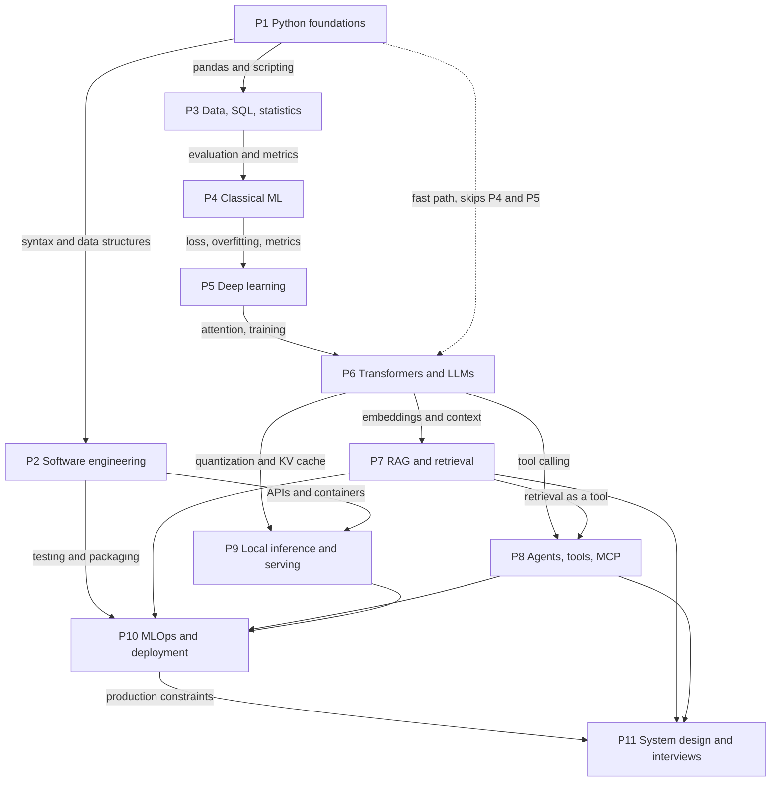

# 00 North Star Roadmap

**Last reviewed:** 2026-09-18 · **Volatility:** medium (phases 6 to 9 date fastest)

This file is the single source of truth for scheduling. No other file in this repository defines its own plan. `tracker/weekly-plan.md` derives from the 24-week plan below. `tracker/progress-log.md` owns review intervals only.

---

## Table of contents

1. [How to read this file](#1-how-to-read-this-file)
2. [The honest shape of the goal](#2-the-honest-shape-of-the-goal)
3. [Phase dependency graph](#3-phase-dependency-graph)
4. [The eleven phases](#4-the-eleven-phases)
5. [The canonical 24-week plan](#5-the-canonical-24-week-plan)
6. [Two orderings](#6-two-orderings)
7. [Compression rules](#7-compression-rules)
8. [Priority markers by role level](#8-priority-markers-by-role-level)
9. [Recovery rules](#9-recovery-rules)
10. [Volatile claims](#10-volatile-claims)

---

## 1. How to read this file

Each phase answers six questions: what you will learn, what you must already know, what you will produce, what you will be able to build, what you will be able to say in an interview, and what usually goes wrong.

Three priority markers appear throughout:

| Marker | Meaning |
|---|---|
| **[MUST]** | You will be asked about this in most interviews. Not knowing it is disqualifying. |
| **[SHOULD]** | Expected at mid level. Absence is noticed but survivable if the rest is strong. |
| **[NICE]** | Differentiator. Skip it if time is short; return to it later. |

One rule governs everything below: **a phase is not complete when you have read it, it is complete when you have produced the artifact.** The mastery checklists in each module define this precisely.

---

## 2. The honest shape of the goal

Before the plan, three things worth being clear about, because plans that hide them fail in week nine.

**24 weeks at 10 hours per week is roughly 240 hours.** That is enough to become a competent junior-to-mid AI engineer who can build real systems and explain them credibly. It is not enough to become strong at classical machine learning theory, and it is not enough to become a deep learning researcher. The plan below deliberately trades ML depth for engineering depth, because the roles you are targeting hire for the second.

**The weakest link is not knowledge, it is shipped evidence.** Candidates who fail AI engineer loops usually fail on one of three things: they cannot write clean Python under observation, they cannot explain why their system fails, or they have nothing they actually built. Every block in this plan ends in a repository artifact for this reason.

**Two phases will be partly stale by the time you finish.** Phases 8 and 9, agents and local inference, move faster than any written curriculum. Treat those modules as scaffolding plus a list of things to verify, never as a reference.

---

## 3. Phase dependency graph

The dotted edge is the fast path discussed in section 6. It is a real shortcut with a real cost, not a shorter route to the same place.

---

## 4. The eleven phases

### Phase 1: Python and programming foundations

**Modules:** `01a-python-core.md`, `01b-python-patterns-and-oop.md`, `01c-python-interview-dsa.md`

| | |
|---|---|
| **Objectives** | Read and write Python without reaching for a reference every line. Understand the object model well enough to predict behavior rather than test for it. |
| **Prerequisites** | None. This is the entry point. |
| **Deliverables** | Roughly 40 small scripts, a test suite you wrote yourself, `projects/project-1-python-data-tool.md` built and running. |
| **You can build** | A command-line tool that reads messy input, transforms it, writes structured output, and has tests. |
| **You can explain** | Mutability and why it causes bugs **[MUST]**. Why `dict` lookup is constant time **[MUST]**. When a generator beats a list **[SHOULD]**. What a decorator actually does to a function object **[SHOULD]**. |
| **Common traps** | Learning syntax without learning the object model, so every bug involving a shared mutable object is a mystery. Skipping tests because the scripts are small. Treating "I followed a tutorial" as knowing it. |

### Phase 2: Software engineering and developer tools

**Module:** `02-software-engineering-foundations.md`

| | |
|---|---|
| **Objectives** | Work in a repository the way a team does. Debug as a method rather than by guessing. |
| **Prerequisites** | Phase 1 through `01b`. |
| **Deliverables** | A repository with branches, pull requests to yourself, CI running tests, pre-commit hooks, and a README someone else could follow. |
| **You can build** | Nothing new. This phase makes everything you build afterwards credible. |
| **You can explain** | Merge versus rebase and when each is wrong **[MUST]**. What your tests do and do not prove **[MUST]**. Why the code works on your machine and not in CI **[MUST]**. HTTP status codes and idempotency **[SHOULD]**. |
| **Common traps** | Skipping this phase because it is not AI. This is the most commonly skipped and most frequently penalized phase for candidates coming from a data background. Interviewers probe it specifically to distinguish engineers from notebook users. |

### Phase 3: Data, SQL, statistics, and experimentation

**Module:** `03-data-and-sql.md`

| | |
|---|---|
| **Objectives** | Get data out of a database correctly, know when a number is meaningful, and know when a comparison is invalid. |
| **Prerequisites** | Phase 1 through `01a`. |
| **Deliverables** | 25 solved SQL exercises, one analysis notebook where you state an uncertainty honestly rather than reporting a point estimate. |
| **You can build** | A query layer over a real schema, and an evaluation table you trust. |
| **You can explain** | The difference between the join types, with row counts **[MUST]**. Why a query is slow and what an index changes **[SHOULD]**. What a p-value does not mean **[SHOULD]**. Sample size intuition for an A/B test **[NICE]**. |
| **Common traps** | Assuming SQL is beneath you. Retrieval evaluation in phase 7 is a data problem, and people who skipped this phase produce evaluation sets that measure nothing. |

### Phase 4: Classical machine learning

**Module:** `04-machine-learning.md`

| | |
|---|---|
| **Objectives** | Frame a problem, avoid leakage, choose a metric that matches the decision being made, and read a result honestly. |
| **Prerequisites** | Phase 3. |
| **Deliverables** | A reproducible scikit-learn pipeline with an evaluation report, plus a deliberately leaky version you diagnosed. |
| **You can build** | A baseline model that is honest about its own uncertainty. |
| **You can explain** | Bias and variance as a tradeoff you can point at in a learning curve **[MUST]**. Precision versus recall and which one the business cares about **[MUST]**. Three ways leakage enters a pipeline **[MUST]**. Why accuracy is usually the wrong metric **[MUST]**. Calibration **[SHOULD]**. |
| **Common traps** | Learning algorithms instead of learning evaluation. Nobody will ask you to implement gradient boosting. Many people will ask why your model looked good offline and failed in production. |

### Phase 5: Deep learning

**Module:** `05-deep-learning.md`

| | |
|---|---|
| **Objectives** | Understand what a gradient is doing, train something end to end in PyTorch, and diagnose a training run from its curves. |
| **Prerequisites** | Phase 4. |
| **Deliverables** | One trained model, plus three deliberately broken training runs you diagnosed from the curves alone. |
| **You can build** | A training loop you wrote rather than copied. |
| **You can explain** | Backpropagation in plain language without hand-waving the chain rule **[MUST]**. Why gradients vanish and what fixes it **[MUST]**. What batch size trades against **[SHOULD]**. Why transformers displaced recurrence **[MUST]**. |
| **Common traps** | Going too deep. You need enough to reason about fine-tuning, quantization, and inference cost. You do not need to derive Adam. Timebox this phase hard. |

### Phase 6: Transformers and LLM engineering

**Module:** `06-transformers-and-llms.md`

| | |
|---|---|
| **Objectives** | Know what happens between a user's keystroke and a token appearing, at every layer. |
| **Prerequisites** | Phase 5 on the dependency path. Phase 1 only on the fast path, with the cost noted in section 6. |
| **Deliverables** | Attention worked by hand on a toy example. A written lifecycle trace of one request through a production LLM app. |
| **You can build** | An LLM application with structured outputs, streaming, and sensible sampling settings. |
| **You can explain** | Self-attention without reciting the paper **[MUST]**. What the KV cache is and why it dominates memory **[MUST]**. Why temperature and top-p are not the same knob **[MUST]**. Why prompting does not fix hallucination **[MUST]**. Tokenization failure modes **[SHOULD]**. |
| **Common traps** | Learning the architecture diagram and not the operational consequences. Interviewers care more about "why did latency spike at long context" than about the positional encoding formula. |

### Phase 7: RAG and retrieval systems

**Module:** `07-rag-and-vector-search.md`

| | |
|---|---|
| **Objectives** | Build retrieval that works on real documents, and be able to say why it failed when it fails. |
| **Prerequisites** | Phase 6, plus phase 3 for the evaluation work. |
| **Deliverables** | `projects/project-2-rag-app.md` built, with an evaluation set of at least 30 pairs and a measured baseline. |
| **You can build** | A cited, grounded question-answering system over messy documents, with numbers attached. |
| **You can explain** | RAG versus fine-tuning as a decision with conditions **[MUST]**. Chunking tradeoffs **[MUST]**. Why the retriever, not the model, is usually the problem **[MUST]**. What a reranker buys you **[SHOULD]**. Recall loss in approximate nearest-neighbor search **[SHOULD]**. Multi-tenancy and deletion **[NICE]**. |
| **Common traps** | Building without evaluation, then having no answer to "how do you know it works". This is the single highest-value phase for the roles you want. Spend extra time here, not less. |

### Phase 8: Agents, tools, MCP, and orchestration

**Module:** `08-agents-tools-and-mcp.md`

| | |
|---|---|
| **Objectives** | Know when an agent is the right shape and, more often, when a deterministic workflow is. |
| **Prerequisites** | Phases 6 and 7. |
| **Deliverables** | `projects/project-3-agent-evaluation.md`, which evaluates agent behavior rather than demonstrating it. |
| **You can build** | A tool-using system with typed schemas, validation, retries, and a trajectory evaluation harness. |
| **You can explain** | Why most "agent" problems are workflow problems **[MUST]**. Prompt injection through tool output **[MUST]**. How you would evaluate an agent that got the right answer by the wrong route **[SHOULD]**. MCP's client/server/host split **[SHOULD]**. When multi-agent is worse than single-agent **[NICE]**. |
| **Common traps** | Framework knowledge substituting for engineering knowledge. Being fluent in LangGraph and unable to explain retries, idempotency, or circuit breakers is a recognizable and penalized pattern. |

### Phase 9: Local inference, serving, performance, and cost

**Module:** `09-local-llm-inference.md`

| | |
|---|---|
| **Objectives** | Run models on your own hardware, measure what they actually do, and reason about the cost of the alternatives. |
| **Prerequisites** | Phase 6, plus phase 2 for containers and APIs. |
| **Deliverables** | A benchmark you ran yourself, with your own numbers, on your own machine. |
| **You can build** | An OpenAI-compatible local serving setup behind a proxy, containerized. |
| **You can explain** | The KV-cache memory formula **[MUST]**. What quantization costs you and where it shows up **[MUST]**. Time-to-first-token versus tokens per second, and which one users feel **[MUST]**. Continuous batching **[SHOULD]**. When local beats hosted on cost **[SHOULD]**. |
| **Common traps** | Repeating throughput numbers you read instead of numbers you measured. In an interview, "I measured X on my machine under these conditions" is worth more than any benchmark you can cite. |

### Phase 10: MLOps, deployment, observability, and evaluation

**Module:** `10-mlops-and-deployment.md`

| | |
|---|---|
| **Objectives** | Put a system somewhere other people can reach it, and know when it breaks before they tell you. |
| **Prerequisites** | Phase 2, plus at least one of phases 7, 8, 9 to have something to deploy. |
| **Deliverables** | One deployed service with health checks, structured logs, a metrics dashboard, and a rollback you have actually practiced. |
| **You can build** | A production-shaped service, not a demo. |
| **You can explain** | What you log, what you alert on, and why those differ **[MUST]**. How you would roll back **[MUST]**. What drift means for an LLM system specifically **[SHOULD]**. SLOs **[SHOULD]**. Cost attribution per request **[SHOULD]**. |
| **Common traps** | Treating deployment as the last 5 percent. It is where most of the interview questions about "production experience" actually live. |

### Phase 11: AI system design and interview preparation

**Modules:** `11-ai-system-design.md`, `12a`, `12b`, `12c`

| | |
|---|---|
| **Objectives** | Structure an answer under time pressure, and turn everything above into things you can say out loud. |
| **Prerequisites** | Phases 7, 8, 10. |
| **Deliverables** | Four system design walkthroughs practiced aloud and timed. A STAR story bank with real entries from your own work. |
| **You can build** | A coherent narrative about what you have built. |
| **You can explain** | Any system in this repository, in 60 seconds and in 5 minutes **[MUST]**. Capacity estimates with the arithmetic shown **[MUST]**. What you would do differently **[MUST]**. |
| **Common traps** | Starting this in the last two weeks. Explanation is a separate skill from construction and it needs its own reps. Begin the 60-second answers from phase 6 onward, not at the end. |

---

## 5. The canonical 24-week plan

Structure: six blocks of four weeks. Three learning weeks, then one review week. The review week is not optional and it is not a buffer for falling behind, it is where retention actually happens.

Every week names an artifact. If the artifact does not exist, the week is not done, regardless of how much you read.

### Block 1, weeks 1 to 4: Python becomes fluent

| Week | Focus | Artifact |
|---|---|---|
| 1 | `01a` sections 1 to 5: execution model, objects and identity, types, strings, control flow | 12 scripts in `practice/week01/`, each demonstrating one behavior you predicted before running |
| 2 | `01a` sections 6 to 9: collections, functions, exceptions, files and structured data | A script that reads a messy CSV, validates rows, writes clean JSON, and fails loudly on bad input. This is the mini-project at the end of `01a`. |
| 3 | `01b`: OOP, dataclasses, comprehensions, generators | Refactor week 2's script into classes with dataclasses, plus 10 pytest tests |
| 4 | **Review** | Practice pack for `01a` scored. Every concept below "Can Explain" in the tracker gets one focused hour. |

### Block 2, weeks 5 to 8: engineer, not scripter

| Week | Focus | Artifact |
|---|---|---|
| 5 | `01b` remainder: decorators, context managers, type hints, logging | Your week 3 code with type hints throughout, structured logging, and a custom context manager that does something real |
| 6 | `02`: git, repo structure, CI, pre-commit, code review | A GitHub repository with CI green, hooks installed, and three pull requests you reviewed against your own checklist |
| 7 | `projects/project-1-python-data-tool.md` | Learning Log Analyzer MVP: CLI, JSON and CSV output, tests passing, README |
| 8 | **Review** | Project 1 README rewritten as if for a stranger. `01b` practice pack scored. |

### Block 3, weeks 9 to 12: data and the discipline of evaluation

| Week | Focus | Artifact |
|---|---|---|
| 9 | `03` SQL: modeling through window functions | 25 exercises solved, with your query plans for the three slowest |
| 10 | `03` statistics and experimentation | One analysis where you report an interval and state what would change your conclusion |
| 11 | `04`: problem framing, splitting, leakage, metrics | The leaky pipeline, diagnosed and documented. This is the artifact, not the working one. |
| 12 | **Review** | `04` practice pack. Write the 60-second answers for bias-variance, precision-recall, and leakage. Say them aloud, timed. |

### Block 4, weeks 13 to 16: how the models actually work

| Week | Focus | Artifact |
|---|---|---|
| 13 | `04` remainder plus `05` fundamentals: gradients, backprop by hand | Backpropagation worked by hand on a 2-layer network, numbers shown, checked against PyTorch autograd |
| 14 | `05`: PyTorch training loop, diagnosing curves | One trained model plus three broken runs with written diagnoses |
| 15 | `06`: tokenization, attention, KV cache, sampling | Attention computed by hand on a toy example. A written trace of one request through a production LLM app. |
| 16 | **Review** | `06` practice pack. First full mock explanation: "how does a transformer work", 60 seconds and 5 minutes, recorded. |

### Block 5, weeks 17 to 20: the part the job is actually about

| Week | Focus | Artifact |
|---|---|---|
| 17 | `07`: ingestion, chunking, embeddings, indexes | Ingestion pipeline handling one genuinely messy format, with the parser failures logged |
| 18 | `07`: hybrid search, reranking, evaluation | Evaluation set of 30-plus pairs, plus a measured naive baseline. Numbers in the repository. |
| 19 | `projects/project-2-rag-app.md` | RAG service running, cited answers, retrieval metrics beating the baseline, or a written explanation of why it does not |
| 20 | **Review** | Project 2 failure-mode analysis written. `07` practice pack scored. |

### Block 6, weeks 21 to 24: production and articulation

| Week | Focus | Artifact |
|---|---|---|
| 21 | `08`: tool calling, agent loops, injection, trajectory evaluation | `projects/project-3-agent-evaluation.md` harness running against 3 tools, adversarial cases included |
| 22 | `09` plus `10`: local serving, containers, deployment, observability | Project 2 containerized, deployed, with logs, metrics, and a rollback you performed on purpose |
| 23 | `11`: system design, four walkthroughs | Each walkthrough practiced aloud and timed. Capacity arithmetic written out. |
| 24 | **Review and consolidation** | `12a` framework internalized. STAR bank populated from your own three projects. Full mock interview, recorded and scored. |

### What this plan deliberately defers

Stated plainly so you are not surprised in an interview:

- **The capstone does not fit in 24 weeks.** CareerAtlas is a 6-week project on top of this. Start it at week 25, or replace project 2 with it and accept that blocks 5 and 6 slip by three weeks.
- **`01c-python-interview-dsa.md` is not scheduled.** Data structures and algorithms practice runs as a parallel track of two or three problems per week from week 5 onward, not as a block. Cramming it does not work.
- **Deep learning gets two weeks.** That is enough to reason about fine-tuning and inference, not enough to discuss architecture research. Accept this or extend the plan.
- **`13-project-portfolio.md` and `14-concept-map.md`** are week 25-plus. They are consolidation, and consolidating nothing is pointless.

---

## 6. Two orderings

### 6a. Dependency order (the plan above)

`P1 → P2 → P3 → P4 → P5 → P6 → P7 → P8 → P9 → P10 → P11`

Nothing is encountered before its prerequisites. Slower to reach the material you care about, but no gaps.

### 6b. LLM-first fast path

`00 → 01a → 01b → 07 → 06 → 08 → 09`, deferring `04` and `05`.

Note the ordering inside it: `07` before `06`. Building RAG first gives you a concrete artifact to hang the transformer concepts on, and RAG is mostly a retrieval and data problem rather than a modeling one. It works without the deep learning background. Attention is easier to care about once you have watched a retriever fail.

**This is a real shortcut with a real cost.** Here is the bill, stated specifically so you can decide.

Questions you will not be able to answer well until you go back for `04` and `05`:

| Question | Phase that covers it |
|---|---|
| "Explain the bias-variance tradeoff." | P4 |
| "Your model does well offline and badly in production. Walk me through the causes." | P4 |
| "When would you pick gradient boosting over a neural network?" | P4 |
| "What is calibration and why might you need it?" | P4 |
| "Why does accuracy mislead on imbalanced data?" | P4 |
| "Walk me through backpropagation." | P5 |
| "Why do gradients vanish, and what fixes it?" | P5 |
| "What does batch size trade against?" | P5 |
| "Why did transformers replace RNNs?" | P5 partially, P6 partially |
| "How would you fine-tune this, and when would you not?" | P5 plus P6 |

That is roughly a third of a standard ML-leaning interview loop. Some AI engineer roles never ask any of it. Some ask all of it in the first screen. The fast path is a bet on which kind of company you are interviewing at.

**Recommended use:** take the fast path to reach `07` and `08` quickly, build project 2, then return to `04` and `05` before you start applying. Not instead of them.

---

## 7. Compression rules

Do not generate a second schedule. Apply these rules to the 24-week plan above.

### To compress 24 weeks into 12

1. Drop every **[NICE]** item.
2. Halve the review weeks: one review week per two blocks instead of per block, placed after blocks 2, 4 and 6.
3. Merge phases 2 and 3 into one week: git and CI only, SQL joins and window functions only.
4. Compress phases 4 and 5 into two weeks total, covering only what phase 6 depends on: loss functions, overfitting, gradients conceptually, why attention replaced recurrence. Accept the section 6b cost list.
5. Cut project 1 entirely. Project 2 becomes your Python evidence as well as your RAG evidence.
6. Keep blocks 5 and 6 at full length. This is where the compression must not happen.

### To expand to 36 weeks

Add a fourth learning week to blocks 3, 4, 5 and 6, and run the capstone as weeks 31 to 36. This is the version to choose if you are working full time.

### Time-budget variants

The 24-week plan assumes 10 hours per week. At other budgets, change scope rather than the calendar:

| Budget | Rule |
|---|---|
| **5 h/week** | Drop **[NICE]** and **[SHOULD]**. Do the artifact, skip the practice packs, keep the review weeks. Expect 36 weeks of calendar time for 24 weeks of plan. |
| **10 h/week** | The plan as written. |
| **15 h/week** | Add `01c` as a scheduled block rather than a parallel track, and start the capstone at week 19 in parallel with block 5. |

---

## 8. Priority markers by role level

Where the bar actually sits, by the role you are targeting.

| Area | Junior AI Engineer | Mid AI Engineer | Generative AI Engineer |
|---|---|---|---|
| Python fluency | **[MUST]** | **[MUST]** | **[MUST]** |
| Git, testing, CI | **[MUST]** | **[MUST]** | **[MUST]** |
| SQL | **[SHOULD]** | **[MUST]** | **[SHOULD]** |
| Classical ML metrics and leakage | **[SHOULD]** | **[MUST]** | **[SHOULD]** |
| Classical ML algorithms in depth | **[NICE]** | **[SHOULD]** | **[NICE]** |
| Deep learning fundamentals | **[SHOULD]** | **[MUST]** | **[SHOULD]** |
| Training and fine-tuning models | **[NICE]** | **[SHOULD]** | **[SHOULD]** |
| Transformer internals | **[SHOULD]** | **[MUST]** | **[MUST]** |
| RAG and retrieval | **[SHOULD]** | **[MUST]** | **[MUST]** |
| Retrieval evaluation | **[SHOULD]** | **[MUST]** | **[MUST]** |
| Tool calling and agents | **[NICE]** | **[SHOULD]** | **[MUST]** |
| MCP specifically | **[NICE]** | **[NICE]** | **[SHOULD]** |
| Local inference and quantization | **[NICE]** | **[SHOULD]** | **[MUST]** |
| Docker and deployment | **[SHOULD]** | **[MUST]** | **[MUST]** |
| Observability and cost | **[NICE]** | **[MUST]** | **[SHOULD]** |
| System design | **[NICE]** | **[MUST]** | **[MUST]** |
| Prompt injection and AI security | **[NICE]** | **[SHOULD]** | **[MUST]** |

`[VERIFY: role expectations vary considerably by company @ read 10 current job postings for your target roles and re-score this table against them]` This table is a reasonable general shape, not a survey result.

---

## 9. Recovery rules

You will fall behind. The plan is designed to absorb it. Apply these in order.

**Rule 1: never skip a review week to catch up.** This is the most tempting and most damaging move. Review weeks are where the previous three weeks become retrievable. Skipping one converts three weeks of work into three weeks of exposure.

**Rule 2: cut scope inside a week, never cut the artifact.** If week 18 is going badly, build the evaluation set with 15 pairs instead of 30. Half an artifact is evidence. No artifact is nothing.

**Rule 3: one week behind is normal, three weeks behind is a signal.** At three weeks, do not accelerate. Re-cut the plan using the compression rules in section 7 and accept the shorter version honestly.

**Rule 4: a missed week gets absorbed by the next review week, once.** If you miss week 17, week 20 covers it and you drop that review week's practice pack. If you miss two weeks in one block, shift the whole calendar by a week instead of compressing.

**Rule 5: if a module is not landing after two attempts, the prerequisite is missing.** Go back one phase rather than rereading. Most "I cannot understand attention" problems are actually "I never understood what a gradient does" problems.

**Rule 6: log the recovery in `tracker/progress-log.md`.** Not for discipline, for diagnosis. Three recoveries clustered in one phase tells you something about that phase, or about the hours you claimed you had.

---

## 10. Volatile claims

Re-check these before relying on them.

| Claim | Why it decays | Re-check against |
|---|---|---|
| Role-level expectations in section 8 | Titles and bars shift yearly and vary by company | 10 current postings for your target roles |
| Phase 8 content, MCP specifically | Specification and ecosystem moving quickly | The official MCP specification |
| Phase 9 runtimes and quantization guidance | Tooling changes release to release | Current llama.cpp and vLLM documentation |
| "Interviewers ask X" claims throughout | Based on general patterns, not a survey | Your own post-interview notes, logged in the tracker |
| The 240-hour estimate | Depends entirely on your starting point | Your own logged hours after block 1 |

**Next review due:** 2027-03-18, or after your first five interviews, whichever comes first.

---

## Connections

- `tracker/weekly-plan.md` turns the section 5 table into a week-by-week working template. It adds no schedule of its own.
- `tracker/progress-log.md` owns spaced repetition and mastery status. Section 5 says when you learn something; the tracker says when you revisit it.
- `13-project-portfolio.md` scores the artifacts this plan produces.
- Every module's `## Prerequisites` section should agree with section 3. If one does not, this file wins and the module is wrong.
