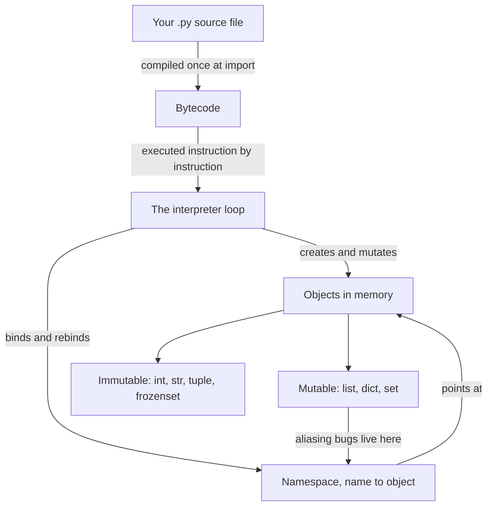

# 01a Python Core

**Last reviewed:** 2026-09-18 · **Volatility:** low (language fundamentals change slowly)

Part 1 of 3. Covers Python from the execution model through files and structured data. `01b` covers OOP, generators, decorators, testing and the applied patterns. `01c` covers interview data structures and algorithms.

---

## Why this matters

Every AI system you will build is a Python program first and an AI system second. Retrieval pipelines are dictionary manipulation. Evaluation harnesses are loops over lists with careful bookkeeping. Inference servers are functions with types at the boundary. When a RAG pipeline silently returns the wrong chunks, the bug is far more often a mutated shared list or a shallow copy than anything to do with embeddings.

In interviews this file is tested in two places: a live coding exercise where you write Python while someone watches, and the moment an interviewer asks "why does this happen?" about a short snippet. The second is where the object model earns its keep.

---

## Prerequisites

None. This is the entry point of the curriculum.

You need Python 3.11 or newer installed and a terminal you can run it in. Verify:

```bash
python3 --version
```

If that prints 3.11 or higher, you are ready. `[VERIFY: current stable Python version @ python.org/downloads]` Anything from 3.10 onward will run every example here.

---

## How to use this module

This page has three modes. **Learn** is the first pass through the concepts. **Build** is the practice task and project work. **Interview** is the optional articulation layer; do it after you can solve the examples.

### Learning guide

| Item | Guidance |
|---|---|
| Estimated first pass | 3–4 hours |
| Setup | Python 3.11+ and a terminal |
| First pass | Read sections 1, 2, 5, 6, 7, 8, and 9, then the first worked example. Treat `[DEPTH · DEEP DIVE]` sections as optional until the core path is comfortable. |
| Priority | `[FOUNDATION]` and `[CORE]` are the first pass; `[DEPTH · DEEP DIVE]` is the second pass. `[MUST]`/`[SHOULD]`/`[NICE]` apply to interview priority. |

By the end of the first pass you should be able to:

- Explain names, objects, identity, mutability, and truthiness.
- Choose collections and control-flow tools using a complexity argument.
- Write defensive file and structured-data loaders that fail usefully.

### Five-minute diagnostic

Answer these without searching. If two or more answers are uncertain, read the first-pass path in order instead of skipping ahead.

1. Why does assigning one list to two names create an alias rather than a copy?
2. When should you use `is` instead of `==`?
3. What is the expected complexity of membership testing in a set versus a list?
4. Why is a mutable default argument dangerous?
5. What should a loader do when one input row is malformed?

### Run the examples

Start by checking the local prerequisite:

```bash
python3 --version
```

Expected output is a version string or command version. Run each example before reading its explanation; write down your prediction first.

## Skip-ahead map

Self-selection, not a test. If you can do the named task without looking anything up, skim that section and move on.

| Section | Level | Skip if you can... |
|---|---|---|
| 1. Execution and the object model | [FOUNDATION] | ...explain why `a = [1]; b = a; b.append(2)` changes `a` |
| 2. Names, objects, identity | [FOUNDATION] | ...say what `a is b` asks that `a == b` does not |
| 3. Types, conversion, truthiness | [FOUNDATION] | ...predict the output of `bool([]) or bool("0")` and say why |
| 4. Strings | [FOUNDATION] | ...explain the difference between `str` and `bytes` and when you need `.encode()` |
| 5. Control flow | [FOUNDATION] | ...rewrite a `for` loop with an index counter using `enumerate` and `zip` |
| 6. Collections | [CORE] | ...say why `dict` lookup is O(1) and `list` membership testing is O(n) |
| 7. Functions | [CORE] | ...explain the mutable default argument trap without hesitating |
| 8. Exceptions | [CORE] | ...say what you should never put in a bare `except:` |
| 9. Files and structured data | [CORE] | ...read a CSV with a broken row and fail loudly rather than silently |

If you skipped five or more, go straight to `01b`.

---

## Mental model

**Python variables are name tags, not boxes.**

Most people arrive with a mental model from spreadsheets or from languages like C: a variable is a container, and assignment puts a value inside it. Python does not work this way, and almost every confusing Python bug traces back to this mismatch.

In Python, values are objects that live somewhere in memory. A name is a label you stick onto an object. Assignment moves the label. It does not copy the object.

```python
a = [1, 2, 3]   # create a list object, stick the label "a" on it
b = a           # stick a second label "b" on the SAME object
b.append(4)     # modify that one object
print(a)        # [1, 2, 3, 4]
```

There is one list. It has two names. Modifying through one name is visible through the other, because there was never a second list.

**Where the analogy breaks down.** Name tags suggest all objects behave the same way, and they do not. Some objects can be modified after creation (lists, dicts, sets) and some cannot (ints, strings, tuples). For the immutable ones, the distinction between "move the label" and "copy the value" is invisible, because you can never observe the difference. That is why beginners can go months without noticing, and then lose a day to a bug involving a list.

Hold both halves: **assignment always moves labels; whether that matters depends on whether the object can change.**

---

## Concept map



---

## Core concepts

### 1. How Python executes code [FOUNDATION]

When you run `python3 script.py`, three things happen in order.

**Compilation.** Python parses your source into bytecode, a lower-level instruction set. This is not machine code and it is not a separate build step you manage. It happens automatically, and for imported modules the result is cached in `__pycache__/` so it is not repeated.

**Execution.** The interpreter walks the bytecode instruction by instruction, maintaining a stack of values.

**Object management.** Every value is an object with a type, an identity, and a reference count. When the count reaches zero, the memory is reclaimed.

You can look at the bytecode directly, which is occasionally useful for settling an argument:

```python
import dis

def add_one(x):
    return x + 1

dis.dis(add_one)
```

On Python 3.11 that prints:

```
  3           0 RESUME                   0

  4           2 LOAD_FAST                0 (x)
              4 LOAD_CONST               1 (1)
              6 BINARY_OP                0 (+)
             10 RETURN_VALUE
```

`[VERIFY: exact bytecode output and column formatting vary by Python version @ run it yourself]` The point is not to read bytecode fluently. It is to internalize that `x + 1` is a sequence of operations on objects, not a mathematical statement.

**Why this matters practically.** Python is slower than compiled languages because of this loop, which is exactly why every performance-sensitive library you will use (NumPy, PyTorch, the tokenizers in every LLM stack) pushes the actual work into compiled C or Rust. When you write `for token in tokens: total += embedding[token]` in Python and it is slow, the fix is usually to express it as one array operation rather than to optimize the loop.


> **Concept checkpoint — 1. How Python executes code**
>
> 1. **Define:** explain the idea in one sentence without repeating the heading.
> 2. **Predict:** before rerunning the smallest example above, state the output or result.
> 3. **Vary:** change one input, parameter, or assumption and explain what should change.
> 4. **Challenge:** name one common misconception or failure mode.
> 5. **Apply:** complete the smallest practice task before moving to the next concept.

### 2. Names, objects, and identity [FOUNDATION]

Three distinct questions you can ask about two names:

| Question | Operator | Asks |
|---|---|---|
| Are these the same object? | `a is b` | Identity |
| Do these have the same value? | `a == b` | Equality |
| What kind of thing is this? | `type(a)` | Type |

```python
a = [1, 2, 3]
b = [1, 2, 3]
c = a

print(a == b)   # True, same contents
print(a is b)   # False, two separate list objects
print(a is c)   # True, one object with two names
print(id(a) == id(c))  # True, same memory identity
```

**The rule for `is`:** use it only for `None`, `True` and `False`. Everywhere else, use `==`. Writing `if x is 0` or `if name is "hello"` appears to work in small scripts because of an interpreter optimization called interning, and then fails unpredictably on larger values. This is a classic interview trap:

```python
print(int("256") is 256)   # True
print(int("257") is 257)   # False
```

CPython pre-creates and reuses the integer objects from -5 to 256, so every `256` is literally the same object. 257 gets a fresh object each time it is constructed, so identity fails while `==` still succeeds.

Two things to notice when you run this. Python emits `SyntaxWarning: "is" with a literal. Did you mean "=="?`, which is the interpreter telling you the answer to the question. And the `int("...")` wrapper is doing real work: if you write the literals directly in a script,

```python
x = 257
y = 257
print(x is y)   # True in a script, False if typed as separate REPL lines
```

the compiler folds the two identical constants in the same code block into one object and you get `True`. Typed as separate lines in the REPL, each line compiles separately and you get `False`.

That instability is the entire lesson. The result depends on constant folding, on the interning range, and on whether two expressions landed in the same code block. All three are implementation details that are free to change between versions. `==` asks the question you actually meant and is stable across all of them.

`[VERIFY: the -5 to 256 caching range is a CPython implementation detail, not a language guarantee @ test on your own interpreter]`

**Mutability, restated as a table.**

| Type | Mutable? | Consequence |
|---|---|---|
| `int`, `float`, `bool` | No | Safe to share freely |
| `str` | No | Every "modification" creates a new string |
| `tuple` | No (shallowly) | Can be a dict key; can still contain mutable things |
| `list` | Yes | Aliasing bugs live here |
| `dict` | Yes | Aliasing bugs live here |
| `set` | Yes | Aliasing bugs live here |
| `frozenset` | No | Can be a dict key |

The tuple caveat is worth a line of its own. A tuple cannot be reassigned, but if it holds a list, that list can still change:

```python
t = (1, [2, 3])
t[1].append(4)
print(t)        # (1, [2, 3, 4])
```

The tuple is unchanged in the sense that it still points at the same two objects. One of those objects changed. This is also why `t` cannot be used as a dictionary key: hashing it fails because the list inside is unhashable.

**Copying, and why shallow is the default.**

```python
import copy

original = {"scores": [1, 2, 3], "name": "run-1"}

alias = original                      # not a copy at all
shallow = original.copy()             # new dict, SAME inner list
deep = copy.deepcopy(original)        # new dict, new inner list

shallow["scores"].append(99)

print(original["scores"])   # [1, 2, 3, 99]   surprise
print(deep["scores"])       # [1, 2, 3]
```

This is the single most common source of silent data corruption in data pipelines. You "copy" a config dict, modify the copy, and mutate the original because the copy was one level deep.


> **Concept checkpoint — 2. Names, objects, and identity**
>
> 1. **Define:** explain the idea in one sentence without repeating the heading.
> 2. **Predict:** before rerunning the smallest example above, state the output or result.
> 3. **Vary:** change one input, parameter, or assumption and explain what should change.
> 4. **Challenge:** name one common misconception or failure mode.
> 5. **Apply:** complete the smallest practice task before moving to the next concept.

### 3. Types, conversion, and truthiness [FOUNDATION]

Python is **dynamically typed** (a name can point at any type, and the type is checked when you use it) and **strongly typed** (it will not silently convert between unrelated types).

```python
"3" + 4
```

```
TypeError: can only concatenate str (not "int") to str
```

That error is Python being strongly typed. JavaScript would produce `"34"`. Python refuses, which is a feature.

**Conversion is explicit and can fail:**

```python
int("42")        # 42
int("42.0")      # ValueError: invalid literal for int() with base 10: '42.0'
int(float("42.0"))  # 42
float("nan")     # nan, a valid float that equals nothing, not even itself
```

That last one bites in data work. `float("nan") == float("nan")` is `False`. Use `math.isnan()`.

**Truthiness.** Every object is either truthy or falsy in a boolean context. The falsy ones are worth memorizing, because the list is short and the consequences are large:

```
False, None, 0, 0.0, "", [], {}, set(), ()
```

Everything else is truthy. Including `"0"`, `"False"`, `[0]`, and `{"": None}`.

```python
print(bool("0"))     # True, non-empty string
print(bool([]))      # False, empty list
print(bool([[]]))    # True, a list containing one thing
```

**The trap this creates:**

```python
def process(items=None, threshold=0):
    if not threshold:              # BUG
        threshold = 0.5
    ...
```

The caller passes `threshold=0` meaning "no threshold", and gets `0.5`. `not 0` is `True`. The fix is to test for the thing you actually mean:

```python
    if threshold is None:
        threshold = 0.5
```

Use `is None` when you mean "was not provided". Use `not x` only when you genuinely mean "empty or zero or absent, all the same".


> **Concept checkpoint — 3. Types, conversion, and truthiness**
>
> 1. **Define:** explain the idea in one sentence without repeating the heading.
> 2. **Predict:** before rerunning the smallest example above, state the output or result.
> 3. **Vary:** change one input, parameter, or assumption and explain what should change.
> 4. **Challenge:** name one common misconception or failure mode.
> 5. **Apply:** complete the smallest practice task before moving to the next concept.

### 4. Strings [FOUNDATION]

Strings are immutable sequences of Unicode characters.

**Formatting: use f-strings.**

```python
name = "qwen"
tokens = 1_432
cost = 0.00341

print(f"{name}: {tokens} tokens")                 # qwen: 1432 tokens
print(f"{name}: {tokens:,} tokens")               # qwen: 1,432 tokens
print(f"cost ${cost:.4f}")                        # cost $0.0034
print(f"{tokens=}, {cost=}")                      # tokens=1432, cost=0.00341
```

That last form, with the `=`, prints the expression and its value. It is the fastest debugging tool in the language and it replaces most `print("tokens:", tokens)` calls.

**Useful operations, the ones you will actually reach for:**

```python
text = "  Chunk 3: retrieval failed  "

text.strip()                    # 'Chunk 3: retrieval failed'
text.strip().lower()            # 'chunk 3: retrieval failed'
text.strip().split(": ")        # ['Chunk 3', 'retrieval failed']
"|".join(["a", "b", "c"])       # 'a|b|c'
text.strip().startswith("Chunk")  # True
text.replace("failed", "ok")    # returns a NEW string
```

Every one of these returns a new string. None of them modify `text`. Forgetting this produces:

```python
text.strip()          # result thrown away
print(text)           # still has the spaces
text = text.strip()   # correct
```

**Immutability has a performance consequence.** Building a string in a loop with `+=` creates a new string every iteration, which is quadratic:

```python
# Slow for large n
out = ""
for chunk in chunks:
    out += chunk

# Fast, linear
out = "".join(chunks)
```

For a few dozen items the difference is irrelevant. For the document chunks in an ingestion pipeline it is not.

**Bytes versus strings.** A `str` is text. A `bytes` object is raw data. Files, network responses and tokenizer internals deal in bytes.

```python
s = "café"
b = s.encode("utf-8")

print(len(s))    # 4 characters
print(len(b))    # 5 bytes, é takes two
print(b)         # b'caf\xc3\xa9'
print(b.decode("utf-8"))   # 'café'
```

`str.encode()` goes to bytes. `bytes.decode()` comes back. The classic failure is decoding with the wrong codec:

```python
b.decode("ascii")
```

```
UnicodeDecodeError: 'ascii' codec can't decode byte 0xc3 in position 3: ordinal not in range(128)
```

You will meet this exact error the first time you ingest a document produced on a Windows machine. The fix is usually `encoding="utf-8"` explicitly, or `errors="replace"` when you would rather have a mangled character than a crash.


> **Concept checkpoint — 4. Strings**
>
> 1. **Define:** explain the idea in one sentence without repeating the heading.
> 2. **Predict:** before rerunning the smallest example above, state the output or result.
> 3. **Vary:** change one input, parameter, or assumption and explain what should change.
> 4. **Challenge:** name one common misconception or failure mode.
> 5. **Apply:** complete the smallest practice task before moving to the next concept.

### 5. Control flow [FOUNDATION]

Conditionals and loops are the least interesting part of Python and the place where beginner code is most recognizable as beginner code. The mechanics take five minutes. The idioms are what matter.

**Conditionals.**

```python
if score >= 0.9:
    label = "high"
elif score >= 0.5:
    label = "medium"
else:
    label = "low"
```

The ternary form, for when a conditional is producing one value:

```python
label = "high" if score >= 0.9 else "low"
```

Use it for a single simple choice. Nesting ternaries is a readability crime; use a real `if` block.

**Loops: iterate over the thing, not over its indices.** This is the single largest difference between Python that looks written by a Python programmer and Python that looks translated from another language.

```python
# What people write when arriving from C or Java
for i in range(len(chunks)):
    print(chunks[i].text)

# What Python wants
for chunk in chunks:
    print(chunk.text)
```

When you genuinely need the index, `enumerate` gives you both:

```python
for i, chunk in enumerate(chunks):
    print(f"{i}: {chunk.text}")

for line_no, line in enumerate(lines, start=1):   # count from 1, for humans
    print(f"{line_no}: {line}")
```

That `start=1` is why the loader in example 3 reports line numbers matching your text editor.

**Iterating two sequences together: `zip`.**

```python
for prediction, label in zip(predictions, labels):
    ...
```

`zip` stops at the shorter sequence, silently. If the two lists having different lengths means something is wrong, say so:

```python
for prediction, label in zip(predictions, labels, strict=True):
    ...
```

```
ValueError: zip() argument 2 is shorter than argument 1
```

`strict=True` requires Python 3.10 or newer. Use it whenever the lengths should match, which in evaluation code is always. A silent truncation of your evaluation set is exactly the class of bug that produces confidently wrong metrics.

**`while` for "until a condition changes".** Use `for` when you know the collection, `while` when you do not:

```python
attempts = 0
while attempts < MAX_RETRIES:
    response = call_api()
    if response.ok:
        break
    attempts += 1
    time.sleep(2 ** attempts)
```

Every `while` loop needs a reason it will terminate. If you cannot say what that reason is, you have written an infinite loop that has not happened yet.

**`break`, `continue`, and the `else` nobody knows about.**

```python
for chunk in chunks:
    if chunk.source == target:
        result = chunk
        break
else:
    raise ValueError(f"no chunk from source {target}")
```

A loop's `else` runs only if the loop finished without hitting `break`. It reads strangely at first and it removes the `found = False` flag variable that otherwise appears in this pattern. Worth knowing because you will meet it, and worth using sparingly because many readers will not know it.

**`any` and `all` replace the flag-variable loop entirely.**

```python
# The loop
has_empty = False
for chunk in chunks:
    if not chunk.text.strip():
        has_empty = True
        break

# The idiom
has_empty = any(not c.text.strip() for c in chunks)
all_scored = all(c.score is not None for c in chunks)
```

Both short-circuit, so they stop at the first decisive element rather than scanning everything.

**Unpacking.**

```python
first, second = pair
head, *rest = items          # head is one item, rest is a list
a, b = b, a                  # swap, no temporary variable

for key, value in config.items():
    ...
```

The `*rest` form is useful and the swap idiom is one of the small pleasures of the language.

**The patterns that replace manual loops**, collected in one place because reaching for the right one is most of writing fluent Python:

| Instead of | Use |
|---|---|
| A loop building a new list | A list comprehension |
| A loop with a manual index counter | `enumerate` |
| Two loops over parallel lists | `zip(..., strict=True)` |
| A loop with a found/not-found flag | `any`, `all`, or `next` with a default |
| A loop summing or counting | `sum`, `len`, `collections.Counter` |
| A loop finding the biggest | `max(items, key=...)` |
| A loop appending to a per-key list | `collections.defaultdict(list)` |
| A loop that filters then transforms | One comprehension with a condition |

`next` with a default deserves its own line, because it is the clean answer to "find the first match or None":

```python
match = next((c for c in chunks if c.source == target), None)
if match is None:
    ...
```

Without the second argument, `next` raises `StopIteration` when nothing matches, which is rarely what you want.

**The bug this section exists to prevent: modifying a collection while iterating over it.**

```python
for chunk in chunks:
    if chunk.is_empty:
        chunks.remove(chunk)      # BUG
```

Removing an item shifts everything after it down by one while the loop's internal position keeps advancing, so the loop skips elements. No exception is raised for a list; you just silently keep some empty chunks. For a dict or set, Python does catch it:

```
RuntimeError: dictionary changed size during iteration
```

The fix is to build a new collection rather than mutating the one you are reading:

```python
chunks = [c for c in chunks if not c.is_empty]
```

This is the same lesson as section 2 from a different angle: prefer producing new objects over mutating shared ones.


> **Concept checkpoint — 5. Control flow**
>
> 1. **Define:** explain the idea in one sentence without repeating the heading.
> 2. **Predict:** before rerunning the smallest example above, state the output or result.
> 3. **Vary:** change one input, parameter, or assumption and explain what should change.
> 4. **Challenge:** name one common misconception or failure mode.
> 5. **Apply:** complete the smallest practice task before moving to the next concept.

### 6. Collections and their tradeoffs [CORE]

Four built-in collections. Choosing the wrong one is the most common cause of accidentally quadratic code.

| | `list` | `tuple` | `set` | `dict` |
|---|---|---|---|---|
| Ordered | Yes | Yes | No | Yes (insertion order) |
| Mutable | Yes | No | Yes | Yes |
| Duplicates | Yes | Yes | No | Keys no, values yes |
| Indexable | Yes | Yes | No | By key |
| Use when | A sequence you will change | A fixed record | Membership and uniqueness | Lookup by key |

**Complexity table.** This is the table to memorize; it answers a surprising share of "why is this slow" questions.

| Operation | `list` | `set` | `dict` |
|---|---|---|---|
| Index / key lookup | O(1) | n/a | O(1) average |
| `x in collection` | **O(n)** | **O(1)** average | **O(1)** average |
| Append / add | O(1) amortized | O(1) average | O(1) average |
| Insert at front | O(n) | n/a | n/a |
| Delete by value | O(n) | O(1) average | O(1) average |
| Iterate | O(n) | O(n) | O(n) |
| Sort | O(n log n) | n/a | n/a |

"Average" means these degrade to O(n) in pathological hash-collision cases, which you will not encounter with ordinary data.

**The single most valuable line in this table** is membership testing. This pattern appears constantly in data work:

```python
# O(n*m). With 10,000 seen ids and 10,000 documents: 100,000,000 comparisons.
seen = []
for doc in documents:
    if doc.id not in seen:
        seen.append(doc.id)
        process(doc)

# O(n). Same logic, one character of type difference, thousands of times faster.
seen = set()
for doc in documents:
    if doc.id not in seen:
        seen.add(doc.id)
        process(doc)
```

**Dictionaries.** The workhorse. Keys must be hashable, which in practice means immutable.

```python
scores = {"precision": 0.81, "recall": 0.64}

scores["f1"] = 0.71                   # add or overwrite
scores.get("mrr")                     # None, no error
scores.get("mrr", 0.0)                # 0.0, a default
scores["mrr"]                         # KeyError: 'mrr'

for metric, value in scores.items():
    print(f"{metric}: {value:.2f}")

"precision" in scores                 # True, checks KEYS not values
```

`.get()` versus `[]` is a real decision, not a style preference. Use `[]` when a missing key means your program is wrong and should stop. Use `.get()` with a default when a missing key is expected. Reaching for `.get()` everywhere hides bugs; reaching for `[]` everywhere produces crashes on ordinary input.

**Two patterns worth knowing now:**

```python
from collections import defaultdict, Counter

# Grouping without checking whether the key exists first
by_source = defaultdict(list)
for chunk in chunks:
    by_source[chunk.source].append(chunk)

# Counting
counts = Counter(doc.language for doc in documents)
print(counts.most_common(3))
```

**Comprehensions.** The idiomatic way to build a collection from another collection.

```python
lengths = [len(c.text) for c in chunks]
long_chunks = [c for c in chunks if len(c.text) > 500]
by_id = {c.id: c for c in chunks}
sources = {c.source for c in chunks}
```

Read them outward: the expression first, then the loop, then the filter. Keep them to one loop and one condition. A comprehension with two `for` clauses and a nested conditional is a loop wearing a disguise, and a plain loop will be clearer.

**Slicing.**

```python
items = [0, 1, 2, 3, 4, 5]

items[1:4]     # [1, 2, 3]     start inclusive, stop exclusive
items[:3]      # [0, 1, 2]
items[-2:]     # [4, 5]
items[::2]     # [0, 2, 4]     every second
items[::-1]    # [5, 4, 3, 2, 1, 0]   reversed
```

Slicing a list returns a **new shallow list**. This is the cheapest correct way to copy one level:

```python
copy_of_items = items[:]
```


> **Concept checkpoint — 6. Collections and their tradeoffs**
>
> 1. **Define:** explain the idea in one sentence without repeating the heading.
> 2. **Predict:** before rerunning the smallest example above, state the output or result.
> 3. **Vary:** change one input, parameter, or assumption and explain what should change.
> 4. **Challenge:** name one common misconception or failure mode.
> 5. **Apply:** complete the smallest practice task before moving to the next concept.

### 7. Functions [CORE]

```python
def score(predictions, labels, threshold=0.5, *, verbose=False):
    """Return accuracy at a decision threshold."""
    if len(predictions) != len(labels):
        raise ValueError(f"length mismatch: {len(predictions)} vs {len(labels)}")
    correct = sum(
        (p >= threshold) == bool(l)
        for p, l in zip(predictions, labels)
    )
    if verbose:
        print(f"{correct}/{len(labels)} correct")
    return correct / len(labels)
```

Points worth naming in that signature:

- `threshold=0.5` is a default. Callers may omit it.
- `*` marks everything after it **keyword-only**. `score(p, l, 0.5, True)` is now an error; you must write `verbose=True`. For any boolean parameter this is worth doing, because `score(p, l, 0.5, True)` is unreadable at the call site.
- Raising early on bad input beats returning a wrong number.

**The mutable default argument trap.** This is asked in interviews constantly and it catches people who have written Python for years.

```python
def add_chunk(chunk, collected=[]):    # BUG
    collected.append(chunk)
    return collected

print(add_chunk("a"))   # ['a']
print(add_chunk("b"))   # ['a', 'b']   expected ['b']
```

The default value is evaluated **once**, when the `def` statement runs, not on each call. Every call without an explicit argument shares one list.

The fix:

```python
def add_chunk(chunk, collected=None):
    if collected is None:
        collected = []
    collected.append(chunk)
    return collected
```

**Scope.** Python resolves names local, then enclosing, then global, then built-in. Assignment inside a function creates a local name unless you say otherwise:

```python
count = 0

def increment():
    count += 1      # UnboundLocalError
```

```
UnboundLocalError: cannot access local variable 'count' where it is not associated with a value
```

Because `count` is assigned inside the function, Python treats it as local throughout the function, including on the right-hand side where it does not yet exist. `global count` fixes it, and needing `global` is usually a sign the function should take an argument and return a value instead.

**Closures.** A function defined inside another function captures the enclosing names.

```python
def make_threshold_filter(threshold):
    def keep(score):
        return score >= threshold
    return keep

strict = make_threshold_filter(0.9)
loose = make_threshold_filter(0.5)

print(strict(0.85))   # False
print(loose(0.85))    # True
```

`keep` remembers `threshold` after `make_threshold_filter` has returned. This is the mechanism behind decorators, covered in `01b`.

**Lambdas.** Anonymous single-expression functions. Use them only as arguments to something else:

```python
chunks.sort(key=lambda c: c.score, reverse=True)
```

Assigning a lambda to a name (`f = lambda x: x + 1`) is worse than `def` in every respect, including the traceback you get when it fails.

**Arguments are passed by assignment.** This follows from section 2 and explains a common surprise:

```python
def reset(scores):
    scores = []          # rebinds the LOCAL name, caller unaffected

def clear(scores):
    scores.clear()       # mutates the shared object, caller affected

data = [1, 2, 3]
reset(data)
print(data)   # [1, 2, 3]
clear(data)
print(data)   # []
```

A function receives labels on the caller's objects. Rebinding a parameter is invisible outside. Mutating the object is not.


> **Concept checkpoint — 7. Functions**
>
> 1. **Define:** explain the idea in one sentence without repeating the heading.
> 2. **Predict:** before rerunning the smallest example above, state the output or result.
> 3. **Vary:** change one input, parameter, or assumption and explain what should change.
> 4. **Challenge:** name one common misconception or failure mode.
> 5. **Apply:** complete the smallest practice task before moving to the next concept.

### 8. Exceptions and defensive programming [CORE]

The governing principle: **catch what you can handle, let everything else crash.** A crash with a traceback is a good outcome. A silently wrong number that reaches a report is not.

```python
try:
    with open(path, encoding="utf-8") as f:
        config = json.load(f)
except FileNotFoundError:
    config = DEFAULT_CONFIG          # a real recovery
except json.JSONDecodeError as e:
    raise ValueError(f"config at {path} is not valid JSON: {e}") from e
```

Two different strategies in one block. A missing file has a sensible fallback. Malformed JSON does not, so it is re-raised with more context. `from e` preserves the original traceback, which you will want at 2am.

**Never write this:**

```python
try:
    result = pipeline(doc)
except:
    result = None
```

A bare `except:` catches `KeyboardInterrupt` and `SystemExit`, so your process ignores Ctrl-C. It catches typos in your own code, so a `NameError` becomes a silent `None`. And it discards the information that would tell you what went wrong. If you must catch broadly, catch `Exception` and log it:

```python
import logging

try:
    result = pipeline(doc)
except Exception:
    logging.exception("pipeline failed for %s", doc.id)
    result = None
```

`logging.exception` records the full traceback. This is the only acceptable broad catch, and it belongs at the top of a loop that must survive one bad item, not scattered through your code.

**The full shape:**

```python
try:
    value = risky()
except ValueError as e:
    ...          # runs only on ValueError
else:
    ...          # runs only if NO exception; keeps the try block small
finally:
    ...          # always runs, exception or not; cleanup goes here
```

**Raise your own.** Failing early with a clear message is cheaper than debugging a wrong result:

```python
def chunk_document(text, size, overlap):
    if overlap >= size:
        raise ValueError(f"overlap ({overlap}) must be smaller than size ({size})")
    ...
```

Include the actual values in the message. `"invalid overlap"` sends you looking; `"overlap (512) must be smaller than size (512)"` tells you.


> **Concept checkpoint — 8. Exceptions and defensive programming**
>
> 1. **Define:** explain the idea in one sentence without repeating the heading.
> 2. **Predict:** before rerunning the smallest example above, state the output or result.
> 3. **Vary:** change one input, parameter, or assumption and explain what should change.
> 4. **Challenge:** name one common misconception or failure mode.
> 5. **Apply:** complete the smallest practice task before moving to the next concept.

### 9. Files, paths, and structured data [CORE]

**Paths: use `pathlib`, not string concatenation.**

```python
from pathlib import Path

data_dir = Path("data") / "raw"
file = data_dir / "documents.csv"

file.exists()
file.suffix          # '.csv'
file.stem            # 'documents'
data_dir.mkdir(parents=True, exist_ok=True)

for p in data_dir.glob("*.csv"):
    print(p.name)
```

The `/` operator joins path segments correctly on every platform. String concatenation with `"/"` breaks on Windows and produces `data//raw` when a trailing slash sneaks in.

**Files: always use `with`.**

```python
with open(file, encoding="utf-8") as f:
    content = f.read()
```

`with` closes the file even if an exception is raised inside the block. Always pass `encoding="utf-8"` explicitly. The default depends on the operating system, so code that works on your machine fails on a colleague's with a `UnicodeDecodeError`.

For large files, iterate rather than reading everything into memory:

```python
with open(file, encoding="utf-8") as f:
    for line in f:              # one line at a time
        process(line.rstrip("\n"))
```

**JSON.**

```python
import json

# Read
with open("config.json", encoding="utf-8") as f:
    config = json.load(f)        # load, from a file object

# Write
with open("out.json", "w", encoding="utf-8") as f:
    json.dump(results, f, indent=2, ensure_ascii=False)

# From and to strings
config = json.loads(text)        # loads, with an s, from a string
text = json.dumps(config)
```

`load`/`dump` take file objects. `loads`/`dumps` take strings. The `s` stands for string, and mixing them up is a rite of passage.

`ensure_ascii=False` keeps non-English text readable in the output file rather than escaping it to `é`.

JSON cannot represent everything Python can. Tuples become lists. Dictionary keys become strings. `datetime` and `set` fail outright:

```python
json.dumps({"seen": {1, 2}})
```

```
TypeError: Object of type set is not JSON serializable
```

Convert before serializing: `list(my_set)`, `dt.isoformat()`.

**JSON Lines**, one JSON object per line, is the right format for logs and datasets. It streams, appends, and survives a truncated file:

```python
with open("eval.jsonl", "w", encoding="utf-8") as f:
    for record in records:
        f.write(json.dumps(record) + "\n")

with open("eval.jsonl", encoding="utf-8") as f:
    records = [json.loads(line) for line in f if line.strip()]
```

**CSV.** Use the `csv` module, never `line.split(",")`. A single quoted comma inside a field breaks the naive version silently.

```python
import csv

with open("documents.csv", newline="", encoding="utf-8") as f:
    reader = csv.DictReader(f)
    for row in reader:
        print(row["title"], row["source"])

with open("out.csv", "w", newline="", encoding="utf-8") as f:
    writer = csv.DictWriter(f, fieldnames=["id", "score"])
    writer.writeheader()
    writer.writerows(rows)
```

`newline=""` is required, not optional. Without it you get blank lines between rows on some platforms.

**Failing loudly on bad rows**, which is the point of doing this by hand rather than with pandas:

```python
import csv
import logging
from pathlib import Path


def load_scores(path: Path) -> list[dict]:
    """Read id,score rows. Skip malformed rows loudly, raise if the file is unusable."""
    rows = []
    skipped = 0
    with open(path, newline="", encoding="utf-8") as f:
        reader = csv.DictReader(f)
        if reader.fieldnames is None:
            raise ValueError(f"{path} is empty")
        missing = {"id", "score"} - set(reader.fieldnames)
        if missing:
            raise ValueError(f"{path} missing columns: {sorted(missing)}")

        for line_no, row in enumerate(reader, start=2):
            try:
                rows.append({"id": row["id"], "score": float(row["score"])})
            except (TypeError, ValueError):
                skipped += 1
                logging.warning("line %d: bad score %r, skipped", line_no, row.get("score"))

    if skipped:
        logging.warning("skipped %d of %d rows in %s", skipped, skipped + len(rows), path)
    if not rows:
        raise ValueError(f"{path} produced no usable rows")
    return rows
```

Note the choices: header validated before the loop, `start=2` so the line number matches what a text editor shows, bad rows logged with their content, and an empty result treated as an error rather than returned as an empty list. A function that silently returns `[]` when a file is malformed will cost you an afternoon.

**Environment variables**, for anything secret:

```python
import os

api_key = os.environ["OPENAI_API_KEY"]        # KeyError if absent, usually correct
log_level = os.environ.get("LOG_LEVEL", "INFO")  # optional with a default
```

Use `os.environ[...]` for things your program cannot run without. Failing at startup with `KeyError: 'OPENAI_API_KEY'` is better than failing at request time with a confusing authentication error.

Never put a key in source code. Not in a file you plan to gitignore, not "temporarily". Keys committed to git stay in the history after you delete them.

---


> **Concept checkpoint — 9. Files, paths, and structured data**
>
> 1. **Define:** explain the idea in one sentence without repeating the heading.
> 2. **Predict:** before rerunning the smallest example above, state the output or result.
> 3. **Vary:** change one input, parameter, or assumption and explain what should change.
> 4. **Challenge:** name one common misconception or failure mode.
> 5. **Apply:** complete the smallest practice task before moving to the next concept.

## Worked examples

### Example 1: aliasing, from confusion to understanding

**The bug, as it appears in real code:**

```python
DEFAULT_CONFIG = {"chunk_size": 512, "sources": []}

def make_config(source):
    config = DEFAULT_CONFIG.copy()
    config["sources"].append(source)
    return config

a = make_config("docs")
b = make_config("wiki")

print(a)   # {'chunk_size': 512, 'sources': ['docs', 'wiki']}
print(b)   # {'chunk_size': 512, 'sources': ['docs', 'wiki']}
```

Both configs list both sources, and `DEFAULT_CONFIG` has been corrupted permanently.

**Line by line.** `.copy()` creates a new dictionary. That new dictionary contains the same two values: the integer `512` and the *same list object*. Copying one level deep copied the reference to the list, not the list. `config["sources"].append(...)` reaches through the copy into the shared list.

**Three fixes, with the tradeoff for each:**

```python
import copy

# 1. Deep copy. Simple, correct, slowest.
config = copy.deepcopy(DEFAULT_CONFIG)

# 2. Build fresh each time. Fastest and clearest for small configs.
def make_config(source):
    return {"chunk_size": 512, "sources": [source]}

# 3. Make the default immutable so the bug cannot happen.
DEFAULT_CONFIG = {"chunk_size": 512, "sources": ()}
def make_config(source):
    config = DEFAULT_CONFIG.copy()
    config["sources"] = [*config["sources"], source]
    return config
```

Option 3 is worth noticing. Making shared state immutable turns a silent bug into a `AttributeError: 'tuple' object has no attribute 'append'` at the moment of the mistake. Preferring immutable defaults is a habit that prevents a whole class of bug.

### Example 2: making a slow pipeline fast without changing what it does

**The slow version:**

```python
def deduplicate(documents, already_indexed):
    """already_indexed is a list of ids already in the vector store."""
    new_docs = []
    for doc in documents:
        if doc["id"] not in already_indexed:
            new_docs.append(doc)
    return new_docs
```

With 50,000 indexed ids and 50,000 incoming documents this performs up to 2.5 billion comparisons.

**The diagnosis.** `in` on a list scans the list. `in` on a set hashes once. The loop itself is fine; the data structure is wrong.

**The fast version:**

```python
def deduplicate(documents, already_indexed):
    indexed = set(already_indexed)          # O(n) once
    return [doc for doc in documents if doc["id"] not in indexed]   # O(1) each
```

Building the set costs one pass. Every subsequent lookup is constant. Same inputs, same outputs, several orders of magnitude faster on real data.

**The measurement, because you should never claim this without checking:**

```python
import random
import time

indexed_list = [f"doc-{i}" for i in range(50_000)]
docs = [{"id": f"doc-{random.randint(0, 99_999)}"} for _ in range(20_000)]

start = time.perf_counter()
slow = [d for d in docs if d["id"] not in indexed_list]
slow_time = time.perf_counter() - start

indexed_set = set(indexed_list)
start = time.perf_counter()
fast = [d for d in docs if d["id"] not in indexed_set]
fast_time = time.perf_counter() - start

assert slow == fast, "results must match"
print(f"list: {slow_time:.3f}s   set: {fast_time:.3f}s   speedup: {slow_time / fast_time:.0f}x")
```

`[UNVERIFIED: the speedup you observe depends on your machine and data]` Run it. The `assert` matters as much as the timing: a performance fix that changes the output is not a fix.

### Example 3: a small, complete, defensive loader

Combining everything above into something you would actually ship. This is the shape of code that survives contact with real data.

```python
"""Load evaluation records from JSONL, validating as we go."""
import json
import logging
from pathlib import Path

logging.basicConfig(level=logging.INFO, format="%(levelname)s %(message)s")

REQUIRED = {"question", "expected", "source_id"}


def load_eval_set(path: Path) -> list[dict]:
    """Read a JSONL evaluation set.

    Raises ValueError if the file is missing, empty, or has no valid records.
    Logs and skips individual malformed records.
    """
    if not path.exists():
        raise ValueError(f"evaluation set not found: {path}")

    records: list[dict] = []
    skipped = 0

    with open(path, encoding="utf-8") as f:
        for line_no, line in enumerate(f, start=1):
            line = line.strip()
            if not line:
                continue

            try:
                record = json.loads(line)
            except json.JSONDecodeError as e:
                logging.warning("line %d: invalid JSON (%s), skipped", line_no, e.msg)
                skipped += 1
                continue

            if not isinstance(record, dict):
                logging.warning("line %d: expected an object, got %s", line_no, type(record).__name__)
                skipped += 1
                continue

            missing = REQUIRED - record.keys()
            if missing:
                logging.warning("line %d: missing keys %s, skipped", line_no, sorted(missing))
                skipped += 1
                continue

            records.append(record)

    total = len(records) + skipped
    if not records:
        raise ValueError(f"{path}: no valid records out of {total} lines")
    if skipped:
        logging.warning("%s: kept %d of %d records", path, len(records), total)

    logging.info("%s: loaded %d records", path, len(records))
    return records


if __name__ == "__main__":
    sample = Path("sample_eval.jsonl")
    sample.write_text(
        '{"question": "what is RAG?", "expected": "retrieval augmented generation", "source_id": "d1"}\n'
        "\n"
        "{not json}\n"
        '{"question": "incomplete"}\n'
        '{"question": "what is a KV cache?", "expected": "cached attention keys and values", "source_id": "d2"}\n',
        encoding="utf-8",
    )
    for r in load_eval_set(sample):
        print(r["question"])
    sample.unlink()
```

Run it. It prints two warnings, loads two records, and the warnings tell you exactly which lines to fix. Compare that to a version that returns `[]` and says nothing.

Three decisions worth naming: `line_no` starts at 1 and counts every line including blanks, so it matches your editor. `REQUIRED - record.keys()` uses set difference on dictionary keys, which works directly without converting. The final `if not records` turns "everything was broken" into an error rather than an empty success.

---

## Common mistakes and debugging

Organized by the symptom you would actually observe, because that is how you meet them.

### Beginner mistakes

| Symptom | Cause | Fix |
|---|---|---|
| `TypeError: can only concatenate str (not "int") to str` | Mixing types in `+` | `f"{a}{b}"` or `str(b)` |
| `IndentationError: unexpected indent` | Mixed tabs and spaces | Configure your editor for 4 spaces, never tabs |
| Modifying a string appears to do nothing | Strings are immutable; the method returned a new one | Assign the result: `s = s.strip()` |
| `KeyError: 'foo'` | Key absent | Use `.get(key, default)` if absent is expected, otherwise fix the data |
| `IndexError: list index out of range` | Off-by-one, or empty list | Check `if items:` first; prefer iteration over indexing |
| `UnboundLocalError` | Assigned to a global inside a function | Pass it in and return it out |
| Loop produces only the last result | Reassigning instead of appending | `results.append(x)`, not `results = x` |
| `ValueError: too many values to unpack` | Shape mismatch in unpacking | Print the thing you are unpacking first |

### Production failure modes

These are the ones that cost real time, because none of them raise an exception.

**Silent data corruption through aliasing.** A config or record is "copied", modified, and the original changes. No error. The symptom is a result that is wrong in a way that depends on processing order. *Diagnostic:* if a bug disappears when you process items in a different order, or only affects items after the first, suspect a shared mutable object. Check every `.copy()` and every default argument.

**Accidentally quadratic code.** Works on 100 test documents, times out on 100,000. *Diagnostic:* if runtime grows much faster than input size, look for `in` against a list inside a loop, string concatenation with `+=` in a loop, or `list.insert(0, ...)`.

**Encoding failures on real-world documents.** The pipeline runs for months, then one PDF from a European client crashes ingestion. *Diagnostic:* `UnicodeDecodeError` naming a byte position. Pass `encoding="utf-8"` explicitly everywhere, and decide deliberately between `errors="strict"` (crash, know about it) and `errors="replace"` (continue, log it).

**Silent truncation on bad rows.** A loader catches exceptions per row, returns what it got, and the evaluation set quietly has 400 records instead of 500. Every downstream number is subtly wrong. *Diagnostic:* count what you read and compare it to what you expected, every time, and log the difference. This is exactly what example 3 does.

**`float("nan")` propagating through a metric.** One bad value turns an average into `nan`. *Diagnostic:* `nan != nan`, so `x != x` detects it. Validate on ingestion, not after aggregation.

**Mutable default accumulating across requests.** The trap from section 7, in a long-running server. Memory grows and results bleed between users. *Diagnostic:* any parameter defaulting to `[]`, `{}` or `set()` is the bug. Grep for it.

### How to debug, as a method

1. **Read the traceback bottom-up.** The last line is the error. The line above it is where it happened. Everything above that is how you got there.
2. **Reproduce it smaller.** Cut the input until it is the smallest thing that still fails. This usually reveals the cause on its own.
3. **Print the type, not just the value.** `print(f"{x=} {type(x)=}")`. Half of Python bugs are the right value in the wrong type.
4. **Check identity when things change unexpectedly.** `print(id(a), id(b))` answers "is this the same object?" definitively.
5. **Use the debugger instead of adding prints.** `breakpoint()` on any line drops you into an interactive prompt at that moment, where you can inspect everything. `n` steps, `c` continues, `p expr` prints, `q` quits.
6. **Predict before running.** Before you execute, say what you expect. When the prediction is wrong, you have learned something. When you skip the prediction, you have only learned what the output is.

---

> **Interview mode (optional on the first pass):** return here after the Learn and Build work. Practice the 60-second answer only after you can explain the mechanism and complete the example.

## Interview angle

Ten questions, roughly ordered by difficulty.

**1. What is the difference between a list and a tuple?**

*Strong outline:* Mutability is the headline: lists can be modified after creation, tuples cannot. Consequences follow from that. Tuples can be dictionary keys and set members because they are hashable; lists cannot. Tuples signal a fixed record with positional meaning, lists signal a homogeneous sequence. Then the caveat that shows depth: a tuple containing a list is not truly immutable and is not hashable.

*Weak answer:* "Tuples use parentheses and lists use brackets." True and irrelevant. It describes syntax when the question is about semantics.

**2. Explain mutable versus immutable, and why it matters.**

*Strong outline:* Assignment binds names to objects; it does not copy. Two names can point at one object. If that object is mutable, a change through one name is visible through the other. Give the two-line example. Then name the practical consequences: shallow copies, mutable default arguments, and passing a list into a function that modifies it.

*Weak answer:* Reciting which types are which without explaining what follows. The list of types is memorization; the consequence is understanding.

**3. Why is `x in my_list` slower than `x in my_set`?**

*Strong outline:* A list has no structure to exploit, so membership is a linear scan, O(n). A set is a hash table: the value is hashed to a bucket and only that bucket is checked, O(1) on average. The cost is that set elements must be hashable and order is not preserved. Mention the average qualifier, since adversarial hash collisions degrade it.

*Weak answer:* "Sets are faster." Correct and content-free.

**4. What does this print, and why?**

```python
def f(x, acc=[]):
    acc.append(x)
    return acc
print(f(1)); print(f(2))
```

*Strong outline:* `[1]` then `[1, 2]`. The default is evaluated once when the `def` executes, so every call without an explicit second argument shares one list. Fix with `acc=None` and create inside. Then the extension that shows you have met it in production: in a long-running service this leaks memory and bleeds state between requests.

*Weak answer:* Getting the output right by guessing, without the "evaluated once at definition time" mechanism.

**5. When would you use `is` instead of `==`?**

*Strong outline:* `is` compares identity, `==` compares value. Use `is` only for singletons: `None`, `True`, `False`. Everywhere else use `==`. Explain why `int("256") is 256` is `True` while `int("257") is 257` is `False`: CPython caches small integers from -5 to 256. The answer to a `is` comparison on non-singletons can also change depending on whether the compiler folded two constants in the same code block, which is why the behavior differs between a script and the REPL. All of that is implementation detail you must never depend on.

*Weak answer:* "`is` is faster." It is, marginally, and that is not why you choose it.

**6. What is wrong with `except:` and what should you write instead?**

*Strong outline:* Bare `except` catches `BaseException`, including `KeyboardInterrupt` and `SystemExit`, so it breaks Ctrl-C and swallows shutdown. It also catches your own typos, turning a `NameError` into a silent wrong answer. Use `except SomeSpecificError` when you can handle it, or `except Exception` with `logging.exception()` when you must survive a bad item in a loop. Governing principle: catch what you can handle, let the rest crash.

*Weak answer:* "It's bad practice." Why it is bad practice is the whole question.

**7. How would you copy a nested dictionary safely?**

*Strong outline:* `.copy()` and `dict(d)` are shallow: the new dict points at the same inner objects. `copy.deepcopy()` recurses. Deep copy is slower and fails on objects that cannot be copied, so prefer restructuring: build fresh, or make the shared parts immutable. Name the real-world version, a config dict corrupted by a "copy".

*Weak answer:* "Use deepcopy." Right tool, no understanding of when it is unnecessary or harmful.

**8. What is truthiness, and where does it bite?**

*Strong outline:* Objects have a boolean value in conditions. Falsy: `False`, `None`, `0`, `0.0`, `""`, `[]`, `{}`, `set()`, `()`. The trap is conflating "absent" with "empty or zero": `if not threshold` is `True` when the caller deliberately passed `0`. Use `is None` for absence.

*Weak answer:* Listing falsy values without the `0` versus `None` distinction, which is the only part with consequences.

**9. You have a pipeline that works on 1,000 documents and times out on 1,000,000. How do you find out why?**

*Strong outline:* First establish how runtime scales: run at 1k, 10k, 100k and look at the shape. Linear growth that is simply too slow is a different problem from superlinear growth. Superlinear points at a nested scan, most often `in` against a list inside a loop, string `+=` accumulation, or repeated `list.insert(0, ...)`. Then profile with `cProfile` to confirm rather than guessing. Fix the data structure, then re-measure, and assert the output is unchanged. Mention memory as the other candidate: loading everything into a list instead of streaming.

*Weak answer:* Jumping straight to multiprocessing. Parallelizing an accidentally quadratic algorithm buys you a constant factor against an exponent.

**10. How do you decide what to catch and what to let crash?**

*Strong outline:* Catch when there is a genuine recovery: a missing optional config file has a default, a rate limit has a retry, one malformed row in ten thousand can be logged and skipped. Let it crash when there is no correct action: a missing API key, a malformed schema, an empty result where data is required. The test is "does my program still produce a correct answer after this?" If no, crashing is the correct behavior. A silently wrong number is the worst outcome available, worse than downtime, because nobody knows to investigate it.

*Weak answer:* "Catch everything so the program doesn't crash." This is the instinct that produces the worst production incidents.

### Follow-up questions to expect

- After question 3: *"When would a set be the wrong choice despite being faster?"* When you need order, duplicates, indexing, or when elements are unhashable. Also when the collection is tiny and built once, where building the set costs more than the scans it saves.
- After question 9: *"You fixed it and it's still slow. Now what?"* Measure before optimizing further. Check whether the bottleneck moved to I/O or to an external API. Consider streaming instead of materializing, batching network calls, and only then parallelism, being specific about whether the work is CPU-bound or I/O-bound, because that determines whether threads or processes are the right tool.

### 60-second and 5-minute answers

For each of these, write both versions in your own words and say them aloud, timed. The 60-second version is what you give first; the 5-minute version is what you give when they say "tell me more."

1. Mutability and aliasing
2. Why dictionary lookup is constant time
3. Exception handling philosophy
4. How you would debug a performance regression

Record yourself. The gap between "I understand this" and "I can say this clearly in 60 seconds" is larger than anyone expects, and it is the gap that loses interviews.

---

## Practice tasks

> **Build mode:** attempt the smallest exercise without looking at the solution, then complete the module project as the exit condition.

No solutions here. They live in the [01a practice pack](quizzes/01a-python-core-practice.md).

### Five tiny exercises

1. Write a function that takes a list of dicts and returns a dict keyed by each item's `"id"`. Handle duplicate ids by keeping the last one, then write a second version that raises on duplicates. Say which you would use in an ingestion pipeline and why.
2. Given a string of comma-separated numbers with inconsistent whitespace and some empty fields, return a list of floats, skipping empties. Do it in one comprehension, then again as a loop with logging for anything unparseable. Compare readability.
3. Write `is_nan(x)` without importing `math`, using only the property that `nan` is not equal to itself. Then explain why the `math` version is still the right one to use.
4. Predict the output before running, then run it:
   ```python
   a = [1, 2, 3]
   b = a[:]
   c = a
   b.append(4)
   c.append(5)
   print(a, b, c)
   ```
   Write down *why* before you check.
5. Write a function that reads a text file and returns the 10 most common words, ignoring case and punctuation. Use `collections.Counter`.

### Three realistic coding tasks

1. **Chunker.** Write `chunk_text(text, size, overlap)` returning a list of overlapping string chunks. Validate that `overlap < size` and that both are positive. Handle text shorter than one chunk, text exactly one chunk long, and empty text. Write down what you decided each edge case should do before you implement it. This function is the foundation of module 07, so get it right.
2. **Resilient loader.** Extend example 3 to accept either JSONL or CSV based on the file suffix, with the same validation and logging contract for both. Return the same shape from both paths.
3. **Config merger.** Write `merge_config(base, override)` that deep-merges two nested dictionaries: nested dicts merge recursively, all other types are replaced by the override. Neither input may be modified. Write the test that would have caught the aliasing bug from example 1.

### One mini-project

**Document inventory tool.**

A command-line script that walks a directory, finds every `.txt`, `.md`, `.json` and `.csv` file, and produces a report.

Requirements:
- Walk recursively with `pathlib`
- Per file: path, size in bytes, line count, and detected encoding problems
- Per type: count and total size
- Flag files that are empty, that fail to decode as UTF-8, or that are unusually large relative to the median
- Output as a readable table to the terminal and as JSON to a file
- Accept the directory and output path as command-line arguments using `sys.argv`, with a usage message when arguments are missing
- Never crash on a single bad file: log it and continue, then report how many failed
- No third-party dependencies

Success criterion: point it at a directory containing at least one deliberately broken file and get a useful report plus a clear warning, not a traceback.

This is the seed of `projects/project-1-python-data-tool.md`. Keep the code.

---

## Mastery checklist

Observable, not topical. You are ready for `01b` when you can do each of these without a reference.

- [ ] Predict the output of any snippet involving two names pointing at one list, and explain it in terms of objects and labels
- [ ] State the falsy values from memory and explain why `if not x` is wrong for a numeric parameter
- [ ] Rewrite an index-counter loop using `enumerate`, and a flag-variable loop using `any` or `next`
- [ ] Explain why removing items from a list while iterating over it skips elements, and give the fix
- [ ] Choose between list, set, dict and tuple for a given task and justify it with a complexity argument
- [ ] Write the mutable default argument bug and its fix from memory, and explain the "evaluated once" mechanism
- [ ] Take a function that mutates its argument and rewrite it to return a new object instead
- [ ] Write a `try`/`except` block where one branch recovers and another re-raises with context using `from e`
- [ ] Read a CSV with a malformed row and produce a loud, useful warning rather than silent truncation
- [ ] Read a traceback and name the exact line and the exact cause without running anything
- [ ] Use `breakpoint()` to inspect state mid-execution
- [ ] Explain why `"".join(parts)` beats `+=` in a loop, in terms of immutability
- [ ] Complete the mini-project, with it surviving a deliberately broken input file

Fewer than eleven of thirteen checked means go back rather than forward. The next file assumes all of this.

---

## Connections

**Backward:** none. This is the first module.

**Forward:**

- `01b-python-patterns-and-oop.md` builds directly on section 7. Closures become decorators, and the iteration in sections 5 and 6 becomes generators. The dataclasses there replace the raw dicts used throughout this file.
- `01c-python-interview-dsa.md` depends on the complexity table in section 6. Every algorithm pattern there is a choice about data structures made under time pressure.
- `02-software-engineering-foundations.md` takes the defensive loader from example 3 and adds the tests, typing and CI that make it shippable.
- `03-data-and-sql.md` assumes the CSV and JSON handling in section 9. The evaluation sets you build there are JSONL files read by exactly the loader in example 3.
- `07-rag-and-vector-search.md` is where this file pays off most directly. The chunker from practice task 1 becomes real. The deduplication from worked example 2 is how you avoid re-embedding documents. The aliasing bug from example 1 is, specifically, how retrieval configs get silently corrupted between experiments.

---

## Volatile claims

| Claim | Why it decays | Re-check against |
|---|---|---|
| Python 3.11-plus assumed | New releases roughly annually | `python.org/downloads` |
| Bytecode output in section 1 | Changes between minor versions | Run `dis.dis` yourself |
| Small integer caching range | CPython implementation detail, not a language guarantee | Test on your interpreter; never depend on it |
| Timing speedups in example 2 | Entirely hardware dependent | Run the benchmark yourself |

Everything else here is language semantics and has been stable for a decade.

**Next review due:** 2027-09-18, or when you upgrade major Python versions.
