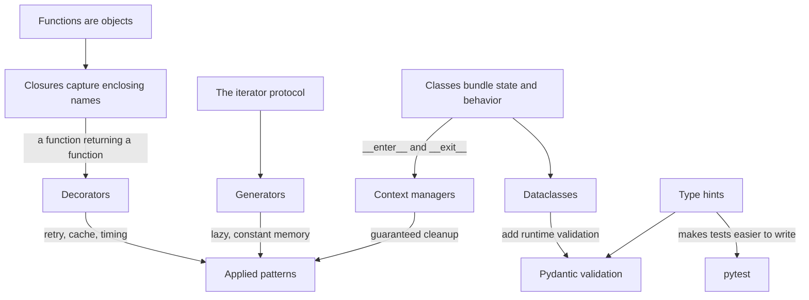

# 01b Python Patterns and OOP

**Last reviewed:** 2026-09-18 · **Volatility:** low, except the applied patterns in section 9

Part 2 of 3. `01a` covered the execution model through files and structured data. This file covers the constructs you use to organize code, and the patterns that appear in every LLM application you will write. `01c` covers interview data structures and algorithms.

---

## Why this matters

`01a` taught you to write Python that works. This file teaches you to write Python that someone else can change six months later without breaking it, which is the actual bar in a job.

Two specific payoffs. First, every applied pattern in section 9 appears in production LLM code: you will write retries with backoff against a rate-limited API, you will validate model output with Pydantic, you will cache embeddings, and you will batch requests. Second, the OOP and typing material is what makes the difference in a code review, where the question is not "does it run" but "what happens when the requirements change".

In interviews this file shows up as the "explain this design" question, and as the moment an interviewer looks at your GitHub and forms an opinion in fifteen seconds.

---

## Prerequisites

All of `01a`, specifically:

| You need | From |
|---|---|
| Names, objects, mutability, aliasing | `01a` section 2 |
| Truthiness and `is None` | `01a` section 3 |
| Collection complexity | `01a` section 6 |
| Functions, closures, mutable defaults | `01a` section 7 |
| Exception strategy | `01a` section 8 |
| Files, JSON, pathlib | `01a` section 9 |

Closures in particular. Decorators in section 4 are closures with syntax, and if closures are shaky, decorators will feel like magic instead of like a mechanism.

---

## Skip-ahead map

| Section | Level | Skip if you can... |
|---|---|---|
| 1. Classes and instances | [FOUNDATION] | ...explain what `self` is and why it is a parameter |
| 2. Composition, inheritance, dataclasses | [CORE] | ...state a case where inheritance is the wrong tool |
| 3. Iterators and generators | [CORE] | ...explain what `yield` does to a function's return type |
| 4. Decorators | [CORE] | ...write a decorator that takes arguments, from memory |
| 5. Context managers | [CORE] | ...write one with `@contextmanager` and say what `finally` guarantees |
| 6. Type hints | [CORE] | ...say what mypy checks that Python does not |
| 7. Testing with pytest | [CORE] | ...write a parametrized test with a fixture |
| 8. Logging, packaging, organization | [CORE] | ...explain why `print` is wrong in a library |
| 9. Applied patterns | [DEPTH] | ...write retry-with-backoff that does not retry a 400 |

Section 9 is the one to read even if you skip everything else.

---

## Mental model

**A class is a factory for objects that carry their own state, and a decorator is a function that returns a modified function.**

Two ideas, and almost everything in this file is one of them wearing different clothes.

The first: in `01a` you passed data into functions. A class bundles data with the functions that operate on it, so `retriever.search(query)` carries the index, the model and the config without you threading them through every call.

The second: functions are objects. You can pass them around, store them, and write functions that take a function and return a new one. Decorators, context managers and most of the applied patterns are this idea.

**Where the analogy breaks down.** "A class bundles data and behavior" makes classes sound universally good, and they are not. A class with one method and no state is a function with extra ceremony. A class hierarchy five levels deep is harder to follow than the duplication it removed. The genuine decision in section 2 is when *not* to reach for a class, which is more often than most codebases suggest.

---

## Concept map



---

## Core concepts

### 1. Classes and instances [FOUNDATION]

A class defines what its instances know and what they can do.

```python
class Retriever:
    """Holds an index and searches it."""

    def __init__(self, index, top_k=5):
        self.index = index
        self.top_k = top_k
        self._query_count = 0

    def search(self, query):
        self._query_count += 1
        return self.index.nearest(query, self.top_k)

    @property
    def query_count(self):
        return self._query_count
```

**`__init__` is not a constructor**, it is an initializer. The object already exists when `__init__` runs; its job is to set up state. The distinction matters once you meet `__new__`, which you rarely will.

**`self` is an ordinary parameter.** When you write `retriever.search(q)`, Python calls `Retriever.search(retriever, q)`. It is not a keyword and there is nothing magic about the name; it is a convention so strong that breaking it is hostile, but it is still just the first parameter.

**The underscore convention.** `_query_count` signals "internal, do not touch from outside". Python does not enforce this. A single underscore is a message to humans, and that is genuinely all it is. A double underscore prefix triggers name mangling, which exists to avoid collisions in inheritance, not to provide privacy. Use a single underscore; you will almost never want the double.

**`@property` turns a method into an attribute access.** `retriever.query_count` looks like a field and runs code. Use it for computed values and read-only access. Do not use it for anything expensive, because callers reasonably assume attribute access is cheap, and a property that makes a network call is a trap.

**The methods worth knowing early:**

```python
class Chunk:
    def __init__(self, text, source):
        self.text = text
        self.source = source

    def __repr__(self):
        return f"Chunk(source={self.source!r}, len={len(self.text)})"

    def __eq__(self, other):
        if not isinstance(other, Chunk):
            return NotImplemented
        return (self.text, self.source) == (other.text, other.source)

    def __hash__(self):
        return hash((self.text, self.source))

    def __len__(self):
        return len(self.text)
```

`__repr__` is the highest-value method on this list by a wide margin. Without it, debugging shows you `<__main__.Chunk object at 0x7f8b1c0d5f40>`, which tells you nothing. With it, every print, every traceback and every debugger view is readable. Write `__repr__` on every class you define; the `!r` in the f-string calls `repr` on the field, which quotes strings and makes whitespace visible.

`__eq__` and `__hash__` travel together. If you define `__eq__` without `__hash__`, Python sets `__hash__` to `None` and your objects can no longer go in a set or be dict keys. Two objects that compare equal must hash equal, or dictionaries break in ways that are extremely hard to diagnose. Returning `NotImplemented` (not `False`) for an unknown type lets Python try the reflected operation, which is the correct protocol.

The good news is that section 2 makes most of this unnecessary.

### 2. Composition, inheritance, and dataclasses [CORE]

**Dataclasses first, because they remove most of the boilerplate above.**

```python
from dataclasses import dataclass, field

@dataclass
class Chunk:
    text: str
    source: str
    score: float = 0.0
    metadata: dict = field(default_factory=dict)

c = Chunk(text="hello", source="doc1")
print(c)          # Chunk(text='hello', source='doc1', score=0.0, metadata={})
print(c == Chunk(text="hello", source="doc1"))   # True
```

You get `__init__`, `__repr__` and `__eq__` generated from the field declarations. For the data-carrying classes that make up most of a codebase, this is what you want.

**`field(default_factory=dict)` is the mutable default trap from `01a` section 7, in a new costume.** Writing `metadata: dict = {}` in a dataclass raises an error at class definition time, because the language learned from that mistake:

```
ValueError: mutable default <class 'dict'> for field metadata is not allowed: use default_factory
```

A rare case of a language catching the bug for you. `default_factory` is called once per instance, producing a fresh dict each time.

**Useful variants:**

```python
@dataclass(frozen=True)          # immutable, and hashable, so it can be a dict key
class DocumentId:
    source: str
    page: int

@dataclass(order=True)           # generates <, <=, >, >= from field order
class Score:
    value: float
    label: str

@dataclass(slots=True)           # lower memory, faster attribute access, no dynamic attributes
class Embedding:
    vector: list[float]
    model: str
```

`frozen=True` is worth reaching for by default on value objects. It makes the aliasing bugs from `01a` impossible: nobody can mutate your object out from under you, and you get hashability for free. Use `dataclasses.replace(obj, field=new)` to produce a modified copy.

**Inheritance versus composition.** The rule that survives contact with real code:

> Inheritance says "is a". Composition says "has a". When you are unsure, you want composition.

```python
# Inheritance, used correctly: a genuine is-a relationship with shared behavior
class Retriever:
    def search(self, query): raise NotImplementedError

class DenseRetriever(Retriever):
    def search(self, query): ...

class BM25Retriever(Retriever):
    def search(self, query): ...

# Composition: the hybrid HAS retrievers, it is not one of them
class HybridRetriever:
    def __init__(self, dense, sparse, reranker):
        self.dense = dense
        self.sparse = sparse
        self.reranker = reranker

    def search(self, query):
        candidates = self.dense.search(query) + self.sparse.search(query)
        return self.reranker.rank(query, candidates)
```

**Why composition usually wins.** Inheritance couples the subclass to the parent's internals permanently. Change the parent and every subclass may break, including ones you have forgotten about. Composition lets you swap a component without touching anything else, and it makes testing trivial, because you pass in a fake reranker instead of subclassing your way around one.

The specific smell: if you find yourself inheriting to reuse one method, or overriding a parent method to do something unrelated to what the parent did, you wanted composition.

**Protocols, for when you want the interface without the hierarchy:**

```python
from typing import Protocol

class Reranker(Protocol):
    def rank(self, query: str, candidates: list[Chunk]) -> list[Chunk]: ...
```

Any class with a matching `rank` method satisfies `Reranker`. No inheritance, no import, no registration. This is Python's structural typing, and it is how you express "anything that behaves like this" without forcing a base class on code you do not own. Type checkers verify it; at runtime nothing happens, which is the point.

### 3. Iterators and generators [CORE]

**The iterator protocol** is what `for` actually uses. An iterable has `__iter__` returning an iterator; an iterator has `__next__` returning the next value or raising `StopIteration`.

You rarely implement this by hand, because generators do it for you.

**A generator is a function containing `yield`.** Calling it does not run the body; it returns a generator object. The body runs one `yield` at a time, pausing and resuming.

```python
def chunk_text(text, size, overlap):
    """Yield overlapping chunks without building the whole list."""
    step = size - overlap
    for start in range(0, len(text), step):
        chunk = text[start:start + size]
        if chunk:
            yield chunk
```

```python
for chunk in chunk_text(document, 512, 50):
    embed(chunk)
```

**Why this matters for the work you will do.** The list version holds every chunk in memory at once. For one document that is irrelevant. For an ingestion pipeline over ten thousand documents it is the difference between running and being killed by the OOM reaper. Generators are the default answer to "this pipeline uses too much memory".

**The tradeoffs, which are real and get people:**

```python
gen = chunk_text(doc, 512, 50)
len(gen)          # TypeError: object of type 'generator' has no len()
gen[0]            # TypeError: 'generator' object is not subscriptable
list(gen)         # works, and now you have the whole thing in memory again

for c in gen: ...  # consumes it
for c in gen: ...  # runs zero times, silently
```

That last one is the dangerous one. A generator is exhausted after one pass and iterating again produces nothing, with no error. If a function receives an iterable and loops over it twice, it will work when passed a list and silently produce wrong results when passed a generator. If you need to iterate more than once, materialize it: `chunks = list(chunk_text(...))`.

**Generator expressions** are comprehensions with parentheses, and they are lazy:

```python
total = sum(len(c) for c in chunk_text(doc, 512, 50))   # never builds a list
```

**`yield from`** delegates to another iterable:

```python
def all_chunks(documents, size, overlap):
    for doc in documents:
        yield from chunk_text(doc.text, size, overlap)
```

**`itertools`, the three that earn their keep:**

```python
from itertools import islice, chain, groupby

first_ten = list(islice(generator, 10))        # take n without consuming the rest
everything = chain(list_a, list_b)             # iterate several iterables as one

def batched(iterable, n):
    """Yield lists of at most n items. Python 3.12 has itertools.batched."""
    it = iter(iterable)
    while batch := list(islice(it, n)):
        yield batch
```

`batched` is worth typing out because you will need it constantly: embedding APIs take batches, and sending one document per request is slow and expensive. The `:=` walrus operator assigns and tests in one expression; here it means "take the next batch, and stop when it comes back empty".

### 4. Decorators [CORE]

A decorator is a function that takes a function and returns a replacement.

**Building one from scratch**, because the syntax makes sense only once you have seen the mechanism:

```python
import functools
import time

def timed(func):
    @functools.wraps(func)
    def wrapper(*args, **kwargs):
        start = time.perf_counter()
        try:
            return func(*args, **kwargs)
        finally:
            elapsed = time.perf_counter() - start
            print(f"{func.__name__} took {elapsed:.3f}s")
    return wrapper

@timed
def embed_batch(texts):
    ...
```

Line by line:

- `timed` takes the function being decorated.
- `wrapper` replaces it. `*args, **kwargs` means it accepts whatever the original accepted, without needing to know the signature.
- `try/finally` means the timing prints even when the function raises, which is when you most want to know.
- `return wrapper` is the substitution. After decoration, the name `embed_batch` points at `wrapper`.
- `@timed` above the `def` is exactly `embed_batch = timed(embed_batch)`.

**`functools.wraps` is not optional.** Without it, the wrapper's name, docstring and signature replace the original's. Your tracebacks say `wrapper`, `help()` shows nothing useful, and any tool that inspects signatures (FastAPI, pytest, Pydantic) breaks. It is one line and forgetting it causes confusing bugs much later.

**A decorator with arguments needs one more layer:**

```python
def retry(times=3, delay=1.0):
    def decorator(func):
        @functools.wraps(func)
        def wrapper(*args, **kwargs):
            last_error = None
            for attempt in range(times):
                try:
                    return func(*args, **kwargs)
                except Exception as e:
                    last_error = e
                    if attempt < times - 1:
                        time.sleep(delay * (2 ** attempt))
            raise last_error
        return wrapper
    return decorator

@retry(times=5, delay=0.5)
def call_api(payload):
    ...
```

Three levels: `retry(...)` returns `decorator`, which receives the function and returns `wrapper`. `@retry(times=5)` calls `retry` first, then applies the result. This is the layer that confuses people, and writing it once from memory is the fastest way past the confusion.

Note this version is deliberately naive. Section 9 has the one you should actually use, and the difference is the interview answer.

**`functools.lru_cache`**, the decorator you will use most:

```python
@functools.lru_cache(maxsize=1024)
def embed_query(text: str) -> tuple[float, ...]:
    ...
```

Caveats that matter. Arguments must be hashable, so no lists or dicts. The cache holds references, so it keeps its entries alive, and an unbounded `maxsize=None` on a long-running service is a memory leak with good manners. And caching a function whose result depends on anything other than its arguments, such as the current time or a database, will serve stale results forever.

**`@staticmethod` and `@classmethod`:**

```python
@dataclass
class Config:
    chunk_size: int
    overlap: int

    @classmethod
    def from_json(cls, path):
        """Alternative constructor. cls is the class, so subclasses get the right type."""
        return cls(**json.loads(Path(path).read_text()))

    @staticmethod
    def validate_overlap(size, overlap):
        """Related to the class, uses no instance or class state."""
        return 0 <= overlap < size
```

`@classmethod` for alternative constructors, which is its dominant use. `@staticmethod` for functions that belong to the class conceptually but touch no state, and be aware that a module-level function is often the better answer.

### 5. Context managers [CORE]

`with` guarantees cleanup. You met it for files in `01a`; this is how to write your own.

```python
from contextlib import contextmanager

@contextmanager
def timer(label):
    start = time.perf_counter()
    try:
        yield
    finally:
        print(f"{label}: {time.perf_counter() - start:.3f}s")

with timer("ingestion"):
    ingest(documents)
```

Everything before `yield` is setup, everything after is teardown, and `finally` is what makes it a guarantee rather than a hope. Without `finally`, an exception inside the block skips your cleanup entirely.

**Yielding a value:**

```python
@contextmanager
def temporary_index(chunks):
    index = build_index(chunks)
    try:
        yield index
    finally:
        index.close()

with temporary_index(chunks) as index:
    results = index.search("query")
```

**The class form**, which you should recognize even if you write the decorator form:

```python
class Timer:
    def __enter__(self):
        self.start = time.perf_counter()
        return self

    def __exit__(self, exc_type, exc_value, traceback):
        self.elapsed = time.perf_counter() - self.start
        return False     # False propagates the exception; True swallows it
```

Returning `True` from `__exit__` suppresses the exception. This is almost always wrong and is worth knowing mostly so you recognize it when a library does it to you.

**Where you will actually use this:** database connections and transactions, temporary directories, acquiring a lock, opening a model and freeing its memory, patching config during a test. Anything with a matching "undo" step.

`contextlib.suppress` is the readable form of a deliberate ignore:

```python
from contextlib import suppress

with suppress(FileNotFoundError):
    cache_path.unlink()
```

Clearer than `try/except/pass`, and unlike a bare except it names exactly what you are ignoring.

### 6. Type hints [CORE]

**Python does not check types at runtime.** Hints are annotations that tools read. This is the single most important fact about them:

```python
def embed(text: str) -> list[float]:
    ...

embed(42)     # runs; no error from Python itself
```

A type checker (mypy, pyright) flags it before you run. The interpreter does not care. People expect hints to validate, and when they need runtime validation the answer is Pydantic, in section 9.

**The syntax you need:**

```python
from typing import Optional, Any, Callable, Protocol

def search(
    query: str,
    top_k: int = 5,
    filters: dict[str, str] | None = None,
    rerank: Callable[[str, list[str]], list[str]] | None = None,
) -> list[tuple[str, float]]:
    ...
```

`X | None` is the modern spelling of `Optional[X]` and reads better. `dict[str, str]` and `list[float]` work directly as of Python 3.9; `Dict` and `List` from `typing` are legacy.

**Where hints pay off most:** function signatures at module boundaries, dataclass fields, and anything returning a container whose contents are not obvious. `-> list[tuple[str, float]]` tells a reader what they are getting without running anything.

**Where they do not pay off:** local variables with obvious types. `count: int = 0` is noise.

**`Any` is an escape hatch that disables checking.** Using it everywhere gives you the annotation ceremony with none of the benefit. Prefer a real type, a union, or a Protocol.

**Running the checker:**

```bash
pip install mypy
mypy src/
```

Start permissive and tighten. Adding `--strict` to an existing untyped codebase produces hundreds of errors and teaches you to ignore them, which is worse than not running it.

### 7. Testing with pytest [CORE]

```python
# tests/test_chunking.py
import pytest
from mypackage.chunking import chunk_text


def test_chunks_cover_the_whole_text():
    chunks = list(chunk_text("abcdefghij", size=4, overlap=0))
    assert "".join(chunks) == "abcdefghij"


def test_overlap_repeats_content():
    chunks = list(chunk_text("abcdefghij", size=4, overlap=2))
    assert chunks[0][-2:] == chunks[1][:2]


def test_overlap_must_be_smaller_than_size():
    with pytest.raises(ValueError, match="overlap"):
        list(chunk_text("abc", size=2, overlap=2))
```

`pytest` needs no class, no `self`, no special assert method. Plain `assert`, and when it fails pytest shows you both sides of the comparison.

**Parametrization**, which removes the copy-pasted test:

```python
@pytest.mark.parametrize(
    "text,size,overlap,expected_count",
    [
        ("abcdefgh", 4, 0, 2),
        ("abcdefgh", 4, 2, 3),
        ("abc", 10, 0, 1),
        ("", 4, 0, 0),
    ],
)
def test_chunk_counts(text, size, overlap, expected_count):
    assert len(list(chunk_text(text, size, overlap))) == expected_count
```

Four separate tests with four separate names in the output. When one fails you know which case.

**Fixtures**, for shared setup:

```python
@pytest.fixture
def sample_chunks():
    return [
        Chunk(text="python is a language", source="a"),
        Chunk(text="attention is all you need", source="b"),
    ]

@pytest.fixture
def temp_index(tmp_path):
    """tmp_path is a built-in fixture giving a fresh directory per test."""
    path = tmp_path / "index.json"
    path.write_text("{}")
    return path


def test_search_returns_matches(sample_chunks):
    assert len(search(sample_chunks, "python")) == 1
```

`tmp_path` is built in and removes an entire category of test flakiness, where tests share files and pass or fail depending on order.

**What is actually worth testing**, since coverage percentage is a poor guide:

| Worth testing | Not worth testing |
|---|---|
| Edge cases: empty, one element, exactly at a boundary | Whether a getter returns what you set |
| Error paths: does it raise the right thing | Third-party library behavior |
| The bug you just fixed, as a regression test | Trivial glue with no logic |
| Anything with arithmetic in it | Exact log message wording |
| The contract at module boundaries | Private helpers, indirectly covered |

**The highest-value habit:** when you fix a bug, write the test that would have caught it, before the fix. It fails, you fix, it passes. This is how a test suite becomes a record of everything that has ever gone wrong, which is the version that actually prevents regressions.

**Coverage tells you what was executed, not what was verified.** A test that calls a function and asserts nothing produces coverage. Treat it as a tool for finding untested regions, never as a target to hit.

### 8. Logging, packaging, and organization [CORE]

**Logging, not printing.**

```python
import logging

logger = logging.getLogger(__name__)

def ingest(path):
    logger.info("ingesting %s", path)
    try:
        ...
    except Exception:
        logger.exception("ingestion failed for %s", path)
        raise
```

Four reasons this beats `print`. You can change the level without editing code. Output can go to a file, a service, or several places. Each record carries a timestamp, level and module name. And `logger.exception` captures the full traceback.

**Use `%s` placeholders, not f-strings, in log calls.** `logger.debug("state: %s", expensive())` skips the formatting entirely when debug is disabled. With an f-string, the work happens whether or not anything is logged.

**Configure once, at the entry point**, never in a library:

```python
# main.py, not in your package modules
logging.basicConfig(
    level=logging.INFO,
    format="%(asctime)s %(levelname)s %(name)s %(message)s",
)
```

A library that calls `basicConfig` hijacks the application's logging. Libraries get a logger and log; applications decide where it goes.

**Levels, used consistently:**

| Level | For |
|---|---|
| `DEBUG` | Detail you want while diagnosing, off in production |
| `INFO` | Normal milestones: started, finished, processed n items |
| `WARNING` | Something unexpected that was handled: a skipped row, a retry |
| `ERROR` | An operation failed |
| `CRITICAL` | The process cannot continue |

The common failure is logging everything at INFO, which produces a stream nobody reads, so nothing is noticed.

**Project layout.** The `src` layout, because it prevents a real problem:

```
myproject/
├── pyproject.toml
├── README.md
├── src/
│   └── mypackage/
│       ├── __init__.py
│       ├── chunking.py
│       ├── retrieval.py
│       └── config.py
└── tests/
    ├── conftest.py
    └── test_chunking.py
```

With `src/`, your tests cannot accidentally import the local source directory instead of the installed package, which means you are testing what you would ship rather than what happens to be lying around. `conftest.py` holds fixtures shared across test files; pytest finds it automatically.

**`pyproject.toml`:**

```toml
[project]
name = "mypackage"
version = "0.1.0"
requires-python = ">=3.11"
dependencies = [
    "pydantic>=2.0,<3.0",
    "httpx>=0.27,<1.0",
]

[project.optional-dependencies]
dev = ["pytest>=8.0", "mypy>=1.10", "ruff>=0.5"]

[build-system]
requires = ["hatchling"]
build-backend = "hatchling.build"

[tool.ruff]
line-length = 100

[tool.pytest.ini_options]
testpaths = ["tests"]
```

`[VERIFY: current versions of these tools @ PyPI]` The version ranges matter more than the exact numbers: an upper bound protects you from a breaking major release, a lower bound documents what you actually need.

**Virtual environments**, one per project, always:

```bash
python3 -m venv .venv
source .venv/bin/activate        # Windows: .venv\Scripts\activate
pip install -e ".[dev]"
```

`-e` installs your package in editable mode, so your source changes take effect without reinstalling. Add `.venv/` to `.gitignore`.

**When to split a module.** Not by line count. Split when a file has two distinct reasons to change, or when you find yourself scrolling past one concern to reach another. `retrieval.py` holding search and reranking is fine. `utils.py` holding eleven unrelated functions is a sign you have been avoiding the naming decision.

`__init__.py` exists to mark the package and to define its public surface:

```python
# src/mypackage/__init__.py
from mypackage.chunking import chunk_text
from mypackage.retrieval import Retriever

__all__ = ["chunk_text", "Retriever"]
```

Keep it thin. Import side effects in `__init__.py` make your package slow to import and hard to test.

### 9. Applied patterns for AI and LLM code [DEPTH]

The rest of this file is background. This section is the part you will use every week.

For each pattern: the naive version, what broke, and the version that survives.

#### 9.1 Calling an HTTP API

**Naive:**

```python
import requests

def embed(text):
    r = requests.post(URL, json={"input": text})
    return r.json()["data"][0]["embedding"]
```

**What breaks.** No timeout, so a hung connection hangs your process forever, and the default is no timeout at all. No status check, so a 429 or 500 returns an HTML error page and you get a `KeyError: 'data'` that tells you nothing about what went wrong. A new connection per call, throwing away TLS handshakes.

**Better:**

```python
import httpx

class EmbeddingClient:
    def __init__(self, base_url: str, api_key: str, timeout: float = 30.0):
        self._client = httpx.Client(
            base_url=base_url,
            headers={"Authorization": f"Bearer {api_key}"},
            timeout=timeout,
        )

    def embed(self, texts: list[str]) -> list[list[float]]:
        response = self._client.post("/embeddings", json={"input": texts})
        response.raise_for_status()
        return [item["embedding"] for item in response.json()["data"]]

    def close(self) -> None:
        self._client.close()

    def __enter__(self): return self
    def __exit__(self, *exc): self.close(); return False
```

A reused client pools connections. An explicit timeout. `raise_for_status()` turns a bad response into an exception at the point of failure. It takes a list, so batching is natural. And it is a context manager, so the connection pool is closed.

#### 9.2 Retries with backoff

The naive decorator in section 4 has three bugs, and naming them is a good interview answer.

```python
import random
import time
import httpx

RETRIABLE_STATUS = {408, 429, 500, 502, 503, 504}


def call_with_retry(func, *, attempts=4, base_delay=1.0, max_delay=30.0):
    """Retry only what is worth retrying, with exponential backoff and jitter."""
    for attempt in range(attempts):
        try:
            return func()
        except httpx.HTTPStatusError as e:
            status = e.response.status_code
            if status not in RETRIABLE_STATUS:
                raise                                    # 400 and 401 will never succeed
            if attempt == attempts - 1:
                raise

            retry_after = e.response.headers.get("Retry-After")
            if retry_after and retry_after.isdigit():
                delay = float(retry_after)               # the server told us; obey it
            else:
                delay = min(base_delay * (2 ** attempt), max_delay)
                delay *= 0.5 + random.random()           # jitter

            logger.warning(
                "attempt %d/%d failed with %s, retrying in %.1fs",
                attempt + 1, attempts, status, delay,
            )
            time.sleep(delay)
        except (httpx.TimeoutException, httpx.ConnectError) as e:
            if attempt == attempts - 1:
                raise
            time.sleep(min(base_delay * (2 ** attempt), max_delay))
    raise RuntimeError("unreachable")
```

The three fixes:

1. **Do not retry what cannot succeed.** A 400 means your request is malformed. Retrying it four times turns one fast failure into four slow ones. A 401 will not fix itself either.
2. **Honor `Retry-After`.** When a rate limiter tells you when to come back, ignoring it and using your own backoff gets you rate limited again.
3. **Jitter.** Without it, a hundred clients that failed together retry together, and the retry storm is worse than the original spike. Randomizing the delay spreads them out. This is the detail that signals you have run something in production.

#### 9.3 Validating with Pydantic

Type hints do not validate. Pydantic does, using the same syntax.

```python
from pydantic import BaseModel, Field, ValidationError


class RetrievalConfig(BaseModel):
    chunk_size: int = Field(gt=0, le=8192)
    overlap: int = Field(ge=0)
    top_k: int = Field(default=5, gt=0, le=100)
    model: str = "bge-large-en-v1.5"

    def model_post_init(self, __context) -> None:
        if self.overlap >= self.chunk_size:
            raise ValueError(f"overlap {self.overlap} must be < chunk_size {self.chunk_size}")


try:
    config = RetrievalConfig(chunk_size=512, overlap=600)
except ValidationError as e:
    print(e)
```

Validation happens at construction, so bad config fails at startup rather than in the middle of an ingestion run.

**The place this matters most in LLM work: parsing model output.**

```python
class ExtractedInvoice(BaseModel):
    invoice_number: str
    total: float = Field(ge=0)
    currency: str = Field(min_length=3, max_length=3)
    line_items: list[str] = Field(default_factory=list)


def extract(response_text: str) -> ExtractedInvoice | None:
    try:
        return ExtractedInvoice.model_validate_json(response_text)
    except ValidationError as e:
        logger.warning("model returned invalid structure: %s", e.errors())
        return None
```

A language model will eventually return a total as `"$1,240.00"`, or omit a field, or emit prose before the JSON. Parsing with `json.loads` and indexing gives you a `KeyError` three functions away from the cause. Validating at the boundary gives you a precise error at the point of entry, and a place to put the retry.

`[VERIFY: Pydantic v2 API, model_validate_json and model_post_init @ current Pydantic docs]` v1 used different method names, and much of the code you will find online is v1. Every example in this section was run against Pydantic 2.13.3 and httpx 0.28.1.

#### 9.4 Batching

```python
def embed_all(client: EmbeddingClient, texts: list[str], batch_size: int = 64) -> list[list[float]]:
    vectors = []
    for batch in batched(texts, batch_size):
        vectors.extend(call_with_retry(lambda: client.embed(batch)))
    return vectors
```

One request per document means one round trip per document. Batching amortizes that, and most providers price and rate limit per request as well as per token.

**Choosing the batch size is empirical, not theoretical.** Too small wastes round trips; too large risks a token limit, a timeout, or losing the whole batch to one bad item. Start at 32 or 64, measure, and adjust. Note the failure-granularity tradeoff: with batch size 256, one malformed document fails 256 documents.

#### 9.5 Caching

```python
import hashlib
import json
from pathlib import Path


class EmbeddingCache:
    """Disk cache keyed by content hash. Survives restarts, unlike lru_cache."""

    def __init__(self, directory: Path, model: str):
        self.dir = directory
        self.model = model
        self.dir.mkdir(parents=True, exist_ok=True)

    def _key(self, text: str) -> str:
        payload = f"{self.model}::{text}".encode("utf-8")
        return hashlib.sha256(payload).hexdigest()

    def get(self, text: str) -> list[float] | None:
        path = self.dir / f"{self._key(text)}.json"
        if not path.exists():
            return None
        try:
            return json.loads(path.read_text())
        except (json.JSONDecodeError, OSError):
            logger.warning("corrupt cache entry %s, ignoring", path.name)
            return None

    def set(self, text: str, vector: list[float]) -> None:
        path = self.dir / f"{self._key(text)}.json"
        tmp = path.with_suffix(".tmp")
        tmp.write_text(json.dumps(vector))
        tmp.replace(path)                # atomic; a crash cannot leave a half-written file
```

Three decisions worth naming. **The model is part of the key**, because the same text embedded with a different model is a different vector, and a cache that ignores this returns silently wrong results after you switch models. **A corrupt entry is a miss, not a crash**, because a cache should never be able to take down the thing it is accelerating. **Writes are atomic** via write-then-rename, so an interrupted process cannot leave a truncated file that parses as valid JSON.

#### 9.6 Configuration

```python
from pydantic_settings import BaseSettings, SettingsConfigDict


class Settings(BaseSettings):
    model_config = SettingsConfigDict(env_prefix="APP_", env_file=".env")

    api_key: str                                  # required; no default, so startup fails without it
    base_url: str = "https://api.example.com"
    chunk_size: int = 512
    log_level: str = "INFO"


settings = Settings()
```

Reads `APP_API_KEY` from the environment or a `.env` file, validates types, and fails at import time if something required is missing. Fail at startup, not at request time, is the whole principle.

`.env` goes in `.gitignore`. Commit a `.env.example` listing the names with dummy values, so someone cloning the repo knows what to set.

#### 9.7 Async, briefly

Use async when you are waiting on many network calls at once. It does not make CPU-bound work faster.

```python
import asyncio
import httpx


async def embed_many(texts: list[str], concurrency: int = 8) -> list[list[float]]:
    limiter = asyncio.Semaphore(concurrency)

    async with httpx.AsyncClient(timeout=30.0) as client:
        async def one(text: str) -> list[float]:
            async with limiter:
                r = await client.post(URL, json={"input": text})
                r.raise_for_status()
                return r.json()["data"][0]["embedding"]

        return await asyncio.gather(*(one(t) for t in texts))
```

The `Semaphore` is the part beginners omit. Without it, `gather` over ten thousand texts opens ten thousand connections at once, and you will be rate limited, run out of file descriptors, or both.

**The rule:** async for I/O-bound concurrency, threads for blocking libraries you cannot make async, processes for CPU-bound work. Mixing blocking calls into async code silently blocks the whole event loop, which is the most common async bug and produces code that is slower than the synchronous version.

---

## Worked examples

### Example 1: refactoring a script into a testable module

**Before**, which is what a working script looks like before anyone has to maintain it:

```python
import json, requests

docs = json.load(open("docs.json"))
out = []
for d in docs:
    text = d["content"]
    for i in range(0, len(text), 500):
        chunk = text[i:i+500]
        r = requests.post("http://localhost:8080/embed", json={"input": chunk})
        out.append({"chunk": chunk, "vec": r.json()["data"][0]["embedding"], "src": d["id"]})
json.dump(out, open("out.json", "w"))
```

It works. Every concern is welded to every other: you cannot test chunking without a network, cannot change the embedding backend without editing the loop, cannot process a different input without editing the file, and a failure on document 900 loses all previous work.

**After:**

```python
# src/ingest/chunking.py
from dataclasses import dataclass


@dataclass(frozen=True)
class Chunk:
    text: str
    source: str
    index: int


def chunk_document(text: str, source: str, size: int, overlap: int):
    """Yield overlapping chunks. Pure: no I/O, trivially testable."""
    if size <= 0:
        raise ValueError(f"size must be positive, got {size}")
    if not 0 <= overlap < size:
        raise ValueError(f"overlap {overlap} must be in [0, {size})")

    step = size - overlap
    for n, start in enumerate(range(0, len(text), step)):
        piece = text[start:start + size]
        if piece:
            yield Chunk(text=piece, source=source, index=n)
```

```python
# src/ingest/pipeline.py
import logging
from typing import Protocol

logger = logging.getLogger(__name__)


class Embedder(Protocol):
    def embed(self, texts: list[str]) -> list[list[float]]: ...


def embed_chunks(chunks, embedder: Embedder, batch_size: int = 64):
    """Embed chunks in batches. Survives a bad batch; reports what was lost."""
    results, failed = [], 0
    for batch in batched(chunks, batch_size):
        try:
            vectors = embedder.embed([c.text for c in batch])
        except Exception:
            logger.exception("batch of %d failed, skipping", len(batch))
            failed += len(batch)
            continue
        results.extend(zip(batch, vectors, strict=True))

    if failed:
        logger.warning("embedded %d chunks, %d failed", len(results), failed)
    return results
```

```python
# tests/test_chunking.py
def test_chunks_are_contiguous_without_overlap():
    chunks = list(chunk_document("abcdefghij", "d1", size=5, overlap=0))
    assert [c.text for c in chunks] == ["abcde", "fghij"]


def test_rejects_overlap_equal_to_size():
    with pytest.raises(ValueError, match="overlap"):
        list(chunk_document("abc", "d1", size=4, overlap=4))


def test_embed_chunks_survives_a_failing_batch(caplog):
    class Flaky:
        def __init__(self): self.calls = 0
        def embed(self, texts):
            self.calls += 1
            if self.calls == 1:
                raise RuntimeError("boom")
            return [[0.0]] * len(texts)

    chunks = list(chunk_document("a" * 200, "d1", size=10, overlap=0))
    results = embed_chunks(chunks, Flaky(), batch_size=10)
    assert len(results) < len(chunks)
    assert "failed" in caplog.text
```

What each change bought. `chunk_document` is pure, so its tests need no network and run in microseconds. `Embedder` as a Protocol means the test passes a fake with no mocking library and no inheritance. `strict=True` in the `zip` catches a backend returning the wrong number of vectors, which is a real failure that would otherwise silently misalign every chunk with the wrong vector. And one bad batch costs one batch instead of the whole run.

The `caplog` fixture is built into pytest and captures log output, which is how you test that a failure was reported rather than swallowed.

### Example 2: a decorator you would actually ship

Combining sections 4 and 9 into something with real behavior.

```python
import functools
import logging
import time
from typing import Callable, TypeVar

logger = logging.getLogger(__name__)
T = TypeVar("T")


def instrumented(name: str | None = None, *, slow_threshold: float = 1.0):
    """Log duration and failures. Warn when a call exceeds slow_threshold seconds."""

    def decorator(func: Callable[..., T]) -> Callable[..., T]:
        label = name or func.__qualname__

        @functools.wraps(func)
        def wrapper(*args, **kwargs) -> T:
            start = time.perf_counter()
            try:
                result = func(*args, **kwargs)
            except Exception:
                logger.exception("%s failed after %.3fs", label, time.perf_counter() - start)
                raise
            elapsed = time.perf_counter() - start
            if elapsed > slow_threshold:
                logger.warning("%s took %.3fs (threshold %.1fs)", label, elapsed, slow_threshold)
            else:
                logger.debug("%s took %.3fs", label, elapsed)
            return result

        return wrapper

    return decorator


@instrumented("retrieval.search", slow_threshold=0.5)
def search(query: str, top_k: int = 5) -> list[str]:
    ...
```

Design decisions worth defending in a review. It **re-raises after logging**, because swallowing an exception in a decorator is how errors disappear. It uses **`func.__qualname__`** rather than `__name__`, so a method shows as `Retriever.search` rather than `search`. It **logs slow calls at WARNING and normal ones at DEBUG**, so production logs contain only the interesting ones. And the timing is computed in the `except` branch too, because how long something took before it failed is often the diagnostic.

### Example 3: from dict to dataclass to Pydantic, and when to stop

Three versions of the same idea, each appropriate somewhere.

```python
# 1. Dict. Fine for something local and short-lived.
config = {"chunk_size": 512, "overlap": 50}
size = config["chunk_size"]         # KeyError at 2am if a caller spelled it "chunksize"
```

```python
# 2. Dataclass. The right default for internal structures.
from dataclasses import dataclass

@dataclass(frozen=True)
class ChunkConfig:
    chunk_size: int = 512
    overlap: int = 50

    def __post_init__(self):
        if self.overlap >= self.chunk_size:
            raise ValueError(f"overlap {self.overlap} >= chunk_size {self.chunk_size}")
```

Typos become `AttributeError` at the point of use, the editor autocompletes fields, and `frozen=True` means nothing downstream can mutate it. Note that type hints still do not check: `ChunkConfig(chunk_size="512")` constructs happily and fails later during arithmetic.

```python
# 3. Pydantic. For anything crossing a trust boundary.
from pydantic import BaseModel, Field

class ChunkConfig(BaseModel):
    chunk_size: int = Field(default=512, gt=0, le=8192)
    overlap: int = Field(default=50, ge=0)
```

Now `ChunkConfig(chunk_size="512")` coerces to the integer 512, and `chunk_size="abc"` raises a `ValidationError` naming the field.

**The rule:** dict for throwaway, dataclass for internal, Pydantic at the boundaries. Boundaries means anything you did not construct yourself: user input, API responses, config files, environment variables, and language model output. Pydantic everywhere adds validation cost and a dependency to code that already knows its own types.

---

## Common mistakes and debugging

### Beginner mistakes

| Symptom | Cause | Fix |
|---|---|---|
| `TypeError: method() takes 1 positional argument but 2 were given` | Forgot `self` in the method definition | Add `self` as the first parameter |
| `AttributeError: 'Foo' object has no attribute 'bar'` | Set in a method that never ran, or a typo | Initialize every attribute in `__init__` |
| `ValueError: mutable default ... use default_factory` | `= []` in a dataclass field | `field(default_factory=list)` |
| Second loop over a generator does nothing | It was exhausted by the first | `list(...)` if you need it twice |
| `TypeError: object of type 'generator' has no len()` | Generators are lazy and have no length | Materialize, or track a count while iterating |
| Decorated function's name is `wrapper` in tracebacks | Missing `functools.wraps` | Add it |
| `TypeError: unhashable type: 'list'` in `lru_cache` | Cache arguments must be hashable | Pass a tuple, or key on a string |
| Tests pass alone, fail together | Shared mutable state between tests | Use fixtures and `tmp_path`, not module globals |
| `unhashable type` after adding `__eq__` | Defining `__eq__` sets `__hash__` to None | Define `__hash__` too, or use `@dataclass(frozen=True)` |

### Production failure modes

**`lru_cache` on a method leaks memory.** `@lru_cache` on an instance method keys on `self`, so the cache holds a reference to every instance it has ever seen, and they are never garbage collected. In a long-running service this is an unbounded leak. *Diagnostic:* memory grows with distinct object count rather than request count. *Fix:* cache a module-level function keyed on the values you actually depend on.

**A generator consumed twice, silently.** A function takes an iterable, loops over it to validate, then loops again to process. Passed a list it works. Passed a generator the second loop sees nothing, so it "processes" zero items and reports success. *Diagnostic:* a pipeline that reports success and produces an empty output, and works in tests where fixtures return lists. *Fix:* materialize at the boundary, or document that you consume the iterable once.

**Exceptions swallowed by a decorator or context manager.** A decorator catches and logs, but does not re-raise; or `__exit__` returns a truthy value. Callers see success. *Diagnostic:* errors in logs with no corresponding failure upstream. *Fix:* re-raise unless you have a specific reason, and never `return True` from `__exit__` by accident.

**Cache key omits something that matters.** An embedding cache keyed only on text returns vectors from the old model after a model swap. Nothing errors; retrieval quality just quietly degrades. *Diagnostic:* quality drops after a config change with no code change. *Fix:* include every input that affects the output in the key, and version the cache directory.

**Config validated too late.** A missing API key surfaces as a 401 inside a worker on the thousandth document. *Diagnostic:* failures that appear well after startup and depend on which code path ran. *Fix:* validate all config at process start.

**Retrying non-retriable errors.** A 400 retried four times with backoff turns a 50ms failure into a 15-second one, and multiplies load during an incident. *Diagnostic:* latency spikes and identical repeated 4xx in logs. *Fix:* the allowlist in section 9.2.

**Blocking calls inside async code.** One `time.sleep` or `requests.get` in a coroutine blocks the entire event loop, so all concurrency stops. *Diagnostic:* async code no faster than sync, or worse. *Fix:* async libraries throughout, or `asyncio.to_thread` for the blocking call.

### How to debug the constructs in this file

1. **A decorator misbehaving:** check `func.__wrapped__` to reach the original, and confirm `functools.wraps` is present. Temporarily comment out the decorator to isolate whether the bug is in it or under it.
2. **A generator producing nothing:** wrap it in `list()` at the point of creation. If that fixes it, it was exhausted somewhere.
3. **A class with confusing state:** write `__repr__` first. Most "I don't understand what this object is doing" problems dissolve once you can see it.
4. **A test that passes alone and fails in the suite:** run with `-p no:randomly` if ordering plugins are installed, then look for module-level mutable state.
5. **Pydantic rejecting valid-looking input:** print `e.errors()`, not `str(e)`. It gives you the field path, the rule that failed, and the value received.

---

## Interview angle

**1. When would you use composition instead of inheritance?**

*Strong outline:* Inheritance for a genuine is-a relationship with shared behavior; composition for has-a, which is most cases. Composition keeps components swappable and makes testing trivial because you inject a fake instead of subclassing. Inheritance couples the subclass to the parent's internals permanently. Give the concrete smell: inheriting to reuse one method, or overriding a parent method to do something unrelated. Mention Protocols as the way to get an interface contract without a hierarchy.

*Weak answer:* "Favor composition over inheritance." Correct slogan, no reasoning. The follow-up will ask when inheritance *is* right and the slogan has no answer.

**2. What does `yield` do, and when is a generator the wrong choice?**

*Strong outline:* `yield` turns a function into a generator function; calling it returns a generator rather than running the body, and the body advances one `yield` at a time. Benefit is constant memory over an arbitrarily long sequence. Wrong when you need `len`, indexing, or more than one pass, and the sharp edge is that a second iteration silently yields nothing rather than raising.

*Weak answer:* "It's like return but it keeps going." Gets the shape, misses that nothing runs until you iterate, which is the part that causes bugs.

**3. Write a decorator that retries on failure. Now tell me what's wrong with it.**

*Strong outline:* Write the three-layer version, then critique it: it retries non-retriable errors like 400 and 401, it ignores `Retry-After`, it has no jitter so clients synchronize into a retry storm, it has no cap on total delay, and a bare `except Exception` catches `KeyboardInterrupt`'s siblings and programming errors. The critique is the answer being tested for.

*Weak answer:* Producing a working retry decorator and stopping. Many candidates can write one. Far fewer can say why theirs is not production-ready.

**4. Do type hints make Python safer at runtime?**

*Strong outline:* No. They are annotations, ignored by the interpreter; `def f(x: int)` accepts a string without complaint. They are checked by external tools, mypy or pyright, usually in CI. For runtime validation you need Pydantic or explicit checks. Note what hints do buy: editor support, refactoring safety, and documentation that cannot drift from the signature.

*Weak answer:* "They make the code type-safe." This is the single most common misconception about Python typing.

**5. What does `functools.wraps` do and what breaks without it?**

*Strong outline:* Copies `__name__`, `__doc__`, `__module__`, `__qualname__` and `__wrapped__` from the wrapped function to the wrapper. Without it, tracebacks show `wrapper`, `help()` is useless, and any framework introspecting signatures breaks: FastAPI cannot build the route, pytest cannot collect the fixture, Pydantic cannot infer the model.

*Weak answer:* "It preserves metadata." True but weightless; the consequences are the answer.

**6. How would you test a function that calls an external API?**

*Strong outline:* Do not call the API. Depend on an interface, a Protocol or an injected client, and pass a fake in tests. Test the pure logic separately from the I/O; most of the bugs live in the pure part. Use `httpx.MockTransport` or `responses` for testing the client layer itself. Keep a small number of real integration tests, run separately and not on every commit, to catch contract drift. Note the tradeoff: heavy mocking tests your mock rather than your code, which is why the boundary should be thin.

*Weak answer:* "Mock it with `unittest.mock.patch`." Works, and patching by string path is brittle and couples tests to import structure. A candidate who reaches for dependency injection first has designed more testable systems.

**7. What is a context manager and when would you write one?**

*Strong outline:* An object implementing `__enter__` and `__exit__`, used with `with`, guaranteeing cleanup even when the block raises. Write one whenever an operation has a matching undo: connections, transactions, locks, temporary files, loading and freeing a model, patching config in tests. `@contextlib.contextmanager` is the concise form, and the `finally` is what makes it a guarantee. Mention that returning `True` from `__exit__` suppresses the exception and is almost always wrong.

*Weak answer:* "It's for opening files." Describes one use, not the concept.

**8. Your service's memory grows over hours and never comes back down. Where do you look?**

*Strong outline:* Ask whether it grows with request count or with distinct-object count, which separates a leak from a cache doing its job. Then the usual suspects: an unbounded `lru_cache`, `lru_cache` on a method pinning every instance, a module-level list or dict appended to per request, a mutable default argument accumulating, and objects held alive by a logging handler or a closure. Confirm rather than guess: `tracemalloc` for allocation sites, `objgraph` for reference chains. Then a specific fix and a re-measurement.

*Weak answer:* "Python has garbage collection, so it isn't a leak." Reference cycles and, far more often, live references you forgot about, produce the same symptom.

**9. What is the difference between a dataclass and a Pydantic model? When do you use each?**

*Strong outline:* Dataclasses generate boilerplate from annotations but do not validate; `ChunkConfig(chunk_size="512")` constructs fine. Pydantic validates and coerces at construction and raises a structured `ValidationError`. Use dataclasses for internal structures you construct yourself, Pydantic at trust boundaries: API input and output, config, files, and language model output. The LLM case is the one worth naming, since a model will eventually return a malformed structure and you want that caught at the boundary with a precise error rather than as a `KeyError` three functions later. Pydantic everywhere costs validation time and a dependency.

*Weak answer:* "Pydantic is a better dataclass." Misses that the cost is real and the choice is about trust boundaries.

**10. Walk me through how you would structure a new Python project.**

*Strong outline:* `src/` layout so tests import the installed package rather than the local directory. `pyproject.toml` with pinned ranges and a dev extra. A virtual environment per project. `tests/` mirroring `src/` with a `conftest.py` for shared fixtures. Ruff and mypy configured in `pyproject.toml` and run in pre-commit and CI. Logging configured at the entry point only, never in library modules. A README stating what it does and how to run it. Then the reasoning: each choice exists to prevent a specific failure, and say which.

*Weak answer:* Listing files without the reasons. The reasons are what distinguishes someone who set this up from someone who copied a template.

### Follow-up questions to expect

- After 3: *"Your retry made an outage worse. How?"* Retries amplify load on a struggling service. Without jitter, clients synchronize. Without a circuit breaker, you keep hammering something that is down. The answer is to stop retrying when failure rates are high, shed load, and fail fast.
- After 6: *"When is mocking actively harmful?"* When the mock encodes your assumption about the dependency rather than its real behavior. The test then passes while production breaks, and it passes more confidently after the real API changes.

### 60-second and 5-minute answers

Write and time both versions for each:

1. Composition versus inheritance
2. What a decorator is, mechanically
3. Why type hints do not validate, and what does
4. How you would make an API client production-ready

---

## Practice tasks

Solutions in `quizzes/01b-python-patterns-practice.md`.

### Five tiny exercises

1. Write a `@dataclass(frozen=True)` for a search result with a document id, score and snippet. Add a `__post_init__` that rejects scores outside `[0, 1]`. Then show what `dataclasses.replace` does and why you need it.
2. Convert a function returning a list of chunks into a generator. Then write the test that catches someone iterating it twice.
3. Write a decorator `@deprecated(reason)` that logs a warning on first call only, not every call. The "first call only" part is the exercise.
4. Write a context manager that changes the working directory and restores it, including when the block raises. Test both paths.
5. Given `@lru_cache` on a method, explain in writing why it leaks, then rewrite it so it does not.

### Three realistic coding tasks

1. **Embedding client.** Build the client from section 9.1 with the retry logic from 9.2 and the cache from 9.5. Write tests using a fake transport, with no network. Include a test proving a 400 is not retried and a 429 is.
2. **Pipeline with a Protocol seam.** Take a chunk-embed-store pipeline and define Protocols for the embedder and the store. Write an in-memory implementation of each for tests, and a real one for one of them. The test suite must run with no external services.
3. **Config layering.** Build a `Settings` class merging defaults, a config file, and environment variables with environment winning. Validate with Pydantic. Fail at startup with a message naming every missing or invalid field at once, not just the first.

### One mini-project

**Turn `01a`'s document inventory tool into a package.**

- `src/` layout, installable with `pip install -e ".[dev]"`
- Dataclasses for the file record and the report, frozen where sensible
- A generator for the directory walk, so it does not build a list of every file first
- A Protocol for the output formatter, with table and JSON implementations
- A `@instrumented` decorator on the slow operations
- Type hints throughout, passing `mypy src/`
- Logging instead of printing, configured only at the entry point
- pytest suite with fixtures and `tmp_path`, including a test for a file that fails to decode
- `pyproject.toml` with pinned ranges, ruff and mypy configured
- Ruff clean

Success criterion: someone clones it, runs `pip install -e ".[dev]"` and `pytest`, and everything passes with no further instructions.

---

## Mastery checklist

- [ ] Write `__repr__` and explain why it is the highest-value dunder method
- [ ] State a case where inheritance is correct and a case where it is the wrong tool, with reasons
- [ ] Use `@dataclass(frozen=True)` and explain what it prevents in terms of `01a`'s aliasing
- [ ] Explain `field(default_factory=list)` by reference to the mutable default trap
- [ ] Convert a list-returning function to a generator and name what you gave up
- [ ] Write a decorator with arguments from memory, including `functools.wraps`
- [ ] Explain what breaks without `functools.wraps`, specifically
- [ ] Write a context manager with `@contextmanager` and say what `finally` guarantees
- [ ] Explain why type hints do not validate at runtime, and name what does
- [ ] Write a parametrized pytest test with a fixture
- [ ] Say what is worth testing and what is not, with reasons
- [ ] Explain why `logger.debug("x: %s", val)` beats an f-string in a log call
- [ ] Write retry-with-backoff that does not retry a 400, honors `Retry-After`, and jitters
- [ ] Name three things that must be in an embedding cache key and why
- [ ] Explain when to use a dict, a dataclass, and a Pydantic model
- [ ] Complete the mini-project, clean under both `pytest` and `mypy`

Fewer than thirteen of sixteen means go back. `01c` and every module after this assume section 9.

---

## Connections

**Backward:**

- `01a` section 7's closures are the mechanism behind every decorator here.
- `01a` section 7's mutable default trap reappears as `field(default_factory=...)`.
- `01a` section 6's complexity table is why the cache in 9.5 is a dict lookup and not a scan.
- `01a` section 8's "catch what you can handle" is the principle behind 9.2's retriable allowlist.

**Forward:**

- `01c-python-interview-dsa.md` uses the generators here for iterative tree and graph traversal.
- `02-software-engineering-foundations.md` takes the packaging and pytest material and adds git, CI and code review.
- `07-rag-and-vector-search.md` is where section 9 becomes the actual work: the chunker, the batched embedder, the cache and the retry logic are the ingestion pipeline.
- `08-agents-tools-and-mcp.md` builds tool schemas on the Pydantic models in 9.3. A typed tool schema is a Pydantic model with a description.
- `10-mlops-and-deployment.md` takes the logging in section 8 and the config in 9.6 into production, adding structured output and secrets management.
- `projects/project-1-python-data-tool.md` is the mini-project above, specified properly.

---

## Volatile claims

| Claim | Why it decays | Re-check against |
|---|---|---|
| Pydantic v2 API: `model_validate_json`, `model_post_init`, `pydantic_settings` | v1 to v2 renamed most of this; most online examples are still v1 | Current Pydantic docs |
| `pyproject.toml` tool versions and ruff config keys | Ruff moves quickly and has renamed config sections | Current ruff and hatchling docs |
| `itertools.batched` availability | Added in 3.12; the hand-rolled version above is the compatible one | Python changelog |
| httpx API surface | Stable but pre-1.0 | Current httpx docs |
| "Most online examples are Pydantic v1" | Will stop being true over time | Spot-check when you next search |

Sections 1 through 8 are language semantics and stable. Section 9 is the volatile one, which is also why it is the valuable one.

**Next review due:** 2027-03-18, or when you next upgrade Pydantic.
