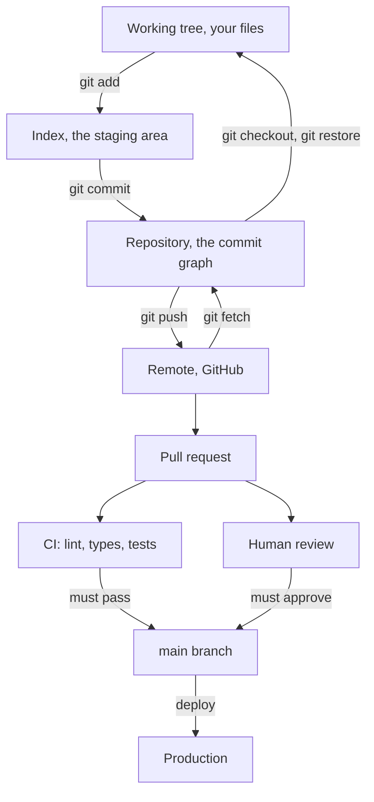

# 02 Software Engineering Foundations

**Last reviewed:** 2026-09-18 · **Volatility:** low, except tooling specifics in section 4

---

## Why this matters

This is the most commonly skipped module in any AI curriculum and the most frequently penalized gap in an AI engineer interview loop.

The reason is structural. Most people arrive at AI engineering from data science or from self-taught model work, where the unit of work is a notebook and the audience is yourself. The job is different: the unit of work is a pull request, the audience is three other engineers plus a future version of you who has forgotten everything, and the code has to run somewhere other than your machine.

Interviewers probe this deliberately, because it separates people who can build a demo from people who can ship. The probes are not subtle: "walk me through your git workflow", "how do you know your change didn't break anything", "your code works locally and fails in CI, what now". A candidate strong on transformers and weak here reads as someone who has not worked on a team.

There is also a selfish reason. Everything in modules 7 through 11 is easier if this is solid. You cannot debug a retrieval pipeline you cannot reproduce.

---

## Prerequisites

| You need | From |
|---|---|
| Writing and running Python | `01a` all sections |
| Packaging, `pyproject.toml`, virtual environments | `01b` section 8 |
| pytest, fixtures, parametrization | `01b` section 7 |
| Logging | `01b` section 8 |
| Exception strategy | `01a` section 8 |

You do not need `01c`. This module and DSA practice are independent.

---

## Skip-ahead map

| Section | Level | Skip if you can... |
|---|---|---|
| 1. Git as a model | [FOUNDATION] | ...explain what a commit actually contains |
| 2. Branching, merging, rebasing | [CORE] | ...say when rebasing is dangerous and why |
| 3. Recovering from git mistakes | [CORE] | ...recover a commit you deleted with `reset --hard` |
| 4. Environments and dependencies | [CORE] | ...explain what a lockfile gives you that a requirements file does not |
| 5. Linting, formatting, type checking | [FOUNDATION] | ...say what ruff does that mypy does not |
| 6. Testing strategy | [CORE] | ...say what an integration test catches that unit tests cannot |
| 7. CI/CD | [CORE] | ...write a GitHub Actions workflow from memory |
| 8. Code review | [CORE] | ...list what you look for in a review, in priority order |
| 9. Debugging as a method | [CORE] | ...describe how you isolate a bug without guessing |
| 10. The command line | [FOUNDATION] | ...find every file containing a string, excluding a directory |
| 11. HTTP and APIs | [CORE] | ...explain idempotency and which methods have it |
| 12. Concurrency and parallelism | [DEPTH] | ...say why threads do not speed up CPU-bound Python |

---

## Mental model

**Engineering practice is a set of devices for surviving your own forgetfulness and other people's changes.**

Every practice in this module exists because of one of two failures.

*You will forget.* Not maybe. In three months you will not remember why that retry limit is 4, what that regex matches, or which of two similar functions is the one still in use. Tests, types, commit messages and code review comments are notes to a future person who happens to be you.

*Someone will change something under you.* A dependency releases a breaking version. A colleague renames a function you call. You yourself change a shared helper and forget the second caller. Lockfiles, CI, type checking and tests exist to make those changes announce themselves rather than surface as a production incident.

**Where the analogy breaks down.** It makes these practices sound purely defensive, and the good ones are not. Good tests let you refactor aggressively because you will find out immediately if you broke something. Good CI lets you merge on a Friday. The practices buy confidence to move faster, and treating them as pure overhead is exactly why people skip them and then move slowly.

---

## Concept map



---

## Core concepts

### 1. Git as a model [FOUNDATION]

Most git confusion comes from learning commands before the model. Learn the model and the commands become obvious.

**A commit is a snapshot, not a diff.** This is the single fact that makes git make sense. Each commit stores the complete state of every tracked file, plus a pointer to its parent commit. Git shows you diffs because diffs are what humans want to read, but it stores snapshots. This is why checking out an old commit is instant and why git can never "lose" your changes once committed.

A commit contains: the full tree of files, the parent commit or commits, author and timestamp, a message, and a hash of all of it. The hash is the commit's identity, which is why changing anything about a commit produces a different commit.

**Three places your work lives:**

| Place | What it is | How work gets there |
|---|---|---|
| Working tree | The files you edit | You edit them |
| Index (staging area) | What the next commit will contain | `git add` |
| Repository | The committed history | `git commit` |

The index confuses people because most tools hide it. Its purpose is letting you commit some of your changes and not others, which matters when you notice a typo fix mixed into a feature.

**A branch is a movable pointer to a commit.** Not a copy of anything. Creating a branch writes a 41-byte file containing a hash. This is why branching is instant and why you should branch constantly.

`HEAD` is a pointer to the branch you are on. "Detached HEAD" means `HEAD` points directly at a commit rather than a branch, which happens when you check out a commit hash. Commits you make there belong to no branch and are hard to find later.

**The daily loop:**

```bash
git status                       # run this constantly; it tells you the truth
git switch -c feature/chunking   # create and switch to a branch
# ... edit files ...
git diff                         # what changed but is not staged
git add src/chunking.py
git diff --staged                # what will be committed
git commit -m "Add overlap validation to chunker"
git push -u origin feature/chunking
```

`git switch` and `git restore` are the modern replacements for the overloaded `git checkout`, which did both branch switching and file restoration and caused endless confusion. Use the new ones.

**Commit messages.** The format that survives:

```
Short summary in the imperative, under 50 characters

Why this change was necessary, and what approach you took.
Not what the diff says; the diff says that. What it cannot
say is why.

Fixes #123
```

The imperative mood ("Add", "Fix", "Remove", not "Added" or "Adds") reads as "applying this commit will Add X", which is what a commit is. The body matters far more than people think: six months later the question is never "what did this change" but "why on earth did we do it this way".

**What not to commit.** A `.gitignore` for a Python AI project:

```gitignore
.venv/
__pycache__/
*.py[cod]
.pytest_cache/
.mypy_cache/
.ruff_cache/
.env
*.log
data/
models/
*.gguf
*.safetensors
.DS_Store
```

Two of these are load-bearing. `.env` keeps secrets out of history, and once a secret is committed it is in the history permanently even after you delete it, so the only real remedy is rotating the key. Model weights and data files are the other: a single `.gguf` can be tens of gigabytes, git stores every version forever, and a repository with a committed model is effectively unclonable. Use Git LFS or, better, keep artifacts out of git entirely.

### 2. Branching, merging, rebasing [CORE]

**Merge** creates a new commit with two parents, preserving exactly what happened.

```bash
git switch main
git pull
git merge feature/chunking
```

**Rebase** replays your commits on top of another branch, producing a linear history.

```bash
git switch feature/chunking
git rebase main
```

Rebase does not move your commits. It creates new commits with the same changes and different parents and hashes. The originals become unreferenced. This is the source of every rebase disaster.

**The rule: never rebase commits that others have pulled.** If your branch is public and someone has based work on it, rebasing rewrites history under them, and their next pull produces a mess that has to be untangled by hand. Rebase your own unpushed or unshared work freely; leave shared history alone.

| Use | When |
|---|---|
| `git rebase main` on your feature branch | Before opening a PR, to get a clean linear history and resolve conflicts on your own time |
| `git merge` into main | Integrating a finished feature, preserving the branch's shape |
| `git rebase -i` | Cleaning up your own messy commits before review |
| Nothing | On a branch someone else has pulled |

**Interactive rebase** is how you turn eight commits of "wip", "fix", "actually fix" into two meaningful ones. `git rebase -i` is unavailable in some environments, including this one, but you should know it exists and what it does: it opens an editor listing your commits with actions (`pick`, `squash`, `reword`, `drop`) you can change.

**Conflicts.** A conflict means git cannot decide, so it asks you:

```
<<<<<<< HEAD
    chunk_size = 512
=======
    chunk_size = 1024
>>>>>>> feature/chunking
```

Above `=======` is the branch you are on, below is the branch coming in. Edit to what it should be, delete all three markers, `git add` the file, then `git rebase --continue` or `git commit`.

Two things that reduce conflicts more than any technique: small branches merged often, and not reformatting files you are not changing. A pull request that reformats a whole file to fix one line is a conflict generator and an unreviewable diff.

**`git pull` is `fetch` plus `merge`**, and the merge is often not what you want. Prefer:

```bash
git pull --rebase
```

or configure it as the default:

```bash
git config --global pull.rebase true
```

This replays your local commits on top of the remote's, avoiding the "Merge branch 'main' of github.com..." commits that clutter history with no information.

### 3. Recovering from git mistakes [CORE]

Worth its own section, because fear of git is mostly fear of losing work, and once you know the recovery moves the fear goes.

**The most important thing to know: committed work is almost never lost.** Git keeps a log of everywhere `HEAD` has been, for about 90 days.

```bash
git reflog
```

```
a3f1c2d HEAD@{0}: reset: moving to HEAD~3
9b2e4f1 HEAD@{1}: commit: Add reranking
7c8d3a0 HEAD@{2}: commit: Add hybrid search
```

Anything in that list is recoverable:

```bash
git reset --hard 9b2e4f1        # back to where you were
```

**The recovery table:**

| Mistake | Fix |
|---|---|
| Wrong message on the last commit | `git commit --amend` |
| Forgot a file in the last commit | `git add file && git commit --amend --no-edit` |
| Committed to main instead of a branch | `git switch -c feature/x && git switch main && git reset --hard origin/main` |
| Want to undo a commit but keep the changes | `git reset --soft HEAD~1` |
| Want to undo a commit and the changes | `git reset --hard HEAD~1` (then reflog if you regret it) |
| Undo a commit that is already pushed | `git revert <hash>`, which adds an inverse commit |
| Discard changes to one file | `git restore path/to/file` |
| Unstage a file, keep the edits | `git restore --staged path/to/file` |
| Need to switch branches mid-change | `git stash`, then `git stash pop` |
| Deleted a branch you needed | `git reflog` to find its tip, then `git switch -c name <hash>` |

**`reset` versus `revert`.** `reset` rewrites history and is for local work. `revert` adds a new commit that undoes an old one, preserving history, and is the only safe choice for anything pushed. Resetting a pushed branch and force-pushing breaks everyone who has pulled it.

**The one thing that does lose work:** uncommitted changes destroyed by `git reset --hard` or `git checkout .`. Those were never in git, so git cannot help. This is the argument for committing often, even messy commits, since you can clean them up later with interactive rebase.

### 4. Environments and dependencies [CORE]

**The problem.** Your code imports `httpx`. Which version? If the answer is "whatever was installed", your code works today and breaks on a colleague's machine, in CI, or next Tuesday when a maintainer ships a breaking change.

**A virtual environment per project**, always:

```bash
python3 -m venv .venv
source .venv/bin/activate
pip install -e ".[dev]"
```

Installing into the system Python eventually produces two projects needing incompatible versions of the same library, with no way out.

**Declared versus locked dependencies**, which is the distinction people miss:

*Declared* dependencies are what your code needs, with ranges, in `pyproject.toml`:

```toml
dependencies = ["httpx>=0.27,<1.0", "pydantic>=2.0,<3.0"]
```

*Locked* dependencies are the exact versions of everything, including transitive dependencies you never named:

```
httpx==0.28.1
httpcore==1.0.9
h11==0.16.0
certifi==2025.8.3
...
```

You need both. Ranges say what is acceptable; the lock says what was actually tested. Without a lock, "it works on my machine" is unfalsifiable because no two machines have the same versions.

```bash
pip freeze > requirements.lock
pip install -r requirements.lock      # exact reproduction
```

`[VERIFY: uv and Poetry both handle this better than pip, and uv has been moving quickly @ current uv docs]` The concept is what matters and it is stable; the tool is not.

**Pinning strategy:**

| Context | Strategy |
|---|---|
| A library others import | Wide ranges, upper bound at the next major |
| An application you deploy | Ranges in `pyproject.toml`, exact pins in a lockfile, lockfile committed |
| A Docker image | Install from the lockfile, never from ranges |
| Anything with a model | Pin the model version too; "latest" is not reproducible |

That last row is the AI-specific one. A pipeline pinned to `gpt-4` or `latest` silently changes behavior when the provider updates it, and your evaluation results from last month become meaningless. Pin the model string, record it in your evaluation output, and treat a model change like a dependency upgrade.

### 5. Linting, formatting, type checking [FOUNDATION]

Three different jobs, often confused:

| Tool | Answers |
|---|---|
| **Formatter** (ruff format, black) | Is it laid out consistently? |
| **Linter** (ruff) | Is anything suspicious or dead? |
| **Type checker** (mypy, pyright) | Do the types line up? |

```bash
pip install ruff mypy

ruff format .          # rewrite formatting
ruff check . --fix     # find and auto-fix lint issues
mypy src/
```

**Formatting is not worth an opinion.** Pick a formatter, run it automatically, and never discuss it again. Every minute spent on line length in code review is a minute not spent on whether the logic is right. The value is that all diffs become semantic, because no diff ever contains a whitespace change.

**Linting catches real bugs**, not just style: unused imports, variables assigned and never read, mutable default arguments, bare `except`, comparisons to `None` with `==`, f-strings with no placeholders. These are exactly the `01a` and `01b` mistakes, caught automatically.

**Pre-commit hooks** run these before a commit exists:

```yaml
# .pre-commit-config.yaml
repos:
  - repo: https://github.com/astral-sh/ruff-pre-commit
    rev: v0.5.0
    hooks:
      - id: ruff
        args: [--fix]
      - id: ruff-format
  - repo: https://github.com/pre-commit/pre-commit-hooks
    rev: v4.6.0
    hooks:
      - id: trailing-whitespace
      - id: end-of-file-fixer
      - id: check-added-large-files
        args: [--maxkb=5000]
      - id: detect-private-key
```

```bash
pip install pre-commit && pre-commit install
```

`[VERIFY: hook revisions @ the pre-commit hook repositories]` Two of these hooks earn their place immediately in AI work: `check-added-large-files` stops you committing a model checkpoint, and `detect-private-key` stops a category of credential leak.

### 6. Testing strategy [CORE]

`01b` covered writing tests. This is about deciding which to write.

**The levels, and what each actually catches:**

| Level | Tests | Catches | Misses |
|---|---|---|---|
| Unit | One function, no I/O | Logic errors, edge cases, off-by-one | Anything about how pieces connect |
| Integration | Several components together | Wrong interfaces, bad assumptions between modules, config errors | Real-world data weirdness |
| End-to-end | The whole system through its real entry point | Deployment and wiring problems | Almost nothing cheaply; these are slow and flaky |
| Contract | Your assumptions about an external service | Provider API changes | Anything internal |

**The shape that works:** many unit tests, a meaningful number of integration tests, very few end-to-end tests. The ratio is not sacred; the reasoning is. Unit tests are fast and precise, so a failure names the broken function. End-to-end tests are slow and vague, so a failure says "something is wrong somewhere".

The common anti-pattern is the inverse: almost no unit tests and a handful of end-to-end tests that take twenty minutes, fail intermittently, and get disabled after the third false alarm.

**What to test in an AI pipeline**, specifically, since this trips people up:

| Testable deterministically | Not |
|---|---|
| Chunking boundaries and overlap | Whether the LLM's answer is good |
| Parsing and schema validation | Embedding values |
| Retrieval given a fixed index and fixed query | Generation quality |
| Prompt template rendering | Model behavior across versions |
| Retry and error handling | Latency under real load |
| Cost and token accounting | |

The right-hand column is not untestable, it is *evaluated* rather than asserted: measured against a dataset, tracked over time, with thresholds. That is module 07's evaluation material, and conflating the two is a common mistake. Do not write a unit test asserting an LLM returns a specific string; it will pass today and fail next week for reasons unrelated to your code.

**Test naming.** The name is read far more often than the body, usually in a CI failure at speed:

```python
def test_chunk_overlap_repeats_trailing_content(): ...
def test_loader_raises_when_all_rows_malformed(): ...
def test_retry_does_not_retry_client_errors(): ...
```

Each says what is being tested and what the expected behavior is. `test_chunking_2` says nothing.

**Flaky tests are worse than no tests.** A test that fails 1 in 20 runs trains everyone to re-run CI instead of reading the failure, which means real failures get re-run too. Fix it or delete it. The usual causes: time dependence, network calls, shared state between tests, and dictionary or set ordering assumptions.

### 7. Continuous integration [CORE]

CI runs your checks on every push, on a machine that is not yours. That last part is the point: it is the first honest answer to "does this work anywhere else".

```yaml
# .github/workflows/ci.yml
name: CI

on:
  push:
    branches: [main]
  pull_request:

jobs:
  test:
    runs-on: ubuntu-latest
    strategy:
      matrix:
        python-version: ["3.11", "3.12"]

    steps:
      - uses: actions/checkout@v4

      - uses: actions/setup-python@v5
        with:
          python-version: ${{ matrix.python-version }}
          cache: pip

      - name: Install
        run: pip install -e ".[dev]"

      - name: Lint
        run: ruff check .

      - name: Format check
        run: ruff format --check .

      - name: Type check
        run: mypy src/

      - name: Test
        run: pytest -v --cov=src --cov-report=term-missing
```

`[VERIFY: action versions @ the GitHub Marketplace listings]`

**Design principles that matter more than the YAML:**

*Fast feedback first.* Lint before tests. A 5-second lint failure beats waiting 4 minutes for tests to reach the same conclusion.

*CI must be reproducible.* If it passes locally and fails in CI, CI is right and your machine is lying. The usual culprits are unpinned dependencies, environment variables set in your shell and not in CI, files present locally and gitignored, and tests depending on run order.

*Never let main go red.* A broken main blocks everyone. Require CI to pass before merge, as a branch protection rule, not as a social convention.

*Secrets go in repository secrets*, referenced as `${{ secrets.NAME }}`, never in the YAML. And be aware that workflows from forked pull requests should not receive secrets, because a PR can modify the workflow that reads them.

**CD is deployment on top of this**, and belongs in module 10. The prerequisite is that CI is trustworthy: nobody should automatically deploy the output of a test suite they do not believe.

### 8. Code review [CORE]

**What to look for, in priority order.** The order matters, because a review that opens with naming nitpicks and never reaches the logic is worse than no review.

1. **Is it correct?** Does it do what the description says? Edge cases: empty, null, one element, very large, concurrent.
2. **Is it safe?** Injection, secrets in code, unvalidated input, over-broad permissions, PII in logs.
3. **Will it fail well?** What happens when the dependency is down, the input is malformed, the call times out. Is the error message useful?
4. **Is it tested?** Not coverage percentage; do the tests cover the risky paths and would they catch a plausible regression?
5. **Can the next person understand it?** Names, structure, comments where the code cannot explain itself.
6. **Is it consistent with the codebase?** Following existing patterns, or deliberately and visibly deviating.
7. **Style.** Last, and mostly automated away by section 5.

**How to give a review.**

Distinguish severity explicitly, because a reviewer who flags everything at the same volume gets ignored:

```
blocking: this retries 4xx errors, which will amplify load during an outage
question: is the 0.7 threshold measured, or a guess? worth a comment either way
nit: `cs` could be `chunk_size`
```

Ask rather than assert when you are not certain. "What happens if `chunks` is empty here?" beats "this crashes on empty input", because half the time the answer is "it can't be, see line 12" and you have learned something.

Review your own PR before requesting review. You will find a third of the issues yourself, which is the cheapest review there is.

**How to receive a review.** The code is not you. A reviewer finding three bugs did you a favor. Respond to every comment, even with "good catch, fixed". If you disagree, say why; a review is a conversation, not a verdict. And if you cannot explain your reasoning clearly, that is evidence the reviewer is right.

**PR hygiene**, which determines whether you get a good review at all:

- **Small.** Under 400 lines of change. Review quality falls off a cliff past that; big PRs get "LGTM" and nothing else.
- **One concern.** A bug fix plus a refactor plus a rename is three PRs.
- **Described.** What changed, why, how you tested it, what you are unsure about.
- **Self-reviewed first.**
- **Green before requesting review.** Do not make a human find what CI would have.

**Reviewing your own work solo**, because you may not have a team right now. Open the PR against your own repo, leave it for at least an hour, then read the full diff in GitHub's interface rather than in your editor. The different presentation and the delay reproduce a surprising amount of the value. Keep a written checklist, the seven points above, and actually run down it.

### 9. Debugging as a method [CORE]

Most people debug by changing things until the symptom goes away. That works often enough to be a habit and it fails exactly when the problem is hard.

**The method:**

1. **Reproduce it reliably.** A bug you cannot reproduce cannot be verified as fixed. If it is intermittent, find what varies: input, timing, order, environment.
2. **Reduce it.** Cut the input and the code path until it is the smallest thing that still fails. This alone solves a large fraction of bugs, because the reduction is where you notice the cause.
3. **Read the error properly.** Bottom of the traceback is the error; the line above it is where. Read the whole message, including the part after the colon that people skip.
4. **Form one hypothesis and state it.** "The chunks are misaligned because `zip` is silently truncating." A hypothesis is falsifiable; "something's wrong with the chunking" is not.
5. **Test the hypothesis specifically.** One change that distinguishes true from false. Not three changes at once.
6. **Confirm you fixed the cause**, not a symptom. If you do not understand why the fix works, you have not fixed it.
7. **Write the regression test.** Before you forget what the bug was.

**Bisecting, which is the technique people know least and need most:**

```bash
git bisect start
git bisect bad                  # current commit is broken
git bisect good v0.3.0          # this tag worked
# git checks out a midpoint; test it, then:
git bisect good    # or: git bisect bad
# repeat; git narrows by binary search
git bisect reset
```

Finds the exact commit that introduced a bug in about log2(n) steps: roughly 10 tests across a thousand commits. When you have a regression and no idea where it came from, this beats reading code every time. It can be automated with `git bisect run pytest tests/test_thing.py`.

**Tools, in order of when to reach for them:**

| Tool | For |
|---|---|
| `print(f"{x=}")` | Quick checks. Honest and fine. |
| `breakpoint()` | Inspecting state interactively, when prints are multiplying |
| `logging.debug` | Bugs that only appear in long runs or production |
| `pytest --pdb` | Dropping into a debugger at the point of test failure |
| `git bisect` | "This used to work" |
| `cProfile` | "This is slow", before guessing why |
| `tracemalloc` | "Memory grows", to find allocation sites |

**The AI-specific debugging problem** is that pipelines fail silently and probabilistically. A retriever returning poor chunks does not raise. The technique is to make each stage observable: log what was retrieved with scores, log the assembled prompt, log the raw model output before parsing. Most "the model is bad" reports turn out to be a retrieval or prompt-assembly problem that was invisible because nobody logged the intermediate stage. Build that visibility in from the start; module 07 treats it as a first-class concern.

### 10. The command line [FOUNDATION]

The commands that carry most of the weight.

**Navigating and finding:**

```bash
ls -lah                              # long, all, human-readable sizes
find . -name "*.gguf" -size +1G      # large model files
du -sh * | sort -h                   # what is taking up space
tree -L 2 -I '__pycache__|.venv'     # structure, two levels
```

**Searching, with ripgrep, which is worth installing:**

```bash
rg "chunk_size"                      # respects .gitignore automatically
rg -i "todo|fixme"                   # case-insensitive alternation
rg -t py "def embed"                 # Python files only
rg -l "OPENAI_API_KEY"               # filenames only; run this before every push
rg -C 3 "raise ValueError"           # three lines of context
```

That fourth one is a habit worth forming. Grepping your own repository for key-shaped strings before pushing catches the leak that `detect-private-key` misses.

**Pipes and inspection:**

```bash
cat eval.jsonl | jq '.score' | sort -n | tail -5      # five highest scores
wc -l data/*.csv                                      # line counts
head -3 big.csv && tail -3 big.csv                    # both ends
ps aux | grep llama-server                            # is it running
lsof -i :8080                                         # what holds this port
```

**Processes and long runs:**

```bash
nohup python ingest.py > ingest.log 2>&1 &   # survives logout
tail -f ingest.log                           # follow output live
kill -9 <pid>                                # last resort
```

`2>&1` sends stderr to the same place as stdout. Without it, your tracebacks go to the terminal and vanish while your log file looks clean, which is a genuinely confusing failure.

**Environment:**

```bash
export APP_API_KEY="..."     # this session only
echo $PATH
which python3                # which one is actually running
env | grep APP_
```

`which python3` after activating a virtualenv, to confirm it points inside `.venv`, resolves a large share of "it says the package isn't installed but I installed it".

### 11. HTTP and APIs [CORE]

Everything you build talks HTTP: model providers, vector databases, your own service.

**A request:**

```
POST /v1/embeddings HTTP/1.1
Host: api.example.com
Authorization: Bearer sk-...
Content-Type: application/json

{"input": ["hello"], "model": "text-embedding-3-small"}
```

Method, path, headers, body. That is all.

**Methods and the property that matters:**

| Method | Purpose | Idempotent | Safe |
|---|---|---|---|
| GET | Read | Yes | Yes |
| POST | Create, or anything else | No | No |
| PUT | Replace | Yes | No |
| PATCH | Partial update | Not necessarily | No |
| DELETE | Remove | Yes | No |

**Idempotent means doing it twice has the same effect as doing it once.** This is not trivia; it determines what you may safely retry. Section 9.2 of `01b` retries on timeout, and a timeout means you do not know whether the server processed your request. Retrying a GET is free. Retrying a POST that charges a card may charge twice.

The production answer is an idempotency key: the client generates a unique id per logical operation and sends it as a header; the server records it and returns the original result on a repeat. If you are designing an API that clients will retry, this is the mechanism, and knowing it is a strong signal in a system design interview.

**Status codes, by the decision they imply:**

| Range | Meaning | Should you retry? |
|---|---|---|
| 2xx | Success | n/a |
| 301, 302, 307 | Redirect | Follow it |
| 400 | Your request is malformed | No. It will never work. |
| 401 | Not authenticated | No. Fix credentials. |
| 403 | Authenticated, not allowed | No. |
| 404 | Not found | No. |
| 408 | Request timeout | Yes |
| 409 | Conflict | Sometimes, after resolving |
| 422 | Semantically invalid | No |
| 429 | Rate limited | Yes, after `Retry-After` |
| 5xx | Server problem | Yes, with backoff |

This table is the retriable allowlist from `01b` section 9.2, and now you know why each entry is where it is.

**Authentication**, briefly: API keys in an `Authorization` header are the common case for model providers. OAuth for acting on a user's behalf. JWTs for stateless sessions in your own service. Keys go in environment variables, never in code, never in a URL, because URLs land in server logs and browser history.

**Designing your own endpoints**, which module 10 expands:

```
GET    /v1/documents           list
POST   /v1/documents           create
GET    /v1/documents/{id}      read one
DELETE /v1/documents/{id}      delete one
POST   /v1/search              search (POST because the query is a body, not a path)
```

Version from the first day. `/v1/` costs nothing now and is nearly impossible to retrofit once clients exist.

### 12. Concurrency and parallelism [DEPTH]

Included because it determines how you serve models, and because the question is common.

**They are different things.** Concurrency is dealing with many things at once, by interleaving. Parallelism is doing many things at once, on multiple cores. Concurrency is a structure; parallelism is an execution property.

**The GIL.** CPython's Global Interpreter Lock means only one thread executes Python bytecode at a time. Consequences:

| Work is | Use | Because |
|---|---|---|
| I/O-bound (network, disk) | `asyncio` or threads | The GIL is released while waiting |
| CPU-bound in pure Python | `multiprocessing` | Threads cannot use multiple cores |
| CPU-bound in NumPy, PyTorch, tokenizers | Threads are fine | Those libraries release the GIL in their C code |

That third row is the one people get wrong in both directions. Pure Python number crunching does not speed up with threads. But a PyTorch forward pass or a Rust tokenizer does run in parallel across threads, because the heavy work happens with the GIL released. This is why an inference server can serve concurrent requests from a thread pool.

`[VERIFY: free-threaded CPython, PEP 703, is progressing and changes this picture @ current Python release notes]` The optional no-GIL build changes the first two rows for code that opts in. Know it exists; the guidance above still describes what you will deploy.

**Choosing:**

```python
# I/O-bound: many API calls. See 01b section 9.7.
async def fetch_all(urls): ...

# CPU-bound: parse 10,000 PDFs
from concurrent.futures import ProcessPoolExecutor
with ProcessPoolExecutor(max_workers=8) as pool:
    results = list(pool.map(parse_pdf, paths))

# A blocking library inside async code
result = await asyncio.to_thread(blocking_call, arg)
```

**Where this bites in AI work.** Embedding 100,000 documents is I/O-bound against a hosted API, so async with a semaphore is right. The same job against a local model is CPU or GPU-bound, so batching matters and concurrency does not. Parsing documents before embedding is CPU-bound, so processes. One pipeline, three different answers, and choosing by habit rather than by measuring is how pipelines end up slower after being "optimized".

---

## Worked examples

### Example 1: a repository set up from scratch

The full sequence, because doing this once deliberately makes it permanent.

```bash
mkdir learning-log-analyzer && cd learning-log-analyzer
git init
python3 -m venv .venv && source .venv/bin/activate
mkdir -p src/analyzer tests
touch src/analyzer/__init__.py tests/__init__.py
```

```toml
# pyproject.toml
[project]
name = "learning-log-analyzer"
version = "0.1.0"
requires-python = ">=3.11"
dependencies = []

[project.optional-dependencies]
dev = ["pytest>=8.0", "pytest-cov>=5.0", "mypy>=1.10", "ruff>=0.5", "pre-commit>=3.7"]

[project.scripts]
analyze = "analyzer.cli:main"

[build-system]
requires = ["hatchling"]
build-backend = "hatchling.build"

# Required whenever the distribution name differs from the package directory.
# Without this, `pip install -e .` fails with "Unable to determine which files
# to ship inside the wheel", because hatchling looks for a directory matching
# the normalized project name (learning_log_analyzer) and finds `analyzer`.
[tool.hatch.build.targets.wheel]
packages = ["src/analyzer"]

[tool.ruff]
line-length = 100
target-version = "py311"

[tool.ruff.lint]
select = ["E", "F", "I", "B", "UP"]

[tool.mypy]
python_version = "3.11"
warn_return_any = true
warn_unused_ignores = true

[tool.pytest.ini_options]
testpaths = ["tests"]
addopts = "-v"
```

The ruff `select` list is worth understanding rather than copying: `E` and `F` are pycodestyle and pyflakes basics, `I` sorts imports, `B` is flake8-bugbear which catches real bug patterns including mutable default arguments, and `UP` modernizes syntax to your target version. `B` is the one that earns its place.

```bash
printf '.venv/\n__pycache__/\n*.py[cod]\n.pytest_cache/\n.mypy_cache/\n.ruff_cache/\n.env\n*.log\ndata/\n' > .gitignore

pip install -e ".[dev]"
pre-commit install

git add -A
git commit -m "Initialize project structure and tooling"
git switch -c feature/first-analyzer
```

Now every commit is linted and formatted, every push is tested by CI once you add the workflow from section 7, and a fresh clone reproduces the environment in two commands.

### Example 2: debugging a CI-only failure

The scenario, which will happen to you: tests pass locally, fail in CI with `FileNotFoundError: data/sample.csv`.

**Bad approach:** add the file to git and move on. The test passes, the underlying bug stays, and it reappears differently in three weeks.

**The method applied:**

*Reproduce.* Cannot locally, which is itself the clue. What is different about CI? It is a fresh clone with nothing untracked.

*Hypothesis.* The test depends on a file that exists on my machine but is not in the repository.

*Test the hypothesis.* Clone into a fresh directory and run the tests there:

```bash
git clone . /tmp/fresh-clone && cd /tmp/fresh-clone
python3 -m venv .venv && source .venv/bin/activate
pip install -e ".[dev]" && pytest
```

It fails identically. Hypothesis confirmed in one step, and you now have a local reproduction.

*Find the cause.* `data/` is gitignored, which is correct, and the test reads from it, which is not.

*Fix the cause, not the symptom.* Do not commit the data file. Make the test generate what it needs:

```python
@pytest.fixture
def sample_log(tmp_path):
    path = tmp_path / "sample.csv"
    path.write_text("date,topic,minutes\n2026-01-01,python,45\n", encoding="utf-8")
    return path


def test_summarize_reads_a_log(sample_log):
    assert summarize(sample_log)["total_minutes"] == 45
```

*Confirm.* Tests pass in the fresh clone.

*Generalize.* The same class of bug exists wherever a test touches a real path. Grep for it: `rg "data/" tests/`.

**The transferable lesson.** "Fresh clone into a temporary directory" reproduces most CI-only failures in under a minute, because the difference is almost always something present locally and not committed: a data file, a `.env`, an installed package, an environment variable. Reach for it before reading the CI logs a fourth time.

### Example 3: a pull request, reviewed

The diff, which looks reasonable:

```python
def search(query, top_k=5):
    embedding = embed(query)
    results = index.query(embedding, top_k)
    return [r.text for r in results if r.score > 0.7]
```

A review of seven lines, in priority order:

```
blocking: filtering after top_k means we can return fewer than top_k results,
  sometimes zero, with no signal to the caller that anything was filtered. Was
  that intended? If so the return type should carry it; if not, filter before
  taking top_k.

blocking: no error handling around embed() or index.query(). Both are network
  calls. What should a caller see when the index is down, an empty list or an
  exception? Right now it is an exception from somewhere inside a library,
  which is the worst of both.

question: where does 0.7 come from? If it was measured, a comment with the
  dataset would be worth more than the number. If it was picked by feel,
  that is fine, but it should be a named constant or a parameter so it can be
  tuned without editing this function.

question: we drop the scores on return. Callers that want to show confidence
  or debug a bad result cannot. Is there a reason not to return the results
  themselves?

nit: type hints would help here, `-> list[str]` in particular, since the
  return type is not obvious from the name.
```

**What makes this a good review.** The blocking issues are correctness and failure behavior, not style. The questions are genuine questions, and the 0.7 one may well have an answer. The nit is labeled as a nit so it does not compete with the real issues. And nothing in it is about the author.

**The revised version:**

```python
DEFAULT_SCORE_THRESHOLD = 0.7   # measured on eval-set-v2, see docs/retrieval-tuning.md


def search(
    query: str,
    top_k: int = 5,
    min_score: float = DEFAULT_SCORE_THRESHOLD,
) -> list[SearchResult]:
    """Return up to top_k results scoring at least min_score.

    Raises RetrievalError if the index or embedding service is unavailable.
    """
    try:
        embedding = embed(query)
        results = index.query(embedding, top_k * 2)      # over-fetch to survive filtering
    except (EmbeddingError, IndexError) as e:
        raise RetrievalError(f"search failed for query {query!r}") from e

    kept = [r for r in results if r.score >= min_score][:top_k]
    if not kept and results:
        logger.info(
            "all %d results below threshold %.2f (best %.3f) for query %r",
            len(results), min_score, results[0].score, query,
        )
    return kept
```

Every change traces to a review comment. Over-fetching addresses the filtering issue. The log line means "no results" is diagnosable rather than mysterious, and it records the best score, which is the number you want when tuning the threshold. `from e` preserves the original traceback.

---

## Common mistakes and debugging

### Beginner mistakes

| Symptom | Cause | Fix |
|---|---|---|
| `fatal: not a git repository` | Wrong directory, or never ran `git init` | `git status` to orient |
| Committed to main by accident | Forgot to branch | Branch from here, reset main to origin |
| `Your branch is ahead by 3 commits` | Not pushed | `git push` |
| Merge conflict markers in a running file | Committed without resolving | `rg "<<<<<<<"` before committing |
| `ModuleNotFoundError` for your own package | Not installed in editable mode | `pip install -e .` |
| Package installed but not found | Wrong virtualenv | `which python3` |
| `pytest` collects nothing | Files not named `test_*.py` | Rename, check `testpaths` |
| CI fails, local passes | Something local and uncommitted | Fresh clone (example 2) |
| Pre-commit blocks a commit | It found something | Read it; `--no-verify` is not a fix |

### Production failure modes

**A secret in git history.** Committed once, deleted in the next commit, still present in every clone forever. *Diagnostic:* `git log -p -S"sk-"` searches history for a string. *Fix:* rotate the key immediately. History rewriting with `git filter-repo` is secondary; assume it is compromised.

**Unpinned dependency breaks a build weeks later.** Nothing changed in your code; a transitive dependency shipped a major version. *Diagnostic:* CI fails on a commit that previously passed. *Fix:* lockfile, committed, used in CI and Docker.

**Flaky test disabled, real bug ships.** The test caught a genuine race condition, failed intermittently, was marked `skip`, and the race reached production. *Diagnostic:* grep for `skip` and `xfail` and ask when each was added. *Fix:* treat flakiness as a bug in the test or the code, never as background noise.

**Large file committed, repository becomes unusable.** A 4GB `.gguf` makes every clone a 4GB download, permanently, even after deletion. *Fix:* `check-added-large-files` in pre-commit, before it happens.

**Long-running rebase of a shared branch.** Someone rebases a branch two colleagues have pulled. Their next pull produces duplicated commits and confusing conflicts. *Fix:* the rule from section 2. Recovery is `git reset --hard origin/branch` after saving local work.

**Silent test ordering dependence.** Tests pass in the order you wrote them and fail when the suite is parallelized, because one leaves state behind. *Diagnostic:* run a subset, or in reverse. *Fix:* fixtures and `tmp_path`, no module-level mutable state.

### The debugging checklist

When stuck for more than thirty minutes:

1. Have I actually read the whole error message, including after the colon?
2. Can I reproduce it reliably? If not, what varies?
3. What is the smallest input that still fails?
4. What is my hypothesis, stated as a falsifiable sentence?
5. When did it last work? (`git bisect`)
6. Am I debugging the code I think I am? (`which python3`, check the import path, add a print at the top)
7. Have I explained it out loud to someone or something? The rubber duck works because forcing a linear explanation exposes the assumption you skipped.

Point 6 catches more than its share: editing one file and running another, or an installed copy shadowing your source.

---

## Interview angle

**1. Walk me through your git workflow.**

*Strong outline:* Branch per change from an up-to-date main, small focused commits with imperative messages explaining why, rebase on main before opening a PR, PR small enough to review properly with a description of what and why and how tested, CI green before requesting review, merge after approval. Then the reasoning: small branches reduce conflicts, rebase-before-PR resolves conflicts on my own time rather than the reviewer's, and never rebasing shared branches because it rewrites history under collaborators.

*Weak answer:* Listing commands without the reasoning or the shared-branch rule.

**2. Merge or rebase?**

*Strong outline:* Both, for different jobs. Rebase my own feature branch onto main before a PR for a linear, reviewable history. Merge the finished feature into main to preserve that it was a unit of work. Never rebase anything others have pulled, because rebase creates new commits with new hashes and rewrites history under them. Mention `pull --rebase` to avoid noise merge commits.

*Weak answer:* "Rebase keeps history clean." True and dangerous without the constraint.

**3. Your code passes locally and fails in CI. How do you approach it?**

*Strong outline:* CI is right and my machine is lying; the question is what is different. Fresh clone into a temp directory with a clean virtualenv reproduces most of these in a minute. Then the candidates in order: uncommitted or gitignored files the tests need, unpinned dependencies resolving differently, environment variables set in my shell, test order dependence, OS or Python version differences from a matrix build. Fix the cause: if a test needs a data file, generate it in a fixture rather than committing it.

*Weak answer:* "Re-run CI." Which is a real move for a genuinely flaky pipeline and an admission you have no method otherwise.

**4. What do you look for in a code review?**

*Strong outline:* Correctness first, including edge cases. Then safety: secrets, injection, unvalidated input, PII in logs. Then failure behavior: what happens when the dependency is down and is the error useful. Then tests, judged by whether they cover risky paths rather than by coverage percentage. Then readability and consistency. Style last, and mostly automated. Then the delivery: label severity so blocking issues are distinguishable from nits, and ask rather than assert when unsure.

*Weak answer:* "Check for bugs and style." No priority order, which is what the question is actually testing.

**5. How do you decide what to test?**

*Strong outline:* Test where a bug is likely and expensive: logic with branches and arithmetic, edge cases, error paths, and anything that has broken before. Do not test getters, third-party behavior, or exact log strings. Many fast unit tests, fewer integration tests, very few end-to-end. For AI pipelines specifically, separate what is assertable, chunking boundaries, parsing, retrieval given a fixed index, from what must be evaluated against a dataset, which is generation quality. Writing a unit test that asserts an LLM's exact output is a test that will fail for reasons unrelated to your change.

*Weak answer:* "Aim for 80% coverage." Coverage measures execution, not verification; a test with no assertions produces coverage.

**6. Explain idempotency and why it matters for retries.**

*Strong outline:* An idempotent operation has the same effect performed once or many times. GET, PUT and DELETE are idempotent by specification; POST is not. It matters because a timeout leaves you not knowing whether the server processed the request, so retrying a non-idempotent POST may duplicate the effect, charging a card twice or creating two records. The production solution is an idempotency key supplied by the client, recorded by the server, which returns the original result on a repeat.

*Weak answer:* "It means you can call it multiple times." Definition without the consequence, and the consequence is the question.

**7. Why won't threads speed up my CPU-bound Python?**

*Strong outline:* The GIL allows only one thread to execute Python bytecode at a time, so pure-Python CPU work does not parallelize across threads; use processes. But the GIL is released during I/O and inside C extensions, so threads do help for network and disk work, and NumPy, PyTorch and Rust-based tokenizers genuinely run in parallel across threads. That last point is why an inference server can use a thread pool. Mention that free-threaded CPython is changing this and that you would measure rather than assume.

*Weak answer:* "Python can't do threads." Wrong, and it misses the C-extension case that matters most in AI work.

**8. You have a regression and no idea which change caused it. What do you do?**

*Strong outline:* Find a commit where it worked and one where it does not, then `git bisect` between them; binary search finds the culprit in about log2(n) tests, roughly 10 for a thousand commits. Automate it with `git bisect run` and a test that reproduces the bug. Then read only that commit's diff. Before all that, write a reliable reproduction, because bisect is only as good as the test you give it.

*Weak answer:* "Look through recent commits." Works for five commits, not five hundred.

**9. How do you make sure your project runs on someone else's machine?**

*Strong outline:* A virtualenv per project so nothing depends on system state. Declared dependencies with ranges in `pyproject.toml` and exact versions in a committed lockfile, so the tested set is reproducible. CI running on a clean machine as the actual proof, ideally across a Python version matrix. A README with the two commands needed. Docker when the environment includes non-Python dependencies. And pin model versions as well as package versions, because a provider updating a model silently changes behavior and invalidates your evaluation results.

*Weak answer:* "requirements.txt." Necessary, not sufficient, and does not distinguish declared from locked.

**10. What is the most important engineering practice for a small team with no time?**

*Strong outline:* An opinionated answer is expected here. Version control with small reviewed PRs, because everything else is recoverable from history and review catches problems earliest and cheapest. Second, CI that runs tests on every PR, because it converts "someone should check" into something that happens. Note the tradeoff honestly: a team with no time will under-invest in end-to-end tests and documentation, which is survivable, whereas skipping review and CI is not, because the cost arrives later and larger.

*Weak answer:* Listing everything as equally important. The question is about prioritization under constraint.

### Follow-up questions to expect

- After 4: *"You are the only engineer. Is review still worth it?"* Yes, with modifications: self-review the full diff in the PR interface after a delay, keep a written checklist, and use the linter and type checker as the automated reviewer. The point is a second pass with different attention, and time creates most of that.
- After 5: *"How do you test something non-deterministic?"* Separate the deterministic parts and unit test them. For the rest, evaluate rather than assert: a fixed dataset, metrics with thresholds, tracked over time, with the test failing on regression beyond a margin rather than on inequality. Seed what can be seeded, and mock the model at the boundary when you are testing your own logic rather than its output.

### 60-second and 5-minute answers

1. Your git workflow and why it is shaped that way
2. How you debug a CI-only failure
3. What you look for in a code review, in priority order
4. Idempotency and retry safety

---

## Practice tasks

Solutions in `quizzes/02-software-engineering-practice.md`.

### Five tiny exercises

1. In a scratch repository, make three commits, then use `git reset --hard HEAD~3`. Recover all three with `reflog`. Write down what `reflog` showed, so you trust it next time.
2. Create a merge conflict on purpose in two branches, resolve it, and explain in writing which side each marker represented.
3. Write a `.gitignore` for an AI project and justify every line. Any line you cannot justify, delete.
4. Take a function with no type hints, add them, run mypy, and fix what it finds. Write down whether it found a real bug.
5. Use `git bisect` on a repository where you deliberately introduced a bug 10 commits back. Count how many steps it took.

### Three realistic coding tasks

1. **Full setup.** Take your `01a` mini-project and give it the example 1 treatment: src layout, pyproject, pre-commit, CI workflow, test suite. Success is a fresh clone running `pip install -e ".[dev]" && pytest` with no other instructions.
2. **Review a PR badly on purpose, then well.** Write a 60-line change with three deliberate problems: a correctness bug, a missing error path, and a style issue. Write two reviews, one that only catches the style issue and one in the section 8 priority order. The contrast is the exercise.
3. **Retry client with idempotency.** Build an HTTP client that retries only retriable statuses, honors `Retry-After`, jitters, and sends an idempotency key on POST. Test it against a fake transport with no network. Include tests proving a 400 is not retried and that the same key is reused across retries of one logical operation.

### One mini-project

**Contribute to your own repository as if to a team.**

Take the `01b` mini-project and run four changes through a full workflow:

1. A feature: add a new output format
2. A bug fix: find a real bug, write the failing test first
3. A refactor: extract something, with no behavior change and tests proving it
4. A dependency upgrade: bump a version, see what breaks

For each: a branch, small commits with real messages, a PR with a description, CI green, a self-review in the priority order from section 8 left as actual PR comments, then merge.

Success criterion: the repository's commit history and PR list read as if written by a team. Someone reviewing your GitHub will see this and it is worth more than the code.

---

## Mastery checklist

- [ ] Explain what a commit contains and why branching is cheap
- [ ] Recover a commit deleted with `reset --hard`, using `reflog`, without looking it up
- [ ] State when rebasing is dangerous, and why, in terms of new hashes
- [ ] Choose `revert` over `reset` for pushed commits, and explain why
- [ ] Explain what a lockfile gives you that a version range does not
- [ ] Say what a formatter, linter and type checker each do, and name a bug only the linter catches
- [ ] Write a GitHub Actions workflow that lints, type checks and tests
- [ ] Debug a CI-only failure with the fresh-clone technique
- [ ] Review a pull request in the section 8 priority order
- [ ] Give a review comment that distinguishes blocking from nit
- [ ] Use `git bisect` to find a regression
- [ ] State a falsifiable hypothesis before changing code when debugging
- [ ] Explain idempotency and derive the retriable status allowlist from it
- [ ] Say when to use async, threads and processes, including the C-extension exception
- [ ] Find every file containing a string, excluding gitignored paths, from memory
- [ ] Complete the mini-project, with a history that reads like a team's

Fewer than thirteen of sixteen means go back. Module 10 assumes all of this and adds deployment on top.

---

## Connections

**Backward:**

- `01b` section 7's pytest becomes a testing *strategy* here: which tests to write, not how.
- `01b` section 8's packaging becomes a reproducible environment with locks and CI.
- `01b` section 9.2's retriable allowlist is derived here from HTTP semantics and idempotency.
- `01a` section 8's "catch what you can handle" is the review criterion "will it fail well".

**Forward:**

- `03-data-and-sql.md` uses the CLI tools here for inspecting data files.
- `07-rag-and-vector-search.md` depends on section 9's observability point: a retrieval pipeline you cannot see inside is one you cannot debug.
- `08-agents-tools-and-mcp.md` builds reliability on idempotency from section 11. An agent that retries a non-idempotent tool call causes real damage.
- `09-local-llm-inference.md` uses section 12's concurrency model directly: serving concurrent requests from a local model is the C-extension case.
- `10-mlops-and-deployment.md` is the direct continuation. CI here, CD there; this module's practices are its prerequisites.
- `13-project-portfolio.md` treats the repository hygiene here as evidence. A reviewer looking at your GitHub judges commit history and PR quality before reading any code.

---

## Volatile claims

| Claim | Why it decays | Re-check against |
|---|---|---|
| ruff, mypy, pre-commit config keys and hook revisions | Ruff especially has renamed config sections between versions | Current ruff and pre-commit docs |
| GitHub Actions versions (`checkout@v4`, `setup-python@v5`) | Bumped periodically | GitHub Marketplace |
| "pip plus a lockfile" as the default | uv is displacing this quickly | Current uv docs |
| GIL behavior and the threads guidance | PEP 703 free-threaded builds change it for opt-in code | Python release notes |
| `git switch` and `git restore` as preferred over `checkout` | Stable since 2.23, unlikely to change | Git release notes |

Sections 1 through 3, 6, 8, 9 and 11 are concepts and stable. Sections 4, 5 and 7 are tooling and will drift.

**Next review due:** 2027-03-18, or when you next set up a new project from scratch.
