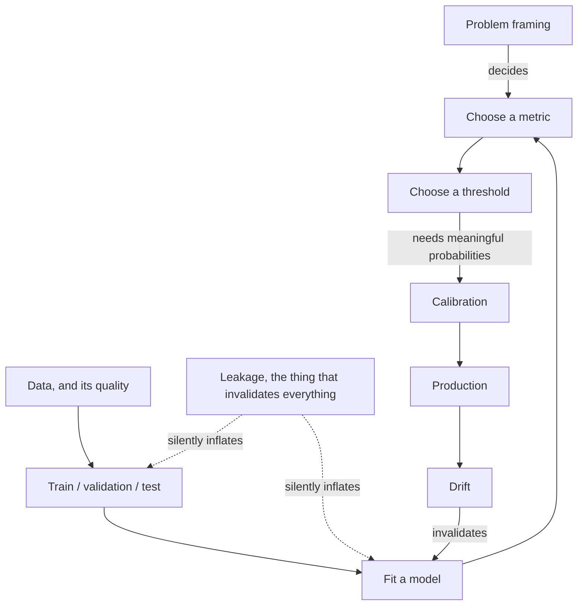

# 04 Classical Machine Learning

**Last reviewed:** 2026-09-18 · **Volatility:** low. The material here has been stable for a decade.

Every number in this module was produced by running the code, on scikit-learn 1.8.0. The leakage demonstration in particular is worth running yourself, because reading about it does not produce the same reaction as watching a model score 0.845 AUC on pure noise.

---

## Why this matters

You are unlikely to build a gradient boosting model in an AI engineering job. You are very likely to be asked about one.

More importantly, this module is not really about algorithms. It is about **evaluation**, and evaluation is the thing that transfers completely. Every idea here, leakage, the right metric for the decision being made, thresholds, calibration, drift, applies unchanged to a RAG system. Module 07's evaluation set is a held-out test set. Its recall@k is a metric chosen for a decision. The "eval questions generated from the chunks" problem is data leakage wearing different clothes.

The interview reality: for an AI engineer role, nobody asks you to derive the SVM dual. They ask why your model looked good offline and failed in production, and the answer is always in this module.

---

## Prerequisites

| You need | From |
|---|---|
| Variance, sampling, p-values, sample size | `03` sections 9, 10 |
| Joins and the denominator problem | `03` sections 4, 5 |
| numpy and pandas basics | `01a`, `03` section 8 |
| Pipelines and testing discipline | `01b`, `02` |

Module `03` section 9 is the hard prerequisite. Most "the model is wrong" problems are statistics problems.

---

## Skip-ahead map

| Section | Level | Skip if you can... |
|---|---|---|
| 1. Problem framing | [FOUNDATION] | ...recognize a ranking problem disguised as classification |
| 2. Splitting and leakage | [CORE] | ...name four routes leakage takes into a pipeline |
| 3. Data quality and imbalance | [CORE] | ...say why resampling is usually the wrong first move |
| 4. Linear and logistic regression | [FOUNDATION] | ...say what logistic regression's coefficients actually mean |
| 5. Regularization and bias-variance | [CORE] | ...point at bias and variance in a learning curve |
| 6. Trees, forests, boosting | [CORE] | ...say when a boosted tree beats a neural network |
| 7. Other algorithms | [DEPTH] | ...say when kNN is a reasonable production choice |
| 8. Unsupervised | [DEPTH] | ...say why k-means needs scaled features |
| 9. Metrics | [CORE] | ...say why accuracy at 1% positives is meaningless |
| 10. Thresholds and business metrics | [CORE] | ...convert a cost matrix into a threshold |
| 11. Calibration | [CORE] | ...say what "0.7" should mean and how you check |
| 12. Pipelines and tuning | [CORE] | ...say why every transform belongs inside the pipeline |
| 13. Drift and monitoring | [CORE] | ...distinguish data drift from concept drift |

---

## Mental model

**A model is a compression of your training data into a rule, and every failure is the rule not surviving contact with data it has not seen.**

Training finds a rule that fits what you showed it. The only question that matters is whether that rule generalizes. Everything in this module is a device for answering that honestly:

- Splitting exists so you have data the rule has not seen.
- Leakage is any way information about the unseen data reached the rule anyway.
- Regularization deliberately makes the rule fit worse, so it generalizes better.
- Calibration asks whether the rule's confidence means anything.
- Drift is the world changing so the rule stops applying.

**Where the analogy breaks down.** "Compression of training data" suggests the goal is faithfulness to the data, and it is not. A model that reproduces the training data perfectly is the worst possible model. The goal is faithfulness to the *process that generated* the data, and the training set is only a sample of that process. This is the distinction that makes overfitting make sense.

---

## Concept map



The dotted arrows are the ones that produce the confident wrong answers.

---

## Core concepts

### 1. Problem framing [FOUNDATION]

Getting this wrong makes everything downstream irrelevant.

| Task | Output | Recognize it by |
|---|---|---|
| **Binary classification** | One of two labels | "Is this X or not" |
| **Multiclass** | One of many labels | "Which category" |
| **Multilabel** | Any number of labels | "Which tags apply" |
| **Regression** | A number | "How much, how many" |
| **Ranking** | An ordering | "Which of these should come first" |
| **Clustering** | Groups, no labels | "What natural groups exist" |
| **Anomaly detection** | Unusual or not | "What looks wrong", with very few positives |
| **Recommendation** | Personalized ranking | "What should this user see next" |

**The most common framing mistake: treating a ranking problem as classification.** If you can only act on the top 20 flagged items per day, you do not need to classify everything; you need the best 20 at the top. The metric is then ranking quality, not accuracy, and this is exactly module 07's situation, where retrieval is ranking and treating it as classification would make no sense.

**The second most common: framing something as ML that is not.** If the rule is "flag anything over $10,000 from a new account", write the rule. A model adds a training pipeline, a monitoring burden and an unexplainable decision, to approximate two lines of code. "We tried a rule first and it was not good enough" is a strong opening in an interview; "we went straight to ML" is not.

**Define success before modeling.** Not "high accuracy", but what decision is made with the output, what an error costs in each direction, and what the current non-ML baseline achieves. Without those you cannot pick a metric in section 9 or a threshold in section 10.

### 2. Splitting and leakage [CORE]

**The splits, and what each is for:**

| Split | Used for | Touched |
|---|---|---|
| **Train** | Fitting parameters | Constantly |
| **Validation** | Choosing hyperparameters, features, model family | Many times |
| **Test** | One final honest estimate | Once, at the end |

The test set is only honest while it is untouched. Every time you look at it and change something, you leak a little information, and after twenty such cycles it is a second validation set with a misleading name.

**Cross-validation** rotates the validation role through k folds, giving k estimates instead of one. Use it when data is scarce, and note that it costs k times the training.

**Time-based splitting** is mandatory for anything temporal. Random splitting when time matters means training on the future to predict the past, which is the single largest source of catastrophically over-optimistic results in industry.

**Leakage: the demonstration.**

Here is a dataset of 200 samples and 2,000 features, all pure noise, generated from a random number generator. **There is no signal.** The correct AUC is 0.5.

```python
rng = np.random.default_rng(0)
X = rng.normal(size=(200, 2000))     # pure noise
y = rng.integers(0, 2, 200)          # unrelated random labels

# WRONG: select features using all the data, then cross-validate
sel = SelectKBest(f_classif, k=20).fit(X, y)
X_sel = sel.transform(X)
leaky = cross_val_score(LogisticRegression(max_iter=1000), X_sel, y,
                        cv=StratifiedKFold(5, shuffle=True, random_state=0),
                        scoring="roc_auc")

# RIGHT: selection inside the pipeline, so it runs per fold
pipe = Pipeline([("sel", SelectKBest(f_classif, k=20)),
                 ("clf", LogisticRegression(max_iter=1000))])
honest = cross_val_score(pipe, X, y,
                         cv=StratifiedKFold(5, shuffle=True, random_state=0),
                         scoring="roc_auc")
```

Actual output:

```
LEAKY  (select on all data, then CV): AUC = 0.845  +/- 0.063
HONEST (selection inside pipeline):   AUC = 0.517  +/- 0.080
true answer: 0.5 (there is no signal)
```

**0.845 AUC on data containing nothing.** The cross-validation was real. The folds were real. The model never saw its validation labels during fitting. And the number is entirely fabricated, because the feature *selection* saw all the labels, so the 20 features chosen were precisely those that happened to correlate with the labels across the whole dataset, including the validation folds.

Note the standard deviation, 0.063, which is small enough to look like a stable result. Leakage does not announce itself as instability.

**The four routes leakage takes**, and how to close each:

| Route | Example | Fix |
|---|---|---|
| **Preprocessing on all data** | Scaling, imputation or feature selection fit before splitting | Everything inside a `Pipeline`, fit per fold |
| **Target leakage** | A feature that is a consequence of the outcome: `account_closed_date` predicting churn | Ask of every feature, "would I have this at prediction time?" |
| **Temporal leakage** | Random split on time-ordered data | Split by time, always |
| **Group leakage** | The same customer, document or patient in both train and test | `GroupKFold` on the entity id |

**Group leakage in AI work specifically:** chunks from the same document in both your training and evaluation sets. They share vocabulary and phrasing, so performance is inflated. This is exactly module 07's "eval questions generated from the chunks" problem, and it is why project 2 tracks a `real_user` slice separately.

**The diagnostic that catches most of it:** a result substantially better than you expected is a bug report, not a success. Investigate before celebrating. Cross-validated AUC of 0.99 on a hard problem means leakage until proven otherwise.

### 3. Data quality and imbalance [CORE]

**Missing values.** The question is always *why* it is missing:

| Kind | Meaning | Handling |
|---|---|---|
| Missing completely at random | Unrelated to anything | Imputation is safe |
| Missing at random | Depends on other observed features | Imputation conditional on those |
| Missing not at random | Depends on the missing value itself | **The missingness is a feature.** Add an indicator. |

Income missing because high earners decline to answer is the third kind. Imputing the mean destroys the signal; adding an `income_missing` flag preserves it.

**Imputation belongs in the pipeline**, fit on train folds only. Imputing with the full dataset's mean is leakage.

**Outliers.** Distinguish a data error, such as an age of 300, from a genuine extreme value, such as a large transaction. Delete errors; keep extremes, because in fraud detection the extremes *are* the signal.

**Class imbalance** is where most people go wrong first.

**Resampling is usually not the first move.** SMOTE and random oversampling are widely taught and frequently harmful: they distort the base rate, so your model's probabilities no longer mean what they say, which destroys calibration and makes threshold selection incoherent. And SMOTE interpolates between minority points, which in high dimensions creates synthetic examples in regions where no real data lives.

**What to do instead, in order:**

1. **Use a metric that is not fooled by imbalance.** Section 9. This alone solves most of it.
2. **Move the threshold.** Section 10. The model's ranking may be fine; your cutoff is wrong.
3. **Class weights**, which adjust the loss without fabricating data.
4. **Collect more positives**, if you can.
5. **Resampling**, last, and re-calibrate afterwards.

**Label quality** is the underrated one. If two human annotators disagree 15% of the time, no model will exceed roughly 85% agreement with either of them, and your test set contains that same 15% noise. **Measure inter-annotator agreement before blaming the model.** A model that appears stuck at 84% may be at the ceiling.

### 4. Linear and logistic regression [FOUNDATION]

**Linear regression** predicts a number as a weighted sum of features, fit by minimizing squared error. Worth knowing because it is the base case for everything, it is genuinely interpretable, and it is a baseline you should always beat before claiming anything complicated is necessary.

**Logistic regression** predicts a probability. It computes the same weighted sum and passes it through the logistic function to squash it into (0, 1), then fits by maximizing the likelihood of the observed labels.

**What the coefficients mean**, which is the interview question. A coefficient is the change in **log-odds** per unit change in the feature, holding others constant. Exponentiate it to get an odds ratio: a coefficient of 0.7 means `e^0.7 ≈ 2.0`, so a one-unit increase doubles the odds.

Two caveats that matter. "Holding others constant" is meaningless when features are correlated, which they usually are. And the coefficient's magnitude depends on the feature's scale, so you cannot compare coefficients for importance unless the features were standardized.

**Why logistic regression remains a strong default:** it is fast, it produces well-calibrated probabilities out of the box (section 11), it is interpretable enough to explain to a regulator, and it has one hyperparameter that matters. Beat it before moving on, and often you will not.

### 5. Regularization and bias-variance [CORE]

**The decomposition.** A model's error has three parts:

- **Bias**: error from the model being too simple to capture the pattern. Underfitting.
- **Variance**: error from the model being so flexible it fits noise. Overfitting.
- **Irreducible noise**: the floor. No model beats it.

You trade bias against variance. More capacity means less bias, more variance.

**Reading it off a learning curve**, which is the practical skill:

| Pattern | Diagnosis | Fix |
|---|---|---|
| Train error high, validation error high and close to it | **High bias.** Too simple. | More features, more capacity, less regularization |
| Train error low, validation error much higher | **High variance.** Overfitting. | More data, more regularization, fewer features |
| Both low and close | Working | Ship it |
| Validation error *below* training error | Suspect a bug | Usually leakage, or a mis-sized split |

**Regularization** penalizes large coefficients, deliberately fitting the training data worse:

| Type | Penalty | Effect |
|---|---|---|
| **L2 (Ridge)** | Sum of squared coefficients | Shrinks all coefficients smoothly; handles correlated features by splitting weight between them |
| **L1 (Lasso)** | Sum of absolute coefficients | Drives some coefficients to exactly zero, so it selects features |
| **Elastic net** | Both | Sparsity plus stability with correlated features |

**The geometric intuition for why L1 zeroes things out:** the L1 constraint region is a diamond with corners on the axes, and the optimum tends to land on a corner, where one coordinate is exactly zero. The L2 region is a circle with no corners, so coordinates shrink toward zero without reaching it. This is a good whiteboard answer.

**Regularization requires scaled features.** The penalty is on coefficient magnitude, and an unscaled feature measured in thousands gets a tiny coefficient that the penalty ignores, while one measured in units gets crushed. Scale first, inside the pipeline.

### 6. Trees, forests, and boosting [CORE]

**A decision tree** splits the data repeatedly on feature thresholds, choosing each split to maximize purity. Interpretable, handles non-linearity and interactions for free, needs no scaling. Alone, it overfits badly; a deep enough tree memorizes the training set.

**Random forest** trains many trees, each on a bootstrap sample of rows and a random subset of features at each split, then averages them. The randomness decorrelates the trees so their errors cancel. Robust, few hyperparameters that matter, hard to overfit badly, a very good default.

**Gradient boosting** trains trees sequentially, each fitting the *residual errors* of those before it. This is a fundamentally different idea from a forest: forests reduce variance by averaging independent models; boosting reduces bias by additively correcting.

| | Random forest | Gradient boosting |
|---|---|---|
| Trees are | Independent, parallel | Sequential, each correcting the last |
| Reduces | Variance | Bias |
| Overfits | Reluctantly | Readily, without care |
| Tuning | Forgiving | Matters: learning rate, depth, estimators, early stopping |
| Typical accuracy | Good | Usually better |
| Trains | Parallel, fast | Sequential |

**XGBoost and LightGBM** are gradient boosting implementations with engineering improvements. LightGBM grows trees leaf-wise rather than level-wise, which is faster and more prone to overfitting on small data. Both handle missing values natively and are the standard answer for tabular problems.

**The question that comes up: when does a boosted tree beat a neural network?**

On tabular data with heterogeneous features, which is most business data, boosted trees usually win, train in minutes rather than hours, need far less tuning, and handle missing values and mixed types without preprocessing. Neural networks win where there is structure to exploit, images, text, audio, sequences, and where you have a lot of data.

The honest version for an AI engineer: **if it is a table, start with LightGBM.** Reaching for a neural network on tabular data is usually a preference rather than a decision. `[VERIFY: this has been the consistent finding in tabular benchmark literature, and the gap narrows periodically @ current comparisons]`

**Feature importance from trees is misleading** in two specific ways worth knowing. Default impurity-based importance is biased toward high-cardinality features, because they offer more split points. And with correlated features, importance is split arbitrarily between them, so a genuinely important feature can appear unimportant because its correlated twin absorbed the credit. Prefer permutation importance, and be careful about causal claims either way.

### 7. Other algorithms [DEPTH]

**k-nearest neighbours.** Predict by the majority of the k closest training points. No training, all the cost at prediction. Needs scaled features and degrades badly in high dimensions, where distances concentrate and everything becomes roughly equidistant.

Worth knowing because it is the conceptual ancestor of vector search: module 07's dense retrieval *is* kNN, with an approximate index making it fast enough to be practical.

**Naive Bayes.** Applies Bayes' rule assuming features are independent given the class. The assumption is almost always false and it works anyway, especially on text. Extremely fast, a reasonable baseline for text classification.

**Support vector machines.** Find the boundary with the widest margin between classes. The kernel trick allows non-linear boundaries without explicitly computing high-dimensional features. Elegant, scales poorly beyond tens of thousands of samples, and largely displaced by boosting for tabular work. Know the margin concept.

### 8. Unsupervised learning [DEPTH]

**k-means** partitions data into k clusters by iteratively assigning points to the nearest centroid and recomputing centroids. Fast and widely used.

**Three things that catch people.** You must choose k, and the elbow method is a heuristic rather than an answer. It assumes roughly spherical, similarly sized clusters, and fails on elongated ones. And **it requires scaled features**, because it uses Euclidean distance, so an unscaled feature with a large range dominates the clustering entirely.

**PCA** finds the orthogonal directions of greatest variance and projects onto the first few. Used for compression, visualization and decorrelation. Also requires scaling, and the components are linear combinations of features, so they are usually not interpretable. Note that variance is not the same as usefulness: a low-variance direction can carry the signal you care about.

**Where this connects:** PCA on embeddings is how you sanity-check that a vector space has structure, and clustering chunks is one way to find near-duplicate content in a corpus, which is module 07's duplicate-domination failure mode.

### 9. Metrics [CORE]

**The most important section in this module.** Choosing the wrong metric is how you ship a model that is worse than doing nothing.

#### The demonstration

A dataset with 1.42% positives. First, a model that always predicts the negative class:

```
accuracy  = 0.9858   <- looks excellent
recall    = 0.0000   <- catches nothing
precision = 0.0000
```

**98.58% accuracy from a model that does nothing.** If your target was "95% accuracy", you have met it by predicting a constant.

Now a real logistic regression at different thresholds:

```
 thresh     acc    prec  recall      F1    TP    FP   FN
   0.50  0.9875   1.000   0.118   0.211    10     0   75
   0.30  0.9885   0.750   0.282   0.410    24     8   61
   0.10  0.9750   0.279   0.482   0.353    41   106   44
   0.05  0.9473   0.147   0.565   0.233    48   279   37
   0.02  0.8630   0.067   0.671   0.122    57   794   28
```

**Read that table carefully; it is the whole section.**

At the default 0.5 threshold, precision is a perfect 1.000 and the model finds 10 of 85 positives. Ten. A dashboard reporting "precision 100%" is describing a model that misses 88% of what it is looking for.

Accuracy *peaks* at threshold 0.30 and then declines, while recall keeps improving. Accuracy is actively steering you away from the model you probably want.

Going from 0.10 to 0.02 buys 16 more true positives and costs 688 more false positives. Whether that is a good trade is a business question, not a modeling one, and no metric answers it for you.

#### The metrics

| Metric | Formula | Answers | Use when |
|---|---|---|---|
| **Accuracy** | (TP+TN)/all | How often right | Balanced classes, symmetric costs. Rarely. |
| **Precision** | TP/(TP+FP) | Of flagged, how many were real | False positives are expensive |
| **Recall** | TP/(TP+FN) | Of real, how many found | False negatives are expensive |
| **F1** | Harmonic mean | Balance of the two | You genuinely value them equally |
| **ROC-AUC** | Area under TPR-FPR | Ranking quality across thresholds | Roughly balanced classes |
| **PR-AUC** | Area under precision-recall | Ranking quality for the positive class | **Imbalanced classes** |
| **Log loss** | Mean negative log likelihood | Probability quality | You need calibrated probabilities |

**ROC-AUC versus PR-AUC**, measured on the same model and data:

```
ROC-AUC = 0.8165   <- flattering on imbalanced data
PR-AUC  = 0.3889   <- the honest one
baseline PR-AUC (random) = 0.0142
```

The same model, the same predictions. 0.82 sounds strong; 0.39 sounds weak. **PR-AUC is the honest one on imbalanced data**, because ROC's false positive rate divides by the huge negative count, so a large absolute number of false positives barely moves it. PR-AUC's precision divides by the flagged count, so false positives hurt visibly.

Note the baseline: random guessing gets PR-AUC 0.0142, the positive rate. So 0.3889 is 27 times better than random, which is genuinely good. **Always report the baseline alongside PR-AUC**, because unlike ROC-AUC its floor is not 0.5.

**For regression:** MAE for the average error in original units, robust to outliers. RMSE penalizes large errors more, in original units. R² is the fraction of variance explained, and it is unitless, which makes it easy to report and hard to interpret. Prefer MAE or RMSE when talking to people who have to act on the number.

### 10. Thresholds and business metrics [CORE]

**A classifier does not output a class. It outputs a score, and you choose a cutoff.** The default 0.5 is a convention with no claim to correctness.

**Choose the threshold from costs.** Suppose a false negative, a missed fraudulent transaction, costs $500, and a false positive, an unnecessary review, costs $5. Then a false negative is 100 times worse, and from the table in section 9:

| Threshold | FN | FP | Cost |
|---|---|---|---|
| 0.50 | 75 | 0 | $37,500 |
| 0.30 | 61 | 8 | $30,540 |
| 0.10 | 44 | 106 | $22,530 |
| 0.05 | 37 | 279 | $19,895 |
| 0.02 | 28 | 794 | $17,970 |

Lowest total cost is at the lowest threshold, which is exactly the one with the worst accuracy (0.8630) and the worst F1 (0.122). **Optimizing F1 here would cost roughly $20,000.**

This is the single most useful thing in the module. Bring costs to the decision, not metric names.

**The other constraint that sets thresholds: capacity.** If your review team handles 50 cases a day, set the threshold so roughly 50 cases clear it, and then the relevant metric is precision at that operating point. This is the **precision@k** framing, and it is module 07's situation exactly, where you pass 5 chunks and so recall@5 is what binds.

**Choose the threshold on validation data, never on test.** It is a hyperparameter, and tuning it on your test set contaminates your final estimate.

### 11. Calibration [CORE]

**A calibrated model's probabilities mean what they say:** of the cases it scores 0.7, about 70% should be positive.

**This matters whenever the number is used for anything other than ranking:** expected-value calculations, combining model output with other evidence, showing confidence to a user, setting a threshold from costs as in section 10.

**Measured.** Random forest predictions bucketed against actual rates:

```
RF predicted 0.0-0.1: n= 5843  mean pred=0.008  actual rate=0.005
RF predicted 0.1-0.3: n=  100  mean pred=0.159  actual rate=0.100
RF predicted 0.3-0.5: n=   24  mean pred=0.383  actual rate=0.542
RF predicted 0.5-0.7: n=   21  mean pred=0.576  actual rate=0.952
RF predicted 0.7-1.0: n=   12  mean pred=0.787  actual rate=1.000
```

**Look at the 0.5-0.7 bucket: the model says 0.576 and the true rate is 0.952.** It is badly underconfident at the top. If you were computing expected value from those numbers, every calculation would be wrong, and not by a small margin.

Note also the small `n` in the upper buckets. With 12 to 24 cases, these estimates are themselves noisy, which is module `03` section 9's point applied to your own diagnostics. Report the counts.

**Brier score** measures calibration and discrimination together, lower being better:

```
LogisticRegression   Brier = 0.01094  AUC = 0.8165
RandomForest         Brier = 0.00837  AUC = 0.8139
RF + isotonic        Brier = 0.00788  AUC = 0.8225
```

**Which model is well calibrated, and why:**

- **Logistic regression** optimizes log loss directly, so it is usually well calibrated out of the box.
- **Random forests** average votes, which pulls predictions toward the middle and away from 0 and 1. Systematically underconfident at the extremes, as the buckets above show.
- **Boosted trees** optimize a margin and tend to be overconfident.
- **Neural networks** with modern training are often badly overconfident.

**Fixes:** Platt scaling fits a logistic regression to the model's outputs, which works well and assumes a sigmoid shape. Isotonic regression fits any monotonic mapping, which is more flexible and needs more data. Both must be fit on **held-out data**; calibrating on the training set is leakage.

Note above that isotonic calibration improved Brier from 0.00837 to 0.00788 and also improved AUC slightly, though calibration generally does not change ranking, so treat a small AUC change as noise.

### 12. Pipelines and tuning [CORE]

**Every transform goes inside the pipeline.** This is not a style preference; it is what makes cross-validation honest, as section 2 demonstrated.

```python
from sklearn.compose import ColumnTransformer
from sklearn.impute import SimpleImputer
from sklearn.pipeline import Pipeline
from sklearn.preprocessing import OneHotEncoder, StandardScaler

numeric = Pipeline([
    ("impute", SimpleImputer(strategy="median")),
    ("scale", StandardScaler()),
])
categorical = Pipeline([
    ("impute", SimpleImputer(strategy="most_frequent")),
    ("encode", OneHotEncoder(handle_unknown="ignore")),
])

preprocess = ColumnTransformer([
    ("num", numeric, numeric_columns),
    ("cat", categorical, categorical_columns),
])

model = Pipeline([
    ("prep", preprocess),
    ("clf", LogisticRegression(max_iter=1000, class_weight="balanced")),
])
```

`handle_unknown="ignore"` matters: a category appearing only in test would otherwise raise at prediction time, which in production is an outage.

**Tuning:**

| Method | When |
|---|---|
| Grid search | Few hyperparameters with a small discrete range |
| Random search | More hyperparameters; usually finds a good region faster than grid |
| Bayesian / successive halving | Expensive models where each fit is costly |

**Nested cross-validation** when you need an unbiased estimate after tuning: an inner loop selects hyperparameters, an outer loop estimates performance. Expensive, and the honest answer when someone asks "is that score after tuning?"

**Always establish a baseline first**, in this order: the constant predictor, a simple rule, logistic regression, then anything complicated. A gradient boosting model that beats logistic regression by 0.4% on AUC has not earned its operational cost, and you cannot know that without the comparison.

**Reproducibility:** set seeds, pin library versions, record the data snapshot. A result you cannot reproduce is not a result. This is `02` section 4's lockfile argument applied to models.

### 13. Drift and monitoring [CORE]

A model degrades in production for reasons unrelated to your code.

| Kind | What changed | Example | Detect with |
|---|---|---|---|
| **Data drift** | Input distribution | A new user segment | Distribution tests on features |
| **Concept drift** | The relationship between input and output | Fraud tactics change | Performance metrics, once labels arrive |
| **Label drift** | Base rate | Fraud rate doubles | Monitor the positive rate |
| **Upstream change** | A feature's meaning or availability | A column's units change | Schema checks, range checks |

**The hard part: labels arrive late, or never.** You may not know a transaction was fraudulent for 60 days. So monitoring input distributions and prediction distributions is the early warning, and performance is the confirmation that comes later.

**What to monitor, in order of how early it warns you:**

1. Input feature distributions, against a training reference
2. Prediction distribution, since a sudden shift in the score histogram is a strong signal
3. Data quality: null rates, new categorical values, out-of-range numbers
4. Performance, as labels arrive
5. Business metrics, which lag most and matter most

**The connection to AI systems** is direct. A RAG system has all four kinds. Data drift is users asking about new topics. Concept drift is documents changing so previously correct answers become wrong. Upstream change is the embedding model version moving. Module 07's freshness monitoring is drift monitoring with a different name.

---

## Worked example: an honest evaluation, end to end

The shape of a real evaluation, in the order you should do it.

**Step 1: baseline first.** Constant predictor: accuracy 0.9858, recall 0.0. Now you know what "98.6% accurate" means, and no result can be misread as impressive on that axis.

**Step 2: split before touching anything.** Stratified, to preserve the base rate. Time-based if the data is temporal. Grouped if entities repeat.

**Step 3: everything inside a pipeline.** Not for tidiness. Because section 2 showed what happens otherwise.

**Step 4: cross-validate, and expect a boring number.** If it is much better than expected, look for leakage before celebrating. The leaky example produced 0.845 ± 0.063 on noise, and low variance is not evidence of correctness.

**Step 5: choose the metric from the decision.** Imbalanced, so PR-AUC with its baseline reported, not accuracy and not bare ROC-AUC.

```
ROC-AUC = 0.8165
PR-AUC  = 0.3889   (random baseline 0.0142, so 27x better than chance)
```

**Step 6: choose a threshold from costs or capacity.** With FN at $500 and FP at $5, the cost-minimizing threshold is 0.02, which has the worst accuracy and worst F1 in the table. State this explicitly, because it looks wrong to anyone reading the metrics alone.

**Step 7: check calibration if the probabilities will be used as probabilities.** The random forest said 0.576 where the true rate was 0.952. Calibrate on held-out data.

**Step 8: touch the test set once.** Report the number with an interval, not a point. With 85 positives in the test set, the uncertainty on recall is substantial, and module `03` section 9 says how much.

**Step 9: write down what would make this wrong.** Drift in the input distribution, a change in the base rate, the label definition shifting, an upstream feature changing units. Then monitor those.

**Why this is the interview answer.** It never mentions an algorithm. Every step is about knowing whether the number is real.

---

## Common mistakes and debugging

### Beginner mistakes

| Symptom | Cause | Fix |
|---|---|---|
| 99% accuracy, model is useless | Imbalanced classes | PR-AUC; look at the confusion matrix |
| CV score far above test score | Leakage in preprocessing | Everything inside the `Pipeline` |
| Validation error below training error | Usually leakage, or a tiny validation set | Check the split |
| Model great offline, bad in production | Temporal or group leakage | Split by time and by entity |
| Scaling changed results dramatically | Distance- or penalty-based model on unscaled features | Scale inside the pipeline |
| `ValueError: Found unknown categories` | A category present only at prediction time | `handle_unknown="ignore"` |
| Feature importance says the id column matters | Impurity importance favours high cardinality | Permutation importance; drop ids |
| Results change every run | No random seed | Set and record seeds |

### Production failure modes

**The leaky feature discovered after launch.** A feature available in training but not at prediction time, or one that is a consequence of the outcome. Offline AUC 0.95, production performance near random. *Diagnostic:* for every feature ask "would I have this, with this value, at the moment of prediction?" *Fix:* rebuild the training set from a point-in-time snapshot.

**Threshold set on the test set.** Tuned to maximize F1 on test, so the reported performance is optimistic and production is worse. *Fix:* thresholds are hyperparameters; choose them on validation.

**Silent upstream schema change.** A feature's units change from dollars to cents. No error, predictions become nonsense. *Diagnostic:* range and distribution checks on every input feature. *Fix:* schema validation at the boundary, which is `01b` section 9.3's Pydantic argument.

**The model that was never better than the rule.** Nobody compared against the existing heuristic. Months of work, a monitoring burden, and no improvement. *Fix:* baseline first, always.

**Calibration drift.** The base rate shifts, so the probabilities no longer mean what they did, and every expected-value calculation downstream is wrong while ranking still looks fine. *Diagnostic:* monitor Brier score and the predicted-versus-actual buckets. *Fix:* recalibrate periodically on recent data.

**Training on a filtered population.** The training set was built from cases that passed an earlier filter, so the model never sees the cases the filter rejects, and in production it sees everything. *Diagnostic:* compare training and production input distributions. This is `03` section 5's denominator problem.

### Debugging method

1. **Compare against the constant baseline** before anything else.
2. **A result better than expected is a bug report.** Investigate before celebrating.
3. **Look at the confusion matrix**, not the summary metric. The counts tell you what the model actually does.
4. **Plot the learning curve** to separate bias from variance.
5. **Ask the point-in-time question** of every feature.
6. **Check the base rate** in train, validation, test and production. Differences explain a lot.
7. **Inspect the highest-confidence errors.** They usually reveal a labeling problem or a leak.

---

## Interview angle

**1. What is data leakage and how do you prevent it?**

*Strong outline:* Any way information from outside the training fold reaches the model. Lead with the demonstration: 200 samples of pure noise, 2,000 random features, random labels, so the true AUC is 0.5. Selecting the top 20 features on all the data and then cross-validating gives 0.845 with a standard deviation of only 0.063. The cross-validation was real; the number is fabricated, because selection saw the validation labels. Then the four routes: preprocessing fit before splitting, target leakage from features that are consequences of the outcome, temporal leakage from random splits on time-ordered data, and group leakage from the same entity in both sets. Prevention: everything inside a `Pipeline`, split by time and by group, and ask of every feature whether you would have it at prediction time. Finish with the diagnostic: a result much better than expected is a bug report.

*Weak answer:* "Don't let test data into training." True and it misses that the most damaging leakage happens through preprocessing while the split looks perfectly correct.

**2. Why is accuracy usually the wrong metric?**

*Strong outline:* Give numbers. At a 1.42% positive rate, predicting the negative class always gives 98.58% accuracy and zero recall. Worse, accuracy actively misleads about thresholds: on real data it peaked at threshold 0.30 and declined as recall improved, so optimizing it steers you away from the model you want. Then the alternatives: precision and recall separately, chosen by which error is expensive; PR-AUC rather than ROC-AUC on imbalanced data, because ROC's false positive rate divides by a huge negative count so false positives barely register, while PR-AUC divides by the flagged count. And always report PR-AUC's baseline, since its floor is the positive rate, not 0.5.

*Weak answer:* "Accuracy is bad for imbalanced data." Correct, and no sense of what to use or why the alternatives differ.

**3. Explain precision and recall, and how you choose between them.**

*Strong outline:* Precision is of what you flagged, how much was real; recall is of what was real, how much you found. You do not choose by preference, you choose from costs. Work an example: false negative $500, false positive $5, so from a threshold table the cost-minimizing point is the *lowest* threshold, which has the worst accuracy and the worst F1. Optimizing F1 there would cost about $20,000. Then the other constraint: if the review team handles 50 cases a day, the threshold is set by capacity and the metric is precision at that operating point, which is the precision@k framing and exactly how retrieval works.

*Weak answer:* Defining both correctly and stopping. The question is how you decide, and costs are the answer.

**4. What is calibration and when do you need it?**

*Strong outline:* A calibrated model's probabilities mean what they say: of the cases scored 0.7, about 70% are positive. Needed whenever the number is used as a number rather than for ranking: expected-value calculations, combining with other evidence, showing confidence, setting a threshold from costs. Give the measurement: a random forest predicting 0.576 in a bucket whose actual rate was 0.952, badly underconfident. Then why, by model family: logistic regression optimizes log loss so it is calibrated by default; forests average votes, which pulls toward the middle; boosted trees optimize a margin and are overconfident. Fixes are Platt scaling or isotonic regression, fit on held-out data, because calibrating on training data is leakage. Measure with Brier score plus predicted-versus-actual buckets, and report the bucket counts because the upper buckets are often small and noisy.

*Weak answer:* "It makes probabilities more accurate." Circular, and it does not say when you need it.

**5. When would you pick gradient boosting over a neural network?**

*Strong outline:* Tabular data with heterogeneous features, which is most business data. Boosted trees usually win there, train in minutes, need far less tuning, handle missing values and mixed types natively, and require no scaling. Neural networks win where there is structure to exploit: images, text, audio, sequences, and where you have a lot of data. The blunt version for an AI engineer: if it is a table, start with LightGBM. Then distinguish the mechanisms, because it shows understanding: forests reduce variance by averaging independent models, boosting reduces bias by additively correcting residuals, which is why boosting overfits readily and needs early stopping while forests are forgiving.

*Weak answer:* "Neural networks are more powerful." Not on tabular data, and "powerful" is not a criterion.

**6. Your model has 0.95 AUC offline and performs badly in production. Walk me through it.**

*Strong outline:* Treat 0.95 as suspicious, not impressive. First candidate is leakage, in priority order: temporal, if the split was random on time-ordered data; group, if an entity appears in both sets; target, if a feature is a consequence of the outcome; preprocessing, if anything was fit before splitting. Second candidate is a training and production distribution mismatch, often because training data came from a filtered population, so the model never saw the cases production sends it. Third is that the offline metric did not reflect the decision, for example optimizing AUC when the system operates at a fixed capacity where precision@k is what matters. Fourth is drift since training. Diagnostics: compare input distributions between training and production, check the base rate in every split, ask the point-in-time question of every feature, and inspect the highest-confidence errors.

*Weak answer:* "Retrain on more recent data." Might help, and it skips the diagnosis.

**7. Explain bias and variance, and how you would tell which you have.**

*Strong outline:* Bias is error from the model being too simple, variance is error from fitting noise, and there is an irreducible floor. Diagnose from a learning curve: training and validation error both high and close together means high bias, so add capacity or features and reduce regularization; training error low with validation much higher means high variance, so get more data, regularize more, or reduce features. Then the fourth case that is not in textbooks: validation error *below* training error is a bug, usually leakage or a mis-sized split, and it should be investigated rather than explained.

*Weak answer:* Defining the terms without the diagnostic, which is the part you would use.

**8. How do you handle class imbalance?**

*Strong outline:* Deliberately not resampling first. In order: use a metric that is not fooled, which is PR-AUC with its baseline, and this alone resolves most cases; move the threshold, since the ranking may be fine and the cutoff wrong; use class weights, which adjust the loss without inventing data; collect more positives if you can; and only then resample. Say why resampling is last: it distorts the base rate so probabilities no longer mean what they say, destroying calibration and making cost-based thresholding incoherent, and SMOTE interpolates between minority points, which in high dimensions creates synthetic examples where no real data lives. If you do resample, recalibrate afterwards.

*Weak answer:* "Use SMOTE." The most commonly taught answer and usually not the best one.

**9. How do you know a model is good enough to ship?**

*Strong outline:* Compare against the thing it replaces, which is the constant predictor, then the existing rule or heuristic, then a simple model. A gradient boosting model beating logistic regression by 0.4% AUC has not earned its operational cost. Then: is the metric the one the decision needs, is the threshold set from costs or capacity on validation rather than test, are the probabilities calibrated if they will be used as probabilities, and is the test set estimate reported with an interval rather than a point. Finally, state what would make it wrong, drift in inputs, a change in base rate, an upstream feature changing, and make sure those are monitored before launch rather than after.

*Weak answer:* "It beats the target metric." Against what baseline, at what threshold, with what uncertainty.

**10. How does everything in this module apply to a RAG system?**

*Strong outline:* Almost all of it, with different names. The evaluation set is a held-out test set, and questions generated from the chunks are group leakage, which is why project 2 tracks real-user questions separately. Recall@k is a metric chosen for a decision, specifically how many chunks you pass, which is the precision@k capacity framing. The refusal threshold is a decision threshold set from the cost of a wrong answer against the cost of an unnecessary refusal. Drift appears as users asking about new topics, documents changing, and the embedding model version moving. And the baseline discipline is identical: measure the naive chunk-and-embed version before claiming any improvement.

*Weak answer:* "They're different areas." They are the same discipline, and the question is testing whether you see that.

### Follow-up questions to expect

- After 1: *"Your pipeline is clean and CV is still suspiciously high. What now?"* Check for group leakage with `GroupKFold` on the entity id, check temporal ordering, and check the features one at a time for target leakage by asking whether each is available at prediction time. Then try shuffling the labels: if performance stays high on shuffled labels, something is structurally wrong with the evaluation itself.
- After 4: *"Your model is well calibrated at launch and drifts. How do you notice?"* Monitor Brier score and the predicted-versus-actual buckets over time, and watch the base rate. Ranking metrics like AUC can stay flat while calibration degrades, so AUC alone will not tell you, and everything downstream that uses the probability as a number quietly becomes wrong.

### 60-second and 5-minute answers

1. What leakage is and how it fakes a result
2. Why accuracy misleads, with numbers
3. How you choose a threshold
4. What calibration is and when you need it

---

## Practice tasks

Solutions in `quizzes/04-machine-learning-practice.md`.

### Five tiny exercises

1. Reproduce the leakage demonstration. Then make it worse: scale before splitting as well, and see how high you can push AUC on pure noise.
2. Build a confusion matrix by hand from counts and compute accuracy, precision, recall and F1. Then change one cell and recompute, to feel which metrics move.
3. Given a cost matrix and a threshold table, find the cost-minimizing threshold. Confirm it is not the F1-maximizing one.
4. Take a random forest, bucket its predictions, and compare predicted against actual rates. Then calibrate and repeat.
5. Construct a dataset where ROC-AUC is high and PR-AUC is poor, and explain in writing why both are correct.

### Three realistic coding tasks

1. **The leaky pipeline, documented.** Build two versions of the same model, one with preprocessing outside the CV loop and one inside. Report both numbers, explain the gap, and write the test that would catch the leaky version in CI. This is a portfolio artifact in itself.
2. **Cost-driven threshold selection.** Take an imbalanced dataset, fit a model, and produce a threshold-versus-cost curve for three different cost ratios. Show that the optimal threshold moves, and that none of the three is 0.5.
3. **Drift simulation.** Train on the first half of a time-ordered dataset and evaluate on successive later windows. Plot performance over time and add input distribution monitoring. Determine whether the distribution shift is detectable before the performance drop, which is the entire argument for input monitoring.

### One mini-project

**Reproducible evaluation with a deliberately broken variant.**

Build a scikit-learn pipeline on any tabular dataset, with:

- A constant baseline, a rule-based baseline, and logistic regression, all measured before anything complicated
- Everything inside a `Pipeline`, with a stratified or grouped or time-based split as appropriate
- A metric chosen and justified in writing from the decision the model serves
- A threshold chosen from a stated cost matrix, selected on validation
- A calibration check with predicted-versus-actual buckets, with counts
- A test set touched exactly once, reported with an interval
- **A second, deliberately leaky version**, with the gap measured and explained
- A written list of what would make the model wrong in production, and what you would monitor

Success criterion: the leaky version scores better, and your write-up explains exactly why that number is not real. That document is worth more in an interview than a model with a good score.

---

## Mastery checklist

- [ ] Recognize a ranking problem disguised as classification
- [ ] Say when a rule is better than a model
- [ ] Name four routes leakage takes, with an example of each
- [ ] Explain why the leaky pipeline scored 0.845 on pure noise
- [ ] Say when time-based and grouped splitting are mandatory
- [ ] Explain why missingness can itself be a feature
- [ ] Give the order of operations for class imbalance, and say why resampling is last
- [ ] Say what a logistic regression coefficient means, and two reasons not to over-read it
- [ ] Diagnose bias versus variance from a learning curve, including the bug case
- [ ] Explain why L1 zeroes coefficients and L2 does not
- [ ] Say when a boosted tree beats a neural network, and why
- [ ] Name two ways tree feature importance misleads
- [ ] Explain why accuracy peaked at the wrong threshold, with numbers
- [ ] Explain why PR-AUC is more honest than ROC-AUC on imbalanced data, and report its baseline
- [ ] Convert a cost matrix into a threshold, and show F1 would have chosen differently
- [ ] Explain calibration, which model families are badly calibrated, and how to fix it
- [ ] Say why every transform belongs inside the pipeline
- [ ] Distinguish data drift from concept drift, and say what you monitor first
- [ ] Map every concept here onto a RAG system

Fewer than fifteen of nineteen means go back. Module 07's evaluation assumes sections 2, 9 and 10.

---

## Connections

**Backward:**

- `03` section 9's variance and intervals are why you report an interval on a test estimate.
- `03` section 10's experimentation is how you validate a model online after validating it offline.
- `03` sections 4 and 5's join and denominator problems are how training sets get silently filtered.
- `01b` section 7's testing discipline is how the leaky pipeline gets caught in CI.

**Forward:**

- `05-deep-learning.md` uses this module's loss, overfitting and metrics vocabulary. Learning-curve diagnosis transfers directly.
- `06-transformers-and-llms.md` section 11's evaluation is this module's discipline applied to generation, where exact match no longer works.
- `07-rag-and-vector-search.md` section 9 is this module's evaluation with retrieval metrics substituted. The leakage lesson is the "questions generated from chunks" warning.
- `10-mlops-and-deployment.md` turns section 13's drift monitoring into production alerting.
- `11-ai-system-design.md` uses section 10's threshold reasoning for capacity-constrained systems.

---

## Volatile claims

| Claim | Why it decays | Re-check against |
|---|---|---|
| "Boosted trees usually win on tabular data" | Consistent finding, periodically contested | Current tabular benchmark literature |
| scikit-learn API details | Stable, and parameters get deprecated | Current scikit-learn docs |
| Specific numbers in every table | Dataset and seed dependent | Rerun them yourself |
| LightGBM and XGBoost characterizations | Both evolve | Current docs |

The concepts, leakage, bias-variance, metric selection, thresholds, calibration, drift, have been stable for a decade and will remain so.

**Next review due:** 2027-09-18.
