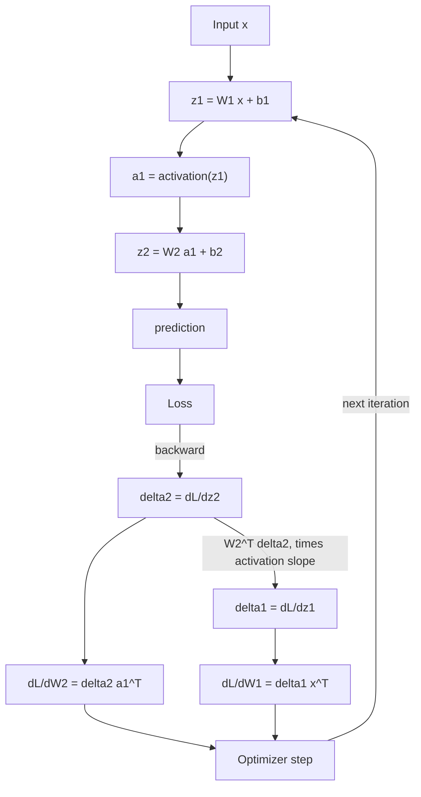

# 05 Deep Learning

**Last reviewed:** 2026-09-18 · **Volatility:** low for fundamentals, medium for tooling

Every number here was produced by running the code, on PyTorch 2.14 and scikit-learn 1.8. The backpropagation example is worked by hand and then checked against autograd; the gradients match to floating-point precision.

---

## Why this matters

You are not going to train a foundation model. You need this module anyway, for three reasons.

**To reason about the models you do use.** Quantization, fine-tuning, inference cost, why a model degrades at long context: all of it is easier once you know what a gradient is doing and why the architecture is shaped the way it is.

**To debug training when you do it.** Fine-tuning an embedding model, training a reranker, training a small classifier for query routing. These are real AI engineer tasks and they fail in the ways this module describes.

**Because it is asked.** "Explain backpropagation" and "why do gradients vanish" appear in most AI engineer loops. They are checking whether you understand the machinery or only the API.

**Timebox this module.** You need enough to reason about fine-tuning and inference. You do not need to derive Adam. Two weeks in the 24-week plan, and the plan means it.

---

## Prerequisites

| You need | From |
|---|---|
| Loss functions, overfitting, bias-variance | `04` sections 5, 9 |
| Learning curve diagnosis | `04` section 5 |
| Metrics and why accuracy misleads | `04` section 9 |
| Leakage and honest evaluation | `04` section 2 |
| numpy, pipelines, seeds | `01a`, `04` section 12 |

Module `04` is a hard prerequisite. Every diagnostic here is that module's diagnostic applied to a different model family.

Mathematically: you need the chain rule. If `y` depends on `u` and `u` depends on `x`, then `dy/dx = dy/du × du/dx`. That is the whole of backpropagation.

---

## Skip-ahead map

| Section | Level | Skip if you can... |
|---|---|---|
| 1. What a network is | [FOUNDATION] | ...say why nonlinearity is the entire point |
| 2. Forward pass and loss | [FOUNDATION] | ...write the forward pass of a 2-layer net from memory |
| 3. Backpropagation by hand | [CORE] | ...compute all gradients for a 2-layer net on paper |
| 4. Gradient descent and optimizers | [CORE] | ...say what momentum and Adam each add |
| 5. Learning rate, batch size, epochs | [CORE] | ...say what batch size trades against |
| 6. Initialization and normalization | [CORE] | ...say why initialization scale matters at depth |
| 7. Activations | [FOUNDATION] | ...say why ReLU displaced sigmoid |
| 8. Losses | [FOUNDATION] | ...say why BCEWithLogits beats sigmoid plus BCE |
| 9. Vanishing and exploding gradients | [CORE] | ...show the problem numerically |
| 10. Regularization | [CORE] | ...name four and say when each helps |
| 11. Architectures | [FOUNDATION] | ...say why transformers displaced recurrence |
| 12. PyTorch | [CORE] | ...write a training loop without a reference |
| 13. Diagnosing a training run | [CORE] | ...name the four curve shapes and their fixes |
| 14. Transfer learning | [CORE] | ...say when to fine-tune and when not to |

---

## Mental model

**A neural network is a stack of adjustable linear transformations with a nonlinearity between each pair, and training is repeatedly asking "which way should each number move to make the error smaller".**

The chain rule answers that question efficiently. Backpropagation is the chain rule applied in reverse through the network, reusing intermediate results so you compute every gradient in roughly the cost of one forward pass rather than one pass per parameter.

**Where the analogy breaks down.** "Which way should each number move" suggests a search over a landscape with a bottom you are trying to reach. In high dimensions the picture is different: local minima are rarely the problem, saddle points and flat regions are, and the surprising empirical fact is that many different minima give similar performance. Training is less like descending into a valley and more like drifting through a vast, mostly-flat space until you land somewhere good enough.

---

## Concept map



---

## Core concepts

### 1. What a network is [FOUNDATION]

A layer computes `z = Wx + b`, a matrix multiply plus an offset. Then an activation function applies a nonlinearity elementwise.

**Why the nonlinearity is the entire point.** Stack two linear layers and you get `W₂(W₁x + b₁) + b₂`, which simplifies to `(W₂W₁)x + (W₂b₁ + b₂)`, a single linear transformation. **Without nonlinearity, a hundred layers have exactly the same expressive power as one.** Depth buys you nothing at all.

The nonlinearity breaks that collapse, and then depth lets the network build representations: early layers learn simple features, later layers combine them into complex ones. That compositional structure is what "deep" means.

**Width versus depth.** A wide enough single hidden layer can approximate any continuous function, which sounds like depth is unnecessary. In practice depth is dramatically more parameter-efficient for the structured functions that appear in real problems, because composition reuses features rather than enumerating cases.

### 2. Forward pass and loss [FOUNDATION]

The forward pass for a 2-layer network:

```
z1 = W1 x + b1
a1 = σ(z1)
z2 = W2 a1 + b2
a2 = σ(z2)
L  = loss(a2, y)
```

That is the whole thing. Everything after is about adjusting `W1, b1, W2, b2`.

**The loss must be differentiable**, because training needs its gradient. This is why accuracy is not a loss function: it is a step function, so its gradient is zero almost everywhere and tells you nothing about which direction to move. You train on a differentiable surrogate such as cross-entropy and *evaluate* on accuracy or whatever module `04` section 9 says the decision needs.

### 3. Backpropagation by hand [CORE]

Work it once with real numbers and it stops being mysterious.

**The network:** 2 inputs, 2 hidden units with sigmoid, 1 output with sigmoid, squared-error loss.

```python
x  = np.array([0.5, 0.1])
y  = np.array([1.0])
W1 = np.array([[0.1, 0.4], [0.2, 0.3]])
b1 = np.array([0.1, 0.2])
W2 = np.array([[0.5, 0.6]])
b2 = np.array([0.3])
```

**Forward:**

```
z1 = W1@x + b1    = [0.19   0.33  ]
a1 = sigmoid(z1)  = [0.5474 0.5818]
z2 = W2@a1 + b2   = [0.9227]
a2 = sigmoid(z2)  = [0.7156]
L  = 0.5*(a2-y)^2 = 0.040442
```

Check one by hand: `z1[0] = 0.1×0.5 + 0.4×0.1 + 0.1 = 0.05 + 0.04 + 0.1 = 0.19`. ✓

**Backward.** Work from the loss toward the inputs, and note that each step is one chain-rule factor.

```
dL/da2  = a2 - y        = [-0.2844]
da2/dz2 = a2(1 - a2)    = [ 0.2035]      sigmoid's derivative
delta2  = dL/dz2        = [-0.0579]      the two multiplied

dL/dW2  = delta2 · a1ᵀ  = [[-0.0317, -0.0337]]
dL/db2  = delta2        = [-0.0579]

dL/da1  = W2ᵀ · delta2  = [-0.0289, -0.0347]      the error, propagated back
delta1  = dL/da1 · a1(1-a1) = [-0.0072, -0.0084]  times this layer's slope

dL/dW1  = delta1 · xᵀ   = [[-0.0036, -0.0007],
                           [-0.0042, -0.0008]]
dL/db1  = delta1        = [-0.0072, -0.0084]
```

**Verified against PyTorch autograd:**

```
torch loss   = 0.040442   (hand: 0.040442)
torch dL/dW2 = [[-0.0317 -0.0337]]   (hand: [[-0.0317 -0.0337]])
torch dL/dW1 = [[-0.0036 -0.0007]
                [-0.0042 -0.0008]]   (hand: same)
ALL GRADIENTS MATCH
```

**The three things to take from this.**

**`delta` is the reusable quantity.** Once you have `delta` for a layer, the weight gradient is `delta · (that layer's input)ᵀ`, always. This is why backpropagation is efficient: you compute each `delta` once and reuse it, rather than recomputing paths for every parameter.

**Backward propagation of error is literally `Wᵀ delta`.** The same weights that carried activations forward carry error backward, transposed. That symmetry is the algorithm.

**Notice the gradient magnitudes.** `dL/dW2` is around 0.03; `dL/dW1` is around 0.004, roughly ten times smaller after one layer. Two layers, ten-fold shrinkage. Section 9 shows what happens at twelve layers.

### 4. Gradient descent and optimizers [CORE]

The update rule: `parameter ← parameter − learning_rate × gradient`.

| Variant | Uses | Tradeoff |
|---|---|---|
| **Batch GD** | The whole dataset per step | Stable, slow, needs all data in memory |
| **SGD** | One sample per step | Fast, very noisy |
| **Mini-batch** | A batch per step | The practical default |

**Momentum** accumulates a moving average of past gradients, so the update has inertia. This damps oscillation across a narrow ravine and accelerates along its floor, and it helps escape flat regions where the gradient is small but consistently pointing the same way.

**Adam** combines momentum with per-parameter learning rates scaled by a running estimate of each gradient's magnitude. Parameters with consistently small gradients get larger effective steps. It works well out of the box, which is why it is the default.

**What to use:** Adam or AdamW, learning rate around 1e-3, and only investigate further if training misbehaves. `[UNVERIFIED: this is a convention, not a measurement; the right value depends on architecture and scale]` SGD with momentum and a tuned schedule sometimes generalizes slightly better on vision tasks, which is a detail worth knowing and not worth starting with.

**AdamW** decouples weight decay from the gradient update. In plain Adam, weight decay gets scaled by the per-parameter learning rate, which weakens it inconsistently. AdamW applies it directly and is the correct default for transformers.

### 5. Learning rate, batch size, epochs [CORE]

**Learning rate is the hyperparameter that matters most.**

| Too high | Too low |
|---|---|
| Loss oscillates, spikes, or becomes NaN | Loss decreases very slowly |
| Diverges | Gets stuck in a poor region |

Measured, with everything else held constant:

```
healthy setup           train=0.0001  val=0.8169
lr far too high (5.0)   train=0.0000  val=29492.0723
```

The training loss looks perfect in both cases. The validation loss at lr=5.0 is four orders of magnitude worse. **A training loss that goes to zero is not evidence of anything**, which is section 13's whole point.

**Schedules** reduce the learning rate over training: large steps early to cover ground, small steps late to settle. Warmup does the reverse at the very start, ramping up from near zero, which prevents early instability when gradients are large and the parameters are random. Warmup plus cosine decay is the standard transformer recipe.

**Batch size** trades several things at once:

| Larger batch | Smaller batch |
|---|---|
| Less gradient noise, more stable | Noisier, which acts as regularization |
| Better hardware utilization | Poor utilization |
| More memory | Less memory |
| Fewer updates per epoch | More updates per epoch |

The noise in small-batch training is not purely a cost: it helps escape sharp minima and often generalizes slightly better. **The common rule: when you increase batch size, increase the learning rate roughly proportionally**, since you are averaging over more samples and the gradient estimate is correspondingly more reliable. `[VERIFY: the linear scaling rule holds over a range and breaks down at extremes @ current literature]`

**Epochs** are passes over the data. The right number is "until validation loss stops improving", which is what early stopping automates.

### 6. Initialization and normalization [CORE]

**Initialization is not arbitrary.** All zeros means every unit in a layer computes the same thing and receives the same gradient forever, so the layer has one effective unit. Too large and activations explode through depth; too small and they vanish.

**Xavier/Glorot** scales the initial weights by the number of inputs and outputs, keeping activation variance roughly constant through the network for sigmoid and tanh. **He initialization** does the same for ReLU, which zeroes half its inputs and therefore needs a factor-of-two larger scale to compensate. Frameworks default to something reasonable; knowing why it matters is the point.

**Batch normalization** normalizes each feature across the batch, then applies a learned scale and shift. It stabilizes training, allows higher learning rates, and acts as a mild regularizer through batch noise. Its problems: behavior differs between training and inference, since inference uses running statistics, and it is unreliable with very small batches.

**Layer normalization** normalizes across features within each sample instead. Independent of batch size, identical at training and inference, and therefore the choice for transformers and anything with variable-length sequences.

**Which and why:** batch norm for convolutional vision models, layer norm for transformers. If a model behaves differently in `eval()` mode than in `train()`, batch norm's running statistics are the first suspect, along with dropout.

### 7. Activations [FOUNDATION]

| Activation | Range | Notes |
|---|---|---|
| **Sigmoid** | (0, 1) | Saturates at both ends; derivative peaks at 0.25. Output layer for binary classification only. |
| **Tanh** | (-1, 1) | Zero-centered, still saturates |
| **ReLU** | [0, ∞) | `max(0, x)`. Cheap, no saturation for positive inputs. The default. |
| **Leaky ReLU** | (-∞, ∞) | Small negative slope; avoids dead units |
| **GELU** | ≈(-0.17, ∞) | Smooth, standard in transformers |
| **Softmax** | Sums to 1 | Output layer for multiclass |

**Why ReLU displaced sigmoid**, which is the interview question. Sigmoid's derivative is `σ(1-σ)`, with a maximum of 0.25 at the centre and near zero at either extreme. Every layer multiplies the backward signal by that derivative, so a deep sigmoid network multiplies by numbers at most 0.25 repeatedly, and the gradient vanishes exponentially with depth. ReLU's derivative is exactly 1 for positive inputs, so the signal passes through undiminished.

**Dying ReLU:** a unit whose input is always negative outputs zero, so its gradient is zero and it never recovers. Leaky ReLU and GELU avoid this by having a nonzero slope for negative inputs. It is mostly a problem with a too-high learning rate.

### 8. Losses [FOUNDATION]

| Task | Loss |
|---|---|
| Binary classification | Binary cross-entropy |
| Multiclass | Cross-entropy |
| Regression | MSE, or MAE when outliers matter |
| Ranking | Pairwise or listwise ranking losses |
| Language modeling | Cross-entropy over the vocabulary |
| Embeddings | Contrastive or triplet loss |

**Why cross-entropy rather than MSE for classification.** MSE combined with a sigmoid produces a gradient that includes the sigmoid's derivative, which is near zero when the model is confidently wrong. So the more wrong it is, the less it learns. Cross-entropy's gradient with a sigmoid output simplifies to `(prediction − target)`, which is large exactly when the model is badly wrong. That cancellation is why the pairing is standard.

**`BCEWithLogitsLoss` beats `Sigmoid` then `BCELoss`** for numerical stability. Computing the sigmoid and then its logarithm separately loses precision, and can produce `inf` or `NaN` for confident predictions. The combined version uses the log-sum-exp trick internally, exactly as in module 06 section 3's softmax. Same principle, different place. Always use the combined form.

**Contrastive and triplet losses** matter directly for AI engineering: they are how the embedding models in module 07 are trained. Pull similar pairs together, push dissimilar ones apart. Fine-tuning an embedding model on your own domain means training with one of these.

### 9. Vanishing and exploding gradients [CORE]

**Measured.** Twelve-layer networks, 64 units wide, gradient magnitude at each layer after one backward pass:

| Activation | Layer 1 | Layer 6 | Layer 12 | Ratio L1/L12 |
|---|---|---|---|---|
| sigmoid | 1.65e-13 | 1.56e-08 | 2.21e-03 | **7.48e-11** |
| tanh | 2.74e-07 | 4.81e-06 | 1.63e-04 | 1.68e-03 |
| relu | 3.76e-08 | 6.66e-07 | 2.93e-04 | 1.28e-04 |

**The sigmoid network's first layer receives a gradient one hundred billion times smaller than its last layer.** With any sane learning rate, the early layers do not move at all. The network is effectively a one-layer model with eleven frozen layers of noise in front of it, and it will train, slowly, to a bad solution, with no error to tell you why.

Tanh is eight orders of magnitude better and ReLU seven, and both still shrink substantially. Depth is genuinely hard.

**The cause:** each backward step multiplies by the activation's derivative and by `Wᵀ`. Repeated multiplication by numbers consistently below one shrinks exponentially; consistently above one explodes.

**The fixes, and what each addresses:**

| Fix | Addresses |
|---|---|
| ReLU-family activations | The derivative-below-one problem |
| Careful initialization (He, Xavier) | Keeps the weight factor near one initially |
| Normalization layers | Rescales activations so the product stays controlled |
| **Residual connections** | Gives the gradient a path that skips layers entirely |
| Gradient clipping | Caps explosion; does nothing for vanishing |

**Residual connections are the one that made very deep networks possible.** A layer computing `x + f(x)` rather than `f(x)` means the gradient flows through the `x` term unchanged, no matter what `f` does. The gradient has a direct route to every earlier layer. Every transformer is built from residual blocks for exactly this reason, and this is the answer to "how do modern networks get to be 100 layers deep".

### 10. Regularization [CORE]

| Technique | Mechanism |
|---|---|
| **Weight decay (L2)** | Penalizes large weights |
| **Dropout** | Randomly zeroes units during training, so no unit can rely on a specific other one |
| **Early stopping** | Stop when validation loss stops improving |
| **Data augmentation** | Transform inputs so the model sees more variation |
| **Batch norm** | Incidentally regularizes through batch noise |
| **Label smoothing** | Softens targets from 1.0 to 0.9, discouraging overconfidence |

**Measured, on 60 training samples:**

```
high variance (only 60 samples)      train=0.0000  val=1.7041  gap=+1.7041
high variance + weight decay (1e-1)  train=0.1227  val=0.2905  gap=+0.1678
```

Weight decay raised the training loss from 0.0000 to 0.1227, which looks like making the model worse, and cut validation loss from 1.70 to 0.29, a six-fold improvement. **That is regularization in one table: fit the training data deliberately worse to generalize better.**

**Dropout is only active during training.** `model.eval()` disables it. Forgetting to call `eval()` before validation is a classic bug that makes validation metrics noisy and pessimistic, and it is why the training loop in section 12 calls `train()` and `eval()` explicitly.

**Early stopping needs patience.** Validation loss is noisy, so stopping at the first uptick stops too early. Wait N epochs without improvement, and keep the best checkpoint rather than the last.

### 11. Architectures [FOUNDATION]

**CNNs** apply small learned filters across an input, sharing weights across positions. This encodes two assumptions: locality, meaning nearby pixels are related, and translation invariance, meaning a feature means the same thing anywhere. Both are true for images and mostly false for tabular data, which is why CNNs dominate vision and do not help on a spreadsheet.

**RNNs** process sequences one step at a time, carrying a hidden state. **LSTMs and GRUs** add gates that control what is remembered and forgotten, which mitigates vanishing gradients over time steps.

**Why transformers displaced recurrence**, which is the question that gets asked:

| Problem with RNNs | Transformers |
|---|---|
| Sequential by construction, so training cannot parallelize over sequence length | All positions processed at once during training |
| Information must survive many steps to reach a distant position | Attention connects any two positions directly, in one step |
| Gradients vanish over long sequences even with gates | Residual connections plus direct paths |

The first row is the practical one: transformers could be trained on far more data with the same hardware, and scale turned out to matter enormously. The second is the representational one. Both are true and the parallelism argument is the one people underweight.

The cost is that attention is quadratic in sequence length, which is why context windows are expensive and why module 06 section 7's KV cache exists.

### 12. PyTorch [CORE]

**Tensors and autograd.** A tensor with `requires_grad=True` records the operations applied to it, building a graph; `.backward()` walks it in reverse and accumulates gradients into `.grad`.

```python
x = torch.tensor([2.0], requires_grad=True)
y = x ** 3
y.backward()
print(x.grad)     # tensor([12.]) because dy/dx = 3x² = 12
```

**The training loop**, which you should be able to write from memory:

```python
import torch
import torch.nn as nn

model = nn.Sequential(
    nn.Linear(20, 64), nn.ReLU(),
    nn.Linear(64, 64), nn.ReLU(),
    nn.Linear(64, 1),
)
optimizer = torch.optim.AdamW(model.parameters(), lr=1e-3, weight_decay=1e-2)
loss_fn = nn.BCEWithLogitsLoss()

for epoch in range(epochs):
    model.train()
    for xb, yb in train_loader:
        optimizer.zero_grad()          # gradients accumulate; clear them first
        logits = model(xb)
        loss = loss_fn(logits, yb)
        loss.backward()                # populate .grad
        optimizer.step()               # apply the update

    model.eval()
    with torch.no_grad():              # no graph, less memory, faster
        val_loss = sum(loss_fn(model(xb), yb).item() for xb, yb in val_loader)
```

**The four lines people get wrong:**

`optimizer.zero_grad()`. PyTorch *accumulates* gradients rather than replacing them, which is deliberate so you can split a large batch across several forward passes. Forget it and your gradients are the sum of every batch so far, and training quietly diverges.

`model.train()` and `model.eval()`. These switch dropout and batch norm behavior. Forgetting `eval()` makes validation noisy and pessimistic; forgetting `train()` afterwards silently disables your regularization.

`torch.no_grad()`. This skips graph construction during evaluation. Without it you build a graph you never use, wasting memory and time, and on a large validation set this can cause an out-of-memory error that looks mysterious.

`.item()`. This extracts a Python float. Accumulating tensors instead keeps the whole computation graph alive, which is a memory leak that grows across epochs.

**`Dataset` and `DataLoader`.** `Dataset` implements `__len__` and `__getitem__`; `DataLoader` handles batching, shuffling and parallel loading. Shuffle the training set, never the validation set.

**Checkpointing:**

```python
torch.save({"model": model.state_dict(),
            "optimizer": optimizer.state_dict(),
            "epoch": epoch}, "ckpt.pt")
```

Save the optimizer state too, or resuming restarts Adam's moment estimates from zero and your training visibly stumbles.

**Device handling:** model and data must be on the same device. `RuntimeError: Expected all tensors to be on the same device` is the most common PyTorch error and always means one `.to(device)` is missing.

**Mixed precision** computes in 16-bit while keeping a 32-bit copy of the weights. Roughly halves memory and speeds up training on modern hardware. This is module 06 section 8's quantization idea applied to training rather than inference.

### 13. Diagnosing a training run [CORE]

**The single most useful skill in this module.** Measured examples, all on the same data with one variable changed:

| Run | Train loss | Val loss | Gap |
|---|---|---|---|
| Full data, 200 epochs | 0.0001 | 0.8169 | +0.8168 |
| Only 60 training samples | 0.0000 | 1.7041 | +1.7041 |
| 1 hidden unit | 0.2704 | 0.2828 | +0.0123 |
| Learning rate 5.0 | 0.0000 | 29492.07 | +29492 |
| 60 samples + weight decay | 0.1227 | 0.2905 | +0.1678 |

**Reading them:**

**Rows 1 and 2: high variance.** Training loss near zero, validation loss high and much worse. The model memorized. Row 2 is the extreme case: 60 samples and a 64-unit network can memorize perfectly and learn nothing. Fixes: more data, regularization, less capacity.

**Row 3: high bias.** Training loss is high (0.27) and validation is *close to it* (gap 0.012). The model is not overfitting; it cannot fit at all. One hidden unit cannot represent the function. Fixes: more capacity, more features, less regularization. **The small gap is the signature**, and it is the case people misread most often, because the validation number looks respectable next to row 1's 0.82.

**Row 4: divergence.** Training loss zero, validation loss 29,492. Absurd values are the tell. Fix the learning rate before anything else.

**Row 5: regularization working.** Compared with row 2, weight decay made training loss worse (0.0000 → 0.1227) and validation six times better (1.70 → 0.29). This is what you want to see.

**An honest note on row 1.** I initially labelled this run "healthy". It is not: a gap of 0.82 is substantial overfitting, produced by training full-batch for 200 epochs on 1,000 samples with no regularization. That mislabeling is itself the lesson: a run that trains smoothly and reaches near-zero training loss *feels* healthy, and the validation gap is the only thing that tells you otherwise. Always look at the gap, never at the training curve alone.

**The diagnostic order:**

1. Is the loss decreasing at all? No means learning rate, or a bug: check that `zero_grad` is called and that the loss connects to the parameters.
2. Is it NaN or absurd? Learning rate too high, or a numerical issue such as a log of zero.
3. Is training loss high and validation close to it? High bias.
4. Is training loss low and validation much higher? High variance.
5. Is validation *below* training? A bug, usually dropout still active during validation, or a leak, exactly as in `04` section 5.
6. Does it look healthy and still perform badly in production? Module `04` section 2. Leakage.

### 14. Transfer learning and fine-tuning [CORE]

**Take a model trained on a large general task, adapt it to your specific one.** The pretrained model has learned representations that transfer, so you need far less data.

| Approach | What changes | When |
|---|---|---|
| **Feature extraction** | Freeze everything, train a new head | Small dataset, similar domain |
| **Full fine-tuning** | All weights | Larger dataset, or a different domain |
| **Partial** | Unfreeze the last N layers | The middle case |
| **Parameter-efficient (LoRA and relatives)** | Small added matrices; base frozen | Large models, limited memory |

**LoRA** deserves a sentence because it dominates LLM fine-tuning: instead of updating a large weight matrix, learn a low-rank decomposition added alongside it. Orders of magnitude fewer trainable parameters, far less memory, and you can swap adapters for different tasks against one base model.

**When not to fine-tune**, which is the more useful half for an AI engineer and echoes module 06 section 6:

- To add facts. Use RAG. Fine-tuning bakes in a snapshot with no provenance, no update path, no citation and no way to delete something on request.
- When you have very few examples. Prompting with examples will usually do better.
- When the base model already does it. Test first.

Fine-tune for *behavior*: a consistent output format, a domain style, a fixed taxonomy. And for AI engineering specifically, the most common genuinely useful case is **fine-tuning an embedding model or reranker on your own domain**, using the contrastive losses from section 8, which can meaningfully improve module 07's retrieval.

---

## Worked example: three broken runs, diagnosed

The exercise that builds the skill. One network, one dataset, one variable changed each time.

```python
def run(label, hidden=64, lr=1e-2, epochs=200, n_train=None, wd=0.0):
    torch.manual_seed(0)
    xt, yt = (Xtr, ytr) if n_train is None else (Xtr[:n_train], ytr[:n_train])
    net = nn.Sequential(nn.Linear(20, hidden), nn.ReLU(),
                        nn.Linear(hidden, hidden), nn.ReLU(),
                        nn.Linear(hidden, 1))
    opt = torch.optim.Adam(net.parameters(), lr=lr, weight_decay=wd)
    loss_fn = nn.BCEWithLogitsLoss()
    for e in range(epochs):
        net.train(); opt.zero_grad()
        loss_fn(net(xt), yt).backward(); opt.step()
    net.eval()
    with torch.no_grad():
        return loss_fn(net(xt), yt).item(), loss_fn(net(Xte), yte).item()
```

**Break 1: starve it of data.** `n_train=60`. Train 0.0000, validation 1.7041.

*Diagnosis from the numbers alone:* training loss is zero, validation is terrible. High variance. *Confirmation:* the gap is 1.70, the largest of any run. *Fix:* more data, or regularization. Applying weight decay at 1e-1 brought validation to 0.2905, which confirms the diagnosis was right.

**Break 2: starve it of capacity.** `hidden=1`. Train 0.2704, validation 0.2828.

*Diagnosis:* training loss is high and validation is nearly equal to it. High bias. The model is not memorizing; it cannot represent the function at all. *The trap:* validation loss of 0.28 is much better than run 1's 0.82, so if you looked only at validation you would conclude this was the better model. On this dataset it might even be, and it is still underfitting, and knowing that tells you more capacity is the next thing to try. *Fix:* more hidden units.

**Break 3: set the learning rate absurdly.** `lr=5.0`. Train 0.0000, validation 29492.07.

*Diagnosis:* the absurd magnitude is the tell. The optimizer took enormous steps and landed somewhere that happens to classify the training set while being nonsense everywhere else. *Fix:* reduce the learning rate by orders of magnitude and add warmup.

**The transferable point.** Every diagnosis came from two numbers and their relationship. Not from staring at a loss curve, not from intuition. Training loss alone told you nothing in any of the three cases; in two of them it was *zero*, the most impressive-looking number available.

---

## Common mistakes and debugging

### Beginner mistakes

| Symptom | Cause | Fix |
|---|---|---|
| Loss does not move | Missing `optimizer.step()`, or lr far too small | Check the loop; print gradient norms |
| Loss increases steadily | Learning rate too high | Reduce by 10x |
| Loss becomes NaN | Exploding gradients, or log of zero | Clip gradients; use `BCEWithLogitsLoss` |
| Gradients grow every epoch | Missing `optimizer.zero_grad()` | Add it at the top of the loop |
| Validation noisy and worse than expected | Dropout active during validation | `model.eval()` |
| Memory grows across epochs | Accumulating tensors instead of floats | `.item()` |
| OOM during validation | Building a graph you never use | `with torch.no_grad()` |
| `Expected all tensors on the same device` | A missing `.to(device)` | Move both model and batch |
| Results change every run | No seed | Seed torch, numpy and Python |
| Deep sigmoid network will not learn | Vanishing gradients | ReLU, residuals, normalization |

### Production failure modes

**Train and inference preprocessing diverge.** Normalization statistics computed differently in the serving path. Quality degrades silently. *Fix:* one preprocessing implementation, shared, tested.

**Checkpoint without optimizer state.** Resuming restarts Adam's moment estimates from zero; the loss visibly jumps. *Fix:* save the full state dict.

**`eval()` never called in the serving path.** Dropout active in production, so predictions are randomly degraded and non-deterministic. *Diagnostic:* the same input gives different outputs. *Fix:* `model.eval()` at load.

**Silent class imbalance in batches.** With a rare positive class, many batches contain none, so gradients are dominated by negatives. *Fix:* stratified sampling or class weights, which is module `04` section 3.

**Mixed precision numerical instability.** Loss becomes NaN only with autocast enabled. *Fix:* gradient scaling, and keeping sensitive operations in fp32.

### Debugging method

1. **Overfit a single batch first.** Take 8 samples and train until the loss is near zero. If it cannot, the bug is in the model, the loss or the loop, not in the data or hyperparameters. This is the single most valuable debugging technique here, and it takes thirty seconds.
2. **Print gradient norms per layer.** Section 9's table is how you find vanishing gradients.
3. **Check shapes at every step.** Silent broadcasting produces wrong losses without any error.
4. **Compare against a linear baseline.** If logistic regression matches your network, the network is not learning anything extra.
5. **Seed everything** before concluding a change helped.

---

## Interview angle

**1. Explain backpropagation.**

*Strong outline:* It is the chain rule applied in reverse through the network, reusing intermediates so all gradients cost about one forward pass rather than one pass per parameter. Walk the 2-layer example: `delta2 = (a2 − y) × a2(1 − a2)`, then `dL/dW2 = delta2 · a1ᵀ`, then propagate with `W2ᵀ delta2` times this layer's activation slope to get `delta1`, then `dL/dW1 = delta1 · xᵀ`. The structural insight is that `delta` is the reusable quantity and the weight gradient is always `delta` times that layer's input transposed. Note the symmetry: the same weights that carried activations forward carry error backward, transposed.

*Weak answer:* "It propagates the error backwards to update weights." A restatement of the name.

**2. Why do gradients vanish, and what fixes it?**

*Strong outline:* Each backward step multiplies by the activation's derivative and by `Wᵀ`; repeated multiplication by factors below one shrinks exponentially with depth. Give the measurement: in a 12-layer sigmoid network, layer 1's gradient is 1.65e-13 while layer 12's is 2.21e-03, a ratio of 7.5e-11, so the early layers never move. Sigmoid is the worst because its derivative peaks at 0.25. Fixes, in order of importance: ReLU-family activations, since the derivative is 1 for positive inputs; careful initialization; normalization layers; and above all residual connections, where a layer computing `x + f(x)` gives the gradient a path that skips the layer entirely. That last one is why 100-layer networks are possible and why every transformer block is residual.

*Weak answer:* "Use ReLU." Correct and incomplete, and it misses residuals, which are the actual answer to depth.

**3. What does batch size trade against?**

*Strong outline:* Larger batches mean less gradient noise and better hardware utilization, at the cost of memory and fewer updates per epoch. Smaller batches are noisier, which acts as a regularizer and often generalizes slightly better by escaping sharp minima. The practical coupling: when you increase batch size, increase the learning rate roughly proportionally, because the gradient estimate is more reliable. Then the honest caveat: the linear scaling rule holds over a range and breaks at extremes, so very large batches need warmup and careful tuning.

*Weak answer:* "Bigger batches are faster." Per epoch, sometimes, and it misses every other axis.

**4. Your training loss is going down nicely. Is the model good?**

*Strong outline:* No information either way. Give the numbers: three separate runs reached a training loss of 0.0000, and their validation losses were 0.82, 1.70 and 29,492. Training loss alone is compatible with a healthy model, severe overfitting, and complete divergence. What you look at is the *relationship* between train and validation: both high and close is high bias; train low and validation much higher is high variance; validation below training is a bug, usually dropout still active or a leak. Add the anecdote that a run reaching near-zero training loss feels healthy, which is exactly why the gap is the thing to check.

*Weak answer:* "Yes, decreasing loss means it's learning." The question is testing precisely this reflex.

**5. Why did transformers replace RNNs?**

*Strong outline:* Two reasons, and the practical one is underweighted. Representationally, attention connects any two positions in one step, whereas an RNN must carry information through many sequential steps where it degrades. Practically, RNNs are sequential by construction so training cannot parallelize over sequence length, while a transformer processes all positions at once. That parallelism meant transformers could be trained on vastly more data with the same hardware, and scale turned out to matter enormously. The cost is that attention is quadratic in sequence length, which is why long context is expensive and why the KV cache exists.

*Weak answer:* "Attention is better than recurrence." No mechanism, and it misses the training-parallelism argument.

**6. When would you fine-tune rather than use RAG?**

*Strong outline:* They fix different things. Fine-tune for behavior: consistent output format, domain style, a fixed taxonomy. Use RAG for facts, because they change. Fine-tuning on documentation bakes a snapshot into the weights with no provenance, no update path short of retraining, no citation, and no way to honor a deletion request; RAG gives all four. Then the AI-engineer-specific case that is genuinely useful: fine-tuning an embedding model or reranker on your own domain, with a contrastive or triplet loss, which can meaningfully improve retrieval. Mention LoRA as what makes fine-tuning large models practical: learn a low-rank addition rather than updating the full matrix, so you get far fewer trainable parameters and swappable adapters.

*Weak answer:* "Fine-tuning is more accurate." Not for facts, and accuracy is not the axis.

**7. How would you debug a model that will not learn?**

*Strong outline:* Overfit a single batch first. Take eight samples and train until the loss is near zero; if it cannot, the bug is in the model, the loss or the loop rather than in the data or hyperparameters, and this takes thirty seconds. Then the checklist in order: is `optimizer.zero_grad()` called, does the loss actually connect to the parameters, are the shapes right since silent broadcasting produces wrong losses with no error, is the learning rate sane, and are per-layer gradient norms reasonable or vanishing. Then compare against a linear baseline: if logistic regression matches your network, the network is not contributing anything.

*Weak answer:* "Try a different learning rate." One item from a list, and it skips the technique that isolates the bug.

**8. What is the difference between batch norm and layer norm, and when do you use each?**

*Strong outline:* Batch norm normalizes each feature across the batch; layer norm normalizes across features within each sample. Batch norm's consequences: it depends on batch composition, behaves differently at training and inference since inference uses running statistics, and is unreliable with small batches. Layer norm is independent of batch size and identical in both modes, which is why transformers and variable-length sequence models use it. Practical note: if a model behaves differently in `eval()` than in `train()`, batch norm's running statistics and dropout are the first two suspects.

*Weak answer:* "Both normalize activations to stabilize training." True of both and does not distinguish them or say when to choose.

**9. Why cross-entropy rather than MSE for classification?**

*Strong outline:* With a sigmoid output, MSE's gradient includes the sigmoid's derivative, which is near zero when the model is confidently wrong, so the more wrong it is the less it learns. Cross-entropy's gradient with a sigmoid simplifies to `(prediction − target)`, which is large exactly when the model is badly wrong. That cancellation is why the pairing is standard. Then the implementation point: use `BCEWithLogitsLoss` rather than sigmoid followed by BCE, because computing the sigmoid then its log separately loses precision and can produce NaN on confident predictions; the combined form uses log-sum-exp internally, the same numerical-stability trick as subtracting the max in softmax.

*Weak answer:* "Cross-entropy is for classification." True by convention, and the question is why.

**10. Walk me through a PyTorch training loop and the parts people get wrong.**

*Strong outline:* Write it, then annotate the four lines. `optimizer.zero_grad()` because PyTorch accumulates gradients rather than replacing them, deliberately, so you can split a large batch across passes, and forgetting it means your gradient is the sum of everything so far. `model.train()` and `model.eval()` because they switch dropout and batch norm, and forgetting `eval()` makes validation noisy and pessimistic while forgetting `train()` silently disables regularization. `torch.no_grad()` during evaluation, because otherwise you build a graph you never use, which wastes memory and causes mysterious OOM on large validation sets. And `.item()` when accumulating metrics, because keeping tensors holds the whole computation graph alive, which is a leak that grows across epochs. Add checkpointing: save the optimizer state too, or resuming restarts Adam's moments from zero.

*Weak answer:* Reciting the loop without the failure modes, which is what is being asked.

### Follow-up questions to expect

- After 2: *"Residuals fix the gradient path. Why do we still need normalization?"* Residuals give the gradient a route back, and they do not control the *scale* of activations flowing forward, which can still drift through depth and cause saturation or numerical problems. Normalization keeps the forward pass in a reasonable range so the residual path stays useful. The two solve different halves.
- After 4: *"You fixed the overfitting and production is still bad. Now what?"* Module `04` section 2. Your validation set is not representative: temporal leakage, group leakage, or a training population that was filtered differently from production. Compare input distributions between training and production, and check the base rate in every split.

### 60-second and 5-minute answers

1. Backpropagation
2. Vanishing gradients and residual connections
3. Reading a learning curve
4. When to fine-tune and when not to

---

## Practice tasks

Solutions in `quizzes/05-deep-learning-practice.md`.

### Five tiny exercises

1. Do the section 3 backprop by hand on paper with different numbers, then verify against autograd. Do not skip the paper step.
2. Build a network with no activation functions and confirm it cannot learn XOR. Add one nonlinearity and confirm it can.
3. Reproduce the section 9 gradient table. Then add residual connections to the sigmoid network and measure the ratio again.
4. Take a working training loop and remove `optimizer.zero_grad()`. Plot what happens, and explain why.
5. Verify that `BCEWithLogitsLoss` and `Sigmoid` plus `BCELoss` agree on normal inputs and diverge on extreme logits such as ±50.

### Three realistic coding tasks

1. **Training loop from scratch.** No `nn.Sequential`. Implement forward, backward and the update with numpy for a 2-layer network, verify gradients against `torch.autograd`, and train it on a real dataset. This is the single most educational exercise in the module.
2. **Diagnostic suite.** Take one dataset and produce five runs: healthy, high bias, high variance, diverged, and regularized. Record train and validation loss for each. Then hand the numbers to someone else and see if they can diagnose each run without the labels.
3. **Fine-tune an embedding model.** Take a small sentence embedding model, build a contrastive dataset from your own notes, fine-tune it, and measure retrieval recall before and after on module 07's evaluation set. This is directly useful work and a strong portfolio item.

### One mini-project

**Train a query classifier for your RAG system.**

A genuinely useful component: classify incoming queries as factual lookup, multi-document comparison, or unanswerable, so you can route them differently.

- Build a labelled set from your project 2 evaluation questions, extended
- Baseline with logistic regression on embeddings, per `04` section 12
- Then a small neural network, and measure whether it is actually better
- Diagnose the curves and document the diagnosis
- Choose the threshold from costs, per `04` section 10
- Check calibration, per `04` section 11
- Deploy it and measure whether routing improves end-to-end quality

Success criterion: you can state whether the neural network beat logistic regression, by how much, and whether the difference exceeded the noise of your test set size. Often it will not, and reporting that honestly is the valuable outcome.

---

## Mastery checklist

- [ ] Explain why stacked linear layers collapse to one
- [ ] Compute all gradients for a 2-layer network by hand and verify against autograd
- [ ] Explain why `delta` is the reusable quantity in backpropagation
- [ ] Say what momentum and Adam each add to plain gradient descent
- [ ] Say what batch size trades against, on at least three axes
- [ ] Explain why initialization scale matters at depth
- [ ] Distinguish batch norm from layer norm and say when each is right
- [ ] Explain why ReLU displaced sigmoid, in terms of derivatives
- [ ] Explain why cross-entropy pairs with sigmoid better than MSE does
- [ ] Say why `BCEWithLogitsLoss` is preferred, and connect it to softmax stability
- [ ] Reproduce the vanishing-gradient measurement and explain the ratio
- [ ] Explain why residual connections made very deep networks possible
- [ ] Show that regularization makes training loss worse and validation better
- [ ] Diagnose high bias, high variance, divergence and a bug from train and validation loss alone
- [ ] Say why a training loss of zero carries no information
- [ ] Write a PyTorch training loop from memory, with the four easily-missed lines
- [ ] Say when to fine-tune, when to use RAG, and what LoRA changes
- [ ] Use the overfit-one-batch technique to isolate a bug

Fewer than fourteen of eighteen means go back. Module 06 assumes sections 9, 11 and 12.

---

## Connections

**Backward:**

- `04` section 5's bias-variance is section 13's diagnosis, in a different model family.
- `04` section 9's metric selection applies unchanged; you still train on a differentiable surrogate and evaluate on what the decision needs.
- `04` section 2's leakage is why a healthy-looking training run can still fail in production.
- `01b` section 7's testing discipline is how the overfit-one-batch check becomes a test.

**Forward:**

- `06-transformers-and-llms.md` is built on sections 9 and 11. Residual connections and layer norm are why transformer blocks look as they do, and the softmax stability trick in section 3 of that module is section 8's log-sum-exp argument.
- `07-rag-and-vector-search.md`'s embedding models are trained with section 8's contrastive losses; fine-tuning one is section 14.
- `09-local-llm-inference.md`'s quantization is section 12's mixed precision applied to inference.
- `10-mlops-and-deployment.md` turns checkpointing and experiment tracking into infrastructure.

---

## Volatile claims

| Claim | Why it decays | Re-check against |
|---|---|---|
| "Adam at 1e-3" as a default | A convention, not a measurement | Your own sweep |
| Linear batch-size scaling rule | Holds over a range, breaks at extremes | Current literature |
| PyTorch API details | Stable, with periodic deprecations | Current PyTorch docs |
| LoRA as the dominant PEFT method | Moving area | Current papers |
| Every number in the tables | Seed and hardware dependent | Rerun them |

Backpropagation, the vanishing gradient mechanism, residual connections, and learning-curve diagnosis are stable and will not change.

**Next review due:** 2027-03-18.
