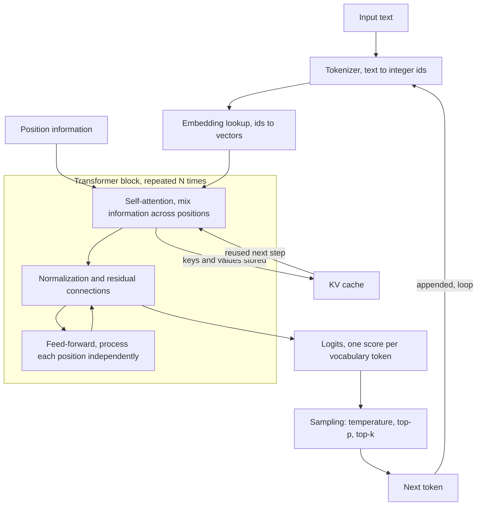
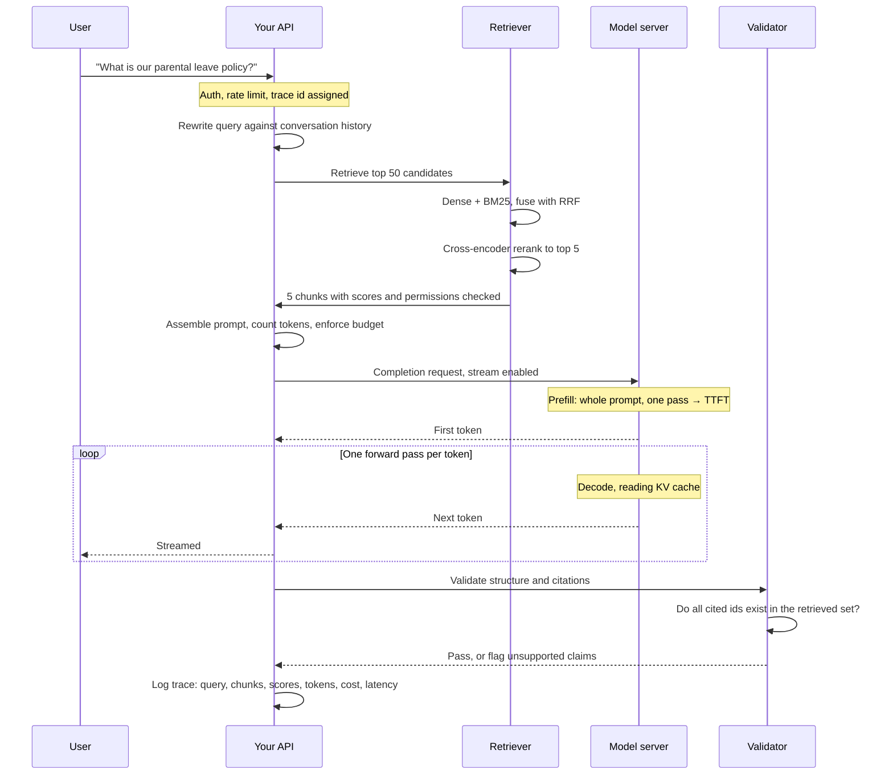

# 06 Transformers and LLMs

**Last reviewed:** 2026-09-18 · **Volatility:** medium; the architecture is stable, everything operational around it is not

Every number in this module was computed, not recalled. The attention example is worked by hand and verified against numpy; the KV cache figures come from the formula, evaluated.

---

## Why this matters

You can build a working LLM application without knowing what happens inside the model. You cannot debug one.

The questions that actually arrive are operational: why did latency spike at long context, why does the same prompt cost three times as much today, why did output quality fall off a cliff after quantization, why does the model confidently invent a citation. Each has an answer inside the architecture, and none is reachable from the API documentation.

In interviews this module is where depth is tested. "Explain attention" is the warm-up. The real questions are "what is in the KV cache and why does it dominate your memory budget", "why does temperature not fix hallucination", and "walk me from a user's keystroke to the first token appearing". Those reward mechanism over vocabulary.

---

## Prerequisites

| You need | From |
|---|---|
| Gradients, loss, training loops | `05` sections on backprop and optimization |
| Neural network basics: layers, nonlinearity | `05` |
| Matrix multiplication and dot products | High school linear algebra is enough |
| Batching, caching, retries against an API | `01b` section 9 |

**On the fast path**, you are reading this after `07` and without `05`. That works for everything except the training material in section 6, which will feel abstract. Read it anyway, and it will land properly when you circle back.

For the linear algebra: you need to know that a dot product of two vectors is a single number measuring alignment, and that a matrix multiply is many dot products at once. That is genuinely all.

---

## Skip-ahead map

| Section | Level | Skip if you can... |
|---|---|---|
| 1. Tokenization | [CORE] | ...name three bugs that are actually tokenization bugs |
| 2. Embeddings and position | [FOUNDATION] | ...say why position must be injected at all |
| 3. Attention, worked by hand | [CORE] | ...compute a 3-token attention output with pencil and paper |
| 4. Multi-head and masking | [CORE] | ...say what causal masking does and why training needs it |
| 5. Architecture families | [FOUNDATION] | ...say when encoder-only beats decoder-only |
| 6. Training stages | [CORE] | ...distinguish pretraining, SFT and preference optimization by what each fixes |
| 7. Inference, KV cache, sampling | [CORE] | ...compute KV cache size from model dimensions |
| 8. Quantization | [CORE] | ...say what you lose at Q4 and where it shows up |
| 9. Hallucination | [CORE] | ...explain why prompting alone cannot fix it |
| 10. Tools and structured output | [CORE] | ...explain how constrained decoding guarantees valid JSON |
| 11. Evaluation | [CORE] | ...say why a benchmark score does not predict your task |
| 12. Security | [CORE] | ...explain why prompt injection is architectural, not a bug |

---

## Mental model

**A language model is a function from a sequence of tokens to a probability distribution over the next token. Everything else is engineering around that one operation.**

Generation is that function applied repeatedly: predict a distribution, pick a token, append it, predict again. There is no plan, no draft, no internal representation of the finished answer. The apparent coherence comes from each token being conditioned on everything before it.

Attention is how the model decides which earlier tokens matter for the current prediction. That is the entire idea. The rest of the architecture is plumbing that makes it trainable at scale.

**Where the analogy breaks down**, in two ways worth holding.

It undersells the model. "Just predicting the next token" is technically accurate and misleading about capability: predicting the next token of a correct proof requires representing the proof. The objective is simple; what the model must learn to satisfy it is not.

It also oversells determinism. The function is deterministic, but the *sampling* on top of it is not, and neither is the batching underneath it. Two identical requests can produce different outputs even at temperature 0, because floating-point reduction order varies with batch composition. Expecting bit-identical output from an API is a common and costly assumption.

---

## Concept map



---

## Core concepts

### 1. Tokenization [CORE]

Models do not see characters. They see integer ids from a fixed vocabulary, typically 30,000 to 200,000 entries, produced by a subword algorithm such as BPE.

Common words get one token. Rare words split into pieces. `"tokenization"` might be `["token", "ization"]`; `"Lakshmidhar"` might be five pieces.

**Why subword rather than words or characters.** Word-level vocabularies cannot handle anything unseen and would need millions of entries. Character-level sequences are far too long, and attention cost grows with the square of sequence length. Subword is the compromise: a bounded vocabulary that can represent anything.

**The bugs this causes, which is why the section exists:**

**Character-level tasks fail bizarrely.** "How many r's in strawberry" is hard because the model sees two or three opaque chunks, not ten letters. Reversing a string, counting characters, and simple ciphers all fail for this reason. Not a reasoning failure; an input representation failure.

**Arithmetic is fragile.** Numbers tokenize inconsistently: `1234` might be one token or `12`,`34` or `1`,`2`,`3`,`4` depending on the tokenizer and what surrounds it. Digits that are not aligned into consistent units make column arithmetic genuinely hard.

**Non-English text costs more.** English is heavily represented in tokenizer training, so English averages fewer tokens per word than most other languages. The same document translated can cost two or three times as much and consume proportionally more context. `[VERIFY: the specific ratios vary by tokenizer @ measure with your provider's tokenizer]`

**Trailing whitespace changes output.** `"The answer is"` and `"The answer is "` tokenize differently, and the model has learned that a token beginning with a space is normal mid-sentence. A trailing space can measurably degrade output. If a prompt template behaves oddly, check its whitespace.

**Token counts are not word counts.** Roughly 0.75 words per token for English prose, much worse for code, JSON, and non-Latin scripts. Budget with an actual tokenizer, never with a word count.

**The practical rule:** when a model fails at something that seems trivially easy, ask whether the task is about characters. If so, it is a tokenization problem, and the fix is to do that part in code rather than to prompt harder.

### 2. Embeddings and position [FOUNDATION]

**Token embeddings.** Each vocabulary id indexes into a learned matrix of shape (vocab_size, d_model), giving a dense vector. These are learned during pretraining, and their geometry is what makes the vectors in module 07 meaningful.

Note the distinction: these are *token* embeddings, one per subword. The sentence embeddings used in retrieval come from a different model trained specifically to put whole passages in a comparable space.

**Why position must be injected.** Attention, as defined in section 3, is permutation-invariant: it computes a weighted sum, and a sum does not care about order. Without position information, "dog bites man" and "man bites dog" produce identical outputs. This is not an implementation detail; it is a consequence of the operation.

Approaches:

- **Learned absolute.** A position vector per index, added to the token embedding. Simple, and cannot extrapolate past the trained maximum length.
- **Sinusoidal.** Fixed functions of position, from the original paper. Extrapolates in principle, poorly in practice.
- **RoPE (rotary).** Rotates query and key vectors by an angle proportional to position, so the dot product between two positions depends on their *relative* distance. Dominant in current models, because relative position is what matters for language and because it extends to longer contexts more gracefully.

**Why you should care about RoPE specifically:** context-length extension techniques work by manipulating RoPE's frequency scaling. When you see a model advertised with an extended context, that is usually what happened, and it usually degrades quality at the extended range compared to a model trained there natively. `[VERIFY: context extension methods and their quality cost @ current papers]`

### 3. Attention, worked by hand [CORE]

The central operation. Work through the arithmetic once and it stops being mysterious.

**The idea in one sentence:** every token asks a question, every token advertises what it offers, and each token builds its output as a weighted blend of what the others offer, weighted by how well its question matches their advertisement.

Three projections of the same input:

| Name | Role |
|---|---|
| **Query** (Q) | What this position is looking for |
| **Key** (K) | What this position offers |
| **Value** (V) | What this position contributes if selected |

The formula:

```
Attention(Q, K, V) = softmax( (Q Kᵀ) / √d_k ) V
```

#### The worked example

Three tokens, `d_model = 4`, `d_k = 2`. Integers chosen so every step is checkable by hand.

```python
import numpy as np

tokens = ["the", "cat", "sat"]
X = np.array([
    [1., 0., 1., 0.],   # the
    [0., 1., 0., 1.],   # cat
    [1., 1., 1., 0.],   # sat
])
W_q = np.array([[1.,0.],[0.,1.],[1.,0.],[0.,1.]])
W_k = np.array([[0.,1.],[1.,0.],[0.,1.],[1.,0.]])
W_v = np.array([[1.,0.],[0.,2.],[0.,1.],[2.,0.]])

Q, K, V = X @ W_q, X @ W_k, X @ W_v
```

**Step 1: project.**

```
Q = [[2, 0],     K = [[0, 2],     V = [[1, 1],
     [0, 2],          [2, 0],          [2, 2],
     [2, 1]]          [1, 2]]          [1, 3]]
```

**Step 2: score every query against every key.** `S = Q Kᵀ`, so `S[i][j]` is how much token i's question matches token j's offer.

```
QKᵀ = [[0, 4, 2],
       [4, 0, 4],
       [2, 4, 4]]
```

Check one by hand: `S[2][1] = q₃ · k₂ = [2,1] · [2,0] = 4`. High, so "sat" is very interested in "cat".

**Step 3: scale by √d_k.** Here √2 ≈ 1.4142.

```
scaled = [[0.000, 2.828, 1.414],
          [2.828, 0.000, 2.828],
          [1.414, 2.828, 2.828]]
```

**Step 4: causal mask.** A decoder predicting token 3 must not see tokens 4 onward. Set everything above the diagonal to −∞, so softmax gives it exactly zero weight.

```
masked = [[0.000,  -inf,  -inf],
          [2.828, 0.000,  -inf],
          [1.414, 2.828, 2.828]]
```

**Step 5: softmax each row**, turning scores into weights summing to 1.

```
weights = [[1.000, 0.000, 0.000],
           [0.944, 0.056, 0.000],
           [0.108, 0.446, 0.446]]
```

**Step 6: weighted sum of values.** `output = weights @ V`.

```
output = [[1.000, 1.000],
          [1.056, 1.056],
          [1.446, 2.337]]
```

#### Row 3 in full, by hand

```
q₃ = [2, 1]

q₃ · k₁ = [2,1]·[0,2] = 2   →  2/√2 = 1.4142
q₃ · k₂ = [2,1]·[2,0] = 4   →  4/√2 = 2.8284
q₃ · k₃ = [2,1]·[1,2] = 4   →  4/√2 = 2.8284

softmax: subtract the max (2.8284), then exponentiate
  exp(1.4142 - 2.8284) = exp(-1.4142) = 0.243
  exp(2.8284 - 2.8284) = exp(0)       = 1.000
  exp(2.8284 - 2.8284) = exp(0)       = 1.000
  sum = 2.243

weights = [0.243, 1.000, 1.000] / 2.243 = [0.108, 0.446, 0.446]

output₃ = 0.108·[1,1] + 0.446·[2,2] + 0.446·[1,3] = [1.446, 2.337]
```

Verified against numpy. Two things to take from it.

**Subtracting the max before exponentiating** is not cosmetic. `exp(800)` overflows to infinity, and softmax is shift-invariant, so subtracting the row max is free and prevents it. Every real implementation does this, and it is a good thing to notice in an interview.

**"sat" attends 0.446 to both "cat" and itself and only 0.108 to "the".** With hand-picked weights this is arbitrary, but it is the mechanism: a learned model's W_q and W_k are trained so this weighting is linguistically meaningful.

#### Why divide by √d_k

The most commonly hand-waved step, and it is empirically demonstrable.

For random vectors with unit-variance components, the dot product's variance grows linearly with dimension, so its standard deviation grows as √d_k. Measured over 5,000 random pairs:

| d_k | std of q·k | std after ÷√d_k |
|---|---|---|
| 2 | 1.41 | 1.00 |
| 64 | 7.94 | 0.99 |
| 512 | 22.43 | 0.99 |

Scaling holds the variance at roughly 1 regardless of dimension. Without it, at d_k = 512 you feed softmax values ranging over tens, and softmax saturates:

```
softmax([10, 2, 1])      = [1.000, 0.000, 0.000]     saturated
softmax([3.1, 0.6, 0.3]) = [0.875, 0.072, 0.053]     informative
```

A saturated softmax has near-zero gradient everywhere, so the model cannot learn. **The scaling is a training-stability fix, not an accuracy trick**, which is the answer to "why √d_k".

### 4. Multi-head attention and masking [CORE]

**Multi-head.** Rather than one attention operation over the full `d_model`, split into `h` heads each of size `d_model / h`, run attention independently in each, concatenate, project.

Why: one attention operation produces one weighted average, and averaging destroys information. A single head must compromise between tracking syntactic agreement, coreference, and topical relevance. Several smaller heads can specialize, and it costs no extra computation because the dimensions are split rather than duplicated.

Post-hoc interpretation of heads as "the syntax head" is appealing and largely unreliable. Some heads have identifiable roles; many do not.

**Causal masking**, from step 4 above, deserves more than a line.

During *training*, the model processes an entire sequence at once and predicts every next-token in parallel. Without masking, predicting token 5 could attend to token 6, which is the answer. The model would learn to copy rather than predict, and generate nothing at inference when there is no future to look at. The mask enforces that position i sees only positions ≤ i.

This is the whole reason training can be parallel while generation is sequential, and it is the source of the throughput asymmetry in section 7: you can score a 4,000-token document in one forward pass, but you cannot generate 4,000 tokens in fewer than 4,000 passes.

**Grouped-query attention (GQA)** matters operationally. Standard multi-head gives every head its own K and V. GQA shares one K/V pair across a group of query heads. Quality cost is small; KV cache memory drops by the grouping factor, which section 7 quantifies as 4x for a typical configuration. Nearly every current model of serving interest uses it.

### 5. Architecture families [FOUNDATION]

| Family | Attention | Trained to | Good at | Examples |
|---|---|---|---|---|
| **Encoder-only** | Bidirectional | Fill in masked tokens | Understanding a whole input: classification, embeddings, reranking | BERT, and the embedding and reranker models in module 07 |
| **Decoder-only** | Causal | Predict the next token | Generation | The GPT, Llama, Claude and Qwen families |
| **Encoder-decoder** | Bidirectional then causal | Map a sequence to a sequence | Translation, summarization | T5, original Transformer |

**When encoder-only is the right answer, which is the interview question.** For classification, embedding or reranking, an encoder sees the entire input in both directions and produces one representation. A decoder-only model can do these by generating a label, but it is larger, slower, and its representations are built under a causal constraint it does not need.

Concretely: the reranker in module 07 is an encoder. Using a large decoder-only model to rerank is enormously more expensive for worse latency and usually no better quality. Knowing when a 100M-parameter encoder beats a 70B decoder is a genuine engineering signal.

Decoder-only dominates generation because it is simpler to scale and one objective, next-token prediction, turns out to subsume most tasks when the model is large enough.

### 6. Training stages [CORE]

Four stages, each fixing something the previous one cannot.

**Pretraining.** Next-token prediction over a very large corpus. Produces a model with broad knowledge and no inclination to be useful: prompt a base model with a question and it may continue with more questions, because that is what the training distribution contains. Almost all capability comes from here, and almost all cost.

**Supervised fine-tuning (SFT).** Train on curated instruction-and-response pairs. Teaches the model to respond rather than continue. Small relative to pretraining, and this is where the model learns the *shape* of an answer.

**Preference optimization** (RLHF, DPO, and variants). Humans rank alternative responses; the model is trained toward the preferred ones. This is how helpfulness, tone, refusal behavior and format consistency are tuned, because those are things people can compare but cannot easily specify as a target output.

**Reasoning training.** Training the model to produce extended intermediate reasoning before answering, rewarded on final correctness. `[VERIFY: this area is moving very fast @ current papers and model cards]`

**What this means for you as an engineer:**

| To change | Use | Not |
|---|---|---|
| Facts the model states | RAG | Fine-tuning; it bakes in a snapshot |
| Output format consistency | SFT, or prompting with examples | RAG; that is few-shot done expensively |
| Tone and style | Preference optimization or prompting | RAG |
| Domain vocabulary | Continued pretraining or SFT | Prompting alone |

This table is the same decision as module 07 section 1, from the training side.

**Why fine-tuning for facts is specifically wrong:** the facts land in weights with no provenance, no update path short of retraining, no way to cite a source, and no way to delete something on request. RAG gives you all four. This is worth stating crisply, because "just fine-tune it on our docs" is a common and expensive instinct.

### 7. Inference: KV cache, batching, sampling [CORE]

Where architecture becomes an operations problem.

#### Two phases with different bottlenecks

**Prefill** processes the entire prompt in one parallel forward pass. Compute-bound: lots of arithmetic, high hardware utilization. Determines **time to first token (TTFT)**.

**Decode** generates one token at a time, each pass depending on the last. Memory-bandwidth-bound: little arithmetic per token, but the entire model's weights must be read from memory for every single token. Determines **tokens per second**.

**This asymmetry explains most inference behavior.** Decode cannot use your hardware's compute; it is waiting on memory. That is why batching helps throughput so much, since one weight read serves many sequences, and why a longer prompt raises TTFT while barely affecting tokens per second.

#### The KV cache

Naive generation recomputes attention over the whole sequence for every new token: quadratic and wasteful, since the keys and values for earlier tokens do not change. So you cache them.

The cost is memory, and it is substantial:

```
kv_bytes = 2 × layers × n_kv_heads × d_head × seq_len × batch × bytes_per_element
```

The leading 2 is for K and V. Evaluated for a 7B-class model, 32 layers, 32 KV heads, d_head 128, fp16:

| Sequence length | Batch 1 | Batch 8 |
|---|---|---|
| 2,048 | 1.00 GB | 8.00 GB |
| 8,192 | 4.00 GB | 32.00 GB |
| 32,768 | 16.00 GB | 128.00 GB |

Per token: 524,288 bytes, exactly 0.5 MB.

With grouped-query attention reducing 32 KV heads to 8:

| Sequence length | Batch 1 | Batch 8 |
|---|---|---|
| 2,048 | 0.25 GB | 2.00 GB |
| 8,192 | 1.00 GB | 8.00 GB |
| 32,768 | 4.00 GB | 32.00 GB |

Per token: 131,072 bytes, 4x smaller. That factor is why GQA is universal.

**Compare against the weights themselves**, 7B parameters:

| Precision | Weights |
|---|---|
| fp16 | 13.04 GB |
| Q8 | 6.52 GB |
| Q4 | 3.26 GB |
| ~2.1 bits | 1.71 GB |

**The conclusion that surprises people: at long context with any batching, the KV cache exceeds the model.** A Q4 7B model is 3.26 GB of weights and, without GQA, 32 GB of cache at 8k context and batch 8. This is why serving frameworks work so hard on cache management, why context length is priced the way it is, and why "just increase the context window" is an infrastructure decision rather than a configuration change.

#### Batching

**Static batching** groups requests, runs them together, returns when all finish. Simple, and a short request waits for the longest one in the batch.

**Continuous batching** adds and removes sequences from the batch as they start and finish, so a completed slot is refilled immediately. Large throughput improvement under mixed workloads, and the reason production serving frameworks exist. Module 09 covers the implementations.

#### Sampling

The model outputs logits, one score per vocabulary token. Sampling turns them into a choice.

**Temperature** divides the logits before softmax. Below 1 sharpens toward the most likely token; above 1 flattens toward uniform. Temperature 0 means always take the maximum.

**Top-k** keeps the k highest-probability tokens and renormalizes. Fixed count, regardless of how confident the distribution is.

**Top-p (nucleus)** keeps the smallest set of tokens whose probability sums to p. Adaptive: when the model is confident, few tokens; when uncertain, many.

**Why temperature and top-p are not the same knob**, which is a common interview question. Temperature reshapes the whole distribution, including the long tail, so high temperature makes genuinely bad tokens reachable. Top-p truncates the tail first and then samples within it. They compose: top-p removes the nonsense, temperature controls variety among what remains. Using temperature alone to get creativity also buys you incoherence.

**Practical settings:** for extraction, classification and structured output, temperature 0 or near it. For conversation, moderate temperature with top-p around 0.9 to 0.95. `[UNVERIFIED: these are conventions, not measurements. Test on your task.]`

**Temperature 0 is not deterministic in practice.** The sampling is, but floating-point reduction order varies with batch composition and hardware scheduling, so results can differ between identical calls. Anyone who has built a regression test asserting exact model output has learned this. Assert on properties, not on strings.

### 8. Quantization [CORE]

Storing weights in fewer bits than the 16 they were trained in.

**Why it works.** Weights cluster in a narrow range and neural networks are robust to small perturbations. Rounding them costs less accuracy than the memory saving suggests.

**Why it matters so much for inference.** Decode is memory-bandwidth-bound, so halving the bytes read per token roughly doubles speed *and* halves memory. It is one of the few genuine two-for-one wins available.

**The levels, as a rough map:**

| Bits | Typical quality | Use |
|---|---|---|
| 16 | Reference | Training; quality baseline |
| 8 | Nearly indistinguishable | Safe default for serving |
| 5-6 | Small degradation, rarely noticeable | Common sweet spot |
| 4 | Noticeable but usually acceptable | The most common serving point |
| 2-3 | Significant, task-dependent | Fitting a large model into small memory |

`[UNVERIFIED: these characterizations are directional. Quantization quality depends on the method, the calibration data, and the task, and it has improved substantially over time. Measure on your own task.]`

**Where degradation shows up first**, which is the useful part:

- Long-context coherence, before short-answer accuracy
- Instruction following and format adherence, before factual recall
- Code generation, before prose
- Rare knowledge, before common knowledge
- Multi-step reasoning, before single-step

A quantized model that scores well on short factual benchmarks can still be noticeably worse at following a complex JSON schema across a long prompt. **This is why benchmark scores are a poor guide to quantization choice**, and why the memory saving looks free until it is not.

**Methods worth knowing by name:** round-to-nearest (simplest, worst); calibration-based methods that use sample data to choose per-group scales; importance-weighted methods that allocate more bits to weights that matter more; and mixed-precision schemes that keep sensitive layers at higher precision. Module 09 covers GGUF's taxonomy specifically, since that is what you will actually choose from.

**The KV cache can be quantized too**, separately from the weights, which matters at long context where the cache dominates. Quality cost is generally higher than for weights.

### 9. Hallucination [CORE]

**What it is, mechanically.** The model produces a distribution over next tokens and samples from it. Nothing in that process checks anything against the world. A fluent falsehood and a fluent truth are produced by identical machinery, and the model's confidence reflects the training distribution's statistics, not the claim's accuracy.

**The specific pattern:** plausible-shaped fabrication. Invented citations look like real citations: plausible authors, a real-sounding journal, a formatted year. Invented API methods follow the library's naming conventions. This is exactly what you would expect from a system trained to produce likely continuations, and it is what makes hallucination dangerous rather than merely wrong: the output has all the surface features of correctness.

**Why prompting cannot fix it.** "Do not make things up" adjusts the distribution slightly toward hedging. It does not install a verification step, because there is none to install. The model has no separate representation of "things I know" against which to check. Asking for confidence scores produces a number sampled from the same distribution as everything else, so an unreliable claim comes with an unreliable confidence.

This is the answer to "how do you stop hallucination", and the honest one: **you do not eliminate it, you build a system where it is caught or made irrelevant.**

**The interventions that actually work**, in order of effectiveness:

1. **Supply the facts.** RAG. A model with the right chunk in context does not need to recall it. Does not eliminate hallucination and moves it from "invented from nothing" to "unsupported by the provided sources", which is detectable.
2. **Verify structurally.** Every claim cites a source id; check each against the source. Module 07 section 9's faithfulness metric.
3. **Enable refusal.** An explicit refusal instruction with fixed wording, plus abstaining when retrieval scores are all low. Measurable, which is the point.
4. **Validate outputs.** Pydantic for structure, then check semantics: does the cited document exist, does the API method exist, does the arithmetic hold.
5. **Use tools for facts that have an authority.** Do not ask the model to recall a stock price or perform arithmetic; give it a tool.
6. **Keep a human in the loop where the cost of being wrong is high.**

**What does not work, and is commonly attempted:** asking the model to rate its own confidence; asking "are you sure"; temperature 0, which makes the model deterministic and not correct; telling it to only use reliable information.

### 10. Tools and structured output [CORE]

**Structured output.** You need JSON matching a schema. Three approaches, increasing in reliability:

**Prompting.** "Respond with JSON matching this schema." Works most of the time. Fails by adding prose around the JSON, using markdown fences, trailing commas, or omitting a field. Always parse defensively with a retry.

**JSON mode.** The provider constrains decoding to syntactically valid JSON. Guarantees parseability, not schema conformance.

**Constrained decoding against a schema.** At each step, the sampler masks out every token that could not continue a valid instance of the schema. **This makes an invalid output impossible rather than unlikely**, which is a categorical difference worth understanding: it is enforced at the sampling step, not checked afterwards. The cost is a slight quality reduction when the schema fights the model's natural output, and some latency.

Even with constrained decoding, validate with Pydantic at the boundary (`01b` section 9.3). Schema-valid and semantically correct are different: a required `total` field will be present and may be nonsense.

**Tool calling.** You describe available functions with a name, description and parameter schema. The model emits a structured call; your code executes it and returns the result; the model continues.

**The thing to be clear about: the model does not execute anything.** It produces text saying a function should be called with certain arguments. Everything after that is your code, and therefore your responsibility, including authorization, validation and rate limiting. Candidates who describe the model as "using tools" without this distinction reveal they have not built one.

**Quality of tool use depends mostly on the descriptions.** The parameter descriptions are what the model reads to decide what to pass. Vague descriptions produce wrong arguments, and the fix is almost always better descriptions rather than a better model. Module 08 covers this in depth.

### 11. Evaluation [CORE]

**Why public benchmarks tell you little about your task.**

**Contamination.** Benchmarks are on the public internet, so they are in pretraining data. A model may have memorized the test set. Contamination is hard to measure and generally assumed to be present to some degree.

**Benchmarks measure benchmark-shaped tasks.** Multiple choice over general knowledge predicts very little about extracting fields from your vendor invoices.

**Optimization pressure.** Benchmarks are a marketing surface, so they receive attention disproportionate to their predictive value.

**A one-point difference is noise.** Without variance reporting, small gaps are not interpretable, and most leaderboards do not report variance.

**What to do instead.** Build a task-specific evaluation set, exactly as in module 07 section 9. Thirty to fifty real examples from your actual use case, with correct outputs, and a metric that reflects the decision being made. This is the single highest-return day of work available and almost nobody does it.

**Evaluation approaches, and where each fits:**

| Approach | Good for | Weakness |
|---|---|---|
| Exact match | Classification, extraction with a fixed answer | Useless for open generation |
| Structural checks | Valid JSON, required fields, cited ids exist | Says nothing about correctness |
| LLM-as-judge | Open-ended quality at scale | Biased toward length and its own style; drifts on model updates |
| Human evaluation | Ground truth | Expensive, slow, needs clear rubrics for agreement |
| Task success | Did the user achieve their goal | Hardest to instrument, and the one that matters |

**On LLM-as-judge**, the practical rules: pin the judge model version, calibrate against a few dozen human labels, and use it for relative comparison between versions rather than as an absolute score. A judge score reported as ground truth is a mistake.

**Regression testing is the form this takes in engineering.** Your evaluation set runs in CI on every change to a prompt, a model version, or a retrieval parameter. Assert no worse than baseline minus a margin, never exact equality, for the determinism reason in section 7.

### 12. Security: prompt injection [CORE]

**The architecture is the vulnerability.** The model receives one token sequence. Your system prompt, the user's message, and any retrieved or tool-returned content all arrive as tokens in that sequence. There is no privileged channel. Instructions and data are the same substance.

So any text that reaches the context can attempt to act as an instruction. That includes a retrieved document, a web page the model fetched, the output of a tool, a filename, a code comment, or an email in a thread.

**Direct injection:** the user tries to override the system prompt. Annoying, usually low-stakes.

**Indirect injection:** an attacker plants instructions in content the system will later retrieve. The user is innocent, the attack arrives through data, and this is the dangerous form.

**Why it is not fixable by prompting.** "Ignore any instructions in the documents below" is itself just more tokens in the same sequence, competing with the injected text on the same terms. It raises the bar and does not close the hole. Anyone who claims prompt-level mitigation solves it has not tried hard enough to break it.

**What actually helps**, all architectural:

- **Least privilege.** The severity is the product of injection succeeding and what the system can then do. A system that can only produce text has an embarrassment problem. A system that can send email, execute code or spend money has an incident.
- **No privilege escalation from content.** Never decide authorization based on text in the context. Permissions come from the authenticated session.
- **Human confirmation for consequential actions.** Anything irreversible, anything that sends data outside, anything that spends money.
- **Structural output validation**, so a tool call must conform to a schema and an allowlist.
- **Isolate untrusted content**, with clear delimiters and, where possible, separate model calls so untrusted content cannot influence a privileged step.
- **Monitor** for the signatures: unexpected tool calls, attempts to access unrelated resources, output containing system-prompt text.

**Data exfiltration** is the specific attack to be able to describe: injected content instructs the model to encode sensitive context into a URL and render it as an image or link, so loading it sends the data to the attacker. This is why rendering model-generated links and images from untrusted contexts is dangerous, and why egress restrictions matter.

Module 08 goes further, because injection plus tool access is where this becomes serious.

---

## Worked examples

### Example 1: the full attention computation

Runnable, verified. See section 3 for the step-by-step reading.

```python
import numpy as np
np.set_printoptions(precision=3, suppress=True)


def softmax(x):
    e = np.exp(x - x.max(axis=-1, keepdims=True))   # shift for numerical stability
    return e / e.sum(axis=-1, keepdims=True)


X = np.array([
    [1., 0., 1., 0.],   # the
    [0., 1., 0., 1.],   # cat
    [1., 1., 1., 0.],   # sat
])
W_q = np.array([[1., 0.], [0., 1.], [1., 0.], [0., 1.]])
W_k = np.array([[0., 1.], [1., 0.], [0., 1.], [1., 0.]])
W_v = np.array([[1., 0.], [0., 2.], [0., 1.], [2., 0.]])

Q, K, V = X @ W_q, X @ W_k, X @ W_v

d_k = Q.shape[-1]
scores = (Q @ K.T) / np.sqrt(d_k)
scores = scores + np.triu(np.ones_like(scores) * -np.inf, k=1)   # causal mask
weights = softmax(scores)
output = weights @ V

print("weights:\n", weights)
print("output:\n", output)
assert np.allclose(weights.sum(axis=1), 1.0)
assert weights[0, 1] == 0.0, "token 1 must not attend to the future"
```

Output:

```
weights:
 [[1.    0.    0.   ]
  [0.944 0.056 0.   ]
  [0.108 0.446 0.446]]
output:
 [[1.    1.   ]
  [1.056 1.056]
  [1.446 2.337]]
```

That is the entire mechanism. Real implementations add multiple heads, many layers, normalization and residual connections, and the arithmetic at the core is this.

**The two assertions are the useful part.** Rows summing to 1 confirms softmax did its job; the upper triangle being exactly zero confirms causality. If you implement attention yourself, those are the two tests to write first, because both failures are silent.

### Example 2: computing a memory budget

The calculation you will actually need, before deciding what you can serve.

```python
def kv_cache_bytes(layers, n_kv_heads, d_head, seq_len, batch=1, bytes_per=2):
    """2 for K and V, times the per-token state, times sequence and batch."""
    return 2 * layers * n_kv_heads * d_head * seq_len * batch * bytes_per


def weight_bytes(params, bits):
    return params * bits / 8


GB = 1024 ** 3

# 7B-class model: 32 layers, d_head 128, 32 query heads
for n_kv in (32, 8):                       # multi-head vs grouped-query
    label = "MHA" if n_kv == 32 else "GQA (8 kv heads)"
    per_token = kv_cache_bytes(32, n_kv, 128, 1)
    print(f"{label}: {per_token / 1024**2:.2f} MB per token")
    for seq in (2048, 8192, 32768):
        one = kv_cache_bytes(32, n_kv, 128, seq) / GB
        eight = kv_cache_bytes(32, n_kv, 128, seq, batch=8) / GB
        print(f"   seq {seq:6,}:  batch 1 {one:6.2f} GB   batch 8 {eight:7.2f} GB")

for bits, name in ((16, "fp16"), (8, "Q8"), (4, "Q4")):
    print(f"weights {name:5s}: {weight_bytes(7e9, bits) / GB:6.2f} GB")
```

Verified output:

```
MHA: 0.50 MB per token
   seq  2,048:  batch 1   1.00 GB   batch 8    8.00 GB
   seq  8,192:  batch 1   4.00 GB   batch 8   32.00 GB
   seq 32,768:  batch 1  16.00 GB   batch 8  128.00 GB
GQA (8 kv heads): 0.12 MB per token
   seq  2,048:  batch 1   0.25 GB   batch 8    2.00 GB
   seq  8,192:  batch 1   1.00 GB   batch 8    8.00 GB
   seq 32,768:  batch 1   4.00 GB   batch 8   32.00 GB
weights fp16 : 13.04 GB
weights Q8   :  6.52 GB
weights Q4   :  3.26 GB
```

**The engineering conclusion.** A Q4 7B model weighs 3.26 GB. At 8k context with batch 8 and multi-head attention, its KV cache is 32 GB, ten times the model. With GQA it is 8 GB, which is the difference between serving and not serving on a given machine.

This is why "what context length do you support" is a capacity question, not a feature flag, and why long-context pricing rises faster than linearly in practice.

### Example 3: tracing a request end to end

The lifecycle question, as a sequence.



**Where the time actually goes**, and this is the part worth internalizing: retrieval and reranking are typically tens to low hundreds of milliseconds; prefill scales with prompt length; decode dominates total latency for a long answer, at one forward pass per token.

So the levers differ by symptom. High TTFT means a long prompt, so retrieve fewer chunks or shorten them. Slow overall generation means the decode phase, so a smaller or more quantized model, better batching, or simply a shorter answer. Confusing the two leads to optimizing the wrong stage, which is a common and expensive mistake.

**Every arrow needs logging.** The trace at the end is what makes module 07's decision tree usable. Without it, "the answer was wrong" has no path back to a cause.

---

## Common mistakes and debugging

### Beginner mistakes

| Symptom | Cause | Fix |
|---|---|---|
| "How many r's in strawberry" fails | Tokenization; the model sees chunks, not letters | Do character work in code |
| Prompt works, same prompt with trailing space is worse | Different tokenization | Strip trailing whitespace from templates |
| Token count much higher than word count | Code, JSON and non-English tokenize poorly | Count with the real tokenizer |
| Temperature 0 gives different outputs | Batch-dependent floating-point reduction order | Assert on properties, not exact strings |
| Output has markdown fences around JSON | Prompt-only structured output | JSON mode or constrained decoding, plus defensive parsing |
| Model invents an API method | Hallucination, plausible-shaped | Supply docs via RAG; validate against the real API |
| Quality dropped after "just" quantizing | Q4 degrades format-following and long-context first | Evaluate on your task, not on a benchmark |
| Context length exceeded, unclear why | Chat history plus system prompt plus chunks | Log token counts per component |

### Production failure modes

**Silent model version change.** A provider updates the model behind a stable alias. Outputs shift; no error, no deploy. *Diagnostic:* log the model version with every request and diff outputs over time. *Fix:* pin explicit versions; run your eval set on change.

**Context exhaustion from accumulated history.** A chat application appends every turn. Around turn 30 it silently truncates the system prompt, and the model stops following its instructions. *Diagnostic:* log token counts per component. *Fix:* a budget with explicit priority, so the system prompt is never the thing dropped.

**Cost explosion from retrieval expansion.** Someone raises top-k from 5 to 20 for quality. Prompt tokens quadruple, and prompt tokens are most of the bill. *Diagnostic:* token counts per request over time. *Fix:* attribute cost per request; require an eval-set improvement to justify a context increase.

**Prefill latency at long context.** TTFT degrades as prompts grow. Users perceive the system as slow even though tokens per second is unchanged. *Diagnostic:* measure TTFT separately from total latency. *Fix:* shorter prompts, prompt caching where the provider supports it, streaming so perceived latency drops.

**Structured output that is valid and wrong.** Constrained decoding guarantees the schema. A required `total` field is present, is a number, and is invented. *Diagnostic:* semantic validation, not just parsing. *Fix:* verify values against the source; check that cited ids exist.

**Indirect prompt injection via ingested content.** A support ticket containing instructions gets indexed, then retrieved. *Diagnostic:* monitor for unexpected tool calls and for output echoing system-prompt content. *Fix:* the architectural controls in section 12.

**Quantization degrading only the hard cases.** The model passes your spot checks and fails on long, complex, format-sensitive requests. *Diagnostic:* an eval set stratified by difficulty and length. *Fix:* evaluate at your actual context length and task complexity.

### Debugging method for this layer

1. **Log the exact input.** The assembled prompt, token count, model version, sampling parameters. Most "the model is wrong" reports are "the prompt was not what I thought".
2. **Separate retrieval from generation.** Module 07's tree. Do not tune prompts to fix a retrieval problem.
3. **Separate TTFT from tokens per second.** They have different causes and different fixes.
4. **Check tokenization when a task seems trivially easy.** Characters, digits, whitespace.
5. **Test at temperature 0 to remove sampling variance**, while remembering it is not fully deterministic.
6. **Bisect the prompt.** Remove sections until behavior changes. Long prompts contain contradictory instructions more often than anyone expects.

---

## Interview angle

**1. Explain self-attention.**

*Strong outline:* Each token produces a query, a key and a value. Score every query against every key by dot product to get a relevance matrix, scale by √d_k, softmax each row into weights summing to one, and take the weighted sum of values. The output for each position is a blend of all positions weighted by relevance. Walk a 3-token example if there is a whiteboard. Then add depth: the √d_k scaling exists because dot-product variance grows with dimension, and unscaled scores saturate softmax to near-zero gradient, so it is a training-stability fix. And multi-head exists because a single weighted average destroys information that several specialized heads can preserve.

*Weak answer:* reciting "queries, keys and values" as a metaphor about databases without the computation.

**2. What is the KV cache and why does it matter?**

*Strong outline:* During generation, attention for earlier tokens does not change, so their keys and values are cached rather than recomputed, turning quadratic work into linear. The cost is memory: 2 × layers × kv_heads × d_head × seq_len × batch × bytes. Give a number: a 7B model at 8k context and batch 8 is about 32 GB of cache with multi-head attention, against roughly 3 GB of Q4 weights, so the cache is ten times the model. That is why grouped-query attention exists, cutting it 4x by sharing K and V across query head groups, and why context length is a capacity decision rather than a config flag.

*Weak answer:* "It caches keys and values so generation is faster." True, and no sense of the memory consequence, which is the entire engineering point.

**3. Why does temperature 0 not make output deterministic?**

*Strong outline:* Sampling becomes deterministic, argmax over logits. The logits themselves are not bit-identical across calls, because floating-point addition is not associative and reduction order varies with batch composition, kernel selection and hardware scheduling. Two identical requests batched with different neighbors can produce slightly different logits and, where two tokens are nearly tied, a different argmax. The engineering consequence: never write a regression test asserting exact model output; assert on structure, on properties, or on a metric with a tolerance.

*Weak answer:* "Temperature 0 is deterministic." Confidently wrong, and it is the kind of thing an interviewer asks precisely because the textbook answer is wrong.

**4. Why does prompting not fix hallucination?**

*Strong outline:* The model samples from a distribution over next tokens; nothing in that process checks a claim against anything. Fluent falsehood and fluent truth come from identical machinery, and the characteristic pattern is plausible-shaped fabrication: invented citations with real-sounding journals, invented API methods following the library's conventions. "Do not make things up" nudges the distribution toward hedging without installing a verification step, because there is none to install; the model has no separate representation of what it knows. Then give the interventions in order: supply facts via RAG, verify claims against cited sources, enable and measure refusal, validate outputs structurally and semantically, use tools for facts with an authority. And name what does not work: self-reported confidence, "are you sure", temperature 0.

*Weak answer:* "Use better prompts and lower the temperature." Both are the common wrong instinct.

**5. Walk me from a user's keystroke to the first token appearing.**

*Strong outline:* Auth and rate limit, query rewriting against history, retrieval with hybrid search and reranking, permission filtering, prompt assembly within a token budget, then the model call. Inside the model: tokenize, embed, prefill the whole prompt in one parallel pass, which is compute-bound and determines TTFT, then decode one token per forward pass, which is memory-bandwidth-bound and determines tokens per second. Then validation of structure and citations, and logging the full trace. The payoff is naming where time goes and which lever fixes which symptom: high TTFT means shorten the prompt, slow generation means the decode phase, and confusing them means optimizing the wrong stage.

*Weak answer:* "It sends the prompt to the API and gets a response." Accurate, and demonstrates nothing.

**6. When would you use an encoder-only model?**

*Strong outline:* Classification, embeddings and reranking. An encoder sees the whole input bidirectionally and produces one representation, which is what those tasks need. A decoder-only model can do them by generating a label, at far greater cost, worse latency, and usually no better quality, because its representations are built under a causal constraint the task does not require. Concretely: the reranker in a RAG pipeline is an encoder cross-encoder, and using a 70B decoder to rerank is enormously expensive for no gain. Knowing when a 100M encoder beats a 70B decoder is the point of the question.

*Weak answer:* "BERT is for understanding, GPT is for generation." Memorized and does not connect to a decision you would make.

**7. Fine-tune or use RAG?**

*Strong outline:* They fix different things. Fine-tuning changes behavior: format consistency, tone, domain style, a fixed taxonomy. RAG changes what is in context: facts, which change. Fine-tuning on documentation is the specific anti-pattern, because it bakes a snapshot into weights with no provenance, no update path short of retraining, no citation, and no way to honor a deletion request. RAG gives you all four. Conversely, using RAG to supply format examples is few-shot prompting done expensively and non-deterministically. In production you usually want both, plus tools for anything live or computed.

*Weak answer:* "RAG is cheaper." Sometimes true and not the reason.

**8. What do you lose when you quantize to 4 bits?**

*Strong outline:* Memory halves or better and decode speeds up, since decode is memory-bandwidth-bound, so it is a genuine two-for-one. The cost is accuracy, and the useful part is *where* it shows up first: long-context coherence, instruction and format following, code, rare knowledge and multi-step reasoning degrade before short factual recall. So a quantized model can score well on short benchmarks and still fail to follow a complex JSON schema across a long prompt, which is exactly the failure that matters in production. The conclusion: evaluate quantization on your own task at your real context length, not on a leaderboard. Mention that the KV cache can be quantized separately and generally tolerates it worse.

*Weak answer:* "It gets slightly worse." No sense of which capabilities degrade, which is the whole engineering content.

**9. Why is prompt injection not fixable with a better system prompt?**

*Strong outline:* The model receives one token sequence; system prompt, user message and retrieved content are the same substance with no privileged channel. "Ignore instructions in the documents" is more tokens competing on equal terms with the injected text. Distinguish direct injection, which is usually low-stakes, from indirect injection, where an attacker plants instructions in content the system later retrieves and the user is innocent. Then the architectural controls: least privilege, so severity equals injection success times capability; never deriving authorization from text in the context; human confirmation for consequential actions; structural output validation against an allowlist; and isolating untrusted content. Describe data exfiltration via a rendered URL as the concrete attack.

*Weak answer:* "Sanitize the input." There is no reliable sanitizer for natural language instructions.

**10. How would you evaluate whether a new model version is better for your use case?**

*Strong outline:* Not from benchmarks, and say why: contamination, benchmark-shaped tasks that do not predict yours, optimization pressure, and one-point differences being noise without variance reporting. Instead: a task-specific set of 30 to 50 real examples with correct outputs and a metric reflecting the actual decision. Run both versions on it, report the distribution and not just the mean, and stratify by difficulty and length since degradation concentrates in the hard cases. Add the operational dimensions: latency split into TTFT and tokens per second, cost per request, and format-following reliability. Then the process point: this is a regression suite in CI, asserting no worse than baseline minus a margin, never exact equality, because output is not deterministic.

*Weak answer:* "Check the benchmarks." The question is testing whether you know why that is insufficient.

### Follow-up questions to expect

- After 2: *"Your context window doubled and throughput collapsed. Why?"* KV cache scales linearly with sequence length, so doubling context halves how many sequences fit in memory, which halves your batch size, and decode throughput depends heavily on batching. You traded throughput for context length, and the fix is GQA, KV quantization, paged attention, or accepting a smaller batch.
- After 4: *"Your RAG system still hallucinates. Now what?"* Separate the cases: unsupported by retrieved sources, which is a generation problem addressed by faithfulness checking and refusal instructions, versus the right sources not being retrieved, which is a retrieval problem. Measure refusal correctness on unanswerable cases; a refusal rate near zero on a corpus that cannot answer everything is the tell.

### 60-second and 5-minute answers

1. How attention works
2. What the KV cache is and why it constrains serving
3. Why hallucination is architectural
4. The lifecycle of a request, and where time goes
5. Why benchmarks do not predict your task

---

## Practice tasks

Solutions in `quizzes/06-transformers-practice.md`.

### Five tiny exercises

1. Compute attention by hand for two tokens with `d_k = 2` and your own small integers. Verify against numpy. Do it on paper first.
2. Take three sentences, one English prose, one JSON, one in a non-Latin script, and count tokens with a real tokenizer. Compute tokens per word for each and explain the spread.
3. Compute the KV cache size for a model you actually use, at the context length you actually use. Compare it with the weight size. State whether the cache or the weights dominate.
4. Show numerically that softmax is shift-invariant, then show that `exp(1000)` overflows and that subtracting the max fixes it.
5. Take one prompt and run it at temperature 0, 0.7 and 1.5, ten times each. Describe how the variance changes, and what fails at 1.5.

### Three realistic coding tasks

1. **Attention from scratch.** Implement multi-head attention with causal masking in numpy. Assert rows sum to 1 and the upper triangle is zero. Then break the masking deliberately and show that the model could see the future, which is the bug the assertion catches.
2. **Token budget manager.** Write a class that assembles a prompt from a system prompt, chat history, retrieved chunks and a question, within a token budget, with explicit priority so the system prompt is never dropped. Log what was truncated. This is a real production component and it is where context-exhaustion bugs live.
3. **Structured output with graceful degradation.** Get a schema-conforming response using constrained decoding if available, JSON mode if not, prompting with defensive parsing and one retry as the fallback. Validate with Pydantic, then add a *semantic* check beyond the schema. Measure the failure rate of each tier on 50 real inputs.

### One mini-project

**Instrument a request end to end.**

Take a working LLM call and add the observability the sequence diagram implies:

- Token counts per prompt component: system, history, retrieved, question
- Model version and sampling parameters, on every request
- TTFT and total latency, separately
- Tokens per second during decode
- Cost per request, split between prompt and completion
- Whether output passed structural and semantic validation
- A trace id linking everything

Then use it: raise your context length and watch TTFT; change temperature and watch validation failures; switch to a smaller model and compare quality against speed on your own eval set.

Success criterion: you can answer "why was that request slow" and "why did that request cost so much" from logs alone, without reproducing it. That is the difference between operating a system and hoping.

---

## Mastery checklist

- [ ] Compute attention for three tokens by hand and verify against code
- [ ] Explain why scores are divided by √d_k, in terms of variance and softmax saturation
- [ ] Explain why softmax subtracts the max before exponentiating
- [ ] Say what causal masking does and why training requires it
- [ ] Name three bugs that are actually tokenization bugs
- [ ] Explain why position must be injected into attention at all
- [ ] Say when an encoder-only model beats a decoder-only one, with a concrete case
- [ ] Distinguish pretraining, SFT and preference optimization by what each fixes
- [ ] Compute KV cache size from model dimensions, and compare against weight size
- [ ] Explain why decode is memory-bandwidth-bound and prefill is compute-bound
- [ ] Say why temperature and top-p are not the same knob
- [ ] Explain why temperature 0 is not fully deterministic, and what that means for tests
- [ ] Say where quantization degrades first, and why benchmarks hide it
- [ ] Explain why prompting cannot fix hallucination, and list what does help
- [ ] Explain how constrained decoding makes invalid output impossible rather than unlikely
- [ ] Say why the model never executes a tool, and what follows from that
- [ ] Explain why prompt injection is architectural, and name three structural mitigations
- [ ] Give four reasons a benchmark score does not predict your task
- [ ] Trace a request end to end and say where the time goes

Fewer than sixteen of nineteen means go back. Modules 08 and 09 assume sections 7, 8 and 12.

---

## Connections

**Backward:**

- `05`'s gradient and loss material is what section 6's training stages operate on, and why section 3's softmax saturation is a training problem rather than an accuracy one.
- `01b` section 9.3's Pydantic validation is section 10's boundary check on model output.
- `01b` section 9.4's batching is the client-side counterpart to section 7's server-side batching.
- `02` section 11's HTTP idempotency governs whether a timed-out completion request may be retried.

**Forward:**

- `07-rag-and-vector-search.md` is built on sections 2, 7 and 9. Section 9's "supply the facts" is what RAG is, and section 12's injection problem is why untrusted corpora are dangerous.
- `08-agents-tools-and-mcp.md` extends section 10 into agent loops, and section 12 into its serious form, where injection plus tool access produces real damage.
- `09-local-llm-inference.md` is section 7 and section 8 applied to your own hardware: the KV cache formula becomes your memory budget, and the quantization table becomes your model choice.
- `10-mlops-and-deployment.md` turns section 11's evaluation into a CI gate and section 7's latency split into monitored metrics.
- `11-ai-system-design.md` uses section 7's capacity arithmetic for estimation questions.

---

## Volatile claims

| Claim | Why it decays | Re-check against |
|---|---|---|
| Quantization quality characterizations | Methods improve; heavily dependent on calibration and task | Your own eval set |
| Sampling parameter conventions | Folklore, not measurement | Test on your task |
| Tokens-per-word ratios | Tokenizer-specific | Measure with your provider's tokenizer |
| Context extension quality cost | Active research area | Current papers |
| Reasoning-training description | Moving very fast | Current model cards |
| Benchmark contamination claims | Measurement improving | Current evaluation literature |
| Model family examples in section 5 | Models are released constantly | Current releases |

Sections 1 to 5, the attention arithmetic, and the KV cache formula are stable. Anything about specific models, quantization quality, or recommended settings is not.

**Next review due:** 2027-03-18, or before any interview where you will discuss model internals.
