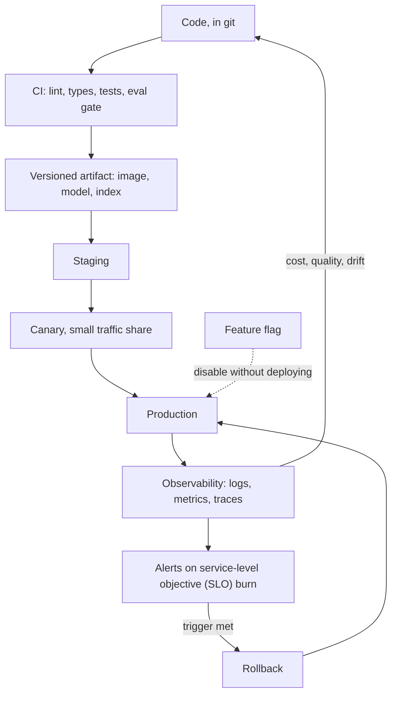

# 10 MLOps and Deployment

**Last reviewed:** 2026-09-18 · **Volatility:** medium. Concepts stable, tooling churns.

---

## Why this matters

"Production experience" is the phrase in the job description, and this module is what it means. Most of the interview questions labelled "tell me about your production experience" are answered here, not in the modeling modules.

The gap this closes is specific. A system that works on your machine and a system other people depend on differ in ways that have nothing to do with model quality: what happens when a dependency is down, how you know it broke before a user tells you, how you roll back, what it costs per request, who is allowed to call it. None of that is glamorous and all of it is what separates a demo from a product.

**The AI-specific half matters more than the generic half.** Standard service monitoring tells you latency and error rate. It cannot tell you that retrieval quality has degraded, that hallucination rate has risen, or that your token spend tripled because someone raised top-k. Those need their own instrumentation, and building it is the differentiator.

---

## Prerequisites

| You need | From |
|---|---|
| Git, CI, testing strategy, dependencies | `02` sections 1-7 |
| HTTP, REST, idempotency, status codes | `02` section 11 |
| Concurrency and parallelism | `02` section 12 |
| Logging, config, retries, caching | `01b` sections 8, 9 |
| Drift and monitoring concepts | `04` section 13 |
| RAG evaluation and instrumentation | `07` sections 9, 10 |
| Trajectory metrics | `08` section 10 |

Module `02` is the hard prerequisite. This module is that one plus deployment.

---

## How to use this module

This page has three modes. **Learn** is the first pass through the concepts. **Build** is the practice task and project work. **Interview** is the optional articulation layer; do it after you can solve the examples.

### Learning guide

| Item | Guidance |
|---|---|
| Estimated first pass | 5 hours |
| Setup | Git, Docker, Python 3.11+, and a terminal |
| First pass | Read lifecycle, versioning, service design, observability, evaluation gates, rollback, and cost. Treat `[DEPTH · DEEP DIVE]` sections as optional until the core path is comfortable. |
| Priority | `[FOUNDATION]` and `[CORE]` are the first pass; `[DEPTH · DEEP DIVE]` is the second pass. `[MUST]`/`[SHOULD]`/`[NICE]` apply to interview priority. |

By the end of the first pass you should be able to:

- Describe the path from versioned code and data to a monitored service.
- Choose observability signals, release gates, rollback points, and scaling tactics.
- Include quality, safety, latency, and cost in an AI deployment decision.

### Five-minute diagnostic

Answer these without searching. If two or more answers are uncertain, read the first-pass path in order instead of skipping ahead.

1. What must be versioned to reproduce an AI result?
2. What is the difference between a log, metric, and trace?
3. What quality check should block a deployment?
4. When is rollback safer than a hot fix?
5. Which cost driver would you measure first for an LLM service?

### Run the examples

Start by checking the local prerequisite:

```bash
docker --version && python3 --version
```

Expected output is a version string or command version. Run each example before reading its explanation; write down your prediction first.

## Skip-ahead map

| Section | Level | Skip if you can... |
|---|---|---|
| 1. The lifecycle | [FOUNDATION] | ...name the stages and where each fails |
| 2. Versioning everything | [CORE] | ...say what you must version besides code |
| 3. Containers | [CORE] | ...explain what a container guarantees and what it does not |
| 4. Service design | [CORE] | ...design an API that survives being retried |
| 5. Cloud, provider-neutral | [FOUNDATION] | ...translate between AWS, GCP and Azure vocabulary |
| 6. Deployment patterns | [CORE] | ...say when batch beats real-time |
| 7. Observability | [CORE] | ...distinguish logs, metrics and traces by what each answers |
| 8. LLM-specific monitoring | [CORE] | ...name five metrics standard APM does not give you |
| 9. Evaluation as a gate | [CORE] | ...write a CI gate on a stochastic metric |
| 10. Security and secrets | [CORE] | ...say where a secret should never be |
| 11. Scaling and reliability | [CORE] | ...explain backpressure and why it beats a bigger queue |
| 12. Rollback and release | [CORE] | ...define a rollback trigger before deploying |
| 13. Cost | [CORE] | ...attribute cost per request and per tenant |

---

## Mental model

**Deployment is the practice of making a system's behavior legible and reversible.**

Legible: you can tell what it is doing right now, and what it did an hour ago, without reproducing anything. Reversible: any change you make can be undone quickly, by someone who was not there when it was made.

Every practice here serves one or both. Versioning makes a change reversible. Tracing makes behavior legible. Feature flags make a release reversible without a deploy. Structured logs make an incident legible at 3am.

**Where the analogy breaks down.** Reversibility is not universal, and knowing where it stops is the important part. You cannot un-send an email, un-charge a card, or un-delete a document once the retention window has passed. Data migrations are often one-way. **Design so that the irreversible parts are few, explicit and gated**, which is module 08's human-in-the-loop argument applied to infrastructure.

---

## Concept map



---

## Running example: document-based support assistant

The support assistant becomes a service with versioned prompts and retrieval data, quality gates, latency and cost monitoring, and a rollback path when a release regresses.

## Core concepts

### 1. The lifecycle [FOUNDATION]

| Stage | Produces | Fails by |
|---|---|---|
| Data collection | A dataset | Silent schema change; stale pipeline |
| Preparation | Features, chunks, an index | Leakage; parser failures |
| Development | A model or a configuration | Optimizing the wrong metric |
| Evaluation | Numbers you trust | Contaminated test set |
| Packaging | A versioned artifact | Unpinned dependency |
| Deployment | A running service | Environment mismatch |
| Monitoring | Signal | Alerting on the wrong thing |
| Iteration | The next version | No rollback path |

**The loop, not the line, is the point.** Monitoring feeds back into development, which is why section 8 exists. A system deployed and never observed is a system you have stopped developing.

**For LLM applications the stages differ in one important way:** there is often no training step, but there is always a *configuration* whose changes are as consequential as a model retrain. Chunk size, top-k, prompt text, model version. These need versioning, evaluation and rollback exactly as a model does, and teams that treat prompts as content rather than as code discover this the hard way.


> **Concept checkpoint — 1. The lifecycle**
>
> 1. **Define:** explain the idea in one sentence without repeating the heading.
> 2. **Predict:** before rerunning the smallest example above, state the output or result.
> 3. **Vary:** change one input, parameter, or assumption and explain what should change.
> 4. **Challenge:** name one common misconception or failure mode.
> 5. **Apply:** complete the smallest practice task before moving to the next concept.

### 2. Versioning everything [CORE]

Code in git is table stakes. The question is what else.

| Artifact | Why | Mechanism |
|---|---|---|
| **Dependencies** | "Works on my machine" | Lockfile, committed |
| **Model or provider version** | Behavior changes underneath you | Pin explicitly, never an alias |
| **Prompts** | A word change alters behavior | In the repo, reviewed, never in a database someone edits |
| **Retrieval config** | Chunk size and top-k change quality and cost | In the repo, in the eval report |
| **The index** | An embedding model change invalidates all vectors | Version the index; include the model in its name |
| **Evaluation sets** | A changed test set makes runs incomparable | In the repo, changes reviewed |
| **Data snapshots** | Reproducing a result needs the data | Content hash, or a versioned store |
| **The artifact** | What actually ran | Immutable image tag, never `latest` |

**The three most commonly missed**, in order:

**Prompts.** Stored in a database or a config UI so non-engineers can edit them. Then behavior changes with no commit, no review, no rollback path and no correlation with the incident. Prompts are code. They go in the repo, through review, and a change runs the evaluation gate.

**Model version aliases.** Calling a stable alias means the provider can change the model beneath you. Your evaluation results silently expire. Pin the explicit version, log it with every request, and treat a change as a deployment.

**The index and its embedding model.** Module 07's warning: vectors from different models are not comparable. Put the model name and version in the index identifier, assert on it at query time, and you convert a silent quality collapse into a loud startup failure.

**Experiment tracking** records what you tried: parameters, metrics, artifacts, the code commit. The discipline matters more than the tool. Minimum viable version is the JSON run reports from projects 2 and 3, committed. `[VERIFY: tracking tools change @ current options]`


> **Concept checkpoint — 2. Versioning everything**
>
> 1. **Define:** explain the idea in one sentence without repeating the heading.
> 2. **Predict:** before rerunning the smallest example above, state the output or result.
> 3. **Vary:** change one input, parameter, or assumption and explain what should change.
> 4. **Challenge:** name one common misconception or failure mode.
> 5. **Apply:** complete the smallest practice task before moving to the next concept.

### 3. Containers [CORE]

**What a container guarantees:** the same filesystem, the same installed packages, the same entrypoint, on any machine with a compatible kernel.

**What it does not guarantee:** the same hardware, the same GPU drivers, the same network, the same environment variables, the same data, the same clock, or the same available memory. "It works in the container" is a much weaker claim than people treat it as, and most remaining "works here, not there" bugs live in that list.

```dockerfile
FROM python:3.11-slim AS builder
WORKDIR /app
COPY requirements.lock .
RUN pip install --no-cache-dir --user -r requirements.lock

FROM python:3.11-slim
RUN useradd --create-home --shell /bin/bash app
WORKDIR /app
COPY --from=builder /root/.local /home/app/.local
COPY --chown=app:app src/ ./src/
USER app
ENV PATH=/home/app/.local/bin:$PATH \
    PYTHONUNBUFFERED=1
EXPOSE 8000
HEALTHCHECK --interval=30s --timeout=3s --start-period=20s \
  CMD python -c "import urllib.request; urllib.request.urlopen('http://localhost:8000/health')"
CMD ["uvicorn", "src.api:app", "--host", "0.0.0.0", "--port", "8000"]
```

**The decisions worth defending in a review:**

**Multi-stage build.** Build dependencies do not ship. Smaller image, smaller attack surface, faster pulls.

**Install from the lockfile, not from ranges.** `02` section 4. A container built from ranges is reproducible in layout and not in contents.

**Non-root user.** A container escape from a root process is far worse than from an unprivileged one. One line, and it is the single most common Dockerfile security finding.

**`PYTHONUNBUFFERED=1`.** Without it Python buffers stdout, so your logs appear in bursts or vanish entirely when the container is killed. This costs people hours during their first incident.

**A healthcheck**, so the orchestrator knows the difference between "the process is running" and "the service works". They are not the same, and a hung process that still holds its port will otherwise receive traffic forever.

**Layer ordering matters** for build speed: copy the lockfile and install before copying source, so a source change does not invalidate the dependency layer.

**GPU containers** need the host's driver stack exposed, via the NVIDIA container toolkit on Linux. Module 09's note applies: there is no Metal passthrough on macOS, so a container on a Mac is CPU-only.


> **Concept checkpoint — 3. Containers**
>
> 1. **Define:** explain the idea in one sentence without repeating the heading.
> 2. **Predict:** before rerunning the smallest example above, state the output or result.
> 3. **Vary:** change one input, parameter, or assumption and explain what should change.
> 4. **Challenge:** name one common misconception or failure mode.
> 5. **Apply:** complete the smallest practice task before moving to the next concept.

### 4. Service design [CORE]

```python
from contextlib import asynccontextmanager

from fastapi import Depends, FastAPI, HTTPException, Request
from pydantic import BaseModel, Field


class AskRequest(BaseModel):
    question: str = Field(min_length=1, max_length=2000)
    top_k: int = Field(default=5, ge=1, le=20)
    conversation_id: str | None = None


class Source(BaseModel):
    chunk_id: str
    score: float
    heading_path: list[str]
    excerpt: str


class AskResponse(BaseModel):
    answer: str | None
    sources: list[Source]
    refused: bool
    model_version: str
    trace_id: str


@asynccontextmanager
async def lifespan(app: FastAPI):
    app.state.retriever = await build_retriever()     # expensive, once
    assert app.state.retriever.embed_model == settings.embed_model, "index/model mismatch"
    yield
    await app.state.retriever.close()


app = FastAPI(lifespan=lifespan)


@app.get("/health")
async def health():
    return {"status": "ok"}


@app.get("/ready")
async def ready(request: Request):
    if not request.app.state.retriever.is_ready():
        raise HTTPException(503, "retriever not ready")
    return {"status": "ready"}


@app.post("/v1/ask", response_model=AskResponse)
async def ask(req: AskRequest, request: Request, user=Depends(current_user)):
    ...
```

**The design points, each of which prevents a real incident:**

**Version the path from day one.** `/v1/` costs nothing now and is nearly impossible to retrofit once clients exist.

**Validate at the boundary with Pydantic.** `max_length=2000` on the question is not pedantry: without it, a 500,000-character question consumes your context budget, your money and a worker.

**Return sources with the answer.** A RAG API returning only prose cannot be debugged by its callers, and `07` section 10's decision tree needs them.

**Return `model_version` and `trace_id` in the response.** When a user reports a bad answer, those two fields turn an investigation into a lookup.

**Separate `/health` from `/ready`.** Health means the process is alive; readiness means it can serve. During startup, while the index loads, the service is healthy and not ready. Conflating them means the orchestrator either kills a starting pod or routes traffic to one that cannot serve.

**Assert the index and embedding model match at startup.** Module 07's silent-quality-collapse failure becomes a loud startup failure. One line.

**Load expensive resources in `lifespan`, not per request.** Obvious once stated, and loading a model per request is a real thing people ship.

**Idempotency for anything that writes.** `02` section 11. An `Idempotency-Key` header, recorded server side, returning the original result on a repeat.

**Rate limiting per API key**, not per IP, since one key behind a NAT is many IPs and vice versa. Return `429` with `Retry-After`, which is what `01b` section 9.2's client is looking for.

**Streaming** for user-facing generation, because perceived latency is dominated by time to first token. Note that streaming complicates error handling: once you have started streaming a 200 response, you cannot change the status code, so validation must happen before the first byte.


> **Concept checkpoint — 4. Service design**
>
> 1. **Define:** explain the idea in one sentence without repeating the heading.
> 2. **Predict:** before rerunning the smallest example above, state the output or result.
> 3. **Vary:** change one input, parameter, or assumption and explain what should change.
> 4. **Challenge:** name one common misconception or failure mode.
> 5. **Apply:** complete the smallest practice task before moving to the next concept.

### 5. Cloud, provider-neutral [FOUNDATION]

The translation table, so you can follow any conversation:

| Concept | AWS | GCP | Azure |
|---|---|---|---|
| Object storage | S3 | Cloud Storage | Blob Storage |
| Managed container run | ECS / Fargate | Cloud Run | Container Apps |
| Kubernetes | EKS | GKE | AKS |
| Serverless function | Lambda | Cloud Functions | Functions |
| Managed Postgres | RDS | Cloud SQL | Database for PostgreSQL |
| Queue | SQS | Pub/Sub | Service Bus |
| Secrets | Secrets Manager | Secret Manager | Key Vault |
| Identity | IAM | IAM | Entra ID |
| Logs and metrics | CloudWatch | Cloud Logging / Monitoring | Monitor |
| ML platform | SageMaker | Vertex AI | Azure ML |

**The choices that actually matter**, independent of provider:

**Managed containers beat Kubernetes until you need Kubernetes.** Cloud Run or Fargate handles scaling, TLS and deployments with a fraction of the operational burden. Adopt Kubernetes when you have several services with genuine orchestration needs, not because it is the standard answer.

**Object storage for artifacts**, not a container image. Models and indexes are large and change on a different cadence than code. Baking a 6 GB model into an image makes every deploy a 6 GB push.

**Managed databases**, always, unless you have a specific reason. Backups, failover and patching are solved problems you should not re-solve.

**Egress cost is the surprise.** Data leaving a cloud is expensive, and cross-region traffic is a line item people discover in month three.


> **Concept checkpoint — 5. Cloud, provider-neutral**
>
> 1. **Define:** explain the idea in one sentence without repeating the heading.
> 2. **Predict:** before rerunning the smallest example above, state the output or result.
> 3. **Vary:** change one input, parameter, or assumption and explain what should change.
> 4. **Challenge:** name one common misconception or failure mode.
> 5. **Apply:** complete the smallest practice task before moving to the next concept.

### 6. Deployment patterns [CORE]

| Pattern | Shape | Use when |
|---|---|---|
| **Batch** | Scheduled, process many, write results | Latency is irrelevant; work is predictable |
| **Real-time API** | Request in, response out | A user is waiting |
| **Async job** | Accept, queue, poll or callback | The work is too slow for a request |
| **Streaming** | Token by token | Generation a user reads |
| **Embedded** | In the client | Offline, privacy, latency |

**When batch beats real-time**, which is underused: if you can predict what will be asked, precompute it. Embedding a corpus is batch. Precomputing summaries for every document is batch. It is cheaper per unit, easier to monitor, trivially retryable, and it removes latency from the user path entirely.

**The async pattern for slow work:**

```
POST /v1/jobs      → 202 Accepted, {"job_id": "..."}
GET  /v1/jobs/{id} → 200 {"status": "running" | "done" | "failed", "result": ...}
```

Anything over roughly 30 seconds should be async. Holding an HTTP connection open for five minutes wastes a worker, breaks through proxies with their own timeouts, and gives the client no way to recover from a disconnect.


> **Concept checkpoint — 6. Deployment patterns**
>
> 1. **Define:** explain the idea in one sentence without repeating the heading.
> 2. **Predict:** before rerunning the smallest example above, state the output or result.
> 3. **Vary:** change one input, parameter, or assumption and explain what should change.
> 4. **Challenge:** name one common misconception or failure mode.
> 5. **Apply:** complete the smallest practice task before moving to the next concept.

### 7. Observability [CORE]

Three signals answering different questions:

| Signal | Answers | Shape | Cost |
|---|---|---|---|
| **Logs** | What happened in this specific request? | Discrete events | High volume |
| **Metrics** | What is the aggregate behavior over time? | Numeric series | Cheap |
| **Traces** | Where did the time go across components? | Spans in a tree | Sampled |

**Structured logs, not strings:**

```python
logger.info(
    "ask_completed",
    extra={
        "trace_id": trace_id,
        "user_id": user.id,
        "question_tokens": q_tokens,
        "retrieved_chunks": [c.id for c in chunks],
        "top_score": chunks[0].score if chunks else None,
        "prompt_tokens": prompt_tokens,
        "completion_tokens": completion_tokens,
        "model_version": settings.model_version,
        "refused": refused,
        "latency_ms": elapsed_ms,
        "ttft_ms": ttft_ms,
    },
)
```

A string log is greppable. A structured log is queryable, which is the difference between "find the errors" and "show me p95 latency for requests that retrieved fewer than three chunks above 0.7".

**A trace id threaded through everything** is the single highest-value piece of instrumentation. Return it in the response, log it at every stage, and a user report becomes a single query.

**Metrics: the four golden signals**, plus what they miss:

| Signal | Metric |
|---|---|
| Latency | p50, p95, p99. **Never the mean.** |
| Traffic | Requests per second |
| Errors | Rate by class |
| Saturation | Queue depth, memory, connections |

**Why never the mean:** a mean latency of 200ms is compatible with 95% of requests at 50ms and 5% at 3 seconds. The mean hides exactly the users who are suffering. Always percentiles.

**Service-level indicators (SLIs) and service-level objectives (SLOs)** are how you decide what to alert on. An SLI is a measurement: the fraction of requests served under 2 seconds. An SLO is a target: 99% over 30 days. The error budget is what remains: 1% of requests may be slow.

**Alert on error budget burn rate**, not on individual failures. A single 500 at 3am is not an incident; spending a week's budget in an hour is. This distinction is what makes on-call sustainable, and it is a strong signal in an interview.

**What to alert on** (few, actionable, urgent) versus **what to dashboard** (everything else). An alert that fires and is ignored is worse than no alert, because it trains people to ignore the next one.


> **Concept checkpoint — 7. Observability**
>
> 1. **Define:** explain the idea in one sentence without repeating the heading.
> 2. **Predict:** before rerunning the smallest example above, state the output or result.
> 3. **Vary:** change one input, parameter, or assumption and explain what should change.
> 4. **Challenge:** name one common misconception or failure mode.
> 5. **Apply:** complete the smallest practice task before moving to the next concept.

### 8. LLM-specific monitoring [CORE]

**Standard APM gives you latency, throughput and errors. None of those move when quality collapses.** This section is the differentiator.

| Metric | Catches | How |
|---|---|---|
| **Retrieval score distribution** | Index or embedding degradation | Histogram of top-1 score per request |
| **Zero-result rate** | Corpus gaps, query drift | Fraction retrieving nothing above threshold |
| **Refusal rate** | Too high means retrieval broke; too low means hallucination | From `07` section 8's fixed wording |
| **Citation validity rate** | Hallucinated citations | Do cited ids exist in the retrieved set |
| **Token usage per request** | Cost regressions and context growth | Split prompt and completion |
| **Cost per request and per tenant** | Budget, and abuse | Tokens times the pinned price |
| **TTFT versus total latency** | Which stage is slow | Measure separately |
| **Tool error rate, per tool** | A dead dependency | From `08` section 9 |
| **Steps per agent task** | Looping, inefficiency | From `08` section 10 |
| **Forbidden-tool attempts** | Injection, or a bug | Alert immediately, always |
| **Ingestion lag** | A stalled pipeline | Source mtime versus index time |
| **Model version in use** | Silent provider change | Log per request; alert on change |

**The five that catch the most, if you build only five:**

1. **Refusal rate.** Exactly measurable, needs no judge model, and moves in both directions for different reasons.
2. **Retrieval score distribution.** A shift here precedes every quality complaint.
3. **Token usage per request.** Cost regressions are silent otherwise.
4. **Ingestion lag.** A stalled pipeline does not fail, it just stops, so nothing errors.
5. **Model version.** The one change you did not make.

**Quality itself needs sampling plus offline evaluation.** You cannot compute faithfulness on every request in real time affordably. Sample a small fraction, score asynchronously, and run the full evaluation set on a schedule. The online metrics above are leading indicators; the evaluation set is the measurement.

**User feedback is signal with a bias.** Thumbs-down is rarer than dissatisfaction and skews toward users who bother. Use it to find examples worth reading, not as a quality metric.


> **Concept checkpoint — 8. LLM-specific monitoring**
>
> 1. **Define:** explain the idea in one sentence without repeating the heading.
> 2. **Predict:** before rerunning the smallest example above, state the output or result.
> 3. **Vary:** change one input, parameter, or assumption and explain what should change.
> 4. **Challenge:** name one common misconception or failure mode.
> 5. **Apply:** complete the smallest practice task before moving to the next concept.

### 9. Evaluation as a deployment gate [CORE]

Projects 2 and 3 built evaluation harnesses. In production they become gates.

```yaml
      - name: Retrieval evaluation gate
        run: |
          python -m grounded.evaluate.harness \
            --cases eval/questions.jsonl \
            --baseline eval/results/001-baseline.json \
            --tolerance 0.02 \
            --out eval/results/ci-${{ github.sha }}.json
```

```python
def test_retrieval_has_not_regressed(eval_cases, retriever):
    report = run_retrieval_eval(eval_cases, retriever, "ci", config={}, k=5)
    recall = report.aggregate()["recall"]
    failing = [c.case_id for c in report.cases if c.recall == 0]
    assert recall >= BASELINE_RECALL - TOLERANCE, (
        f"recall@5 fell to {recall:.3f} from baseline {BASELINE_RECALL:.3f}. "
        f"Cases with zero recall: {failing}"
    )
```

**Three properties that make this work rather than becoming noise:**

**A tolerance, never equality.** Output is not deterministic (`06` section 7), so asserting equality produces a flaky test, and `02` section 6 explains why a flaky test is worse than none.

**The failure message names the broken cases.** "0.69 < 0.71" sends someone hunting. A list of case ids sends them to the fix.

**It runs on prompt and config changes too**, not only on code. A prompt edit is a behavior change and must clear the same gate. This is section 2's argument, enforced.

**What to gate on:** retrieval metrics, refusal correctness, citation validity, cost per request, and p95 latency. **What not to gate on:** an LLM-judge quality score as an absolute threshold, since the judge drifts and you will end up disabling the gate.


> **Concept checkpoint — 9. Evaluation as a deployment gate**
>
> 1. **Define:** explain the idea in one sentence without repeating the heading.
> 2. **Predict:** before rerunning the smallest example above, state the output or result.
> 3. **Vary:** change one input, parameter, or assumption and explain what should change.
> 4. **Challenge:** name one common misconception or failure mode.
> 5. **Apply:** complete the smallest practice task before moving to the next concept.

### 10. Security and secrets [CORE]

**Where a secret must never be:** source code, a container image, a log line, an error message, a URL, a client-side bundle, or a git history. That last one is permanent: once committed, rotate the key, because deletion does not remove it from history.

**Where it should be:** a secrets manager, injected as an environment variable or a mounted file at runtime, with rotation and an access audit trail.

```python
class Settings(BaseSettings):
    model_config = SettingsConfigDict(env_prefix="APP_")

    api_key: SecretStr                        # repr() will not leak it
    database_url: SecretStr
    model_version: str                        # pinned, not an alias
    embed_model: str
```

`SecretStr` prevents the most common leak, which is a settings object landing in a log line or a traceback.

**Authentication and authorization:**

- Authenticate every endpoint. "Internal only" is not authentication; network position is not identity.
- Authorize per request, against current state. Module 07 section 11: a user who lost access at 10am must not receive their content at 10:01.
- Scope API keys per client, so you can revoke one without breaking everyone.

**Tenant isolation.** The highest-severity bug class in a multi-tenant AI system is returning one tenant's data to another. Defenses: tenant id from the authenticated session and never from the request body, filtering at the data layer rather than in application code, and a test that specifically attempts cross-tenant access. Write that test; it is the one nobody writes.

**PII.** Know what is in your prompts, because prompts reach your provider and your logs. Redact before logging. Know your provider's retention policy. A deletion request must reach the document, its chunks, its vectors and any cached embeddings; the cache is the part that gets forgotten.

**Prompt injection at the infrastructure level**, from module 08 section 11: least privilege on every tool, an egress allowlist so the third leg of the trifecta is broken, and alerting on forbidden-tool attempts.


> **Concept checkpoint — 10. Security and secrets**
>
> 1. **Define:** explain the idea in one sentence without repeating the heading.
> 2. **Predict:** before rerunning the smallest example above, state the output or result.
> 3. **Vary:** change one input, parameter, or assumption and explain what should change.
> 4. **Challenge:** name one common misconception or failure mode.
> 5. **Apply:** complete the smallest practice task before moving to the next concept.

### 11. Scaling and reliability [CORE]

**Scale the bottleneck, and find it before scaling anything.** For LLM applications the bottleneck is usually the model provider's rate limit or your own inference capacity, not your web tier. Adding API replicas in front of a saturated model does nothing except queue faster.

**Load testing** must use realistic prompt lengths. Testing with 50-token prompts and serving 3,000-token RAG prompts measures nothing useful, because prefill cost scales with prompt length (`06` section 7).

**Backpressure** is the reliability concept most worth understanding. When work arrives faster than you can process it, you have three options: queue it, drop it, or slow the producer. **Unbounded queueing is the worst of the three** and the most common default. Latency grows without bound, memory fills, and every request eventually times out anyway, so you have converted a partial outage into a total one while doing all the work.

A bounded queue that rejects with `429` when full is a better system: some clients are served well, others retry, and the service stays up. **"Make the queue bigger" is almost always the wrong answer**, and saying so is a strong interview signal.

**Circuit breakers** stop calling a failing dependency, fail fast, and periodically test recovery. Without one, every request waits for a timeout against a dead service and your thread pool fills with doomed work.

**Graceful degradation**, with the options named in advance: serve from cache, fall back to a smaller model, return retrieval results without generation, or return a clear error. Decide before the incident, because 3am is not when to design this.

**Timeouts everywhere**, and they must decrease as you go deeper. If your API times out at 30 seconds, the model call must be shorter, or the outer timeout fires while inner work continues, leaking resources.


> **Concept checkpoint — 11. Scaling and reliability**
>
> 1. **Define:** explain the idea in one sentence without repeating the heading.
> 2. **Predict:** before rerunning the smallest example above, state the output or result.
> 3. **Vary:** change one input, parameter, or assumption and explain what should change.
> 4. **Challenge:** name one common misconception or failure mode.
> 5. **Apply:** complete the smallest practice task before moving to the next concept.

### 12. Rollback and release [CORE]

**Define the rollback trigger before you deploy.** Not "if it looks bad" but "if the error rate exceeds 2% for 5 minutes, or p95 exceeds 4 seconds, or refusal rate moves more than 10 points, roll back". Written down, agreed, ideally automated.

| Pattern | Mechanism | Rollback |
|---|---|---|
| **Rolling** | Replace instances gradually | Redeploy the old version |
| **Blue-green** | Two environments, switch traffic | Switch back, seconds |
| **Canary** | Small traffic share first | Route the share back to zero |
| **Feature flag** | New path behind a runtime toggle | Flip the flag, no deploy |

**Feature flags are the best rollback available** for AI systems specifically, because so many changes are configuration: a prompt, a top-k, a model version, a reranker on or off. A flag makes each one reversible in seconds by someone who was not involved in the change. That property is worth more than the deployment mechanism.

**Canary needs enough traffic to be meaningful.** At 1% of a hundred requests a day, you learn nothing before you promote. `03` section 10's sample-size arithmetic applies: know how long your canary must run to detect the regression you care about, and if the answer is three weeks, canary is not your safety mechanism and the rollback trigger is.

**Database migrations are the asymmetry.** Deploys roll back; schema changes often do not. Use expand-and-contract: add the new column, deploy code that writes both, backfill, deploy code that reads the new one, and only then remove the old. Each step is individually reversible.

**Practise the rollback.** A rollback procedure nobody has executed is a hypothesis. Do it deliberately, in working hours, before you need it at 3am.


> **Concept checkpoint — 12. Rollback and release**
>
> 1. **Define:** explain the idea in one sentence without repeating the heading.
> 2. **Predict:** before rerunning the smallest example above, state the output or result.
> 3. **Vary:** change one input, parameter, or assumption and explain what should change.
> 4. **Challenge:** name one common misconception or failure mode.
> 5. **Apply:** complete the smallest practice task before moving to the next concept.

### 13. Cost [CORE]

**Attribute cost per request, per endpoint and per tenant**, or you cannot act on it.

```python
cost = (prompt_tokens * PROMPT_PRICE + completion_tokens * COMPLETION_PRICE) / 1_000_000
logger.info("request_cost", extra={"trace_id": trace_id, "tenant": tenant, "cost_usd": cost})
```

`[VERIFY: prices change; keep them in config, not in code, and version the config]`

**Where the money goes in a RAG system**, which is not where people expect: prompt tokens usually dominate, because retrieved chunks are large and answers are short. So `top_k` is a cost lever with a multiplier on it. Raising it from 5 to 20 roughly quadruples your prompt tokens and therefore most of your bill.

**Optimizations, in order of return:**

| Lever | Effect |
|---|---|
| Cache identical and near-identical requests | Largest single win in most systems |
| Provider prompt caching for a stable prefix | Large, if your system prompt is long and stable |
| Right-size the model per task | Classification and routing do not need your largest model |
| Reduce retrieved chunks | Direct multiplier on prompt tokens |
| Shorter system prompts | Paid on every request, forever |
| Batch anything not user-facing | Better throughput per unit |

**The governing rule: require an evaluation-set improvement to justify a context increase.** Otherwise "let's pass more chunks" happens repeatedly and quadruples the bill for a quality change nobody measured.

**Budget alerts on the derivative, not just the level.** A cost that doubled overnight matters before it reaches the monthly cap, and a cap alert arrives after the money is spent.

---


> **Concept checkpoint — 13. Cost**
>
> 1. **Define:** explain the idea in one sentence without repeating the heading.
> 2. **Predict:** before rerunning the smallest example above, state the output or result.
> 3. **Vary:** change one input, parameter, or assumption and explain what should change.
> 4. **Challenge:** name one common misconception or failure mode.
> 5. **Apply:** complete the smallest practice task before moving to the next concept.

## Worked example: a deployment checklist

Run this before shipping. Every item exists because skipping it caused an incident somewhere.

### Before the first deploy

**Build and packaging**
- [ ] Multi-stage Dockerfile, non-root user, `PYTHONUNBUFFERED=1`
- [ ] Installed from a committed lockfile, not from ranges
- [ ] Image tagged with the commit SHA, never `latest`
- [ ] Image size sane; model and index in object storage, not baked in

**Configuration**
- [ ] All config from environment, validated at startup, failing fast
- [ ] Secrets from a secrets manager, `SecretStr` in the settings object
- [ ] Model version pinned explicitly, not an alias
- [ ] Index asserts its embedding model matches at startup

**The service**
- [ ] `/health` and `/ready` are separate
- [ ] Every endpoint authenticated; authorization per request against current state
- [ ] Request validation with explicit maximum sizes
- [ ] Rate limiting per API key, returning `429` with `Retry-After`
- [ ] Idempotency keys on anything that writes
- [ ] Timeouts at every layer, decreasing with depth
- [ ] Response includes `trace_id` and `model_version`

**Observability**
- [ ] Structured logs with a trace id threaded through every stage
- [ ] p50, p95, p99 latency; TTFT measured separately
- [ ] Token counts and cost per request, tagged by tenant
- [ ] The five LLM metrics from section 8
- [ ] Dashboards exist and someone has looked at them

**Safety**
- [ ] SLO defined, with an alert on error budget burn rate
- [ ] Rollback trigger written down, with thresholds
- [ ] Rollback executed at least once, deliberately
- [ ] Feature flags on the model version, prompt and retrieval config
- [ ] Graceful degradation path decided and tested

**Evaluation**
- [ ] Evaluation gate in CI with a tolerance, failing with case ids
- [ ] Gate runs on prompt and config changes, not only code
- [ ] Baseline committed and dated

### Before every subsequent deploy

- [ ] CI green, including the evaluation gate
- [ ] Changes to prompts or retrieval config reviewed like code
- [ ] Cost impact estimated if context size changed
- [ ] Rollback trigger still correct for this change
- [ ] Deployed behind a flag if the behavior change is meaningful
- [ ] Someone is watching for the first 30 minutes

**The three most commonly skipped**, and each one produces the same incident repeatedly: `/health` and `/ready` conflated, the rollback never practised, and the evaluation gate not running on prompt changes.

---

## Common mistakes and debugging

### Beginner mistakes

| Symptom | Cause | Fix |
|---|---|---|
| Logs empty until the container dies | stdout buffering | `PYTHONUNBUFFERED=1` |
| Works locally, fails in the container | Missing environment variable | Validate config at startup |
| Orchestrator kills a starting pod | `/health` used for readiness | Separate the two |
| Image is 8 GB | Model baked in | Object storage, fetched at startup |
| Deploy cannot be rolled back | Tagged `latest` | Tag with the commit SHA |
| Latency looks fine, users complain | Reporting the mean | Percentiles |
| Cost tripled, nothing changed | `top_k` raised in a config edit | Version config; alert on token usage |
| Quality dropped, no deploy happened | Provider changed the model | Pin versions; log per request |

### Production failure modes

**The unbounded queue outage.** Traffic spikes, work queues, latency grows, memory fills, everything times out. A partial outage became total. *Fix:* bounded queue, reject with `429`.

**The prompt edited in a database.** Someone changes a prompt through an admin UI; behavior changes with no commit, no review, no rollback and no correlation with the incident. *Fix:* prompts in the repo, through CI.

**Cross-tenant data leak.** Tenant id taken from the request body rather than the session. *Fix:* identity from the authenticated session only, filtering at the data layer, and a test that attempts cross-tenant access.

**Silent ingestion stall.** The pipeline stopped three days ago. Nothing failed, because nothing ran. The system answers confidently from stale data. *Fix:* alert on ingestion lag, not on ingestion failure.

**Retry storm during a partial outage.** A dependency slows; every client retries; the retries are the load that finishes it. *Fix:* jitter (`01b` 9.2), circuit breakers, and retry budgets.

**Timeout inversion.** The outer timeout is shorter than the inner one, so the client gives up while work continues, leaking workers. *Fix:* timeouts decreasing with depth.

**The eval gate disabled.** It became flaky because it asserted on an LLM-judge score with no tolerance, so someone turned it off, and three months later there is no gate. *Fix:* gate on deterministic metrics with tolerances.

### Debugging method

1. **Start with the trace id.** If a user report cannot become a single query, fix that first.
2. **Check what changed**, including config and provider model versions, not just deploys.
3. **Separate TTFT from total latency.** Different causes, different fixes.
4. **Check saturation before capacity.** Queue depth and connection pools tell you whether you are throughput-limited or dependency-limited.
5. **Look at percentiles, and at the shape.** A bimodal latency distribution usually means two paths, one cached.
6. **Correlate quality metrics with deploys and config changes**, in that order.

---

> **Interview mode (optional on the first pass):** return here after the Learn and Build work. Practice the 60-second answer only after you can explain the mechanism and complete the example.

## Interview angle

**1. Walk me through deploying an LLM application.**

*Strong outline:* Artifact first: multi-stage image built from a committed lockfile, non-root, tagged with the commit SHA, model and index in object storage rather than baked in. Config from environment, validated at startup, secrets from a secrets manager, model version pinned explicitly rather than an alias. Service: versioned path, validation with size limits, separate health and readiness, auth on every endpoint, rate limits, timeouts decreasing with depth. Then the AI-specific parts: an evaluation gate in CI that also runs on prompt and config changes, the LLM monitoring in section 8 since standard APM will not tell you quality degraded, and feature flags on model version, prompt and retrieval config so each is reversible in seconds. Finish with the rollback trigger defined before deploying, and practised.

*Weak answer:* "Containerize it and deploy to Kubernetes." Describes a mechanism and none of the properties that matter.

**2. What do you monitor for an LLM application that standard APM does not give you?**

*Strong outline:* Latency, throughput and error rate do not move when quality collapses. The additional ones: retrieval score distribution, since a shift precedes every quality complaint; refusal rate, which is exactly measurable given fixed refusal wording and moves in both directions for different reasons; citation validity, checking that cited ids exist in the retrieved set; token usage and cost per request, because cost regressions are otherwise silent; ingestion lag, because a stalled pipeline does not fail, it just stops; and the model version in use, to catch a provider changing it underneath you. For agents add tool error rates, steps per task, and forbidden-tool attempts, which should alert immediately. Then the honest caveat: quality itself needs sampling plus a scheduled offline evaluation, because you cannot afford faithfulness checks on every request.

*Weak answer:* "Latency, errors and token usage." The third is right; the first two are what APM already gives you.

**3. How do you roll back an LLM application?**

*Strong outline:* Define the trigger before deploying, with thresholds: error rate above 2% for 5 minutes, p95 above 4 seconds, refusal rate moving more than 10 points. Then the mechanism, and for AI systems the best one is usually a feature flag rather than a deployment pattern, because so many consequential changes are configuration: prompt, top-k, model version, reranker on or off. A flag makes each reversible in seconds by someone who was not involved. Blue-green and canary are good for code; canary needs enough traffic to be statistically meaningful, and if the sample-size arithmetic says three weeks then canary is not your safety mechanism. Finally, database migrations are the asymmetry, so expand-and-contract, and practise the rollback in working hours before you need it at 3am.

*Weak answer:* "Redeploy the previous version." Does not cover config changes, which are most of them.

**4. Your service is slow under load. How do you approach it?**

*Strong outline:* Find the bottleneck before scaling anything, because for LLM applications it is usually the model provider's rate limit or your own inference capacity, not the web tier, and adding API replicas in front of a saturated model just queues faster. Separate TTFT from total latency, since prefill scales with prompt length and decode with output length. Check saturation signals, queue depth and connection pools, to tell throughput-limited from dependency-limited. Look at percentile shape, because bimodal usually means a cache hit path and a miss path. Then the reliability point: if the queue is unbounded, that is the bug. Latency grows without bound, memory fills, everything times out anyway, so a partial outage became total. A bounded queue rejecting with 429 serves some clients well and stays up, and "make the queue bigger" is almost always wrong.

*Weak answer:* "Add more instances." Sometimes right, and it skips the diagnosis and misses backpressure entirely.

**5. How do you make an evaluation set part of deployment?**

*Strong outline:* It becomes a CI gate. Three properties make it work rather than become noise. A tolerance rather than equality, because output is not deterministic even at temperature 0, and a flaky gate gets disabled. A failure message naming the specific failing cases, so the message sends someone to the fix rather than hunting. And it must run on prompt and configuration changes, not only code, because a prompt edit is a behavior change. Gate on deterministic metrics: retrieval recall, refusal correctness, citation validity, cost per request, p95 latency. Do not gate on an LLM-judge score as an absolute threshold, because the judge drifts and the gate will end up disabled, which is the common failure.

*Weak answer:* "Run the eval in CI." Correct and misses all three properties that determine whether it survives.

**6. Where should secrets live, and what is the worst mistake?**

*Strong outline:* A secrets manager, injected at runtime as an environment variable or mounted file, with rotation and an access audit trail. Never in code, an image, a log line, an error message, a URL, a client bundle, or git history. The worst mistake is git history, because it is permanent: deleting the file in a later commit does not remove it, so the only real remedy is rotating the key. Practical defences: `SecretStr` in your settings so a settings object in a traceback does not leak, `detect-private-key` in pre-commit, and grepping your repository for key-shaped strings before pushing.

*Weak answer:* "Use environment variables." Necessary and not sufficient; it says nothing about how they get there or about history.

**7. How do you control cost?**

*Strong outline:* First attribute it: cost per request, per endpoint, per tenant, logged with the trace id, or you cannot act. Then know where it goes, which for RAG is usually prompt tokens rather than completion tokens, because chunks are large and answers short. That makes top-k a lever with a multiplier: raising it from 5 to 20 roughly quadruples prompt tokens and therefore most of the bill. Optimizations in order of return: caching identical and near-identical requests, provider prompt caching for a stable prefix, right-sizing the model per task since routing and classification do not need your largest, reducing retrieved chunks, shortening the system prompt which is paid on every request forever, and batching anything not user-facing. Then the governing rule: require an evaluation-set improvement to justify any context increase. And alert on the derivative, not just the monthly cap, because a cap alert arrives after the money is spent.

*Weak answer:* "Use a cheaper model." One lever, and usually not the biggest.

**8. Explain the difference between health and readiness, and why it matters.**

*Strong outline:* Health means the process is alive; readiness means it can serve. They diverge during startup while an index or model loads, during a dependency outage where the process is fine but cannot do useful work, and during shutdown when you want to stop receiving traffic before the process exits. Conflating them causes two specific failures: the orchestrator kills a pod that is still loading because it reports unhealthy, or it routes traffic to a pod that is alive but cannot serve. Add that a health check should not check dependencies, or one database blip restarts every pod simultaneously, which converts a degraded system into an outage.

*Weak answer:* "They're both health checks." The divergence cases are the answer.

**9. How do you version an LLM application?**

*Strong outline:* Code in git is table stakes; the question is what else. Dependencies in a committed lockfile. The model or provider version pinned explicitly, never an alias, and logged per request. Prompts in the repository, reviewed, never in a database an admin UI edits, because otherwise behavior changes with no commit, no review and no rollback path. Retrieval configuration in the repository and in the evaluation report. The index versioned with its embedding model in the identifier, asserted at startup, which converts module 07's silent quality collapse into a loud startup failure. Evaluation sets versioned, or runs are not comparable. And the artifact tagged with a commit SHA rather than `latest`. The three most commonly missed are prompts, model aliases, and the index-to-embedding-model binding.

*Weak answer:* "Version the model and the code." Misses prompts and configuration, which are most of the changes in an LLM system.

**10. What does "production experience" actually mean to you?**

*Strong outline:* An opinionated answer is expected. Two properties: the system's behavior is legible, meaning you can tell what it is doing now and what it did an hour ago without reproducing anything, and reversible, meaning any change can be undone quickly by someone who was not there when it was made. Then what follows: a trace id threaded through everything so a user report is one query; alerting on error budget burn rate rather than individual failures, because that is what makes on-call sustainable; a rollback trigger defined before deploying and practised; and knowing where reversibility stops, since you cannot un-send an email or un-charge a card, which is why the irreversible actions should be few, explicit and gated.

*Weak answer:* Listing tools. The question is about properties, and naming Kubernetes and Prometheus answers a different one.

### Follow-up questions to expect

- After 2: *"All your metrics look fine and users say answers got worse. Now what?"* The online metrics are leading indicators, not quality measurement. Run the offline evaluation set, which is the actual measurement. Check what changed that is not a deploy: provider model version, index rebuild, corpus ingestion, a config edit. Then sample recent requests and read them, because a metric that did not move may simply not be measuring the thing that broke, and that gap is itself a finding to fix.
- After 4: *"You bounded the queue and clients now get 429s. They are unhappy."* That is the honest tradeoff, made visible. Options: scale the actual bottleneck, shed low-priority traffic first so important requests still succeed, add per-client quotas so one heavy user cannot consume everything, or degrade gracefully by serving cached or retrieval-only responses. The 429 is not the problem, it is the system telling the truth about capacity rather than lying with unbounded latency.

### 60-second and 5-minute answers

1. What you monitor that APM does not give you
2. How you roll back an LLM application
3. Backpressure and why a bigger queue is the wrong answer
4. What "production experience" means

---

## Practice tasks

> **Build mode:** attempt the smallest exercise without looking at the solution, then complete the module project as the exit condition.

Solutions and delayed practice are in the [10 practice pack](quizzes/10-mlops-practice.md).

### Five tiny exercises

1. Take an existing Dockerfile and apply every section 3 improvement. Measure the image size before and after.
2. Add a trace id to a service and thread it through every log line and the response. Then trace one request end to end from the logs alone.
3. Write an SLO for a RAG endpoint, compute its error budget, and define the burn-rate alert.
4. Define a rollback trigger with specific thresholds for a prompt change, then argue why each threshold is the right number.
5. Instrument token counts per prompt component and find which component grew most over a week of use.

### Three realistic coding tasks

1. **Production-shape the project 2 service.** Everything on the section 3 and 4 checklists: health and readiness, auth, rate limiting, idempotency, structured logging with trace ids, cost attribution, the LLM metrics. Then load-test it with realistic prompt lengths.
2. **Evaluation gate in CI.** Wire project 2's harness into GitHub Actions with a tolerance, a failure message naming cases, and a trigger on prompt and config paths. Then deliberately regress retrieval and confirm the gate catches it.
3. **Chaos exercise.** Take a running system and break things on purpose: kill the vector store, make the model provider return 429s, stall the ingestion pipeline, exhaust the queue. For each, record how long until you noticed from monitoring alone, and what the user experienced. Fix whatever you did not notice.

### One mini-project

**Deploy something and operate it for two weeks.**

Take project 2, deploy it somewhere reachable, and run it. Then:

- Define an SLO and track the error budget
- Practise a rollback, deliberately, and time it
- Make a config change behind a feature flag and roll it back
- Let the ingestion pipeline stall on purpose and see whether your monitoring catches it
- Track cost per request daily and explain any change
- Write an incident report for something that actually went wrong

Success criterion: an incident report about something real, with a timeline, a cause, and a change you made so it does not recur. That document is worth more in an interview than any architecture diagram, because almost no candidate has one.

---

## Mastery checklist

- [ ] Name what must be versioned besides code, and the three most commonly missed
- [ ] Explain what a container guarantees and three things it does not
- [ ] Say why `PYTHONUNBUFFERED=1` matters
- [ ] Separate `/health` from `/ready` and give the divergence cases
- [ ] Design an API that survives being retried
- [ ] Translate between AWS, GCP and Azure vocabulary
- [ ] Say when batch beats real-time
- [ ] Distinguish logs, metrics and traces by the question each answers
- [ ] Say why you never report mean latency
- [ ] Define an SLI, an SLO and an error budget, and alert on burn rate
- [ ] Name five LLM-specific metrics APM does not provide
- [ ] Write a CI gate on a stochastic metric that will not become flaky
- [ ] Say where a secret must never be, and why git history is permanent
- [ ] Explain backpressure and why a bigger queue is the wrong answer
- [ ] Define a rollback trigger with thresholds, before deploying
- [ ] Explain expand-and-contract for migrations
- [ ] Attribute cost per request and name the biggest lever in a RAG system
- [ ] Run the deployment checklist and say why each item exists

Fewer than fourteen of eighteen means go back. Module 11 assumes sections 7, 11 and 13.

---

## Connections

**Backward:**

- `02` sections 4 and 7 are the CI half; this is the CD half.
- `02` section 11's idempotency is section 4's write-safety design.
- `01b` section 9.2's jitter is why retry storms are survivable.
- `04` section 13's drift is section 8's monitoring.
- `07` section 9's evaluation becomes section 9's gate; its section 10 instrumentation becomes production logging.
- `08` sections 9 and 10 become agent monitoring.
- `09`'s serving setup is what you are deploying when the model is local.

**Forward:**

- `11-ai-system-design.md` uses section 11's scaling vocabulary and section 13's cost arithmetic for capacity estimation.
- `capstone/02-build-plan.md` and `capstone/03-evaluation.md` apply this checklist.
- `12b-interview-question-bank.md`'s production diagnostic scenarios draw on the failure modes here.

---

## Volatile claims

| Claim | Why it decays | Re-check against |
|---|---|---|
| Cloud service names | Providers rename things | Current provider docs |
| Base image tags and versions | Routine churn | Docker Hub |
| Token prices | Change frequently | Provider pricing; keep in versioned config |
| Experiment tracking tool landscape | Consolidating | Current options |
| "Managed containers beat Kubernetes until you need it" | Opinionated, and I stand by it | Your own operational load |

The observability model, SLOs and error budgets, backpressure, idempotency, expand-and-contract and the rollback discipline are stable and predate LLMs by a decade.

**Next review due:** 2027-03-18.
