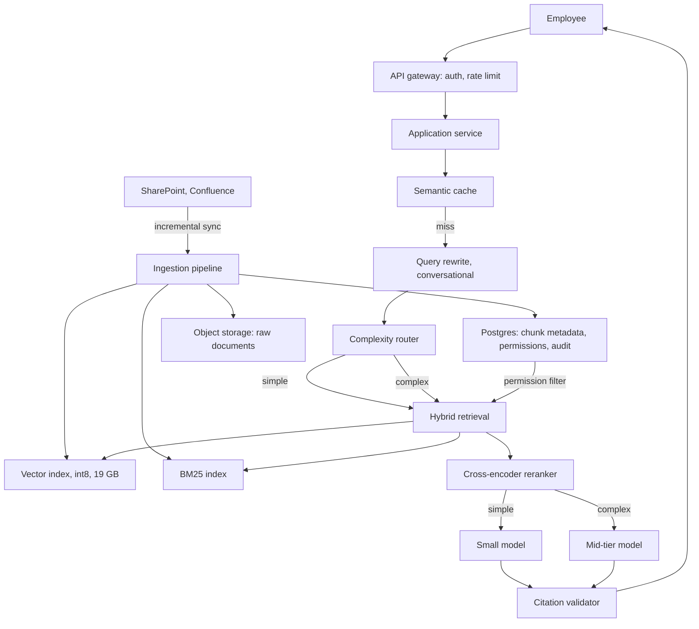
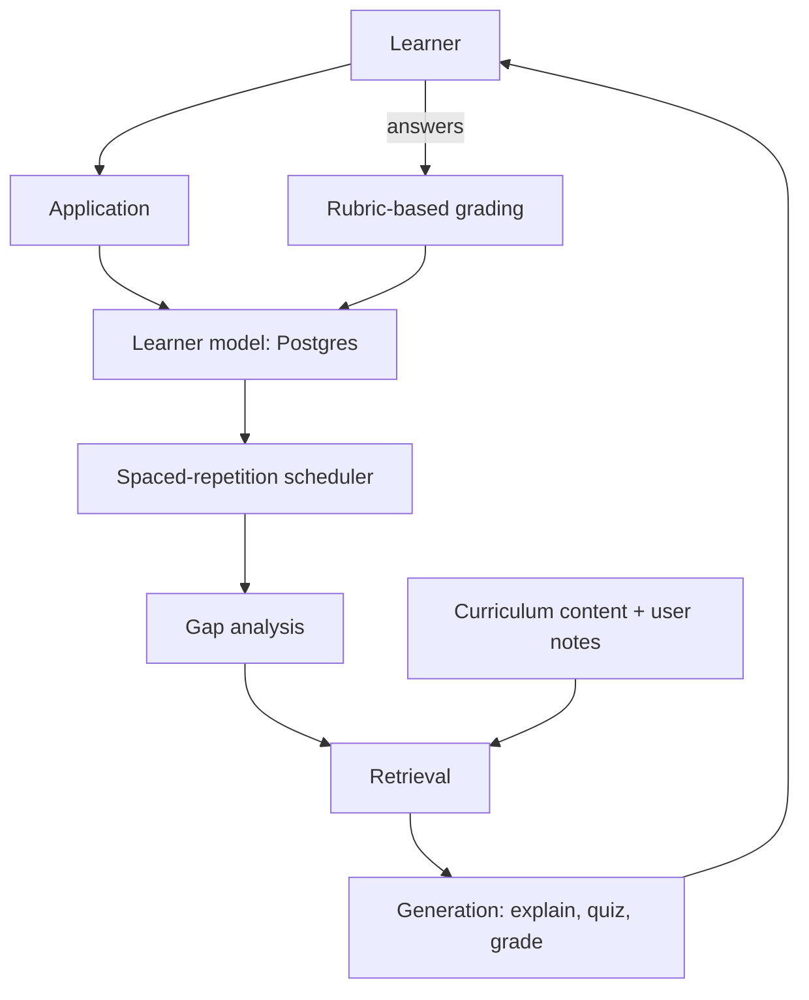
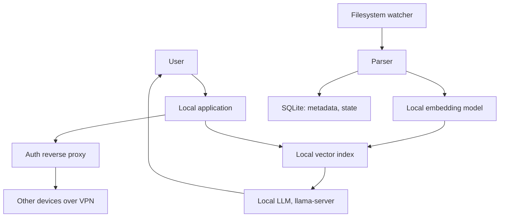
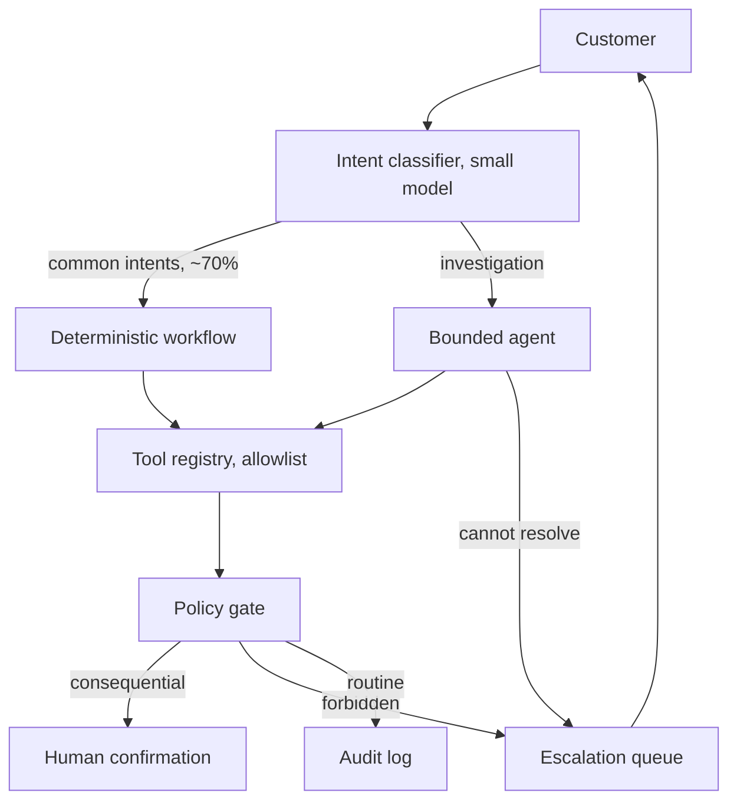

# 11 AI System Design

**Last reviewed:** 2026-09-18 · **Volatility:** low for the method, medium for the component landscape

Every number in the walkthroughs was computed, so you can check the arithmetic and substitute your own assumptions.

---

## Why this matters

System design is the round that decides senior-level offers, and AI system design is a recent enough variant that most candidates have not practised it.

The interviewer is not checking whether you know the components. They are checking whether you can take an underspecified problem, extract requirements, do arithmetic on the back of an envelope, make tradeoffs with reasons, and say what would falsify your design. Those are the skills, and they are separable from everything else in this repository.

**The most common failure is not knowing the material.** It is jumping to a diagram before establishing what the system must do, and then defending the diagram instead of the requirements.

---

## Prerequisites

| You need | From |
|---|---|
| RAG architecture and failure modes | `07` all |
| KV cache, prefill/decode, context costs | `06` section 7 |
| Agent boundaries, tool safety, the trifecta | `08` sections 1, 11 |
| Backpressure, SLOs, rollback, cost attribution | `10` sections 7, 11, 13 |
| Local serving and memory budgets | `09` |
| Arithmetic discipline, sample sizes, denominators | `03` sections 9, 10 |

This module assumes all of them. It is consolidation, not new material, which is why it comes last.

---

## How to use this module

This page has three modes. **Learn** is the first pass through the concepts. **Build** is the practice task and project work. **Interview** is the optional articulation layer; do it after you can solve the examples.

### Learning guide

| Item | Guidance |
|---|---|
| Estimated first pass | 4 hours |
| Setup | Modules 07–10 completed and a calculator or scratchpad |
| First pass | Read the answer framework, requirements, capacity estimation, patterns, evaluation, and security. Treat `[DEPTH · DEEP DIVE]` sections as optional until the core path is comfortable. |
| Priority | `[FOUNDATION]` and `[CORE]` are the first pass; `[DEPTH · DEEP DIVE]` is the second pass. `[MUST]`/`[SHOULD]`/`[NICE]` apply to interview priority. |

By the end of the first pass you should be able to:

- Turn an underspecified AI problem into requirements and measurable constraints.
- Estimate capacity, choose components, and state tradeoffs in order.
- Design evaluation, safety, reliability, and cost into the first answer.

### Five-minute diagnostic

Answer these without searching. If two or more answers are uncertain, read the first-pass path in order instead of skipping ahead.

1. What requirement should you clarify before drawing a system diagram?
2. Which traffic and payload numbers drive capacity estimates?
3. What makes a component choice reversible?
4. How would you know the design is failing after launch?
5. Where should human approval or permission boundaries appear?

### Run the examples

Start by checking the local prerequisite:

```bash
python3 --version
```

Expected output is a version string or command version. Run each example before reading its explanation; write down your prediction first.

## Skip-ahead map

| Section | Level | Skip if you can... |
|---|---|---|
| 1. The answer framework | [CORE] | ...run a 45-minute design to a timed structure |
| 2. Requirements | [CORE] | ...name the five questions to ask before drawing anything |
| 3. Capacity estimation | [CORE] | ...compute tokens per day and cost from user counts |
| 4. Component vocabulary | [FOUNDATION] | ...place every box and say what it is for |
| 5. Patterns | [CORE] | ...pick the right shape for eight problem types |
| 6. Reliability and scale | [CORE] | ...say where your design fails first |
| 7. Evaluation and quality | [CORE] | ...say how you would know the system works |
| 8. Security and privacy | [CORE] | ...design tenant isolation and injection containment |
| 9. Cost | [CORE] | ...name the biggest lever and quantify it |
| 10-13. Four walkthroughs | [CORE] | n/a, practise them aloud |

---

## Mental model

**A system design answer is a sequence of decisions, each with a stated reason and a stated cost. The diagram is a by-product.**

Interviewers are listening for the reasons. "I would use a vector database" is a box. "I would use a vector database rather than a linear scan because we have 20 million chunks, which at 1024 dimensions is 76 GB, so exhaustive search per query is not viable, and I accept losing a few percent of recall which I would measure" is a decision.

**Where the analogy breaks down.** "A sequence of decisions" implies you can proceed linearly. You cannot: capacity estimates change your component choices, which change your cost, which changes the requirements you negotiate. The real process loops, and **saying so out loud is a strength.** "That cost estimate changes my answer on the model tier, let me revise" is what a senior engineer sounds like.

---

## Running example: document-based support assistant

The support assistant is the running design problem: define requirements, estimate traffic and context, choose retrieval and model components, then design evaluation, security, reliability, and cost controls.

## Core concepts

### 1. The answer framework [CORE]

A repeatable structure for 45 minutes. Say the structure out loud at the start; it signals you have done this before and it stops you rambling.

| Phase | Minutes | Output |
|---|---|---|
| **1. Clarify** | 5-8 | Scope, users, constraints, what success means |
| **2. Estimate** | 5 | QPS, tokens, storage, cost. Arithmetic shown. |
| **3. High-level design** | 10 | The boxes and the data flow |
| **4. Deep dive** | 10-15 | One or two components, in detail, where they ask |
| **5. Bottlenecks and failure** | 5-8 | Where it breaks first, and what you would do |
| **6. Evaluation and operations** | 5 | How you know it works; what you monitor |

**Rules that keep it on track:**

**Do not draw until phase 3.** Every minute of drawing before requirements is a minute defending an arbitrary choice.

**Say your assumptions out loud and write them down.** "I am assuming 20% daily active, tell me if that is wrong." If the interviewer corrects you, that is a gift, not a failure.

**Do the arithmetic visibly.** Not "that will be a lot of tokens" but "80,000 queries a day at 3,050 tokens each is 244 million tokens a day". The number is less important than showing you can produce one.

**State tradeoffs as tradeoffs.** Every decision costs something. A candidate who presents only benefits sounds like they have not built it.

**Leave time for phases 5 and 6.** Many candidates spend 40 minutes on the diagram and never reach failure modes or evaluation, which is where senior signal lives.


> **Concept checkpoint — 1. The answer framework**
>
> 1. **Define:** explain the idea in one sentence without repeating the heading.
> 2. **Predict:** before rerunning the smallest example above, state the output or result.
> 3. **Vary:** change one input, parameter, or assumption and explain what should change.
> 4. **Challenge:** name one common misconception or failure mode.
> 5. **Apply:** complete the smallest practice task before moving to the next concept.

### 2. Requirements [CORE]

**The five questions to ask before anything else:**

1. **Who uses it and how many?** Internal team of 50 or public product of 5 million are different systems.
2. **What does a good answer look like, and what does a bad one cost?** A wrong answer about a lunch menu and a wrong answer about a drug interaction need different designs.
3. **What is the latency expectation?** Interactive, or a report that arrives in ten minutes.
4. **What are the data constraints?** Where does it live, can it leave, who may see what, how often does it change.
5. **What already exists?** You are rarely building from nothing, and the existing search index or database changes the answer.

**Functional requirements:** what it does. Usually the easy part and where candidates over-invest.

**Non-functional requirements:** where the design actually lives.

| Dimension | Ask |
|---|---|
| Latency | p50 and p95, separately for first token and completion |
| Throughput | Peak QPS, not average |
| Availability | What downtime is acceptable, and what does degraded look like |
| Freshness | How stale may an answer be |
| Accuracy | What error rate is acceptable, in which direction |
| Privacy | Data residency, retention, who may see what |
| Cost | Budget per month or per query |

**Define success measurably**, and this is the answer most candidates skip: "90% of questions answered with a correct citation, p95 under 3 seconds, no cross-tenant leakage, under $X per month". Without it you cannot evaluate the design you are about to propose.

**Negotiate scope explicitly.** "I will design for text documents and treat images and audio as out of scope, is that reasonable?" A system design question is always too large for the time available, and choosing what to exclude is part of the skill.


> **Concept checkpoint — 2. Requirements**
>
> 1. **Define:** explain the idea in one sentence without repeating the heading.
> 2. **Predict:** before rerunning the smallest example above, state the output or result.
> 3. **Vary:** change one input, parameter, or assumption and explain what should change.
> 4. **Challenge:** name one common misconception or failure mode.
> 5. **Apply:** complete the smallest practice task before moving to the next concept.

### 3. Capacity estimation [CORE]

**Show the arithmetic.** The goal is not precision; it is demonstrating that you reason quantitatively and that your design is sized to something.

**The chain to work through:**

```
users → daily active → queries per day → QPS → peak QPS
      → tokens per query → tokens per day → cost per day
      → documents → chunks → vector storage → index memory
```

**Worked, for the enterprise assistant in section 10:**

```
50,000 employees, 20% daily active, 8 queries each
  = 10,000 DAU × 8 = 80,000 queries/day

Concentrated in an 8-hour workday = 28,800 seconds
  average QPS = 80,000 / 28,800 = 2.78
  peak at 3×   = 8.3 QPS
  peak at 5×   = 13.9 QPS
```

**Peak matters, average does not.** You size for peak. A 3x to 5x daily peak is a reasonable default assumption for internal tools, and stating the multiplier as an assumption is the point.

```
Tokens per query:
  5 chunks × 400 tokens  = 2,000
  system prompt          =   500
  conversation history   =   300
  prompt total           = 2,800
  output                 =   250

Per day: 80,000 × 3,050 = 244M tokens/day
Per month (30 days):     = 7.3B tokens
```

**Cost, at illustrative prices:**

| Tier | Input | Output | Per day | Per month |
|---|---|---|---|---|
| Mid | $3.00/M | $15.00/M | $972 | $29,160 |
| Small | $0.25/M | $1.25/M | $81 | $2,430 |

`[UNVERIFIED: prices are illustrative and change constantly. The arithmetic is the point, not the numbers.]`

**The twelve-fold gap between tiers is the most important thing in this table**, because it makes model routing a first-class design decision rather than an optimization. If 70% of queries are simple lookups a small model handles, routing them saves most of the bill.

**Cache impact, on the mid tier:**

| Hit rate | Per day | Per month |
|---|---|---|
| 0% | $972 | $29,160 |
| 30% | $680 | $20,412 |
| 50% | $486 | $14,580 |

**Storage:**

```
2,000,000 documents × 8 pages × 500 tokens = 8.0B tokens
Chunked at 400 tokens                       = 20M chunks
```

| Configuration | Vector storage |
|---|---|
| 1024-dim, float32 | 76 GB |
| 1024-dim, int8 quantized | 19 GB |
| 384-dim, float32 | 29 GB |
| Raw text, ~4 bytes/token | 30 GB |

**76 GB does not fit in one machine's RAM comfortably, and 19 GB does.** That single comparison decides your index architecture, and it is why vector quantization and embedding dimension are design decisions rather than tuning knobs.

**The throughput check people forget:**

```
At 40 tokens/sec per stream, 250 output tokens = 6.2 seconds of generation
At 8.3 QPS peak × 6.2s = 52 concurrent streams needed
```

If you are self-hosting, 52 concurrent streams is your capacity requirement, and module 09's KV cache arithmetic tells you whether your hardware supports it. Candidates who compute QPS and stop have missed that generation occupies a stream for seconds, not milliseconds.

**Numbers worth carrying in your head:**

| Quantity | Rough value |
|---|---|
| Tokens per English word | ~1.3 |
| Tokens per page of prose | ~500 |
| Seconds in a day | 86,400 |
| Seconds in an 8-hour workday | 28,800 |
| Peak-to-average ratio | 3-5x |
| float32 vector, 1024-dim | 4 KB |


> **Concept checkpoint — 3. Capacity estimation**
>
> 1. **Define:** explain the idea in one sentence without repeating the heading.
> 2. **Predict:** before rerunning the smallest example above, state the output or result.
> 3. **Vary:** change one input, parameter, or assumption and explain what should change.
> 4. **Challenge:** name one common misconception or failure mode.
> 5. **Apply:** complete the smallest practice task before moving to the next concept.

### 4. Component vocabulary [FOUNDATION]

| Component | Does | Chosen by |
|---|---|---|
| **API gateway** | Auth, rate limiting, routing | Traffic, auth model |
| **Application service** | Orchestration | Language, team |
| **Queue** | Decouples producers from consumers | Whether work is async |
| **Relational database** | Metadata, permissions, transactions | Always needed |
| **Object storage** | Documents, artifacts, models | Size, cost |
| **Vector index** | Similarity search | Scale, filtering needs |
| **Lexical index** | Keyword search | Hybrid retrieval |
| **Cache** | Repeated results | Hit rate |
| **Model provider or inference server** | Generation | Privacy, cost, control |
| **Observability stack** | Logs, metrics, traces | Always needed |
| **Feature flags** | Runtime config changes | Always, for AI systems |

**The two most commonly omitted from candidate diagrams**, and noticing them is a signal:

**The relational database.** People draw a vector store and forget that chunk metadata, permissions, document provenance, ingestion state and audit logs all need somewhere structured to live. Module 03 section 11 and module 07 section 11: without it, you cannot filter by permission, honor a deletion request, or monitor ingestion lag.

**The ingestion pipeline.** Candidates draw the query path and skip how documents get in. That pipeline is where most quality problems originate (module 07 section 2), and it needs scheduling, incremental updates, failure handling and monitoring of its own.


> **Concept checkpoint — 4. Component vocabulary**
>
> 1. **Define:** explain the idea in one sentence without repeating the heading.
> 2. **Predict:** before rerunning the smallest example above, state the output or result.
> 3. **Vary:** change one input, parameter, or assumption and explain what should change.
> 4. **Challenge:** name one common misconception or failure mode.
> 5. **Apply:** complete the smallest practice task before moving to the next concept.

### 5. Patterns [CORE]

| Problem | Shape | Key decisions |
|---|---|---|
| **Document Q&A** | RAG | Chunking, hybrid retrieval, citation, refusal |
| **Support chatbot** | RAG + tools + escalation | When to escalate; conversational rewriting |
| **Semantic search** | Retrieval only, no generation | Ranking quality; latency budget |
| **Recommendation** | Candidate generation then ranking | Cold start; feedback loops |
| **Batch classification** | Offline pipeline | Throughput, not latency; cost per item |
| **Real-time scoring** | Low-latency model service | Feature freshness; p99 |
| **Agentic workflow** | Bounded loop with tools | Stopping, permissions, trajectory evaluation |
| **Document extraction** | VLM or OCR then schema validation | Layout variance; validation at the boundary |

**The pattern-level decision most often got wrong: using RAG where semantic search is enough.** If the user wants to find the document, return the documents. Generation adds latency, cost and a hallucination surface to a problem that a ranked list already solves. Saying this in an interview is a strong signal.

**The second: generation where retrieval failed.** No architecture recovers from bad retrieval, so retrieval quality is where the design effort belongs.


> **Concept checkpoint — 5. Patterns**
>
> 1. **Define:** explain the idea in one sentence without repeating the heading.
> 2. **Predict:** before rerunning the smallest example above, state the output or result.
> 3. **Vary:** change one input, parameter, or assumption and explain what should change.
> 4. **Challenge:** name one common misconception or failure mode.
> 5. **Apply:** complete the smallest practice task before moving to the next concept.

### 6. Reliability and scale [CORE]

**Say where your design fails first.** Interviewers ask this and it separates people who have operated systems from people who have drawn them.

For a typical RAG system, in order:

1. **The model provider.** Rate limits, latency spikes, outages. Mitigations: caching, a fallback provider or model, graceful degradation to retrieval-only.
2. **The ingestion pipeline.** It stalls silently and answers go stale with no error. Mitigation: alert on lag, not on failure (module 10 section 8).
3. **The vector index.** Memory pressure at scale, and rebuild time after a change.
4. **Context growth.** Conversations grow until the system prompt is truncated (module 06's failure mode).
5. **Cost.** Not a failure but an outage of a different kind, when someone caps your spend mid-day.

**Backpressure**, from module 10 section 11, is the concept to name. An unbounded queue converts a partial outage into a total one. A bounded queue rejecting with `429` keeps the system up and tells the truth about capacity.

**Multi-region** only if the requirements demand it. It multiplies complexity: index replication, consistency, cross-region cost. Say "I would not do this unless availability or data residency requires it" rather than adding it for completeness.

**Idempotency** on anything that writes, per module 02 section 11, because clients will retry.


> **Concept checkpoint — 6. Reliability and scale**
>
> 1. **Define:** explain the idea in one sentence without repeating the heading.
> 2. **Predict:** before rerunning the smallest example above, state the output or result.
> 3. **Vary:** change one input, parameter, or assumption and explain what should change.
> 4. **Challenge:** name one common misconception or failure mode.
> 5. **Apply:** complete the smallest practice task before moving to the next concept.

### 7. Evaluation and quality [CORE]

**Reach this phase.** Many candidates never do, and it is where senior signal is concentrated.

The answer is module 07 section 9, compressed:

- An evaluation set of real questions with labelled relevant chunks, including unanswerable cases
- Retrieval and generation measured **separately**, because an end-to-end score cannot tell you which broke
- A measured baseline, so every change is a delta
- A CI gate with a tolerance (module 10 section 9)
- Online metrics as leading indicators: refusal rate, retrieval score distribution, citation validity
- Sampled offline scoring for quality itself

**The sentence that lands:** *"I would build the evaluation set before the retriever, because otherwise every subsequent decision is a guess."*


> **Concept checkpoint — 7. Evaluation and quality**
>
> 1. **Define:** explain the idea in one sentence without repeating the heading.
> 2. **Predict:** before rerunning the smallest example above, state the output or result.
> 3. **Vary:** change one input, parameter, or assumption and explain what should change.
> 4. **Challenge:** name one common misconception or failure mode.
> 5. **Apply:** complete the smallest practice task before moving to the next concept.

### 8. Security and privacy [CORE]

**Tenant isolation** is the highest-severity bug class. Design choices: tenant id from the authenticated session and never the request body; filtering at the data layer rather than application code; separate indexes per tenant when the count is small, which is correct by construction; and a test that specifically attempts cross-tenant access.

**Permission-aware retrieval**, from module 07 section 6: never post-filter as the primary mechanism, because it under-returns silently and the result count can leak existence. Permissions evaluated at query time against current state, never baked in at ingestion.

**Prompt injection**, from module 08 section 11: state the lethal trifecta, private data plus untrusted content plus external communication, and say which leg you are breaking. Usually egress.

**PII and retention:** know what reaches the provider, what is logged, what the retention policy is, and that a deletion request must reach the document, its chunks, its vectors and any cached embeddings.


> **Concept checkpoint — 8. Security and privacy**
>
> 1. **Define:** explain the idea in one sentence without repeating the heading.
> 2. **Predict:** before rerunning the smallest example above, state the output or result.
> 3. **Vary:** change one input, parameter, or assumption and explain what should change.
> 4. **Challenge:** name one common misconception or failure mode.
> 5. **Apply:** complete the smallest practice task before moving to the next concept.

### 9. Cost [CORE]

From module 10 section 13, with the arithmetic from section 3.

**The levers, ordered by return:**

| Lever | Effect on the $29k/month example |
|---|---|
| Model routing: small model for simple queries | Up to ~12x on the routed share |
| Caching at 30-50% hit rate | $29k → $20k or $15k |
| Provider prompt caching for a stable prefix | Large if the system prompt is long |
| Reduce chunks from 5 to 3 | ~26% of prompt tokens |
| Shorter system prompt | Paid on every request, forever |

**The governing rule:** require an evaluation-set improvement to justify any context increase, or "let's pass more chunks" happens repeatedly and multiplies the bill for an unmeasured quality change.

---


> **Concept checkpoint — 9. Cost**
>
> 1. **Define:** explain the idea in one sentence without repeating the heading.
> 2. **Predict:** before rerunning the smallest example above, state the output or result.
> 3. **Vary:** change one input, parameter, or assumption and explain what should change.
> 4. **Challenge:** name one common misconception or failure mode.
> 5. **Apply:** complete the smallest practice task before moving to the next concept.

## Walkthrough 1: Enterprise RAG assistant

**Prompt:** *"Design an internal assistant that answers employee questions from company documents."*

### Requirements

Clarifying: 50,000 employees, documents in SharePoint and Confluence, roughly 2 million documents, permissions matter and vary per document, answers must cite sources, p95 under 3 seconds, data must stay within the corporate cloud tenancy.

Success: 90% of answerable questions answered with a valid citation, no cross-permission leakage, under $30k/month.

Out of scope, negotiated: images, audio, and write actions.

### Capacity

From section 3: **80,000 queries/day, 2.78 average QPS, 8.3 peak, 244M tokens/day, ~$29k/month on a mid tier, 20M chunks at 76 GB float32 or 19 GB int8.**

**The two decisions that fall straight out of the arithmetic:** int8 quantized vectors, because 19 GB fits in memory and 76 GB does not; and model routing, because the 12x tier gap is larger than any other lever available.

### Design



### Data flow

1. Authenticate; derive the user's permission set from the session, never the request.
2. Check the semantic cache, scoped to the permission set, since a cached answer must not cross a permission boundary.
3. Rewrite the query against conversation history.
4. Route on complexity.
5. Retrieve hybrid, with permissions as an indexed filter evaluated during traversal.
6. Rerank to the top 5.
7. Assemble the prompt within budget; refuse if all scores are below threshold.
8. Generate with the routed model, streaming.
9. Validate every cited id against the retrieved set.
10. Log the full trace; write an audit record of which documents were surfaced to whom.

### Bottlenecks, in order

**Model provider rate limits at peak.** 52 concurrent streams at peak. Mitigation: caching, routing, a bounded queue rejecting with 429, and degradation to retrieval-only.

**Ingestion lag.** 2 million documents with incremental sync. A stall means confidently stale answers with no error. Alert on lag.

**Permission freshness.** Someone loses access at 10am and must not receive that content at 10:01. Permissions at query time, never baked in.

**Index rebuild.** Changing the embedding model means re-embedding 20M chunks. Version the index, build alongside, switch atomically.

### Evaluation and operations

Evaluation set of 200 real questions from the helpdesk, with labelled chunks and at least 40 unanswerable. Retrieval and generation measured separately, CI gate with tolerance. Online: refusal rate, retrieval score distribution, citation validity, cost per request, ingestion lag. Audit log of document access, which is a compliance requirement here rather than a nice-to-have.

### The concise interview version

*"50,000 employees, 20% active, 8 queries each gives 80,000 queries a day, about 2.8 QPS average and 8 to 14 at peak. At 2,800 prompt tokens and 250 output, that is 244 million tokens a day, roughly $29,000 a month on a mid-tier model, which makes routing the largest lever since the tier gap is about 12x. 2 million documents chunk to 20 million vectors, 76 GB at float32 and 19 GB at int8, so I would quantize because that is the difference between fitting in memory and not. Hybrid retrieval with permissions as an indexed filter evaluated at query time, never baked in at ingestion, and a cross-encoder reranker. The thing that breaks first is the ingestion pipeline stalling silently, so I alert on lag rather than on failure. And I would build the evaluation set before the retriever."*

---

## Walkthrough 2: Personalized AI learning assistant

**Prompt:** *"Design a system that helps someone learn a technical subject, adapting to their progress."*

### Requirements

The interesting clarification: **is this retrieval over content, or a model of the learner?** Both, and the learner model is the hard part and the differentiator.

Assume 100,000 users, 30% weekly active, 20 interactions per session, latency tolerant at 2-5 seconds, content is a fixed curriculum plus user-uploaded notes.

Success: measurable learning gain on spaced-repetition performance, not engagement time, which is a metric that rewards the wrong thing.

### The design point that matters

**Most of this system is not the LLM.** The learner model, which concepts are mastered, which are due for review, which prerequisites are missing, is a relational database and the spaced-repetition scheduling from `tracker/progress-log.md`. The model generates explanations and questions; it does not decide what to teach.



**Why this shape.** Putting scheduling in the model means it is non-deterministic, unauditable and expensive. Putting it in a database makes it correct, cheap, explainable to the user, and testable. **Use the model for what only it can do**, which is generating an explanation adapted to what the learner just got wrong.

### Capacity, briefly

30,000 weekly active × 20 interactions ≈ 600,000 interactions/week ≈ 86,000/day. Explanations are longer outputs than RAG answers, perhaps 600 tokens, and prompts are shorter. Roughly comparable token volume to walkthrough 1.

**The cost structure differs** in a way worth naming: grading free-text answers is a per-answer model call, so it scales with engagement rather than with questions asked. Rubric-based grading with a small model is the routing decision here.

### Failure modes specific to this design

**Grading disagreement.** Two runs grade the same answer differently. Mitigation: a fixed rubric, temperature 0, and sampling for human review. Report grading consistency as a metric.

**The learner model going stale or wrong.** If mastery is overestimated, the system stops reviewing something the learner has forgotten. Mitigation: the failure rule from `tracker/progress-log.md`, where a failed review resets to the shortest interval rather than stepping back one.

**Optimizing engagement instead of learning.** A system that maximizes time spent is not the same as one that maximizes retention. Define success as review performance over time, and say so explicitly.

---

## Walkthrough 3: Local-first private document copilot

**Prompt:** *"Design a document assistant where no data may leave the user's machine."*

### Requirements

The constraint drives everything. Single user or small team, documents on the local machine, no network calls with document content, and the user's hardware is whatever they have.

Success: useful answers within the hardware budget, with honest degradation when the hardware cannot support the request.

### The design



### The memory budget is the design

This is module 09 applied. On a 32 GB machine with a 75% GPU wired limit:

```
usable                             ≈ 24 GB
embedding model                    ≈  1 GB
reranker                           ≈  0.5 GB
vector index, 50k chunks, 1024-dim ≈  0.2 GB
KV cache, 4k context, 2 streams    ≈  0.5 GB
compute buffers                    ≈  1.5 GB
headroom at 20%                    ≈  4.8 GB
                                     -------
available for the generator        ≈ 15.5 GB
```

**A 14B at Q5_K_M is 9.2 GB and fits with room. A 27B at Q3_K_M is 12.3 GB and fits with almost none.** Module 09 section 7's argument applies: the smaller model at higher precision is very likely better, because sub-Q4 damage lands on instruction following and long-context coherence, which is exactly what a document assistant needs.

**Say this out loud in an interview**, because most candidates asked about local deployment name a model and stop.

### Tradeoffs to state honestly

| Gained | Given up |
|---|---|
| Privacy, absolutely | Frontier model quality |
| No per-token cost | Fixed hardware cost, and idle time is waste |
| Offline operation | Operational burden on the user |
| Version stability | Easy scaling |

**Degradation, designed rather than accidental:** if a document set is too large for the index budget, index the most recently accessed and say so. If a query needs more context than fits, retrieve fewer chunks and tell the user. **Silent degradation is the failure mode to design against.**

### Multi-device

Module 09 section 11's pattern: the inference server bound to localhost, an authenticating reverse proxy in front, reachable over a private network such as Tailscale. Note explicitly that a private network is a perimeter, not authentication within it.

---

## Walkthrough 4: Multi-tool support agent with human escalation

**Prompt:** *"Design a customer support agent that can look things up, take some actions, and escalate."*

### The first move, and the answer

**Most of this should not be an agent.** Module 08 section 1: "where is my order" is a workflow, look up the order then look up shipping. "Why was I charged twice" is an investigation whose path depends on what each lookup reveals.

**So: a classifier routes to a workflow for the common cases and an agent for investigations.** Saying this first is the strongest move available on this question, because the reflexive answer is to make everything an agent.



### Tools, with blast radius stated

| Tool | Writes | Idempotent | Gate |
|---|---|---|---|
| `get_order` | No | Yes | Scoped to session user |
| `get_shipping` | No | Yes | None |
| `search_help_docs` | No | Yes | None |
| `escalate` | Ticket | No | Idempotency key |
| `issue_refund` | Money | No | **Human confirmation** |

**Applying the lethal trifecta:** private data yes, untrusted content yes since customer messages and editable help docs, so the third leg is the one to break. No general HTTP tool, `escalate` writes internally only, `issue_refund` requires human confirmation that shows amount and order, and there is an egress allowlist.

**Authorization at the tool, never the prompt.** `get_order` checks the order belongs to the authenticated session's user. "The model will only ask for the user's own orders" is not a control, because injected content can ask for anything.

### Capacity and cost

10,000 tickets/day, 70% routed to the workflow at roughly 1 model call each, 30% to the agent at an average of 4 steps with accumulating context.

```
workflow:  7,000 × 1 call  ×  1,500 tokens =  10.5M tokens/day
agent:     3,000 × 4 calls × ~4,000 avg    =  48.0M tokens/day
```

**The agent is 30% of traffic and 82% of tokens.** That is the argument for routing, quantified, and it is a much stronger statement than "agents are expensive".

### Evaluation

Project 3's harness. Trajectory cases including forbidden-tool attempts, injection payloads in help documents, a timing-out tool, and cases that must escalate. **`forbidden_tool_violations` must be zero**, and any non-zero value alerts immediately because it means a bug or an attack.

Operationally: escalation rate, which rising means the agent is degrading and falling too far means it is over-reaching; steps per task; cost per task; and human-confirmation approval rate, because a rate near 100% means confirmation fatigue and the control is theatre.

---

## Common mistakes

| Mistake | Why it costs you |
|---|---|
| Drawing before clarifying | You defend an arbitrary design for 40 minutes |
| No arithmetic | The single clearest signal of inexperience |
| Averages instead of peaks | Undersized by 3-5x |
| Forgetting the relational database | No permissions, no deletion, no audit |
| Forgetting the ingestion pipeline | Half the system, and where most quality problems start |
| Never reaching evaluation | Where senior signal lives |
| Only stating benefits | Sounds like you have not operated it |
| Agent where a workflow fits | The most common AI-specific design error |
| RAG where search suffices | Adds latency, cost and hallucination for nothing |
| Post-filtering permissions | Under-returns silently; leaks existence |
| Unbounded queues | Turns partial outages into total ones |
| Prompts not versioned | Behavior changes with no commit and no rollback |

---

> **Interview mode (optional on the first pass):** return here after the Learn and Build work. Practice the 60-second answer only after you can explain the mechanism and complete the example.

## Interview angle

**1. Design a document Q&A system for 50,000 employees.**

*Strong outline:* Walkthrough 1, structured. Clarify first, five questions. Then arithmetic out loud: 80,000 queries a day, 2.8 QPS average, 8 to 14 at peak, 244 million tokens a day, roughly $29k/month mid-tier, 20M chunks at 76 GB float32 or 19 GB int8. Let the arithmetic drive two decisions visibly: quantize the vectors because that is the difference between fitting in memory and not, and route by complexity because the model tier gap is about 12x. Then the design, with permissions as an indexed filter at query time. Then failure modes in order, leading with ingestion stalling silently. Then evaluation, built before the retriever.

*Weak answer:* Drawing the standard RAG diagram with no numbers, no permissions and no ingestion pipeline.

**2. How do you estimate capacity for an LLM system?**

*Strong outline:* Work the chain out loud: users, daily active fraction, queries per user, queries per day, average QPS over the active window rather than 24 hours, then peak at 3 to 5x. Then tokens: chunks times chunk size, plus system prompt, plus history, plus output. Multiply for daily tokens, apply prices for cost. Then storage: documents to chunks to vectors, with dimension and precision, because that decides your index architecture. Then the check most candidates miss: generation occupies a stream for seconds, so at 40 tokens per second and 250 output tokens that is 6.2 seconds, and 8.3 QPS peak means about 52 concurrent streams. State every assumption aloud and invite correction.

*Weak answer:* "It depends on usage." The arithmetic is the skill being tested.

**3. Your design works at 10,000 users. What breaks at a million?**

*Strong outline:* Name them in order with the reason. Model provider rate limits first, mitigated by caching, routing, a bounded queue and degradation to retrieval-only. Then the vector index, since 76 GB becomes 7.6 TB and exceeds single-machine memory, forcing sharding or disk-based indexing with a latency cost. Then ingestion throughput, and index rebuild time becoming days, which makes an embedding model change a migration project. Then cost, which at 100x is a different business. Then the relational database on the metadata path. Then say what does *not* break, because the stateless application tier scales horizontally and is the least interesting part.

*Weak answer:* "Add more servers." Does not identify which bottleneck, and the stateless tier is the one that scales trivially.

**4. Design a support agent that can issue refunds.**

*Strong outline:* Start by saying most of it should not be an agent, and route: a classifier sends common intents to a deterministic workflow and investigations to a bounded agent. Quantify it: 70% of traffic to the workflow, and the agent is 30% of traffic but 82% of tokens because context accumulates across steps. Then tools with blast radius stated per tool, the lethal trifecta with egress named as the leg you break, authorization at the tool against the authenticated session rather than in the prompt, human confirmation that shows amount and recipient, idempotency keys so a retry cannot double-refund, and a full audit trail. Then evaluation with trajectory cases including forbidden-tool attempts and injection payloads, with forbidden-tool violations alerting immediately. Add the confirmation-fatigue point: an approval rate near 100% means the control is theatre.

*Weak answer:* Drawing an agent with five tools and adding "human in the loop" without specifying what the human sees or decides.

**5. How would you know your system works?**

*Strong outline:* Evaluation set of real questions with labelled relevant chunks, including at least 20% unanswerable, built before the retriever because otherwise every decision is a guess. Retrieval and generation measured separately, since an end-to-end score cannot tell you which broke. A measured baseline so every change is a delta. A CI gate with a tolerance, failing with the specific case ids. Online, leading indicators that are cheap and exact: refusal rate, retrieval score distribution, citation validity, cost per request, ingestion lag. Quality itself sampled and scored offline on a schedule, because faithfulness checks on every request are not affordable. And be explicit that user thumbs-down is biased and useful for finding examples to read, not as a quality metric.

*Weak answer:* "User feedback and monitoring." Neither specified, and thumbs-down alone is a biased sample.

**6. When would you not use RAG?**

*Strong outline:* When the user wants to find the document rather than an answer, in which case semantic search returns a ranked list and generation just adds latency, cost and a hallucination surface. When the answer needs a live value or an action, where tools are correct and RAG over a nightly snapshot confidently reports stale data. When the problem is behavior rather than knowledge, where fine-tuning or better prompting applies. And when the corpus fits comfortably in context, though cost at volume can still argue for retrieval. Then the anti-patterns: fine-tuning on documentation, which bakes a snapshot into weights with no provenance or update path, and using RAG to supply format examples, which is few-shot prompting done expensively.

*Weak answer:* "RAG is always good for private data." The question is testing whether you can decline your default tool.

**7. Design for a hard privacy constraint: nothing leaves the machine.**

*Strong outline:* Walkthrough 3. The memory budget is the design, so do the arithmetic: on 32 GB with a 75% wired limit you have about 24 GB, minus embedding model, reranker, index, KV cache, compute buffers and 20% headroom leaves about 15.5 GB for the generator. A 14B at Q5_K_M is 9.2 GB and fits comfortably; a 27B at Q3_K_M is 12.3 GB and fits with nothing spare, and sub-Q4 damage lands on instruction following and long-context coherence, which is exactly what a document assistant needs, so the smaller model at higher precision is the better choice. Then state the tradeoffs honestly, including the frontier-quality ceiling you accept, and design the degradation explicitly so the system tells the user when it cannot index everything rather than silently truncating.

*Weak answer:* "Run a local model." No budget, no model choice reasoning, no degradation design.

**8. How do you handle multi-tenancy?**

*Strong outline:* Tenant id from the authenticated session, never the request body, because that is the single highest-severity bug class. Filtering at the data layer rather than in application code, so a forgotten `where` clause cannot leak. For the vector index, separate indexes or namespaces per tenant when the count is small, which is correct by construction and makes deletion a dropped collection, versus indexed metadata filters when there are many tenants. Never post-filter as the primary mechanism, because it under-returns silently so restricted tenants get worse answers with no explanation, and the result count can leak the existence of matching content. Then the test nobody writes: one that specifically attempts cross-tenant access and asserts it fails.

*Weak answer:* "Filter results by tenant." The naive approach, with all three problems.

**9. Where does most of your cost go, and what would you do about it?**

*Strong outline:* Prompt tokens, usually, because retrieved chunks are large and answers are short, so top-k is a lever with a multiplier on it. Quantify from a worked example: 2,800 prompt tokens against 250 output, so raising chunks from 5 to 20 roughly quadruples most of the bill. Levers by return: model routing, since the tier gap is around 12x and most queries are simple; caching, where 30 to 50% hit rate takes $29k to $20k or $15k; provider prompt caching for a stable prefix; fewer chunks; and a shorter system prompt, which is paid on every request forever. Then the governing rule: require an evaluation-set improvement to justify any context increase, and alert on the cost derivative rather than only the monthly cap, because a cap alert arrives after the money is spent.

*Weak answer:* "Use a cheaper model." One lever, and it skips the attribution that tells you which lever matters.

**10. What would make you change this design?**

*Strong outline:* Treat it as an invitation to show judgment rather than defend. Name the assumptions the design rests on and what would falsify each: if the peak-to-average ratio is 10x rather than 3x, the capacity sizing changes; if permissions are coarse rather than per-document, the filtering design simplifies enormously; if documents change hourly rather than daily, the ingestion design dominates; if the corpus turns out to fit in context, the whole retrieval layer is unnecessary. Then the measurement that would change it after launch: if the evaluation set shows retrieval recall is already high and generation is the weak stage, effort moves from the retriever to the prompt and model.

*Weak answer:* "Nothing, I think it's solid." The question is checking whether you know where your own design is fragile.

### Follow-up questions to expect

- *"Your latency budget is 3 seconds and generation alone takes 6. What now?"* State the arithmetic that creates the conflict, then the options: stream so time to first token is what users feel, shorten the answer, use a faster model for the routed share, or renegotiate the requirement. Be explicit that streaming changes perceived latency rather than actual, and that if the requirement is a hard 3-second completion then the answer length must come down.
- *"The interviewer says budget is one tenth of your estimate."* Do not panic-redesign. Work the levers in order with numbers: route more aggressively to a small model, raise the cache hit rate, cut chunks from 5 to 3, shorten the system prompt. Then say what quality cost each carries and that you would measure it on the evaluation set, and if the gap is still 10x, name what scope you would cut rather than pretending the arithmetic works.

### 60-second and 5-minute answers

Practise all four walkthroughs at both lengths, aloud and timed. The 60-second version of walkthrough 1 is written out above; write your own for the other three.

---

## Practice tasks

Solutions and delayed practice are in the [11 practice pack](quizzes/11-system-design-practice.md).

> **Build mode:** attempt the smallest exercise without looking at the solution, then complete the module project as the exit condition.

### Five tiny exercises

1. Estimate tokens per day and monthly cost for a product you use, stating every assumption.
2. For a system you have built, name where it fails first and what you would do.
3. Take walkthrough 1 and redo the arithmetic at 500,000 users. Which decisions change?
4. Write the five clarifying questions for "design a system that summarizes meetings".
5. Take any design and list the assumptions that would change it if wrong.

### Three realistic tasks

1. **Do all four walkthroughs aloud, timed, recorded.** Score yourself: did you clarify first, show arithmetic, state tradeoffs, reach evaluation? Most people fail the last one on the first attempt.
2. **Design something you have actually built**, then compare against what you built. The gap is the most instructive thing here, and "I would do X differently" is a strong interview answer with a real example behind it.
3. **Cost-constrained redesign.** Take walkthrough 1 and cut the budget to $5k/month. Work the levers with numbers, state the quality cost of each, and say what you would cut if it still does not fit.

### One mini-project

**Write a design document for your capstone.**

Requirements with measurable success criteria, capacity estimation with arithmetic shown, architecture diagram, data flow, the technology choices with the alternative rejected and why, failure modes in order, evaluation plan, security analysis, and cost estimate with levers.

Success criterion: someone who has not seen the system could implement it, and could tell you where they think you are wrong. That is the bar for a design document, and it is `capstone/01-architecture.md`.

---

## Mastery checklist

- [ ] Run a 45-minute design to a stated structure, reaching evaluation
- [ ] Ask the five clarifying questions before drawing anything
- [ ] Define success measurably before designing
- [ ] Compute QPS from users, using peak rather than average
- [ ] Compute tokens per day and cost, showing the arithmetic
- [ ] Compute vector storage and say what it decides
- [ ] Do the concurrent-stream check that QPS alone misses
- [ ] Name the two components candidates usually omit
- [ ] Pick the right pattern for eight problem types
- [ ] Say when semantic search beats RAG
- [ ] Say where your design fails first, in order
- [ ] Explain backpressure and why a bigger queue is wrong
- [ ] Describe permission-aware retrieval and why post-filtering fails
- [ ] State the lethal trifecta and which leg you break
- [ ] Quantify cost levers rather than naming them
- [ ] Say what would change your design
- [ ] Deliver all four walkthroughs at 60 seconds and 5 minutes

Fewer than fourteen of seventeen means practise more. This module is practised, not read.

---

## Connections

**Backward:** every technical module feeds one of the walkthroughs. `07` is walkthrough 1, `08` is walkthrough 4, `09` is walkthrough 3, `03` sections 9 and 10 are the arithmetic discipline, `10` is sections 6 and 9.

**Forward:** `12a-interview-framework.md` owns the general answer framework; this module owns the design-specific one. `12b` references these walkthroughs rather than duplicating them. `capstone/01-architecture.md` is the mini-project.

---

## Volatile claims

| Claim | Why it decays | Re-check against |
|---|---|---|
| Every price and cost figure | Change constantly | Current provider pricing |
| Tokens-per-second assumptions | Hardware and model dependent | Your own benchmark |
| Component landscape | Tooling churn | Current options |
| "3-5x peak-to-average" | A reasonable default, not a measurement | Your own traffic |

The framework, the estimation chain, the failure-mode ordering and the security reasoning are stable. Every number is illustrative and should be recomputed with current prices before you rely on it.

**Next review due:** before your first system design interview, and recompute the prices then.
