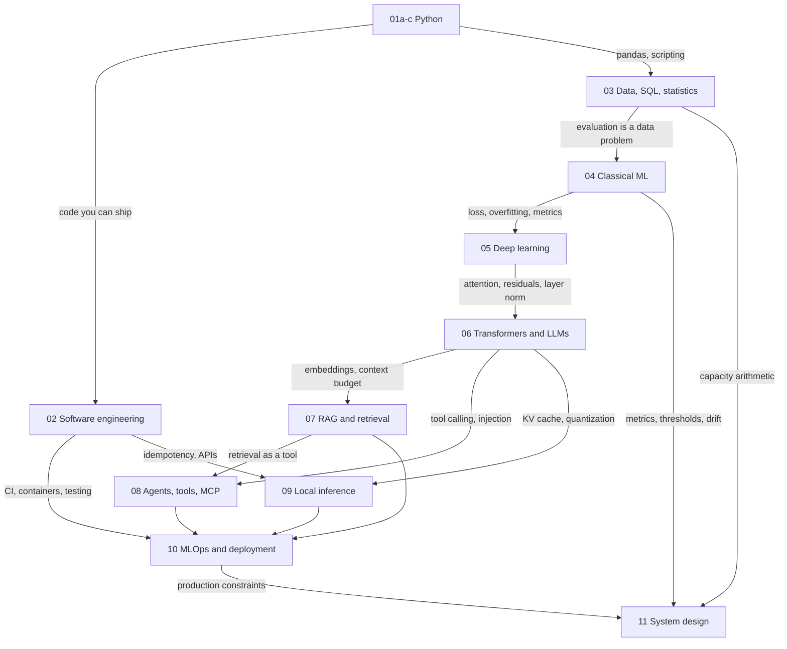
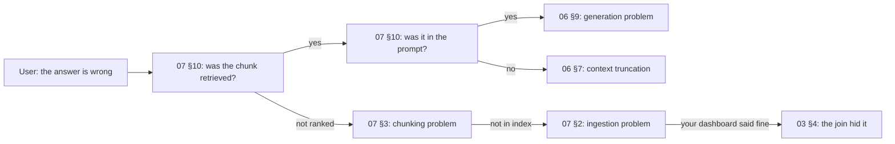

# 14 Concept Map

**Last reviewed:** 2026-09-18 · **Volatility:** low

The consolidation file. Not a glossary of 200 terms, for the reason given in the review of the original prompt library: a generated glossary is a weak learning artifact you will not read, and terms learned in context inside a module stick far better.

This file does one thing instead: **shows how the modules connect**, so that when you are asked a question spanning three of them you can see the path.

Use it in two places. At week 24, to consolidate. And in the 48 hours before an interview, as the one file to skim.

---

## 1. The whole repository in one diagram



---

## 2. The six ideas that appear everywhere

If you internalize nothing else, internalize these. Each recurs in four or more modules under different names, and recognizing the recurrence is what makes cross-cutting interview questions easy.

### Idea 1: Evaluate before you optimize

| Module | Form |
|---|---|
| `04` §2 | Split before touching the data; the test set is honest only while untouched |
| `07` §9 | Build the evaluation set before the retriever |
| `08` §10 | Trajectory cases before the agent |
| `10` §9 | The eval set becomes a CI gate |
| Projects 2, 3, capstone | Harness in week 1, baseline committed before any improvement |

**Why it recurs:** without a baseline, every change is a feeling. This is the single most transferable discipline in the repository.

### Idea 2: Information leaking into your evaluation

| Module | Form |
|---|---|
| `04` §2 | Preprocessing fit on all data: 0.845 AUC on pure noise |
| `07` §9 | Eval questions generated from the chunks they should retrieve |
| `03` §4-5 | A join that silently drops rows, so metrics cover a subset |
| `12b` X3 | The same mechanism, named |

**The universal diagnostic:** a result better than you expected is a bug report, not a success.

### Idea 3: Fail loudly, or you will not know

| Module | Form |
|---|---|
| `01a` §9 | A bad row is logged and skipped; a bad file raises |
| `03` §4 | `INNER JOIN` hides failed ingestion; the anti-join finds it |
| `07` §11 | Ingestion lag alerts, because a stalled pipeline does not error |
| `08` §4 | Stop reasons must be distinguishable, or a step limit reads as an answer |
| `10` §8 | Alert on lag, not on failure |

**Why it recurs:** silence is the most expensive failure mode. Every one of these is a case where nothing errors and the answer is wrong.

### Idea 4: Prefer immutable, prefer new objects

| Module | Form |
|---|---|
| `01a` §2 | Aliasing: assignment moves labels, it does not copy |
| `01b` §2 | `frozen=True` makes the bug structurally impossible |
| `01a` §5 | Build a new list rather than mutating during iteration |
| `10` §12 | Expand-and-contract migrations; immutable image tags |

**Why it recurs:** shared mutable state produces bugs that depend on order and disappear when you look at them.

### Idea 5: The boundary is where you validate

| Module | Form |
|---|---|
| `01b` §9.3 | Pydantic at trust boundaries, not internally |
| `06` §10 | Structured output validated after generation |
| `08` §3 | Tool arguments validated before execution; the registry is an allowlist |
| `10` §4 | Request validation with size limits before the model sees anything |
| `07` §8 | Citations validated against the retrieved set |

**Why it recurs:** a precise error at the boundary costs seconds; a `KeyError` three functions downstream costs an afternoon.

### Idea 6: Measure the thing, not a proxy for it

| Module | Form |
|---|---|
| `04` §9 | Accuracy at 1.42% positives is 98.58% for a model that does nothing |
| `06` §11 | Benchmarks do not predict your task |
| `07` §9 | Recall, MRR and nDCG diverge; report all three |
| `09` §12 | Never quote a throughput number you did not measure |
| `10` §7 | Never report mean latency |
| `13` §1 | "It works" is not a measurement |

---

## 3. Cross-module chains

Four chains that appear as interview questions. Being able to walk one is worth more than knowing all its parts separately.

### Chain A: from a wrong answer to its cause



**Modules touched:** 07, 06, 03, 02. This is `12b` X1 and X16.

### Chain B: from context length to your bill

```
06 §7: KV cache = 2 × layers × kv_heads × d_head × seq_len × batch × bytes
   ↓
09 §8: that is your memory budget; it competes with the weights
   ↓
06 §7: more cache means smaller batch, which means lower decode throughput
   ↓
10 §13: prompt tokens dominate RAG cost, so top-k is a multiplier
   ↓
11 §3: 80,000 queries/day × 2,800 prompt tokens = most of $29k/month
   ↓
11 §9: model routing, because the tier gap is ~12x
```

**Modules:** 06, 09, 10, 11. This is `12b` X6.

### Chain C: from a document to a hallucination

```
07 §2: PDF extracted in the wrong reading order
   ↓
07 §3: chunk has no heading, so it lacks its own topic vocabulary
   ↓
07 §5: unfindable by the obvious query
   ↓
07 §8: model has no supporting source
   ↓
06 §9: it generates a plausible answer anyway, because nothing checks
   ↓
07 §9: refusal rate did not rise, because there was no refusal instruction
   ↓
10 §8: no monitoring caught it, because quality metrics were not built
```

**Modules:** 07, 06, 10. Seven stages, one ingestion decision at the top.

### Chain D: from injection to incident

```
06 §12: instructions and data are the same token sequence
   ↓
07 §11: your corpus contains documents you did not write
   ↓
08 §11: add tools and the lethal trifecta completes
   ↓
08 §9: the agent retries a non-idempotent call
   ↓
02 §11: idempotency was the control you needed
   ↓
10 §10: least privilege and an egress allowlist are the architectural fix
```

**Modules:** 06, 07, 08, 02, 10.

---

## 4. Concepts by module, with the one-line version

Compressed for skimming. Each line is the thing to be able to say.

### Python (01a-c)

- **Names are labels, not boxes.** Assignment moves labels; mutation is visible through every label.
- **`is` only for None, True, False.** Identity elsewhere depends on interning and constant folding.
- **`x in set` is O(1), `x in list` is O(n).** The most valuable line in the complexity table.
- **Mutable defaults are evaluated once**, at `def` time, and shared forever.
- **Catch what you can handle; let the rest crash.** A silently wrong number is worse than downtime.
- **Generators are exhausted after one pass**, silently.
- **`functools.wraps` or your tracebacks lie.**
- **Type hints do not validate.** Pydantic does.

### Software engineering (02)

- **A commit is a snapshot, not a diff.** Branching is cheap because a branch is a pointer.
- **Never rebase what others have pulled.** Rebase creates new commits with new hashes.
- **`reflog` recovers almost anything committed.**
- **A lockfile is what makes "works on my machine" falsifiable.**
- **Idempotency decides what you may retry.**
- **The GIL blocks pure-Python threads, not C extensions.** Which is why an inference server can thread.

### Data and statistics (03)

- **`INNER JOIN` deletes evidence silently.**
- **`COUNT(*)` after a LEFT JOIN returns 1 for the rows you were looking for.**
- **`100.0 *`, not `100 *`.** Integer division reported 28.6% as 0.
- **A function on an indexed column defeats the index.**
- **Standard error scales as 1/√n.** Halving uncertainty needs 4x the data.
- **A p-value is not the probability the null is true.** Twenty tests of nothing find something 65% of the time.

### Classical ML (04)

- **Leakage produced 0.845 AUC on pure noise.**
- **98.58% accuracy from predicting the majority class.**
- **PR-AUC is the honest one on imbalanced data**, and its baseline is the positive rate.
- **The threshold comes from costs, not from 0.5.**
- **Calibration: a forest said 0.576 where the truth was 0.952.**
- **Everything inside the pipeline**, or cross-validation is a lie.

### Deep learning (05)

- **Without nonlinearity, 100 layers equal 1.**
- **`delta` is the reusable quantity**; the weight gradient is always `delta × input^T`.
- **12-layer sigmoid: layer 1 gets 7.5e-11 of layer 12's gradient.**
- **Residual connections gave the gradient a path that skips layers.** That is why depth works.
- **A training loss of zero carries no information.** Three runs reached it with validation at 0.82, 1.70 and 29,492.
- **Regularization makes training worse and validation better.** That is the trade.

### Transformers and LLMs (06)

- **Attention: score, scale by √d_k, mask, softmax, weighted sum of values.**
- **√d_k because dot-product variance grows with dimension** and saturated softmax has no gradient.
- **Subtract the max before exponentiating**, or overflow.
- **KV cache = 2 × layers × kv_heads × d_head × seq × batch × bytes.** At 8k and batch 8 it can be 10x the weights.
- **Prefill is compute-bound, decode is bandwidth-bound.** Different symptoms, different fixes.
- **Temperature 0 is not deterministic.** Floating-point reduction order varies with batching.
- **Quantization degrades format-following before factual recall.** Which is why benchmarks hide it.
- **Prompting cannot fix hallucination.** There is no verification step to install.
- **Injection is architectural.** Instructions and data are the same substance.

### RAG (07)

- **The search engine is the hard part.** Most RAG problems are retrieval problems.
- **Bigger chunks retrieve worse.** One vector averaging five topics is close to nothing.
- **Parent-child: embed small, return large.** Usually the highest-value structural change.
- **The orphan problem: "It increased by 12%" is unretrievable and useless.**
- **Embeddings fail at identifiers, negation, numbers, rare terms.** Which is what BM25 fixes.
- **RRF fuses ranks, not scores**, because the scales are incomparable.
- **Recall@k is the ceiling.** An unretrieved chunk cannot be used.
- **20% of your eval set must be unanswerable**, or refusal is unmeasurable.
- **Post-filtering permissions under-returns silently.**

### Agents (08)

- **Can you draw the flowchart? Then build the flowchart.**
- **The model never executes anything.** It emits a request; your code decides.
- **Descriptions matter more than the model.**
- **Four stopping conditions**, and every stop reason must be distinguishable.
- **Five agents at 90% reliability give 59%.**
- **Final-answer accuracy is insufficient.** Right answer, wrong route.
- **The lethal trifecta: private data, untrusted content, external communication.** Break one leg.

### Local inference (09)

- **Your budget is not your RAM.** Wired limit, minus weights, cache, buffers, headroom.
- **Q3_K_M 27B is 12.29 GB against a 12.0 GB limit.** That is why it did not fit.
- **Q2_K is larger than IQ3_XXS.** K-quant superblock overhead.
- **Quantization speeds up decode** because decode is bandwidth-bound.
- **Smaller at higher precision usually beats larger at Q2.**
- **vLLM and llama.cpp are different products**, not competitors.
- **Never quote a number you did not measure.**

### MLOps (10)

- **Legible and reversible.** Every practice serves one or both.
- **Version prompts, model aliases, and the index-to-embedding-model binding.** The three most missed.
- **`/health` is not `/ready`.**
- **Never report mean latency.**
- **Alert on error budget burn rate**, not individual failures.
- **An unbounded queue turns a partial outage into a total one.**
- **Define the rollback trigger before deploying, and practise it.**
- **Prompt tokens dominate RAG cost.** top-k is a multiplier.

### System design (11)

- **Clarify, estimate, design, deep dive, failure, evaluation.** Reach the last two.
- **Show the arithmetic.** It is the clearest signal available.
- **Peak, not average.** 3-5x.
- **76 GB versus 19 GB decides your index architecture.**
- **The concurrent-stream check QPS alone misses.**
- **Say what would change your design.**

---

## 5. The 48-hour skim

If you have one hour before an interview, read only this.

**The numbers you own** (fill from your own repository):

| | |
|---|---|
| Recall@5 before and after your biggest change | |
| Latency that change cost | |
| Eval set size and composition | |
| Tokens/sec measured on your hardware | |
| Model and quantization you ran, and why | |
| Cost per request or month | |
| Injection attempts, and how many succeeded | |

**The five answers to have ready cold:**

1. **Attention:** score, scale, mask, softmax, weighted sum. √d_k for gradient stability.
2. **KV cache:** the formula, and that it can exceed the weights at long context.
3. **Diagnosing a wrong RAG answer:** chain A, walked backward, and the logging it requires.
4. **Why prompting cannot fix hallucination:** no verification step exists; here is what does help.
5. **When something should not be an agent:** can you draw the flowchart?

**The three sentences that signal seniority:**

- "I built the evaluation set before the retriever, because otherwise every decision is a guess."
- "That result was better than I expected, so I looked for leakage before celebrating."
- "Here is what would change my mind about this design."

---

## Connections

Every module. This file is the index.

- `12a-interview-framework.md` section 9 has the question index; this has the concept index.
- `tracker/progress-log.md` section 3 lists the same concepts as trackable rows.
- The mastery checklists at the end of each module are the testable form of section 4 here.

---

## Volatile claims

Every number quoted in section 4 came from a module where it was computed or measured, and each carries its own volatility note there. The two that decay fastest:

| Claim | Source | Re-check |
|---|---|---|
| Quantization sizes and behavior | `09` | Your own `.gguf` files |
| Cost figures | `10`, `11` | Current provider pricing |

The six recurring ideas and the four chains are the durable content, and they will still be true when every tool named in this repository has been replaced.

**Next review due:** before your first interview, and then after your fifth.
