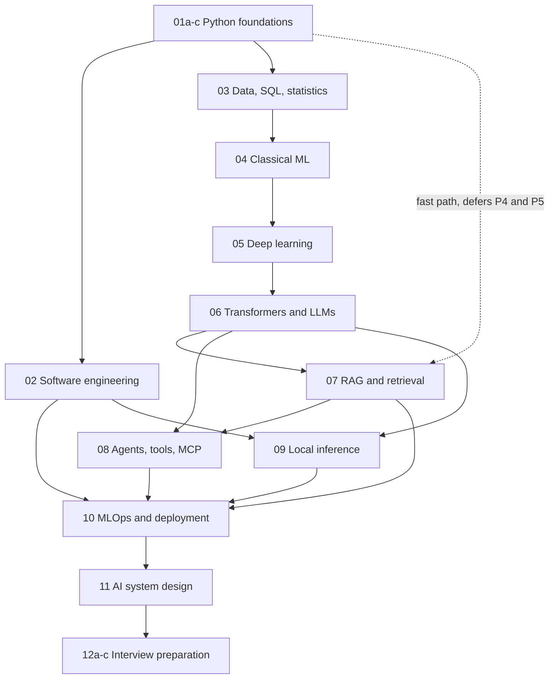

# AI Engineer Learning OS

A structured, project-based learning and interview-preparation system for AI engineering. Twelve technical modules, four projects, and the trackers and practice material that make them stick.

**Status:** generated and not yet studied. See [How to use this honestly](#how-to-use-this-honestly).

---

## Contents

1. [What this is](#what-this-is)
2. [Start here](#start-here)
3. [The map](#the-map)
4. [Every file](#every-file)
5. [How to study](#how-to-study)
6. [The projects](#the-projects)
7. [Tracking progress](#tracking-progress)
8. [Conventions used throughout](#conventions-used-throughout)
9. [Reading it as a website](#reading-it-as-a-website)
10. [Rendering the diagrams](#rendering-the-diagrams)
11. [How to use this honestly](#how-to-use-this-honestly)
12. [Maintenance](#maintenance)

---

## What this is

A curriculum that takes you from rusty Python to being able to build, evaluate and defend AI systems in an interview. It assumes no prior AI knowledge and it does not skip fundamentals.

**What makes it different from a reading list:**

**Every module ends in something you can do**, not something you have read. The mastery checklists are observable tasks.

**Every claim that can be checked was checked.** Code in these modules was executed; numbers were computed rather than recalled. Where a figure could not be verified it is marked `[UNVERIFIED]` with the method to measure it yourself, and where something will go stale it is marked `[VERIFY: what to check @ where]`.

**Evaluation comes before building**, everywhere. Projects 2, 3 and the capstone all build their measurement harness before the thing being measured. This is the single most transferable discipline here.

**The failures are documented.** Modules record what breaks and how you diagnose it, not only how things work.

---

## Start here

**If you are starting from the beginning:**

1. Read [`00-north-star-roadmap.md`](00-north-star-roadmap.md). It has the 24-week plan and two orderings.
2. Set up [`tracker/progress-log.md`](tracker/progress-log.md).
3. Begin [`01a-python-core.md`](01a-python-core.md).

**Do not read everything first.** The roadmap's generation order is also a study order, and a module you have not worked through is not an asset.

**If you are preparing for an interview in under two weeks:** [`12a-interview-framework.md`](12a-interview-framework.md) section 7, then [`14-concept-map.md`](14-concept-map.md) section 5. Nothing else.

---

## The map



The dotted edge is the LLM-first fast path. It reaches the material you probably care about sooner, at a cost the roadmap lists explicitly.

---

## Every file

### Modules

| File | Covers |
|---|---|
| [`00-north-star-roadmap.md`](00-north-star-roadmap.md) | The 24-week plan, two orderings, compression rules. **The only schedule.** |
| [`01a-python-core.md`](01a-python-core.md) | Execution model, objects, collections, control flow, functions, exceptions, files |
| [`01b-python-patterns-and-oop.md`](01b-python-patterns-and-oop.md) | OOP, generators, decorators, typing, pytest, and the applied patterns for LLM code |
| [`01c-python-interview-dsa.md`](01c-python-interview-dsa.md) | Interview data structures and algorithms |
| [`02-software-engineering-foundations.md`](02-software-engineering-foundations.md) | Git, CI, testing strategy, code review, debugging, HTTP, concurrency |
| [`03-data-and-sql.md`](03-data-and-sql.md) | SQL against a real schema, joins, aggregation traps, indexes, statistics, experimentation |
| [`04-machine-learning.md`](04-machine-learning.md) | Leakage, metrics, thresholds, calibration, pipelines, drift |
| [`05-deep-learning.md`](05-deep-learning.md) | Backprop by hand, optimizers, vanishing gradients, PyTorch, diagnosing training |
| [`06-transformers-and-llms.md`](06-transformers-and-llms.md) | Attention worked by hand, KV cache, sampling, quantization, hallucination, injection |
| [`07-rag-and-vector-search.md`](07-rag-and-vector-search.md) | Chunking, hybrid retrieval, reranking, evaluation, failure taxonomy, permissions |
| [`08-agents-tools-and-mcp.md`](08-agents-tools-and-mcp.md) | Workflow versus agent, tool schemas, stopping, MCP, trajectory evaluation, the trifecta |
| [`09-local-llm-inference.md`](09-local-llm-inference.md) | Memory budgets, GGUF quantization, runtimes, serving, benchmarking |
| [`10-mlops-and-deployment.md`](10-mlops-and-deployment.md) | Versioning, containers, observability, LLM-specific monitoring, rollback, cost |
| [`11-ai-system-design.md`](11-ai-system-design.md) | The answer framework, capacity arithmetic, four complete walkthroughs |
| [`12a-interview-framework.md`](12a-interview-framework.md) | Skills matrix, answer structure, mock schedules, the 48-hour checklist |
| [`12b-interview-question-bank.md`](12b-interview-question-bank.md) | 45 cross-cutting questions. Module questions stay in their modules. |
| [`12c-interview-behavioral-and-projects.md`](12c-interview-behavioral-and-projects.md) | STAR, the story bank, project deep dives, the transition narrative |
| [`13-project-portfolio.md`](13-project-portfolio.md) | What makes a project credible, and a rubric to score yours |
| [`14-concept-map.md`](14-concept-map.md) | How the modules connect. The consolidation and pre-interview skim file. |

### Projects

| File | Builds |
|---|---|
| [`projects/project-1-python-data-tool.md`](projects/project-1-python-data-tool.md) | Learning Log Analyzer. Clean engineering, no AI. Complete tested MVP source included. |
| [`projects/project-2-rag-app.md`](projects/project-2-rag-app.md) | A grounded QA system, evaluation harness first |
| [`projects/project-3-agent-evaluation.md`](projects/project-3-agent-evaluation.md) | A trajectory evaluation harness, with adversarial cases |
| [`capstone/`](capstone/) | CareerAtlas, in five documents: PRD, architecture, build plan, evaluation, narrative |

### Trackers and practice

| File | Purpose |
|---|---|
| [`tracker/progress-log.md`](tracker/progress-log.md) | Mastery status, spaced repetition, mock scores, STAR bank. **The only review schedule.** |
| [`tracker/weekly-plan.md`](tracker/weekly-plan.md) | The weekly working template, derived from the roadmap |
| [`quizzes/01a-python-core-practice.md`](quizzes/01a-python-core-practice.md) | Worked example: flashcards, MCQs, debugging scenarios, Anki export |
| [`quizzes/01b-python-patterns-practice.md`](quizzes/01b-python-patterns-practice.md) through [`quizzes/11-system-design-practice.md`](quizzes/11-system-design-practice.md) | Delayed retrieval, prediction, debugging, explanation, and implementation practice for every technical module |

### A note on the practice packs

Every technical module now has a practice pack. Work it **at least one day
after** the first reading: the questions are deliberately delayed so that you
practice retrieval rather than recognition. Each pack includes retrieval,
prediction, debugging, explanation, and an implementation task with a rubric.

`01a`'s pack remains the most extensive worked example, including flashcards,
multiple-choice questions, short answers, debugging scenarios, interview
questions, implementation exercises, a scoring guide, and an Anki export. Add
your own misses to the relevant pack as you study.

---

## How to study

### The loop

1. **Read the module's skip-ahead map.** Skim what you can already do.
2. **Work the core concepts**, running every example rather than reading it.
3. **Do the practice tasks.** The exercises, not just the reading.
4. **Build the mini-project.** This is the exit condition, not the reading.
5. **Score the practice pack** at least a day later.
6. **Update the tracker** with evidence, not with a feeling.
7. **Say the 60-second answers aloud**, recorded.

### What actually produces retention

**Predict before running.** Before executing any example, say what it will print. When you are wrong, you have learned something. When you skip the prediction, you have only learned what the output is.

**Say it aloud.** Explanation is a separate skill from understanding, and it is the one being tested. Start the 60-second answers from module 06 onward, not at week 24.

**Do the reviews.** The intervals in the tracker are the mechanism. A failed review resets to one day, not back one step, and that rule is what makes the schedule work.

**Build the projects.** A module read without its project is half-learned. The projects are also the only thing you can talk about in an interview.

### What to skip when time is short

In order: the `[NICE]` items, the practice packs, `01c` as a scheduled block since DSA works better as a parallel drip, and depth in `04` and `05` beyond what `06` depends on. The roadmap's compression rules have the full list.

**What never to skip:** the evaluation material in `07` section 9, the projects, and the review weeks.

---

## The projects

They ladder deliberately.

| Project | Demonstrates | Why it exists |
|---|---|---|
| **1** | Clean Python, tested and typed | Proves you can write software. The one people skip, and the fastest signal a reviewer reads. |
| **2** | Retrieval engineering and measurement | The evaluation-first inversion. Most candidates cannot say how they know their RAG works. |
| **3** | Adversarial thinking, evaluating without ground truth | Almost nobody evaluates agents. This is the gap. |
| **Capstone** | Integration, real use, honesty about unverifiable components | The one you actually use while studying. |

**The property that makes any of them credible** is a measured before-and-after, and a documented failure. `13-project-portfolio.md` has the rubric.

---

## Tracking progress

[`tracker/progress-log.md`](tracker/progress-log.md) is the single source of truth for what you know and when you revisit it.

**The status ladder** requires evidence to advance:

`Not Started → Learning → Practiced → Can Explain → Can Build → Interview Ready`

**"Can Explain" is a separate rung on purpose.** Explanation is a distinct skill, and it is the gap that loses interviews.

**Spaced repetition:** 1, 3, 7, 14, 30, 60 days, then quarterly. **A failed review resets to 1 day**, not back one step. That rule is the one people quietly ignore and the one that makes the system work.

A Markdown table cannot notify you, so the tracker includes an Anki CSV export spec. The Markdown file is the audit trail; Anki does the scheduling.

---

## Conventions used throughout

| Convention | Meaning |
|---|---|
| `[VERIFY: what @ where]` | Version-sensitive; check before relying on it |
| `[UNVERIFIED]` | A figure not measured here, with the method to measure it yourself |
| `[FOUNDATION] [CORE] [DEPTH]` | Section difficulty, used by the skip-ahead maps |
| **[MUST] [SHOULD] [NICE]** | Interview priority, from the roadmap |
| `## Volatile claims` | Every module ends with what will go stale and when |
| `## Mastery checklist` | Observable tasks, not topics. The exit condition. |
| `## Connections` | Explicit links backward and forward, by filename and section |

**Every technical module has the same reader loop**, so once you have read one
you know where to find things in all of them: a learner guide and diagnostic,
concept checkpoints that ask you to define/predict/vary/apply, a Build section,
an optional Interview section, a mastery checklist, connections, and volatile
claims.

---

## Reading it as a website

The repository ships a browsable HTML version in [`docs/`](docs/): one page per
document, sidebar navigation, client-side search across the whole curriculum,
rendered Mermaid diagrams, syntax highlighting, and a light/dark theme that
follows your system and can be toggled.

**Offline:**

```bash
python3 -m http.server 8000 --directory docs
# then open http://localhost:8000
```

A local server is needed because search fetches a JSON index, and most browsers
block `fetch` from `file://`. Everything else works if you just open
`docs/index.html` directly.

**On GitHub Pages:** Settings → Pages → source `main` / `/docs`. Nothing else to
configure; `.nojekyll` is already present.

**Rebuilding after you edit a module:**

```bash
pip install -r requirements-build.txt
python3 build_site.py
```

`build_site.py` is the generator. The navigation structure, page titles and
groupings are the `NAV` list at the top of it; add a module there and it appears
in the sidebar, the search index and the previous/next pager.

Mermaid is vendored (`docs/assets/mermaid.min.js`, 3.5 MB) rather than loaded
from a CDN, so the site works with no network.

## Rendering the diagrams

Mermaid diagrams render natively on GitHub, and in the HTML site above. All
diagrams here were validated against Mermaid 11 before inclusion.

Elsewhere:

- **VS Code:** the Markdown Preview Mermaid Support extension
- **Obsidian:** built in
- **Locally:** `npx @mermaid-js/mermaid-cli -i file.md -o out.pdf`
- **In a browser:** paste into [mermaid.live](https://mermaid.live)

Diagrams stay within the GitHub-safe subset: `flowchart TD`, quoted labels containing punctuation, no HTML beyond `<br/>`, under 20 nodes.

---

## How to use this honestly

**This is study material, not a project.**

**Accurate:** "I worked through a structured curriculum and kept my notes, evaluation sets and results in a repository."

**Not accurate:** listing "AI Engineer Learning OS" as a project on a CV, or presenting these modules as something you wrote.

**The projects are your evidence.** The curriculum is scaffolding. When an interviewer asks what you have built, the answer is projects 1 through 3 and the capstone, with their results tables and failure analyses.

**Nothing here is completed until you have done it.** A repository of modules is not learning. `13-project-portfolio.md` section 7 covers this in more detail, including how to talk about AI-assisted work honestly.

**Claim no number you have not measured.** Every metric in the project specifications is a bracket for you to fill from your own results files. A bracketed placeholder on a submitted CV is a disqualifying error.

---

## Maintenance

**This repository decays.** Every module ends with a `## Volatile claims` table naming what will go stale and what to check it against.

**Review cadence, fastest first:**

| Module | Next review |
|---|---|
| `09` local inference | Every 3 months, or when llama.cpp is upgraded |
| `08` agents and MCP | Every 3 months |
| `06`, `07`, `10`, `11` | Every 6 months, and before any interview |
| `12a-c` | After every five interviews, from your own notes |
| `01`-`05` | Annually. Language and statistics fundamentals barely move. |

**When you find something wrong, fix it here.** A curriculum you correct is one you are engaging with; one you read passively is one you are not.

**What to add as you go:**

- Your own failure notes into the relevant module's debugging section
- Interview questions you were actually asked, into `12b`
- Numbers you measured, into the modules that assert them
- Personal misses and failure notes into the relevant practice pack

**The one thing not to add: more modules.** The scope here already exceeds what most people finish. Depth in what exists beats breadth.

---

## Contributing, to your future self

Six months from now you will not remember why you made a decision. When you correct or extend a file:

- Say **why**, not just what. The diff shows what.
- Update the `## Volatile claims` table if you changed something version-sensitive.
- Update the `## Connections` section if you changed what a module depends on.
- Keep the module structure. Consistency is why you can find things.
- Add a date to anything time-sensitive.

---

## License

The curriculum structure and your own notes are yours. Verify any factual claim marked `[VERIFY]` before relying on it professionally.
