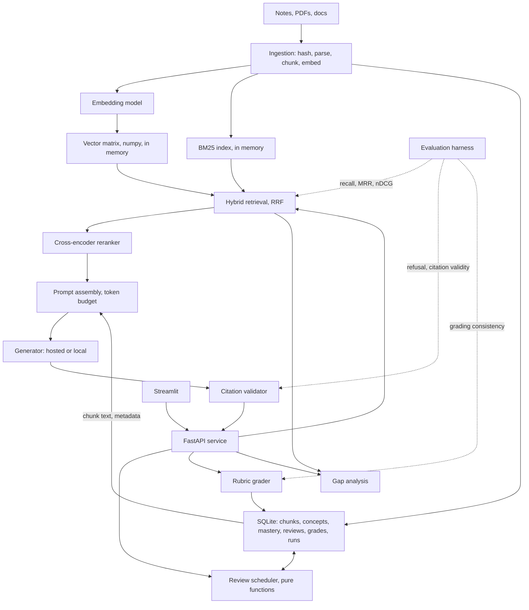

# CareerAtlas: Architecture

**Capstone 2 of 5** · Last reviewed: 2026-09-18

Design decisions with the alternative rejected and why, per `11` section 1. This is the document `11`'s mini-project asks for.

---

## Constraints that drive the design

| Constraint | Consequence |
|---|---|
| Single user, local-first | No horizontal scaling; SQLite is sufficient; the memory budget is real |
| Corpus is your own notes, a few thousand chunks | Exhaustive vector search is viable; no vector database needed |
| Every answer cites or refuses | Citation validation is a required component, not a feature |
| Mastery must be evidence-backed | The learner model is relational, not inferred |
| You will use it while studying | It must be usable in week 3 |

**The most consequential: the corpus is small.** A few thousand chunks means a numpy matrix multiply per query is a few milliseconds. This removes an entire category of infrastructure, and saying so is the first architectural decision.

---

## System diagram



---

## Technology decisions

Each with the alternative rejected, per `11` section 1.

### Vector search: numpy matrix, not a vector database

**Chosen:** vectors in a numpy array, loaded at startup, cosine via one matrix multiply.

**Rejected:** Chroma, Qdrant, FAISS, pgvector.

**Why.** At 5,000 chunks and 1,024 dimensions the matrix is 20 MB at float32, and an exhaustive scan is a few milliseconds. A vector database buys approximate search you do not need, filtering you can do in SQLite, and an operational dependency for a local tool.

**What would change it.** Above roughly 100,000 chunks (`07` section 5), or if you needed persistence across processes without a reload, or concurrent writers. Say this: a decision without a reversal condition is a preference.

**The cost accepted:** startup loads the whole matrix, so a 500,000-chunk corpus would be slow to start. Not a concern at this scale, and it is the thing that breaks first if the corpus grows.

### Storage: SQLite, not Postgres

**Chosen:** SQLite, one file.

**Rejected:** Postgres, or JSON files.

**Why.** Single user, single writer, no network. SQLite gives real transactions, foreign keys and the `03` section 6 window functions the scheduler needs, with zero operational burden. JSON files would mean reimplementing joins and losing atomicity, which is the mistake that makes spaced-repetition state corrupt on a crash.

**What would change it.** Multi-user, which is the stretch goal, or if you wanted pgvector to collapse the vector and relational stores into one.

### Retrieval: hybrid with reranking

**Chosen:** dense plus BM25, fused with RRF, then a cross-encoder reranker.

**Rejected:** dense only.

**Why.** `07` section 4: embeddings are bad at exact identifiers and rare terms, and study notes are full of both, such as `IQ2_XXS`, `ef_search`, `BCEWithLogitsLoss`. Dense-only retrieval on technical notes fails on exactly the terms you most want to look up.

**The cost accepted:** the reranker adds latency and a second model in memory. Budget it explicitly (below), and make it toggleable so you can measure its contribution rather than assuming it.

### Generation: pluggable, hosted by default

**Chosen:** an interface with hosted and local implementations, hosted as the default.

**Rejected:** committing to either.

**Why.** Hosted gets the MVP working in week 3. Local is the stretch goal that makes the privacy property real. A `Protocol` seam (`01b` section 2) costs nothing and means swapping is a config change rather than a refactor.

**What this forces:** the prompt must work with both, so no provider-specific features in the MVP path.

### The learner model: relational, not inferred

**Chosen:** mastery, review schedule and grades in SQLite tables, with the scheduler as pure functions.

**Rejected:** asking the model what you should review.

**Why.** This is the most important decision in the system. Scheduling is deterministic arithmetic over dates and outcomes. Putting it in a model makes it non-deterministic, unauditable, expensive and impossible to unit-test. Putting it in a database makes it correct, free, explainable to the user, and covered by tests.

**The principle, worth stating in your README:** *use the model only for what only it can do.* It generates explanations and grades free text. It does not decide what is due.

---

## Data schema

```sql
-- Corpus
CREATE TABLE documents (
    doc_id        INTEGER PRIMARY KEY,
    path          TEXT NOT NULL UNIQUE,
    kind          TEXT NOT NULL CHECK (kind IN ('notes','job_description','project','interview')),
    content_hash  TEXT NOT NULL,
    parsed_at     TEXT NOT NULL,
    parser_version TEXT NOT NULL,
    warnings      TEXT                      -- JSON array; lossy extraction recorded
);

CREATE TABLE chunks (
    chunk_id      INTEGER PRIMARY KEY,
    doc_id        INTEGER NOT NULL REFERENCES documents(doc_id) ON DELETE CASCADE,
    position      INTEGER NOT NULL,
    heading_path  TEXT NOT NULL,            -- JSON array
    text          TEXT NOT NULL,            -- shown to the user and the model
    embed_text    TEXT NOT NULL,            -- may carry a context prefix
    token_count   INTEGER NOT NULL,
    embed_model   TEXT NOT NULL,            -- 07 section 4: vectors are model-specific
    UNIQUE (doc_id, position)
);

-- Learner model
CREATE TABLE concepts (
    concept_id    INTEGER PRIMARY KEY,
    name          TEXT NOT NULL UNIQUE,
    module        TEXT,                     -- e.g. '07'
    priority      TEXT CHECK (priority IN ('must','should','nice'))
);

CREATE TABLE mastery (
    concept_id    INTEGER PRIMARY KEY REFERENCES concepts(concept_id),
    status        TEXT NOT NULL CHECK (status IN
                    ('not_started','learning','practiced','can_explain','can_build','interview_ready')),
    updated_at    TEXT NOT NULL,
    evidence_kind TEXT,                     -- 'graded_answer' | 'exercise' | 'link'
    evidence_ref  TEXT                      -- U7: you can always see why
);

CREATE TABLE reviews (
    review_id     INTEGER PRIMARY KEY,
    concept_id    INTEGER NOT NULL REFERENCES concepts(concept_id),
    scheduled_for TEXT NOT NULL,
    completed_at  TEXT,
    outcome       TEXT CHECK (outcome IN ('pass','fail')),
    interval_days INTEGER NOT NULL
);

CREATE TABLE grades (
    grade_id      INTEGER PRIMARY KEY,
    concept_id    INTEGER NOT NULL REFERENCES concepts(concept_id),
    question      TEXT NOT NULL,
    answer        TEXT NOT NULL,
    rubric_version TEXT NOT NULL,
    score         INTEGER NOT NULL CHECK (score BETWEEN 1 AND 5),
    rationale     TEXT NOT NULL,
    user_disagreed INTEGER NOT NULL DEFAULT 0,   -- U10: the honesty mechanism
    graded_at     TEXT NOT NULL,
    model_version TEXT NOT NULL
);

-- Operations
CREATE TABLE interactions (
    interaction_id INTEGER PRIMARY KEY,
    trace_id      TEXT NOT NULL,
    kind          TEXT NOT NULL,
    question      TEXT,
    refused       INTEGER NOT NULL DEFAULT 0,
    prompt_tokens INTEGER,
    completion_tokens INTEGER,
    cost_usd      REAL,
    latency_ms    REAL,
    ttft_ms       REAL,
    model_version TEXT NOT NULL,
    created_at    TEXT NOT NULL
);

CREATE TABLE retrievals (
    interaction_id INTEGER NOT NULL REFERENCES interactions(interaction_id),
    chunk_id      INTEGER NOT NULL REFERENCES chunks(chunk_id),
    rank          INTEGER NOT NULL,
    score         REAL NOT NULL,
    used_in_prompt INTEGER NOT NULL
);

CREATE INDEX idx_chunks_doc ON chunks(doc_id);
CREATE INDEX idx_reviews_due ON reviews(scheduled_for) WHERE completed_at IS NULL;
CREATE INDEX idx_retrievals_interaction ON retrievals(interaction_id);
```

**Five schema decisions worth defending:**

**`embed_model` on every chunk.** `07` section 4's operational rule. Changing the embedding model invalidates every vector, and this column turns a silent quality collapse into a detectable mismatch.

**`text` and `embed_text` separate.** With contextual retrieval you embed an augmented version and show the original. Conflating them puts generated text into your citations, which is a subtle correctness bug.

**`evidence_kind` and `evidence_ref` on mastery.** U7 requires that you can see why a concept has its status. Without these columns, mastery is an unexplained number and the tool is doing exactly what it is supposed to prevent.

**`user_disagreed` on grades.** U10. This one column is how you find out your grader is unreliable, and it is the difference between a learning tool and a slot machine.

**`used_in_prompt` on retrievals.** `07` section 10's decision tree needs to distinguish "retrieved but truncated out" from "not retrieved at all". Without this column you cannot walk the tree.

---

## API specification

```
GET  /health                      liveness
GET  /ready                       the index is loaded and the model matches

POST /v1/ask                      grounded question
GET  /v1/chunks/{chunk_id}        resolve a citation

POST /v1/ingest                   index a path; returns per-file results
GET  /v1/ingest/status            last run, lag, failures

GET  /v1/reviews/due              what is due today
POST /v1/reviews/{id}/complete    record pass or fail; reschedules

POST /v1/practice/question        generate a question for a concept
POST /v1/practice/grade           grade an answer against the rubric
POST /v1/grades/{id}/disagree     record disagreement

GET  /v1/mastery                  all concepts with status and evidence
POST /v1/gaps                     compare a job description against the corpus
```

**Request and response for the core endpoint:**

```python
class AskRequest(BaseModel):
    question: str = Field(min_length=1, max_length=2000)
    top_k: int = Field(default=5, ge=1, le=20)
    concept_id: int | None = None          # scopes retrieval when practising


class Citation(BaseModel):
    marker: str                            # "S1"
    chunk_id: int
    doc_path: str
    heading_path: list[str]
    score: float
    excerpt: str


class AskResponse(BaseModel):
    answer: str | None
    refused: bool
    refusal_reason: str | None             # "no sources above threshold"
    citations: list[Citation]
    trace_id: str
    model_version: str
    prompt_tokens: int
    completion_tokens: int
    cost_usd: float
```

**Why the response is shaped this way.** `refused` and `refusal_reason` separately, because "I could not find it" and "I found it and could not answer" are different. Citations carry the score and the heading path, so you can judge retrieval quality yourself. `trace_id` and `model_version` because `10` section 4: a bad-answer report becomes a lookup instead of an investigation. Token counts and cost in the response because you are the operator as well as the user.

---

## Memory budget

If you run the local option (`09` Part 1). On a 32 GB machine with the default 75% wired limit:

```
usable                                ≈ 24.0 GB
embedding model                       ≈  1.0 GB
cross-encoder reranker                ≈  0.5 GB
vector matrix, 5k chunks, 1024-dim f32 ≈  0.02 GB
BM25 index                            ≈  0.05 GB
KV cache, 8k context, 1 stream, GQA   ≈  2.0 GB
compute buffers                       ≈  1.5 GB
headroom at 20%                       ≈  4.8 GB
                                        --------
available for the generator           ≈ 14.1 GB
```

**A 14B at Q5_K_M is 9.24 GB and fits comfortably. A 27B at Q3_K_M is 12.29 GB and fits with 1.8 GB spare.** Per `09` section 7, the 14B at higher precision is the better choice, because sub-Q4 damage lands on instruction following and long-context coherence, which is exactly what citation-constrained generation depends on.

**Note the vector matrix is 20 MB**, which is 0.1% of the budget. That is the arithmetic justifying the numpy decision, and it is the kind of sentence that makes an architecture decision credible.

---

## Failure modes

| Failure | Symptom | Design response |
|---|---|---|
| Notes too sparse | High refusal rate | Refusal log becomes a study list; report corpus coverage |
| PDF parses badly | Garbage chunks retrieved | `warnings` column; extraction validation at ingest |
| Embedding model changed | Quality collapse, no error | `embed_model` per chunk, asserted at startup |
| Grader inconsistent | Feedback is noise | Consistency measured; `user_disagreed` recorded |
| Mastery overstated | False confidence | Evidence required; failed reviews reset to 1 day |
| Review queue overwhelming | Avoidance, then abandonment | Cap and prioritize the daily list |
| Citations misaligned | Cites the wrong source | Validator checks every id against the retrieved set |
| Context exhausted | System prompt truncated | Token budget with explicit priority |
| Cost creeps | Surprise bill | Cost per interaction recorded; a local option exists |

**The one to design against hardest is mastery overstatement**, because it is the failure where the tool is actively harmful rather than merely unhelpful. Evidence-required advancement and the reset rule are the mechanisms.

---

## What would change this design

Stated so the document is honest about its own fragility, per `11` section 10's answer.

- **Corpus above ~100k chunks:** the numpy matrix becomes a real index, and startup time becomes a problem first.
- **Multi-user:** SQLite becomes Postgres, and permission-aware retrieval (`07` section 6) becomes necessary rather than optional.
- **Grading consistency measured below ~70%:** the grader is not trustworthy and the practice feature should be cut rather than shipped, because unreliable feedback is worse than none.
- **Evaluation shows retrieval recall is already high:** effort moves from the retriever to prompt assembly and generation, which is where the remaining error would be.

**Next:** `capstone/02-build-plan.md`.

---

## Volatile claims

| Claim | Why it decays | Re-check against |
|---|---|---|
| The ~100k chunk threshold for exhaustive search | Hardware dependent | Benchmark on your machine |
| Model sizes in the memory budget | Model-specific | Your own `.gguf` file sizes |
| "numpy is enough" | True at this scale only | Your actual chunk count |

The schema decisions and the failure-mode reasoning are stable.

**Next review due:** week 3 of the build.
