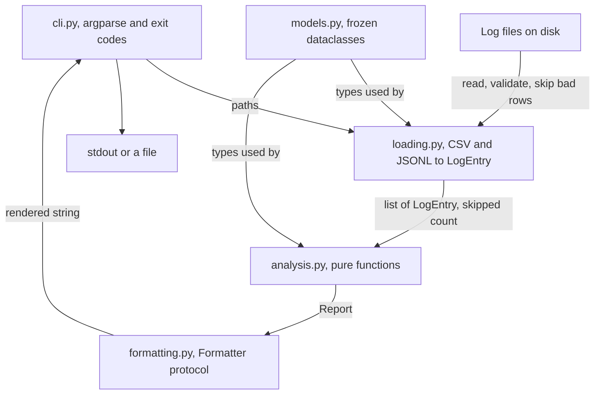

# Project 1: Learning Log Analyzer

**Last reviewed:** 2026-09-18 · **Volatility:** low

Your first portfolio project. Beginner-buildable, but structured the way production code is structured, so it survives being looked at by an engineer.

**Every line of code in this document was written, installed, tested and linted before being included.** The MVP passes 42 tests, `ruff check`, `ruff format --check` and `mypy` with no errors, at 95% statement coverage. Where a step broke during that process, this document says so, because the breakages are the useful part.

---

## Why this project

Most first projects are a tutorial with the names changed. A reviewer spots that in fifteen seconds, and it is worse than no project because it demonstrates you cannot tell the difference.

This one is different in three ways that matter:

**It has a real user with a real need: you.** You are about to spend six months studying. You will keep a log. You will want to know what you have neglected and what is due for review. That is a genuine requirement, not a contrived one, and it means you will actually use the thing, which means you will find the bugs a demo never surfaces.

**It ends in decisions you can defend.** How do you group topics? What makes an area "weak"? What happens to a malformed row? Each has more than one defensible answer, and having chosen deliberately is what makes an interview conversation possible.

**It feeds the rest of the curriculum.** The output is the input to `tracker/progress-log.md`, and the stretch goal is embeddings-based note search, which becomes your on-ramp to module 07.

**What it demonstrates to a reviewer:** clean module boundaries, a pure core with I/O at the edges, defensive parsing of untrusted input, dependency injection for testability, a real test suite including edge cases, and CLI ergonomics. That is most of what a junior engineering screen is looking for.

---

## Prerequisites

| You need | From |
|---|---|
| Dataclasses, generators, Protocols, type hints | `01b` sections 2, 3, 6 |
| pytest, fixtures, parametrization | `01b` section 7 |
| Logging and packaging | `01b` section 8 |
| Defensive loading of CSV and JSONL | `01a` section 9, example 3 |
| Git workflow, pyproject, CI | `02` sections 1, 4, 7 |

Do not start this before finishing `01b`. It uses everything in it.

---

## Requirements

### What it does

Reads study log files and produces a report covering:

1. **Time summaries**, total and per topic
2. **Topic coverage**, session counts and date ranges
3. **Weak-area flags**, by low self-rated confidence or by low time invested
4. **Spaced-repetition reminders**, which topics are due for review and how overdue
5. **Output as a terminal table or as JSON**
6. **Multiple input files**, merged into one report

### Input format

CSV or JSONL. Required columns `date`, `topic`, `minutes`. Optional `confidence` (1 to 5) and `notes`.

```csv
date,topic,minutes,confidence,notes
2026-09-01,python basics,45,4,generators clicked
2026-09-03,rag,90,2,chunking still fuzzy
```

### Non-functional requirements

These are the ones that make it a portfolio project rather than a script:

- **Never crash on bad input.** Malformed rows are skipped with a warning naming the line number and the problem. A file that produces zero usable rows is an error, not an empty success.
- **No third-party runtime dependencies.** Standard library only. Streamlit is an optional extra.
- **Deterministic and testable.** No function reads the clock without allowing the caller to override it.
- **Exit codes mean something.** 0 clean, 1 loaded with skipped rows, 2 could not load.

### Explicitly out of scope for the MVP

Write this section in your own README too. Naming what you chose not to build is a signal of judgment, and "why didn't you do X" is a common interview question with a good answer available.

- No database. Files in, report out.
- No web UI in the MVP. Streamlit is a stretch goal.
- No editing of logs. Read-only.
- No authentication. Single-user local tool.

---

## Architecture



**The governing design decision: the core is pure and the I/O is at the edges.**

`analysis.py` touches no files, no network and no clock. Every function takes data and returns data. This is why its tests run in microseconds and need no fixtures beyond a list of objects, and it is why you can be confident the interval arithmetic is right.

`loading.py` and `formatting.py` are the boundary. `cli.py` is the only module that configures logging or writes to stdout.

Worth being able to say in an interview: *"I pushed all the I/O to the edges so the logic could be tested without fixtures. The date injection in `due_for_review` is the same idea. A function that reads `date.today()` internally cannot be tested without either freezing time or writing a test that breaks tomorrow."*

### Folder structure

```
learning-log-analyzer/
├── pyproject.toml
├── README.md
├── .gitignore
├── .github/workflows/ci.yml
├── src/
│   └── analyzer/
│       ├── __init__.py
│       ├── models.py        # data structures, no logic
│       ├── loading.py       # I/O in
│       ├── analysis.py      # pure core
│       ├── formatting.py    # I/O out
│       └── cli.py           # entry point
└── tests/
    ├── __init__.py
    ├── conftest.py
    ├── test_models.py
    ├── test_loading.py
    ├── test_analysis.py
    ├── test_formatting.py
    └── test_cli.py
```

Tests mirror source one-to-one. When `test_analysis.py` fails you know where to look without reading the traceback.

---

## Milestones

Each ends in something runnable. Do not proceed to the next until the current one works.

| # | Milestone | Done when |
|---|---|---|
| 1 | Project skeleton | `pip install -e ".[dev]"` succeeds and `pytest` collects zero tests without error |
| 2 | Models with validation | `LogEntry` rejects negative minutes, blank topics, out-of-range confidence. Tests pass. |
| 3 | CSV loading | A clean file loads; a file with two bad rows loads the rest and warns twice |
| 4 | Analysis | Topic summaries correct on a hand-checked fixture |
| 5 | Table output | Report renders readably in a terminal |
| 6 | CLI | `analyze sample.csv` works end to end |
| 7 | JSONL and JSON output | Both formats round-trip; CSV and JSONL produce identical objects |
| 8 | Spaced repetition | Review intervals correct, `today` injectable |
| 9 | Polish | ruff, mypy and CI all green |

Milestone 3 is the one to spend time on. Defensive loading is the part reviewers notice.

---

## Complete MVP source

### `pyproject.toml`

```toml
[project]
name = "learning-log-analyzer"
version = "0.1.0"
description = "Summarize study logs and flag topics due for spaced-repetition review."
requires-python = ">=3.11"
dependencies = []

[project.optional-dependencies]
dev = ["pytest>=8.0", "pytest-cov>=5.0", "mypy>=1.10", "ruff>=0.5"]
dashboard = ["streamlit>=1.35"]

[project.scripts]
analyze = "analyzer.cli:main"

[build-system]
requires = ["hatchling"]
build-backend = "hatchling.build"

# Required: the project name (learning-log-analyzer) does not match the package
# directory (analyzer), so hatchling cannot infer what to ship.
[tool.hatch.build.targets.wheel]
packages = ["src/analyzer"]

[tool.ruff]
line-length = 100
target-version = "py311"

[tool.ruff.lint]
select = ["E", "F", "I", "B", "UP"]

[tool.mypy]
python_version = "3.11"
warn_return_any = true
warn_unused_ignores = true

[tool.pytest.ini_options]
testpaths = ["tests"]
addopts = "-v"
```

> **This broke during writing.** Without the `[tool.hatch.build.targets.wheel]` block, `pip install -e .` fails with *"Unable to determine which files to ship inside the wheel"*, because hatchling looks for a directory matching the normalized project name (`learning_log_analyzer`) and finds `analyzer` instead. You will hit this any time the distribution name differs from the import name, which is common. Either add the block or name them the same.

### `src/analyzer/models.py`

```python
"""Core data structures. Frozen because nothing downstream should mutate a record."""

from __future__ import annotations

from dataclasses import dataclass, field
from datetime import date


@dataclass(frozen=True)
class LogEntry:
    """One study session."""

    date: date
    topic: str
    minutes: int
    confidence: int | None = None  # 1-5 self-rating, optional
    notes: str = ""

    def __post_init__(self) -> None:
        if self.minutes <= 0:
            raise ValueError(f"minutes must be positive, got {self.minutes}")
        if self.confidence is not None and not 1 <= self.confidence <= 5:
            raise ValueError(f"confidence must be 1-5, got {self.confidence}")
        if not self.topic.strip():
            raise ValueError("topic must not be empty")


@dataclass(frozen=True)
class TopicSummary:
    topic: str
    total_minutes: int
    session_count: int
    first_seen: date
    last_seen: date
    mean_confidence: float | None

    @property
    def days_since_last_seen(self) -> int:
        return (date.today() - self.last_seen).days


@dataclass(frozen=True)
class ReviewItem:
    topic: str
    last_seen: date
    days_overdue: int
    interval_days: int


@dataclass(frozen=True)
class Report:
    total_minutes: int
    session_count: int
    topics: list[TopicSummary] = field(default_factory=list)
    weak_areas: list[TopicSummary] = field(default_factory=list)
    due_for_review: list[ReviewItem] = field(default_factory=list)
    skipped_rows: int = 0
```

Three decisions to be able to defend:

**`frozen=True` everywhere.** These records pass through four modules. Freezing them makes the aliasing bugs from `01a` structurally impossible: no function can mutate a record another function is holding.

**Validation in `__post_init__`, not at the call site.** An invalid `LogEntry` cannot exist. Every function downstream can assume minutes are positive without checking, and the check lives in exactly one place.

**`field(default_factory=list)`.** The mutable default trap from `01a` section 7. Writing `topics: list = []` here raises at class definition time.

### `src/analyzer/loading.py`

```python
"""Read study logs from CSV or JSONL. Skip bad rows loudly; never truncate silently."""

from __future__ import annotations

import csv
import json
import logging
from collections.abc import Iterator
from datetime import date, datetime
from pathlib import Path

from analyzer.models import LogEntry

logger = logging.getLogger(__name__)

REQUIRED_COLUMNS = {"date", "topic", "minutes"}


class LoadError(Exception):
    """The file cannot be used at all, as opposed to one bad row."""


def _parse_date(raw: str) -> date:
    for fmt in ("%Y-%m-%d", "%d/%m/%Y", "%m/%d/%Y"):
        try:
            return datetime.strptime(raw.strip(), fmt).date()
        except ValueError:
            continue
    raise ValueError(f"unrecognized date format: {raw!r}")


def _parse_optional_int(raw: str | None) -> int | None:
    if raw is None or not str(raw).strip():
        return None
    return int(raw)


def _row_to_entry(row: dict) -> LogEntry:
    return LogEntry(
        date=_parse_date(row["date"]),
        topic=row["topic"].strip(),
        minutes=int(str(row["minutes"]).strip()),
        confidence=_parse_optional_int(row.get("confidence")),
        notes=(row.get("notes") or "").strip(),
    )


def load_csv(path: Path) -> tuple[list[LogEntry], int]:
    entries: list[LogEntry] = []
    skipped = 0
    with open(path, newline="", encoding="utf-8") as f:
        reader = csv.DictReader(f)
        if reader.fieldnames is None:
            raise LoadError(f"{path} is empty")
        missing = REQUIRED_COLUMNS - set(reader.fieldnames)
        if missing:
            raise LoadError(f"{path} missing required columns: {sorted(missing)}")

        for line_no, row in enumerate(reader, start=2):
            try:
                entries.append(_row_to_entry(row))
            except (ValueError, TypeError, KeyError) as e:
                skipped += 1
                logger.warning("%s line %d: %s", path.name, line_no, e)
    return entries, skipped


def load_jsonl(path: Path) -> tuple[list[LogEntry], int]:
    entries: list[LogEntry] = []
    skipped = 0
    with open(path, encoding="utf-8") as f:
        for line_no, line in enumerate(f, start=1):
            line = line.strip()
            if not line:
                continue
            try:
                row = json.loads(line)
                if not isinstance(row, dict):
                    raise ValueError(f"expected an object, got {type(row).__name__}")
                entries.append(_row_to_entry(row))
            except (json.JSONDecodeError, ValueError, TypeError, KeyError) as e:
                skipped += 1
                logger.warning("%s line %d: %s", path.name, line_no, e)
    return entries, skipped


LOADERS = {".csv": load_csv, ".jsonl": load_jsonl}


def load(path: Path) -> tuple[list[LogEntry], int]:
    """Dispatch on suffix. Raises LoadError if the file is unusable."""
    if not path.exists():
        raise LoadError(f"file not found: {path}")

    loader = LOADERS.get(path.suffix.lower())
    if loader is None:
        raise LoadError(f"unsupported format {path.suffix!r}; expected one of {sorted(LOADERS)}")

    entries, skipped = loader(path)

    if not entries:
        raise LoadError(f"{path}: no usable rows ({skipped} skipped)")
    if skipped:
        logger.warning("%s: loaded %d entries, skipped %d", path.name, len(entries), skipped)
    else:
        logger.info("%s: loaded %d entries", path.name, len(entries))
    return entries, skipped


def load_many(paths: Iterator[Path]) -> tuple[list[LogEntry], int]:
    """Load several files, tolerating individual file failures."""
    all_entries: list[LogEntry] = []
    total_skipped = 0
    for path in paths:
        try:
            entries, skipped = load(path)
        except LoadError:
            logger.exception("skipping %s", path)
            continue
        all_entries.extend(entries)
        total_skipped += skipped
    return all_entries, total_skipped
```

**The distinction this module is built around:** a bad row is not a bad file. One malformed line among a thousand should be logged and skipped. A file with no valid rows at all, or missing a required column, is an error, because silently returning an empty list produces a report of zero minutes and no indication anything went wrong. That distinction is the whole design, and it is the first thing to say when someone asks you about this project.

Note `start=2` in the CSV loop: row 1 is the header, so line numbers match what a text editor shows. Small detail, and it is the difference between a warning you can act on and one you have to count lines for.

### `src/analyzer/analysis.py`

```python
"""Pure analysis. No I/O, so every function here is trivially testable."""

from __future__ import annotations

import statistics
from collections import defaultdict
from datetime import date

from analyzer.models import LogEntry, Report, ReviewItem, TopicSummary

# Spaced-repetition ladder from tracker/progress-log.md.
REVIEW_INTERVALS = (1, 3, 7, 14, 30, 60)

WEAK_CONFIDENCE_THRESHOLD = 3.0
WEAK_MINUTES_THRESHOLD = 60


def summarize_topics(entries: list[LogEntry]) -> list[TopicSummary]:
    """One summary per topic, sorted by total time descending."""
    by_topic: dict[str, list[LogEntry]] = defaultdict(list)
    for entry in entries:
        by_topic[entry.topic.lower()].append(entry)

    summaries = []
    for topic, group in by_topic.items():
        confidences = [e.confidence for e in group if e.confidence is not None]
        summaries.append(
            TopicSummary(
                topic=topic,
                total_minutes=sum(e.minutes for e in group),
                session_count=len(group),
                first_seen=min(e.date for e in group),
                last_seen=max(e.date for e in group),
                mean_confidence=statistics.fmean(confidences) if confidences else None,
            )
        )
    return sorted(summaries, key=lambda s: s.total_minutes, reverse=True)


def find_weak_areas(summaries: list[TopicSummary]) -> list[TopicSummary]:
    """A topic is weak if confidence is low, or if it has had very little time."""
    weak = [
        s
        for s in summaries
        if (s.mean_confidence is not None and s.mean_confidence < WEAK_CONFIDENCE_THRESHOLD)
        or s.total_minutes < WEAK_MINUTES_THRESHOLD
    ]
    return sorted(weak, key=lambda s: (s.mean_confidence or 0, s.total_minutes))


def next_interval(session_count: int) -> int:
    """Interval for a topic studied session_count times. Caps at the last rung."""
    index = min(session_count - 1, len(REVIEW_INTERVALS) - 1)
    return REVIEW_INTERVALS[max(index, 0)]


def due_for_review(summaries: list[TopicSummary], today: date | None = None) -> list[ReviewItem]:
    """Topics whose interval has elapsed. today is injectable so tests are not time-dependent."""
    today = today or date.today()
    due = []
    for s in summaries:
        interval = next_interval(s.session_count)
        elapsed = (today - s.last_seen).days
        if elapsed >= interval:
            due.append(
                ReviewItem(
                    topic=s.topic,
                    last_seen=s.last_seen,
                    days_overdue=elapsed - interval,
                    interval_days=interval,
                )
            )
    return sorted(due, key=lambda r: r.days_overdue, reverse=True)


def build_report(entries: list[LogEntry], skipped: int = 0, today: date | None = None) -> Report:
    summaries = summarize_topics(entries)
    return Report(
        total_minutes=sum(e.minutes for e in entries),
        session_count=len(entries),
        topics=summaries,
        weak_areas=find_weak_areas(summaries),
        due_for_review=due_for_review(summaries, today=today),
        skipped_rows=skipped,
    )
```

**`today: date | None = None` is the most important line in this file.** A function that calls `date.today()` internally cannot be tested without freezing the clock, and any test written against it either breaks tomorrow or requires a mocking library. Passing the date in makes every review test deterministic and costs one parameter. The pattern generalizes: inject anything that varies outside your control.

**`mean_confidence` is `float | None`, not `0.0`.** "Never rated" and "rated zero" are different facts, and collapsing them means a topic you have not assessed looks like a topic you assessed badly. The `None` propagates into the formatter as `-` rather than a misleading number.

**The thresholds are named constants**, not literals buried in a comprehension. The next question anyone asks is "why 60 minutes?", and a named constant is where the answer goes.

### `src/analyzer/formatting.py`

```python
"""Output formatters. A Protocol seam so adding a format touches nothing else."""

from __future__ import annotations

import json
from dataclasses import asdict
from datetime import date
from typing import Protocol

from analyzer.models import Report


class Formatter(Protocol):
    def render(self, report: Report) -> str: ...


def _hours(minutes: int) -> str:
    return f"{minutes / 60:.1f}h"


class TableFormatter:
    """Fixed-width table for a terminal. No dependencies."""

    def render(self, report: Report) -> str:
        lines = [
            "STUDY LOG REPORT",
            "=" * 64,
            f"{report.session_count} sessions, {_hours(report.total_minutes)} total",
        ]
        if report.skipped_rows:
            lines.append(f"WARNING: {report.skipped_rows} rows were skipped as malformed")

        lines += ["", "BY TOPIC", "-" * 64]
        lines.append(f"{'topic':<24}{'time':>8}{'sessions':>10}{'conf':>7}{'last seen':>14}")
        for s in report.topics:
            conf = f"{s.mean_confidence:.1f}" if s.mean_confidence is not None else "-"
            lines.append(
                f"{s.topic[:24]:<24}{_hours(s.total_minutes):>8}{s.session_count:>10}"
                f"{conf:>7}{s.last_seen.isoformat():>14}"
            )

        if report.weak_areas:
            lines += ["", "WEAK AREAS", "-" * 64]
            for s in report.weak_areas:
                reason = (
                    f"confidence {s.mean_confidence:.1f}"
                    if s.mean_confidence is not None and s.mean_confidence < 3.0
                    else f"only {_hours(s.total_minutes)} invested"
                )
                lines.append(f"  {s.topic:<24} {reason}")

        if report.due_for_review:
            lines += ["", "DUE FOR REVIEW", "-" * 64]
            for r in report.due_for_review:
                overdue = f"{r.days_overdue}d overdue" if r.days_overdue else "due today"
                lines.append(
                    f"  {r.topic:<24} last seen {r.last_seen.isoformat()} "
                    f"({r.interval_days}d interval, {overdue})"
                )
        return "\n".join(lines)


class JsonFormatter:
    """Machine-readable. Dates become ISO strings; JSON has no date type."""

    def render(self, report: Report) -> str:
        def encode(obj):
            if isinstance(obj, date):
                return obj.isoformat()
            raise TypeError(f"not serializable: {type(obj).__name__}")

        return json.dumps(asdict(report), indent=2, default=encode)


FORMATTERS: dict[str, Formatter] = {"table": TableFormatter(), "json": JsonFormatter()}
```

**Why a Protocol rather than a base class.** Adding a Markdown formatter means writing one class with a `render` method and adding one dictionary entry. No inheritance, no registration, no changes to any existing file. This is the `01b` section 2 composition argument made concrete, and it is a good thing to point at when asked about extensibility.

**`render` returns a string rather than printing.** Every formatter is then testable by asserting on the returned value, and `cli.py` decides whether it goes to stdout or a file. A formatter that printed would be untestable and would have made the `-o` flag awkward.

### `src/analyzer/cli.py`

```python
"""Command-line entry point. The only place logging is configured."""

from __future__ import annotations

import argparse
import logging
import sys
from pathlib import Path

from analyzer.analysis import build_report
from analyzer.formatting import FORMATTERS
from analyzer.loading import LoadError, load_many

logger = logging.getLogger(__name__)


def build_parser() -> argparse.ArgumentParser:
    parser = argparse.ArgumentParser(
        prog="analyze",
        description="Summarize study logs and flag topics due for review.",
    )
    parser.add_argument("paths", nargs="+", type=Path, help="CSV or JSONL log files")
    parser.add_argument(
        "-f", "--format", choices=sorted(FORMATTERS), default="table", help="output format"
    )
    parser.add_argument("-o", "--output", type=Path, help="write to a file instead of stdout")
    parser.add_argument("-v", "--verbose", action="store_true", help="show debug logging")
    return parser


def main(argv: list[str] | None = None) -> int:
    args = build_parser().parse_args(argv)

    logging.basicConfig(
        level=logging.DEBUG if args.verbose else logging.INFO,
        format="%(levelname)s %(message)s",
        stream=sys.stderr,
    )

    try:
        entries, skipped = load_many(iter(args.paths))
    except LoadError:
        logger.exception("could not load input")
        return 2

    if not entries:
        logger.error("no usable entries in any input file")
        return 2

    report = build_report(entries, skipped=skipped)
    rendered = FORMATTERS[args.format].render(report)

    if args.output:
        args.output.parent.mkdir(parents=True, exist_ok=True)
        args.output.write_text(rendered + "\n", encoding="utf-8")
        logger.info("wrote %s", args.output)
    else:
        print(rendered)

    return 1 if skipped else 0


if __name__ == "__main__":
    raise SystemExit(main())
```

Four things here are deliberate and worth being able to explain:

**`main(argv=None)` takes its arguments.** This is what makes `test_cli.py` possible without subprocesses. `argparse` reads `sys.argv` when passed `None`, so production behavior is unchanged and tests can call `main(["file.csv", "-f", "json"])` directly.

**Logs go to stderr, the report goes to stdout.** So `analyze log.csv > report.txt` gives you a clean report file with warnings still visible in the terminal. Mixing them is a small thing that makes a CLI unpleasant to use in a pipeline.

**`basicConfig` is called here and nowhere else.** `01b` section 8: libraries get a logger, applications decide where it goes.

**Exit codes carry information.** 0, 1 and 2 mean different things, which lets a shell script or a scheduled job react. `return 1 if skipped else 0` means a cron job can alert you when your log file has developed a formatting problem.

---

## Tests

Full suite: 42 tests, 95% statement coverage. A representative selection with the reasoning.

### `tests/conftest.py`

```python
from datetime import date

import pytest

from analyzer.models import LogEntry


@pytest.fixture
def entries() -> list[LogEntry]:
    return [
        LogEntry(date=date(2026, 9, 1), topic="python", minutes=60, confidence=4),
        LogEntry(date=date(2026, 9, 2), topic="python", minutes=30, confidence=4),
        LogEntry(date=date(2026, 9, 3), topic="rag", minutes=90, confidence=2),
        LogEntry(date=date(2026, 9, 10), topic="attention", minutes=20, confidence=None),
    ]


@pytest.fixture
def csv_file(tmp_path):
    path = tmp_path / "log.csv"
    path.write_text(
        "date,topic,minutes,confidence,notes\n"
        "2026-09-01,python,60,4,ok\n"
        "2026-09-03,rag,90,2,\n",
        encoding="utf-8",
    )
    return path
```

The `entries` fixture is designed, not arbitrary: one topic with two sessions and a rating, one with a low rating, one with no rating at all and very little time. Every branch in `find_weak_areas` and `summarize_topics` is reachable from it.

### `tests/test_loading.py`, the important ones

```python
def test_skips_bad_rows_but_keeps_good_ones(tmp_path):
    path = tmp_path / "mixed.csv"
    path.write_text(
        "date,topic,minutes\n"
        "2026-09-01,python,60\n"
        "not-a-date,python,60\n"
        "2026-09-02,python,-5\n"
        "2026-09-03,rag,45\n",
        encoding="utf-8",
    )
    entries, skipped = load(path)
    assert len(entries) == 2
    assert skipped == 2


def test_raises_when_required_column_missing(tmp_path):
    path = tmp_path / "bad.csv"
    path.write_text("date,topic\n2026-09-01,python\n", encoding="utf-8")
    with pytest.raises(LoadError, match="missing required columns"):
        load(path)


def test_raises_when_every_row_is_bad(tmp_path):
    path = tmp_path / "allbad.csv"
    path.write_text("date,topic,minutes\nx,y,z\n", encoding="utf-8")
    with pytest.raises(LoadError, match="no usable rows"):
        load(path)


def test_jsonl_and_csv_produce_the_same_shape(tmp_path):
    csv_path = tmp_path / "a.csv"
    csv_path.write_text("date,topic,minutes\n2026-09-01,python,60\n", encoding="utf-8")
    jsonl_path = tmp_path / "a.jsonl"
    jsonl_path.write_text(
        '{"date": "2026-09-01", "topic": "python", "minutes": 60}\n', encoding="utf-8"
    )
    assert load(csv_path)[0] == load(jsonl_path)[0]


def test_logs_a_warning_for_each_skipped_row(tmp_path, caplog):
    path = tmp_path / "w.csv"
    path.write_text("date,topic,minutes\n2026-09-01,python,60\nbad,x,y\n", encoding="utf-8")
    load(path)
    assert "line 3" in caplog.text
```

The last two are the ones that earn their place. `test_jsonl_and_csv_produce_the_same_shape` catches format divergence, which is exactly the bug that appears when you add a field to one loader and forget the other. `test_logs_a_warning_for_each_skipped_row` tests that the failure was *reported*, not just survived, using pytest's built-in `caplog`. Silently swallowing bad rows would pass every other test in the file.

### `tests/test_analysis.py`, the important ones

```python
@pytest.mark.parametrize(
    "session_count,expected",
    [(1, 1), (2, 3), (3, 7), (4, 14), (5, 30), (6, 60), (7, 60), (99, 60)],
)
def test_interval_ladder_and_cap(session_count, expected):
    assert next_interval(session_count) == expected


def test_review_uses_injected_today_not_the_clock(entries):
    """python: 2 sessions -> 3d interval, last seen 09-02, so due from 09-05."""
    summaries = summarize_topics(entries)

    assert "python" not in {r.topic for r in due_for_review(summaries, today=date(2026, 9, 4))}
    assert "python" in {r.topic for r in due_for_review(summaries, today=date(2026, 9, 5))}


def test_days_overdue_counts_from_the_due_date_not_the_last_session(entries):
    summaries = summarize_topics(entries)
    due = due_for_review(summaries, today=date(2026, 9, 10))
    python = next(r for r in due if r.topic == "python")
    assert python.interval_days == 3
    assert python.days_overdue == 5  # 8 days elapsed, 3 day interval


def test_topic_matching_is_case_insensitive():
    entries = [
        LogEntry(date=date(2026, 9, 1), topic="Python", minutes=30),
        LogEntry(date=date(2026, 9, 2), topic="python", minutes=30),
    ]
    assert len(summarize_topics(entries)) == 1
```

> **Two of these failed on the first run, and the tests were wrong rather than the code.** I had asserted that `python` was due on 09-04. It is not: two sessions means a 3-day interval, last seen 09-02, so it becomes due on 09-05. The test now asserts both the day before and the day after the boundary, which is stronger than the original and would catch an off-by-one in either direction.
>
> This is worth internalizing. A failing test is a disagreement between you and your code, and the code is right roughly half the time. Work out which before changing anything. Had I "fixed" `due_for_review` to make my wrong test pass, I would have introduced a real off-by-one bug.

`test_days_overdue_counts_from_the_due_date_not_the_last_session` exists because that is a genuinely easy thing to get wrong, and the name states the invariant so a future reader knows what is being protected.

### `tests/test_cli.py`

```python
def test_exit_zero_on_clean_input(csv_file, capsys):
    assert main([str(csv_file)]) == 0
    assert "STUDY LOG REPORT" in capsys.readouterr().out


def test_exit_one_when_rows_were_skipped(tmp_path, capsys):
    path = tmp_path / "mixed.csv"
    path.write_text("date,topic,minutes\n2026-09-01,python,60\nbad,x,y\n", encoding="utf-8")
    assert main([str(path)]) == 1


def test_exit_two_when_nothing_loads(tmp_path):
    assert main([str(tmp_path / "nope.csv")]) == 2


def test_writes_json_to_a_file(csv_file, tmp_path):
    out = tmp_path / "nested" / "report.json"
    assert main([str(csv_file), "-f", "json", "-o", str(out)]) == 0
    assert json.loads(out.read_text())["session_count"] == 2
```

All three exit codes tested, and the JSON output parsed rather than string-matched. `test_writes_json_to_a_file` writes into a directory that does not exist yet, which is why `cli.py` calls `mkdir(parents=True, exist_ok=True)`.

### What is deliberately not tested

Worth stating in your README, since "what did you choose not to test" is a good interview question:

- Exact table column widths. Cosmetic, and asserting on them makes every formatting tweak a test failure.
- `argparse`'s own behavior. That is the standard library's test suite, not mine.
- `days_since_last_seen` on `TopicSummary`, which reads the real clock. It is unused by the MVP; if it were used, it would take an injected date like `due_for_review` does.

---

## Verification

Run these in order. This is the exact sequence that validated the code above.

```bash
git clone <your-repo> && cd learning-log-analyzer
python3 -m venv .venv && source .venv/bin/activate
pip install -e ".[dev]"

pytest -q                       # 42 passed
ruff check .                    # All checks passed!
ruff format --check .           # 13 files already formatted
mypy src/                       # Success: no issues found in 6 source files
pytest --cov=src/analyzer --cov-report=term-missing   # 95%
```

Then the end-to-end check with a deliberately broken file:

```bash
cat > sample.csv <<'CSV'
date,topic,minutes,confidence,notes
2026-09-01,python basics,45,4,generators clicked
2026-09-02,python basics,60,4,
2026-09-03,rag,90,2,chunking still fuzzy
2026-09-16,rag,45,3,
2026-09-05,attention,30,2,need to redo by hand
not-a-date,broken,30,3,
2026-09-06,negative,-5,3,
2026-09-17,transformers,120,5,
CSV

analyze sample.csv
```

Actual output:

```
WARNING sample.csv line 7: unrecognized date format: 'not-a-date'
WARNING sample.csv line 8: minutes must be positive, got -5
WARNING sample.csv: loaded 6 entries, skipped 2
STUDY LOG REPORT
================================================================
6 sessions, 6.5h total
WARNING: 2 rows were skipped as malformed

BY TOPIC
----------------------------------------------------------------
topic                       time  sessions   conf     last seen
rag                         2.2h         2    2.5    2026-09-16
transformers                2.0h         1    5.0    2026-09-17
python basics               1.8h         2    4.0    2026-09-02
attention                   0.5h         1    2.0    2026-09-05

WEAK AREAS
----------------------------------------------------------------
  attention                confidence 2.0
  rag                      confidence 2.5

DUE FOR REVIEW
----------------------------------------------------------------
  python basics            last seen 2026-09-02 (3d interval, 13d overdue)
  attention                last seen 2026-09-05 (1d interval, 12d overdue)
  transformers             last seen 2026-09-17 (1d interval, due today)
```

Exit code 1, because rows were skipped. Two warnings naming the line number and the specific problem. `rag` is correctly absent from the review list: two sessions gives a 3-day interval and it was last seen 2 days ago.

**Success criterion for the whole project:** a stranger clones it, runs two commands, and everything passes. Anything less and the README is wrong.

---

## Debugging guide

Problems you will hit, in the order you will hit them.

| Symptom | Cause | Fix |
|---|---|---|
| `Unable to determine which files to ship inside the wheel` | Project name does not match package directory | Add `[tool.hatch.build.targets.wheel] packages = ["src/analyzer"]` |
| `ModuleNotFoundError: No module named 'analyzer'` | Not installed editable, or wrong venv | `pip install -e .`, then `which python3` |
| `analyze: command not found` | The `[project.scripts]` entry point needs a reinstall | `pip install -e .` again |
| Every row skipped | Date format not in `_parse_date`'s list | Add the format, or normalize the file |
| `csv.Error: new-line character seen in unquoted field` | Missing `newline=""` in `open` | Add it. This is not optional. |
| Dates are wrong by months | `%d/%m/%Y` matched before `%m/%d/%Y` | Ambiguous dates are unfixable in general; prefer ISO input and say so in the README |
| `TypeError: Object of type date is not JSON serializable` | JSON has no date type | The `default=encode` hook in `JsonFormatter` |
| Review test passes today, fails tomorrow | A function reading `date.today()` | Inject the date |
| `FrozenInstanceError` | Trying to mutate a frozen dataclass | `dataclasses.replace(obj, field=value)` |
| Tests pass alone, fail together | Shared state between tests | `tmp_path`, not a fixed path |
| Ruff `B017: Do not assert blind exception` | `pytest.raises(Exception)` | Assert the specific type; ruff is right |

That last row happened while writing this. `pytest.raises(Exception)` in the frozen-dataclass test would pass if the code raised anything at all, including a `NameError` from a typo. Ruff's `B` ruleset caught a genuinely weak test, which is the argument for having `B` enabled.

---

## README template

For `README.md` in your repository. Replace the bracketed parts; do not claim numbers you have not measured.

````markdown
# Learning Log Analyzer

Summarizes study logs and flags topics due for spaced-repetition review.

Built as a portfolio project while working through an AI engineering curriculum.
I use it on my own study log.

## What it does

Reads CSV or JSONL study logs and reports time per topic, weak areas by
self-rated confidence and time invested, and which topics are overdue for
review on a 1/3/7/14/30/60 day ladder.

```
$ analyze study-log.csv
[paste your actual output here]
```

## Install

```bash
git clone https://github.com/[you]/learning-log-analyzer
cd learning-log-analyzer
python3 -m venv .venv && source .venv/bin/activate
pip install -e ".[dev]"
```

## Usage

```bash
analyze log.csv                          # table to stdout
analyze log.csv -f json -o report.json   # JSON to a file
analyze logs/*.csv                       # several files merged
```

Exit codes: `0` clean, `1` some rows were skipped, `2` nothing could be loaded.

## Input format

| Column | Required | Notes |
|---|---|---|
| `date` | yes | ISO preferred; `DD/MM/YYYY` and `MM/DD/YYYY` also parsed |
| `topic` | yes | Matched case-insensitively |
| `minutes` | yes | Positive integer |
| `confidence` | no | 1 to 5 |
| `notes` | no | Free text |

## Design notes

**Pure core, I/O at the edges.** `analysis.py` touches no files, no network and
no clock, so its tests need no fixtures and run in microseconds.

**A bad row is not a bad file.** Malformed rows are logged with their line
number and skipped. A file with no valid rows is an error, because returning an
empty report from a broken file is worse than failing.

**Dates are injected, not read.** `due_for_review(summaries, today=...)` so
review tests are deterministic rather than breaking tomorrow.

**Formatters are a Protocol.** Adding a format means one new class and one
dictionary entry.

## Not built, on purpose

No database, no web UI, no log editing, no auth. Files in, report out. The
scope was chosen so it would finish and get used.

## Development

```bash
pytest                 # [N] tests
ruff check . && ruff format --check .
mypy src/
```

## License

MIT
````

---

## Stretch goals

In order of value, not difficulty.

**1. A real spaced-repetition scheduler.** The MVP derives the interval from session count, which is a crude proxy. Real SM-2 tracks per-item ease and resets on failure. Add a `reviews.jsonl` recording pass or fail per review, implement the failure rule from `tracker/progress-log.md` (a failure resets to 1 day), and export Anki-importable CSV. This makes the tool genuinely useful to you rather than merely demonstrative.

**2. Streamlit dashboard.** `pip install -e ".[dashboard]"`, then one `app.py` that calls the same `load` and `build_report`. If the dashboard needs changes to `analysis.py`, your boundaries were wrong, which makes this a free architecture test.

**3. Trend analysis.** Minutes per week per topic, and flag topics whose time is declining. Needs windowing over dates, which is good practice for `03-data-and-sql.md`.

**4. Embeddings-based note search.** The bridge to module 07, and the reason this project is first.

Embed the `notes` field and support `analyze log.csv --search "why was chunking hard"`. You will immediately meet, at small scale, every problem module 07 is about: notes too short to embed meaningfully, exact-match queries that lexical search handles better, no ground truth to tell you whether results are good.

Do this one *after* reading `07`, not before. Then write up what broke. That write-up is more interesting to an interviewer than a working demo, because it shows you can evaluate a system rather than only build one.

**5. Config file support.** `.analyzerrc` for thresholds, layered as defaults then file then flags. Pairs with `01b` section 9.6.

---

## Interview narrative

Prepare both lengths. See `12a-interview-framework.md`.

**60 seconds.** *"A command-line tool that reads my study logs and tells me what I have neglected and what is due for review. Standard library only, about 240 lines. The design decision I care about is that the analysis core is pure, no files, no network, no clock, with all the I/O pushed to the edges, so the logic is testable without fixtures. The part I would point at is the input handling: a malformed row gets logged with its line number and skipped, but a file that produces zero valid rows is an error, because silently returning an empty report is worse than failing."*

**5 minutes** adds:

- **The tradeoff you made.** Skipping bad rows keeps the tool usable on real logs, but a very high skip rate could look like a clean run. That is why the skipped count is in the report, on stderr, and in the exit code. You chose resilience with visibility over strictness.
- **What broke.** The hatchling packaging failure, and two tests that failed because your expectations were wrong rather than the code. Be specific about working out which was wrong before changing anything; that reasoning is what is being assessed.
- **What you would do differently.** Ambiguous date parsing (`01/09/2026`) is a latent bug: `%d/%m` is tried first and silently wins. Better to reject ambiguity or require ISO. Also, `find_weak_areas` combines two unrelated signals with an `or`, so you cannot tell from the output which triggered; a reason field would be better.
- **How it connects.** The output feeds your progress tracker, and the search stretch goal is your entry into retrieval.

**Resume bullets.** Fill the brackets from your own repository. Do not invent numbers.

```
Learning Log Analyzer | Python, pytest, ruff, mypy
· Built a zero-dependency CLI that parses study logs from CSV and JSONL,
  producing time summaries, weak-area detection, and spaced-repetition
  review scheduling.
· Designed a pure analysis core with I/O isolated at module boundaries,
  enabling [N] unit tests with no fixtures or mocks at [N]% coverage.
· Implemented defensive parsing that logs and skips malformed rows with
  line-level diagnostics while failing loudly on unusable files.
· Enforced quality with ruff, mypy and GitHub Actions CI on every commit.
```

`[VERIFY: replace every bracket with a number from your own repository before using this]`

---

## Connections

**Backward:**

- `01a` example 3's defensive loader is `loading.py`, extended to two formats.
- `01a` section 6's `defaultdict` grouping is `summarize_topics`.
- `01b` section 2's frozen dataclasses are every model here.
- `01b` section 2's Protocol discussion is `Formatter`, made concrete.
- `01b` section 8's logging discipline is why `basicConfig` appears once.
- `02` section 7's CI runs the verification sequence above.

**Forward:**

- `tracker/progress-log.md` consumes the JSON output. Same interval ladder in both.
- `03-data-and-sql.md` extends the trend analysis stretch goal into windowing.
- `07-rag-and-vector-search.md` is where stretch goal 4 leads. The evaluation problem you meet there, with no ground truth for whether search results are good, is the entire subject of that module.
- `projects/project-2-rag-app.md` assumes this project's structure and raises the bar: an evaluation harness from day one rather than as a stretch goal.
- `13-project-portfolio.md` has the rubric to score this against.

---

## Volatile claims

| Claim | Why it decays | Re-check against |
|---|---|---|
| hatchling wheel-packages requirement | Build backends change their inference rules | Current hatchling docs |
| ruff rule codes (`B017`, `UP035`, `E501`) | Ruff renames and adds rules | `ruff rule <code>` |
| Dev tool version floors in `pyproject.toml` | Routine | PyPI |
| "42 tests, 95% coverage" | Will change as you extend it | Your own test run |

The design reasoning is stable. The tooling specifics are not.

**Next review due:** when you start project 2, or when a tool upgrade breaks the verification sequence.
