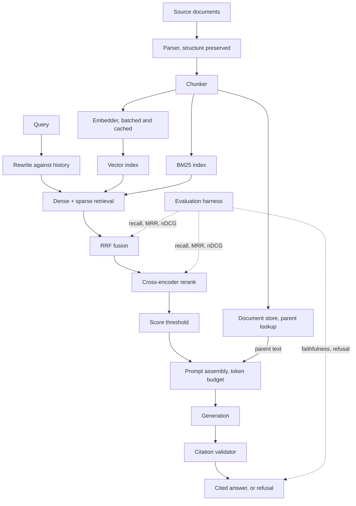

# Project 2: Grounded Answers Over Messy Documents

**Last reviewed:** 2026-09-18 · **Volatility:** medium

Your second portfolio project, and the one that will carry most of your interview conversations.

**The rule that defines it: the evaluation harness is built before the retriever.** Not alongside, not after. This inverts how almost everyone builds RAG, and it is the single thing that makes this project credible rather than another tutorial clone.

---

## Why this project, and why this shape

**The problem with most RAG portfolio projects.** Chunk some markdown, embed it, stuff the top 5 into a prompt, ship a Streamlit app. It works on the demo query. A reviewer asks "how do you know it works" and there is no answer, because there was never a way to know.

That question ends more AI engineer interviews than any other. This project exists to make you the candidate who has an answer.

**Three design constraints that make it credible:**

1. **A real constraint forcing a design decision.** Without one, every choice is arbitrary and you have nothing to discuss.
2. **An evaluation set before any retrieval code**, with a measured baseline. Every subsequent change is a number, not a feeling.
3. **Documented failures.** What broke, what you tried, what did not help. Interviewers trust a project with a failure analysis far more than one without.

**What it demonstrates:** retrieval engineering rather than API plumbing, measurement discipline, the ability to diagnose a pipeline you cannot see inside, and honest reporting. That is the whole junior-to-mid AI engineer bar.

---

## Prerequisites

| You need | From |
|---|---|
| The whole of module 07, especially section 9 | `07-rag-and-vector-search.md` |
| Embeddings, context windows, structured output | `06` sections 2, 7, 10 |
| Batching, caching, retries, Pydantic | `01b` section 9 |
| Project structure, CI, testing strategy | `02`, and project 1 |
| Local serving, if you use your own model | `09` Part 1 |

Do not start before finishing module 07. The evaluation material in section 9 of that module is the spine of this project.

---

## Choosing your corpus

**The corpus determines the project's credibility**, so choose deliberately.

**Good choices** share three properties: you know the content well enough to judge answers, it is genuinely messy, and it is legitimately yours to use.

| Option | Messiness | Why it works |
|---|---|---|
| Your own study notes plus PDFs from this curriculum | Mixed formats, inconsistent structure | You know it cold, so you can label relevance fast |
| Public sector documents: council minutes, regulations | Scanned PDFs, tables, multi-column | Genuinely hard, and publicly available |
| A large open-source project's docs plus issues plus changelog | Markdown, HTML, threaded discussion | Cross-document questions arise naturally |
| Academic papers in one narrow area | Two-column PDFs, equations, references | The two-column extraction problem is real and instructive |

**Avoid:** a single clean markdown file, anything you cannot legally process, and any corpus you do not know well enough to label relevance by hand. That last one is the killer, because it makes step 1 impossible.

**The constraint you must state**, because it is what forces every design decision. Pick one and commit:

- *Everything runs locally.* No data leaves the machine. Now you are choosing an embedding model against a memory budget and module 09 becomes load-bearing.
- *Answers must cite, or refuse.* An uncited claim is a bug. Forces citation verification and refusal measurement.
- *Sub-second retrieval on a laptop.* Forces real thinking about index choice and reranker cost.
- *Documents carry permissions.* Forces the section 6 filtering problem to be solved properly.

The local-only constraint pairs naturally with your existing llama.cpp setup and makes the project genuinely yours rather than a wrapper around someone's API.

---

## Architecture



The dotted lines are the point of the project. Evaluation attaches at three places, so when a number moves you know which stage moved it.

### Folder structure

```
grounded-answers/
├── pyproject.toml
├── README.md
├── .github/workflows/ci.yml
├── eval/
│   ├── questions.jsonl          # built FIRST
│   ├── corpus_manifest.json
│   └── results/                 # one file per run, committed
├── src/grounded/
│   ├── models.py
│   ├── ingest/
│   │   ├── parse.py
│   │   ├── chunk.py
│   │   └── embed.py
│   ├── retrieve/
│   │   ├── dense.py
│   │   ├── sparse.py
│   │   ├── fuse.py
│   │   └── rerank.py
│   ├── generate/
│   │   ├── prompt.py
│   │   └── validate.py
│   ├── evaluate/
│   │   ├── metrics.py
│   │   ├── harness.py
│   │   └── report.py
│   ├── api.py
│   └── config.py
└── tests/
```

**`eval/` sits above `src/` in the tree on purpose.** It is built first and it is the thing you show people.

---

## Build plan

Six milestones. Each ends in something demonstrable, and the order is deliberate.

### Milestone 1: the evaluation set, before any retrieval code

**This is the milestone people skip and it is the project.**

Build `eval/questions.jsonl`, 30 to 50 entries:

```jsonl
{"id": "q001", "question": "What notice period applies to parental leave?", "relevant_chunks": [], "expected_answer": "30 days", "answerable": true, "category": "single_doc", "source": "real_user"}
{"id": "q002", "question": "How does our parental leave compare to sick leave?", "relevant_chunks": [], "expected_answer": "...", "answerable": true, "category": "multi_doc", "source": "authored"}
{"id": "q003", "question": "What is the policy on sabbaticals?", "relevant_chunks": [], "expected_answer": null, "answerable": false, "category": "unanswerable", "source": "authored"}
{"id": "q004", "question": "What does error code ERR_2032 mean?", "relevant_chunks": [], "expected_answer": "...", "answerable": true, "category": "exact_identifier", "source": "real_user"}
```

**Required composition**, and hold yourself to it:

| Category | Minimum | Why it exists |
|---|---|---|
| `single_doc` | 12 | The baseline case |
| `multi_doc` | 5 | Answer spans documents; breaks naive top-k |
| `unanswerable` | 8 | Measures refusal. **The category everyone omits.** |
| `exact_identifier` | 3 | Part numbers, error codes. Where dense retrieval fails. |
| `negation` | 2 | "documents that do not mention X" |
| `conflicting` | 2 | Two documents disagree. Tests conflict surfacing. |

`relevant_chunks` starts empty. You fill it in milestone 2, once chunks exist and have ids. **Write the questions before you have seen the chunks**, or you will unconsciously write questions your chunker happens to handle.

**On `source`.** Tag each question `real_user` or `authored`. Report metrics on both slices separately. Authored questions flatter your system; real ones do not. The gap between the two slices is itself a finding worth writing up.

**On generating questions with a model:** acceptable as a starting point for the `authored` slice, with one rule. Rewrite every generated question in your own words before saving it, because a question generated from a chunk shares that chunk's vocabulary and makes retrieval look better than it is.

**Milestone 1 is done when** you have 30-plus questions committed, meeting the composition table, with no retrieval code written.

### Milestone 2: ingestion, and the baseline you must beat

Parse, chunk naively, embed, index. Deliberately unsophisticated: fixed-size chunks, no overlap, dense retrieval only, top 5.

Then label `relevant_chunks` in your eval set by reading the chunks. Tedious, three to four hours, and unavoidable. You will learn more about your corpus in this pass than from anything else in the project.

**Then measure and commit the numbers:**

```
eval/results/001-baseline.json
{
  "run_id": "001-baseline",
  "config": {"chunk_size": 512, "overlap": 0, "retriever": "dense", "top_k": 5,
             "embed_model": "...", "embed_model_version": "..."},
  "retrieval": {"recall@5": 0.00, "mrr": 0.00, "ndcg@5": 0.00},
  "by_category": {"single_doc": {...}, "unanswerable": {...}, ...},
  "by_source": {"real_user": {...}, "authored": {...}},
  "latency_ms": {"p50": 0, "p95": 0}
}
```

**This file is the most important artifact in the project.** Every later run is compared against it, and the sequence of these files is what you show an interviewer.

### Milestone 3: generation with enforced grounding

Add prompt assembly, generation and citation validation. Use the structure from module 07 section 8: sources before question, explicit refusal wording, structured `[S1]` citations.

**The validator is not optional.** Every cited id must exist in the retrieved set. An answer citing `[S7]` when only five sources were supplied is a hallucination you can catch programmatically, and catching it is a demonstrable capability.

Now measure generation metrics: faithfulness, refusal correctness on your unanswerable slice, and citation validity rate.

**Expect the refusal number to be bad.** A baseline system typically answers unanswerable questions confidently. That number improving is one of your best before-and-after stories.

### Milestone 4: improve, one change at a time

Each change gets a run file and a row in your results table. **One change per run**, or you cannot attribute the difference.

In the order most likely to pay off:

| # | Change | Fixes |
|---|---|---|
| 1 | Structure-aware chunking | Orphaned chunks, split facts |
| 2 | Heading path in `embed_text` | Chunks lacking their own topic vocabulary |
| 3 | BM25 + RRF fusion | Exact identifiers, rare terms, negation |
| 4 | Cross-encoder reranking | Ranking quality; usually the largest single win |
| 5 | Parent-child retrieval | Precision and completeness together |
| 6 | Conversational query rewriting | Follow-up questions |
| 7 | Score threshold and refusal | Over-answering |

**Record changes that did not help.** A run where semantic chunking cost 40 minutes and moved recall by 0.01 is a genuinely good thing to have in your results table, and it is the kind of honesty interviewers notice.

### Milestone 5: serve it

FastAPI, Pydantic request and response models, streaming, structured logging with a trace id carrying every field from module 07's instrumentation block, health endpoint, Docker.

The API returns the answer *and* the sources with scores, because a RAG API that returns only prose cannot be debugged by its callers.

### Milestone 6: write up the failures

A `docs/failure-analysis.md` with, for each failure mode you hit: the symptom as a user would report it, the diagnosis and how you reached it, the fix, and the measured effect.

**Three to five real entries beat a perfect system.** This document is what makes the project interesting to talk about.

---

## The evaluation harness

The core of the project. This is what you build in milestone 1.

```python
"""Run the eval set against a retrieval pipeline and produce a comparable report."""
from __future__ import annotations

import json
import statistics
import time
from dataclasses import asdict, dataclass, field
from datetime import datetime, timezone
from pathlib import Path
from typing import Protocol

from grounded.evaluate.metrics import mrr, ndcg_at_k, recall_at_k


@dataclass(frozen=True)
class EvalCase:
    id: str
    question: str
    relevant_chunks: list[str]
    expected_answer: str | None
    answerable: bool
    category: str
    source: str


@dataclass
class CaseResult:
    case_id: str
    category: str
    source: str
    retrieved: list[str]
    recall: float
    mrr: float
    ndcg: float
    latency_ms: float
    answered: bool | None = None
    citations_valid: bool | None = None


@dataclass
class RunReport:
    run_id: str
    config: dict
    timestamp: str
    cases: list[CaseResult] = field(default_factory=list)

    def aggregate(self, key=None) -> dict:
        cases = [c for c in self.cases if key is None or key(c)]
        if not cases:
            return {}
        return {
            "n": len(cases),
            "recall": statistics.fmean(c.recall for c in cases),
            "mrr": statistics.fmean(c.mrr for c in cases),
            "ndcg": statistics.fmean(c.ndcg for c in cases),
            "p50_latency_ms": statistics.median(c.latency_ms for c in cases),
        }


class Retriever(Protocol):
    def search(self, query: str, k: int) -> list[str]: ...


def load_eval_set(path: Path) -> list[EvalCase]:
    cases = []
    for line_no, line in enumerate(path.read_text(encoding="utf-8").splitlines(), start=1):
        line = line.strip()
        if not line:
            continue
        try:
            cases.append(EvalCase(**json.loads(line)))
        except (json.JSONDecodeError, TypeError) as e:
            raise ValueError(f"{path}:{line_no}: {e}") from e
    if not cases:
        raise ValueError(f"{path}: no cases")
    return cases


def run_retrieval_eval(
    cases: list[EvalCase], retriever: Retriever, run_id: str, config: dict, k: int = 5
) -> RunReport:
    report = RunReport(
        run_id=run_id,
        config=config,
        timestamp=datetime.now(timezone.utc).isoformat(),
    )

    for case in cases:
        if not case.answerable:
            continue                     # retrieval metrics are meaningless without a target

        start = time.perf_counter()
        retrieved = retriever.search(case.question, k=k)
        elapsed_ms = (time.perf_counter() - start) * 1000

        relevant = set(case.relevant_chunks)
        report.cases.append(
            CaseResult(
                case_id=case.id,
                category=case.category,
                source=case.source,
                retrieved=retrieved,
                recall=recall_at_k(retrieved, relevant, k),
                mrr=mrr(retrieved, relevant),
                ndcg=ndcg_at_k(retrieved, relevant, k),
                latency_ms=elapsed_ms,
            )
        )
    return report


def write_report(report: RunReport, directory: Path) -> Path:
    directory.mkdir(parents=True, exist_ok=True)
    path = directory / f"{report.run_id}.json"

    categories = sorted({c.category for c in report.cases})
    sources = sorted({c.source for c in report.cases})

    payload = {
        "run_id": report.run_id,
        "timestamp": report.timestamp,
        "config": report.config,
        "overall": report.aggregate(),
        "by_category": {c: report.aggregate(lambda r, c=c: r.category == c) for c in categories},
        "by_source": {s: report.aggregate(lambda r, s=s: r.source == s) for s in sources},
        "cases": [asdict(c) for c in report.cases],
    }
    path.write_text(json.dumps(payload, indent=2), encoding="utf-8")
    return path
```

**Four design decisions worth defending in a review:**

**Unanswerable cases are excluded from retrieval metrics.** Recall against an empty relevant set is meaningless; those cases are scored on refusal instead. Including them would silently drag your recall toward zero and hide real regressions. This is a genuine subtlety and a good thing to have noticed.

**Per-case results are stored, not just aggregates.** When recall drops 0.05 you need to know *which five questions* broke. An aggregate tells you something moved; the cases tell you what to fix.

**Segmented by category and source.** An improvement to `exact_identifier` at the cost of `multi_doc` is invisible in the mean. And the `real_user` versus `authored` gap is a standing check on whether your eval set is flattering you.

**`config` is stored with every run.** Six weeks later, "run 004 was better" is useless without knowing what run 004 was. The default-argument binding in the lambdas (`c=c`) is the `01a` closure trap, and omitting it makes every category report identical, which is a bug that looks like working code.

### The regression test

```python
BASELINE_RECALL = 0.71      # from eval/results/001-baseline.json
TOLERANCE = 0.02


def test_retrieval_has_not_regressed(eval_cases, retriever):
    report = run_retrieval_eval(eval_cases, retriever, "ci", config={}, k=5)
    recall = report.aggregate()["recall"]
    assert recall >= BASELINE_RECALL - TOLERANCE, (
        f"recall@5 fell to {recall:.3f}, baseline {BASELINE_RECALL:.3f}. "
        f"Failing cases: {[c.case_id for c in report.cases if c.recall == 0]}"
    )
```

Tolerance rather than equality, for the flakiness reason in `02` section 6. And the failure message names the broken cases, because a CI failure saying "0.69 < 0.71" sends you hunting.

---

## Results table

The artifact you show people. Keep it in the README, updated per run.

| Run | Change | recall@5 | MRR | nDCG@5 | Refusal acc. | p50 latency |
|---|---|---|---|---|---|---|
| 001 | Baseline: fixed 512, dense, top 5 | | | | | |
| 002 | + structure-aware chunking | | | | | |
| 003 | + heading path in embed_text | | | | | |
| 004 | + BM25 and RRF | | | | | |
| 005 | + cross-encoder rerank | | | | | |
| 006 | + parent-child retrieval | | | | | |
| 007 | + score threshold and refusal | | | | | |

`[VERIFY: leave every cell blank until you have measured it. Do not fill this in with plausible numbers; a fabricated results table is worse than none, and an interviewer who probes one will find out.]`

Add a column for what each change cost in latency. "Reranking improved recall@5 by 0.13 and added 180ms at p50" is a complete engineering statement. Half of it is not.

---

## Failure modes to expect

You will hit most of these. Each one is material for the write-up.

| Symptom | Likely cause | Where to look |
|---|---|---|
| Baseline recall near zero | Chunk ids unstable between runs | Make chunk ids deterministic from content hash and position |
| Metrics suspiciously perfect | Eval questions generated from chunks | Compare `real_user` against `authored` slices |
| Great recall, bad answers | Generation, not retrieval | Confirm chunks are in the assembled prompt |
| Refusal accuracy near zero | No refusal instruction, or no threshold | Module 07 section 8 |
| Reranking made it worse | Reranker input pool too small | Retrieve 50 before reranking to 5, not 10 |
| Exact identifiers never found | Dense-only | BM25 |
| Follow-ups nonsense | No conversational rewriting | Log the actual query sent to the retriever |
| Quality changed with no code change | Embedding model version moved | Pin and assert the version |
| Latency spiked after reranking | Cross-encoder on too many candidates | Measure each stage separately |

---

## Interview narrative

**60 seconds.** *"A grounded question-answering system over [corpus], built evaluation-first. I wrote a 40-question evaluation set with labelled relevant chunks before writing any retrieval code, including 8 unanswerable questions to measure refusal. That gave me a baseline, and then every change was a measured delta rather than a guess. The biggest win was [X], which moved recall@5 from [A] to [B] and cost [N]ms. The most interesting failure was [Y]."*

**5 minutes** adds:

- **The constraint and what it forced.** Local-only meant choosing an embedding model against a memory budget; citations-or-refusal meant building a validator.
- **The evaluation design.** Why retrieval and generation are measured separately, why unanswerable cases are excluded from recall, why results are segmented by category and source.
- **One failure in depth.** Walk the module 07 decision tree on a real case from your own project. This is the single most valuable thing you can do in a RAG interview.
- **A change that did not work**, and what you learned. Candidates who only report wins read as either lucky or dishonest.
- **What you would do differently.** Larger eval set; labelling relevance earlier; measuring latency per stage from day one.

**Resume bullets.** Every bracket comes from your own results files.

```
Grounded Answers | Python, FastAPI, [vector store], [embedding model]
· Built a retrieval-augmented QA system over [N] documents with an
  evaluation-first workflow: a [N]-question labelled eval set and measured
  baseline preceded any retrieval implementation.
· Improved recall@5 from [X] to [Y] through [specific changes], measuring
  each change independently against the baseline.
· Implemented hybrid dense and BM25 retrieval with reciprocal rank fusion
  and cross-encoder reranking, and citation validation rejecting
  unsupported claims.
· Documented [N] production failure modes with diagnosis and measured fixes.
```

`[VERIFY: replace every bracket from your own eval/results/ files. If you cannot fill one in, remove the bullet.]`

---

## Success criteria

The project is done when:

- [ ] `eval/questions.jsonl` has 30-plus questions meeting the composition table
- [ ] `eval/results/001-baseline.json` exists and predates every other run
- [ ] The results table has at least five runs with real numbers
- [ ] At least one run made something worse, and is still in the table
- [ ] `docs/failure-analysis.md` has three-plus real entries
- [ ] The regression test runs in CI and has caught at least one regression
- [ ] A stranger can clone, install and run the eval harness from the README
- [ ] You can walk the module 07 decision tree on a real failure from your own logs

The fourth and eighth are the ones that distinguish this from a tutorial.

---

## Connections

**Backward:** module 07 entirely, especially section 9. Module 06 sections 7 and 10 for context budget and structured output. `01b` section 9 for the client, cache and batching. `02` for CI and testing strategy. Project 1 for structure and defensive parsing. Module 09 if you serve locally.

**Forward:** `projects/project-3-agent-evaluation.md` applies the same evaluation-first discipline to agent trajectories. `capstone/` reuses this retrieval layer. `10-mlops-and-deployment.md` turns the regression test into a deployment gate. `11-ai-system-design.md`'s enterprise RAG walkthrough is this project at scale. `13-project-portfolio.md` has the rubric.

---

## Volatile claims

| Claim | Why it decays | Re-check against |
|---|---|---|
| Improvement ordering in milestone 4 | A reasonable prior, not a result; your corpus decides | Your own results table |
| Eval set size guidance (30-50) | A pragmatic floor for a solo project | Statistical power for the differences you care about |
| Tooling named in the folder structure | Ecosystem churn | Current docs |

The evaluation-first discipline and the measurement design are stable. Everything about specific tools is not.

**Next review due:** when you start the capstone.
